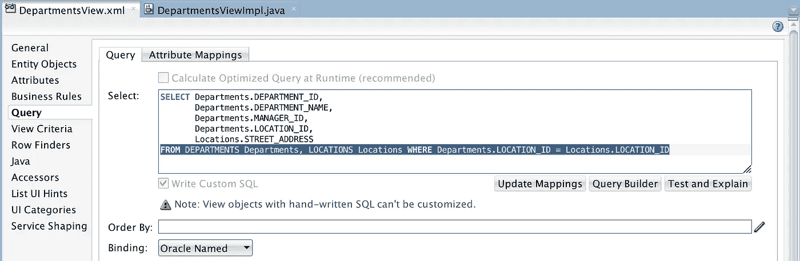
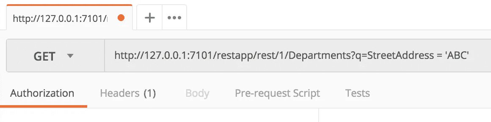
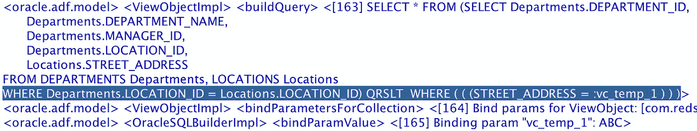
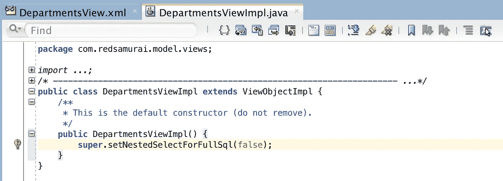
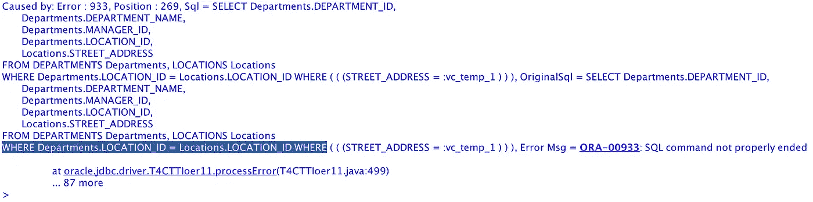
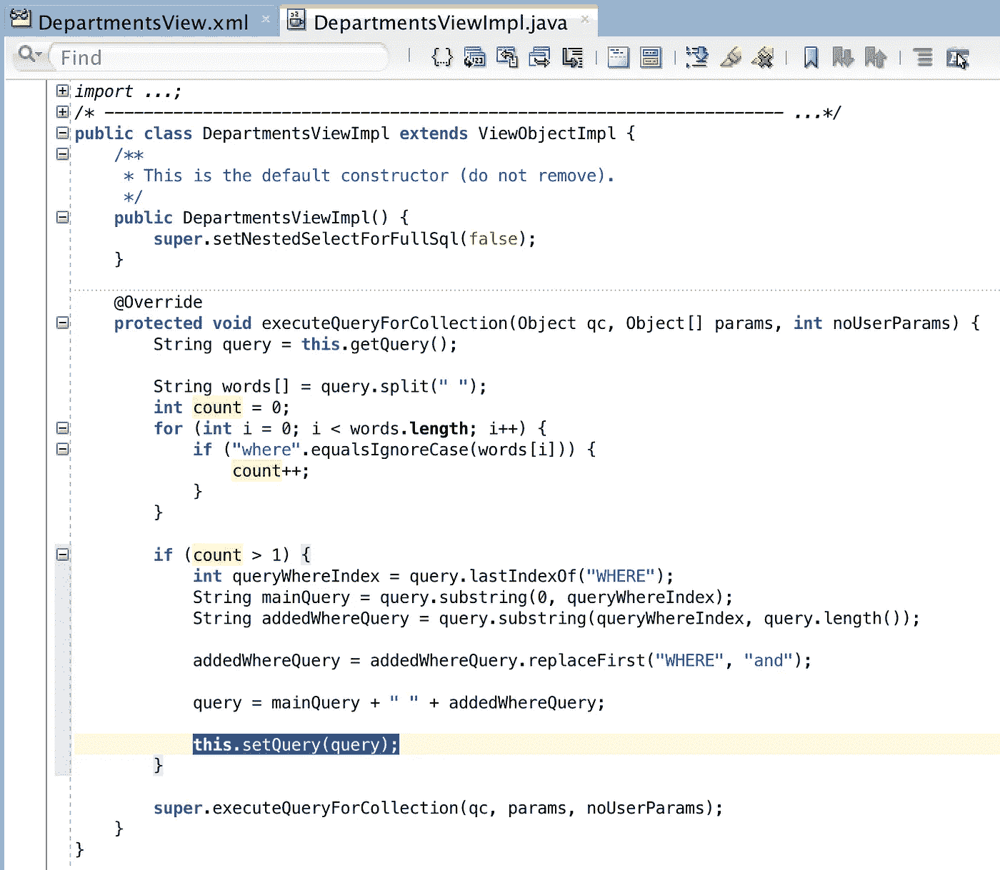
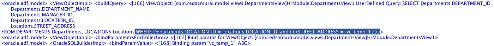

# ADF BC REST 查询和 SQL 嵌套控制解决方案

> 原文：<https://medium.com/oracledevs/adf-bc-rest-query-and-sql-nesting-control-solution-6b6e64184950?source=collection_archive---------0----------------------->

我将谈论专家模式视图对象(用手写的 SQL)，这个视图对象是基于 SQL 连接创建的。这就是我今天例子的使用案例。我将描述与生成 SQL 语句相关的问题，并给出如何解决它的提示。如果您想通过 ADF BC REST 服务公开复杂的 VO(带连接和计算总数的 SQL ),然后对这个 REST 资源运行查询，这将特别有用。

代码可以在我的 [GitHub](https://github.com/abaranovskis-redsamurai/ADFBCRestApp) 仓库中找到。

下面是 SQL join 和专家模式 VO(可以手动修改 SQL 的那个):

这个 VO 是通过 ADF BC REST 曝光的，我就不赘述了，你可以在网上找到更多关于它的信息。一旦应用程序开始运行，REST 资源就可以通过 GET 访问。ADF BC REST 语法允许将查询字符串与 REST 请求一起传递，这里我基于 StreetAddress='ABC '进行过滤:

在后端，默认情况下这可以正常工作，并生成嵌套查询(这是专家模式 VOs 的预期行为，所有附加条件子句将通过 SQL 包装添加)。虽然这样的查询执行得很好，但这不是我们在某些用例中想要的。如果我们在 SQL 中计算总计或平均聚合值，我们不希望它被包装:

为了防止 SQL 换行，我们可以在 VO 构造函数中调用 ADF BC API 方法:

虽然这可能适用于常规的 ADF BC，但不适用于来自 ADF BC REST 的标准。禁用查询嵌套后，生成的 SQL 查询包含两个 WHERE 子句:

我建议的可能解决方案—覆盖 executeQueryForCollection 方法，进行一些解析并更改 second WHERE to AND，应用更改后的查询字符串，然后执行 super:

这个技巧很有帮助，查询如我们所预期的那样生成，从 ADF BC REST 查询调用添加的标准被附加在 WHERE 子句的末尾:

*原载于 2018 年 8 月 16 日*[*【andrejusb.blogspot.com*](https://andrejusb.blogspot.com/2018/08/adf-bc-rest-query-and-sql-nesting.html)*。*