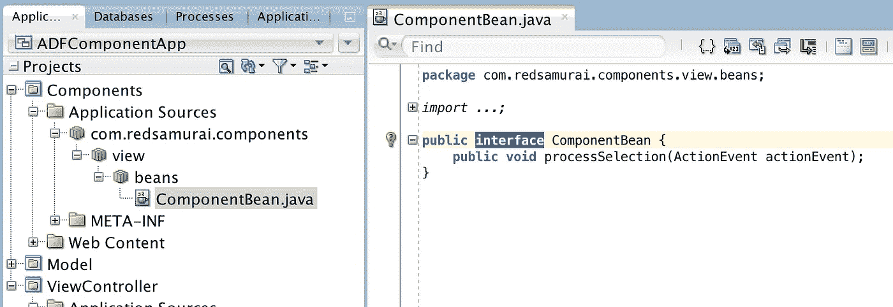

# ADF 声明性组件示例

> 原文：<https://medium.com/oracledevs/adf-declarative-component-example-ffa30928596f?source=collection_archive---------1----------------------->

ADF 声明性组件支持是流行的 ADF 框架特性，但是在这篇文章中，我想从稍微不同的角度来解释它。我将展示如何通过属性将 ADF 绑定和 Java bean 对象传递到组件中，在这些情况下，当组件必须显示来自 ADF 绑定的数据时，这种方法可以提供健壮性并简化组件开发。

这是在示例应用程序中实现的组件—选择列表呈现来自 ADF LOV 的数据，按钮调用 Java bean 方法打印选定的 LOV 项目值(从 ADF 绑定中检索):

JDeveloper 提供向导来创建声明性组件的初始结构:

这是 ADF 声明性组件，它是从我们自己的标签中呈现的。有两个属性。列表绑定分配有 LOV 绑定对象实例，bean 属性分配有在支持 bean 范围中定义的 Java bean 实例。这样，我们将对象直接传递到组件中:

LOV 绑定在目标页面定义文件中定义，组件在该文件中使用:

Bean 是在同一个项目中定义的，其中创建了使用 ADF 声明性组件的页面。我们需要定义组件属性类型来匹配 bean 类型，因此，我们必须在组件库中创建类接口，并在目标项目中实现它:

组件和主项目可以在同一个 JDEV 应用程序中，我们可以使用 JDEV 工作集在项目之间导航(当运行主项目时，我们不想运行组件项目，组件项目是通过 ADF JAR 库部署和重用的):

组件内部定义了 Bean 接口:

列表绑定的属性是用 JUCtrlListBinding 类型定义的，这允许将绑定实例直接传递给组件。对于 bean 实例也是如此，使用接口定义 bean 实例类型，这将从使用组件的页面分配:

声明性组件基于 ADF Faces 组件的组合:

从 [GitHub](https://github.com/abaranovskis-redsamurai/ADFComponentApp) 资源库下载示例应用程序。

*原载于 2018 年 3 月 22 日*[*【andrejusb.blogspot.com*](https://andrejusb.blogspot.lt/2018/03/adf-declarative-component-example.html)*。*