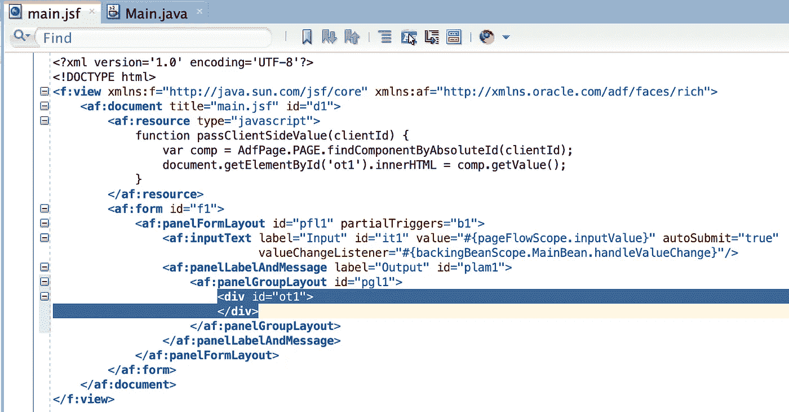
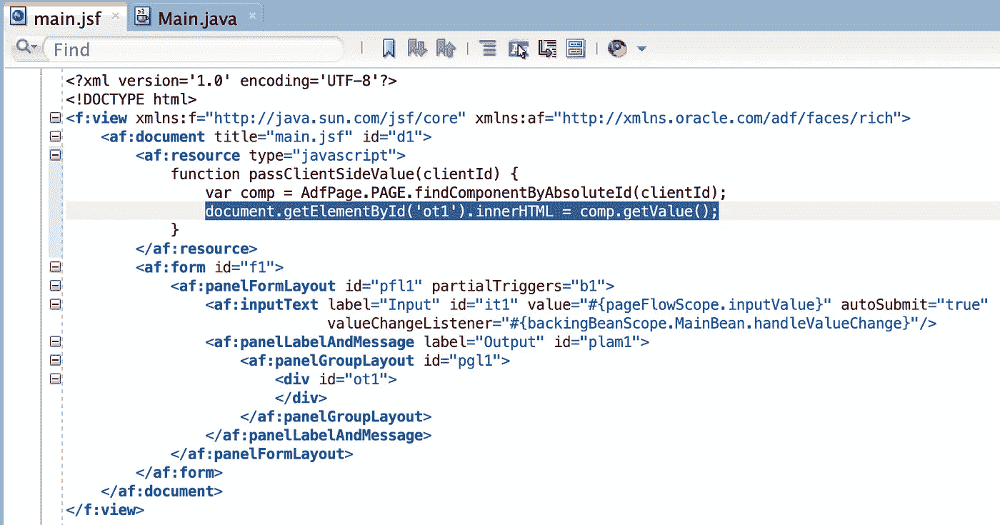
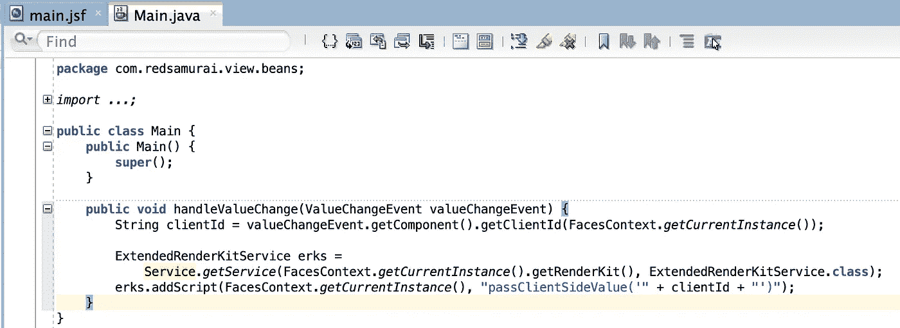
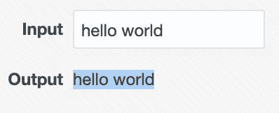

# 使用 innerHTML 的 ADF Faces 和客户端值

> 原文：<https://medium.com/oracledevs/adf-faces-and-client-side-value-with-innerhtml-f6806bcef0df?source=collection_archive---------0----------------------->

在 ADF Faces 中，您可以利用 JavaScript 的全部功能。我将解释如何将 ADF Faces 组件中的值赋给普通的 HTML div。

示例应用程序可以在 GitHub [repo](https://github.com/abaranovskis-redsamurai/ADFClientSideValueApp) 上获得。它不需要数据库连接，您可以直接在 Oracle JDeveloper 中运行它。

调查 JSF·佩奇。我已经实现了带有值更改监听器的 ADF Faces 输入组件。在这个组件下面，有一个 ID 为 *ot1* 的 HTML div。我们将通过 JS 函数 *passClientSideValue* 以编程方式为这个 div 分配一个文本值:

JavaScript 函数通过客户端 ID 从 ADF Faces 组件中读取值，并将其分配给 HTML div 的 *innerHTML* 属性:

当 ADF Faces 值更改时，通过 ADF 自动提交事件调用值更改侦听器。在值更改监听器中，我们提取输入组件的客户端 ID，并通过来自 Java 的 JavaScript 调用将其传递给 JS 函数:

最终结果如下所示:

特别是，当您希望绕过 ADF Faces 验证生命周期并在表单中显示更新的值而不管当前的验证错误时，这种方法非常有用。

*最初发表于*[*http://andrejusb.blogspot.com*](https://andrejusb.blogspot.com/2019/06/adf-faces-and-client-side-value-with.html)*。*