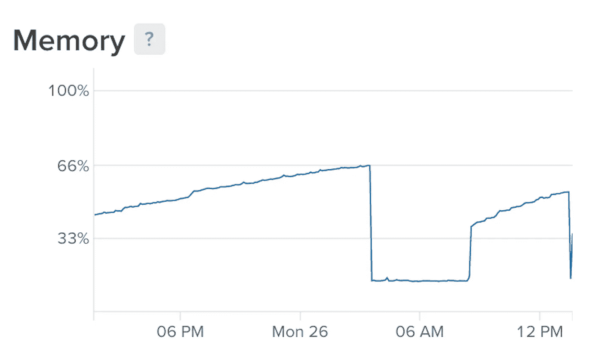
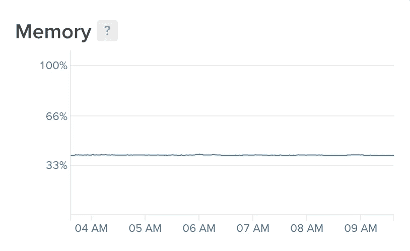
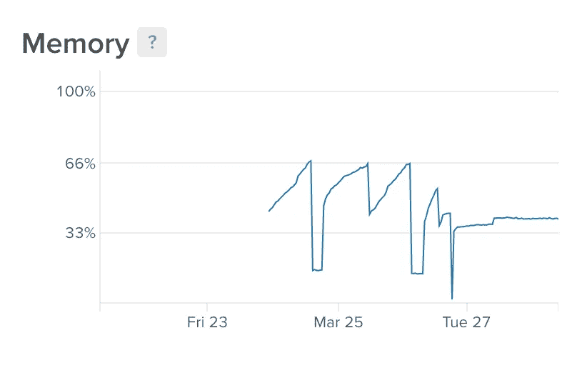

# Docker 上的 ADF 针对 JVM 的 Java 内存限制调优

> 原文：<https://medium.com/oracledevs/adf-on-docker-java-memory-limit-tuning-for-jvm-7e2dedc86e5a?source=collection_archive---------1----------------------->

在 Docker 环境中运行 Java 看起来是一个挑战，默认情况下，Java 不知道 Docker 的内存限制。查看这篇文章比如——[docker 里面的 Java:不失败的你必须知道的事情](https://developers.redhat.com/blog/2017/03/14/java-inside-docker/)。我以前能够在没有 Java 内存问题的情况下，使用 Java _ OPTIONS =-*XX:+unlock commercial features-XX:+resource management-XX:+use G1 GC*，在 Docker 上运行 WebLogic 和 ADF ( [基本 WebLogic 调优，避免 OOM](http://andrejusb.blogspot.lt/2017/11/essential-weblogic-tuning-to-run-on.html) )。然而，Docker 升级到最新版本后，这些设置不再有帮助。我不想用-Xmx 硬编码内存设置。

Java 开始消耗 Docker 中所有可用的内存，最终被杀死。您可以从下面的图表中看到这一点——内存在增长、消失，重启后又在增长:

为了解决这个问题，我应用了来自 Java 平台组、产品管理博客的设置——Java SE 对 Docker CPU 和内存限制的支持。我已经将之前设置的 JAVA _ OPTIONS =-*XX:+UnlockCommercialFeatures-XX:+resource management-XX:+use G1 GC*替换为 JAVA _ OPTIONS =-*XX:+UnlockExperimentalVMOptions-XX:+UseCGroupMemoryLimitForHeap-XX:+use G1 GC*。

JAVA _ OPTIONS =-*XX:+unlockeexperimentalvmoptions—XX:+UseCGroupMemoryLimitForHeap-XX:+useg1 GC*完成了工作— JVM 停留在 Docker 内存限制 sharp:

该图表显示了应用设置前后的 Java 内存行为。3 月 27 日起— Java 内存与 Java _ OPTIONS =-*XX:+UnlockExperimentalVMOptions—XX:+UseCGroupMemoryLimitForHeap-XX:+use G1 GC*:

*原载于 2018 年 3 月 28 日*[*andrejusb.blogspot.com*](https://andrejusb.blogspot.lt/2018/03/adf-on-docker-java-memory-limit-tuning.html)T22。