# 面向多环境的 ADF 参数部署— AZURE DEVOPS

> 原文：<https://medium.com/globant/adf-parameters-deployment-for-multi-environment-azure-devops-9fbcf97e3f56?source=collection_archive---------0----------------------->

# 介绍

Azure Data Factory 就是解决这类数据场景的平台。它是基于云的 ETL 和数据集成服务，允许您创建数据驱动的工作流来协调数据移动和大规模转换数据。简单地说，这是一种可以让你瞬间将数据从一个服务转移到另一个服务的服务。

**Azure 数据工厂=数据迁移+分析**

随着世界向云和大数据发展；数据集成和迁移仍将是跨行业组织的基本要素。ADF 可以帮助您有效地解决这两个问题，使您能够专注于您的数据，并允许您通过单一视图来调度、监控和管理您的 ETL/ELT 管道。

以下是 Azure Data Factory 采用率上升的一些原因:驱动更多价值、改善业务流程结果、减少管理费用、更好的决策、提高业务流程敏捷性。

在这篇博客中，我们将讨论在通过 Azure DevOps CI/CD 管道进行部署时处理 ADF 参数所面临的挑战，以及应对这一挑战的解决方案。挑战在于，你看不到 Azure DevOps CI/CD 管道中的 ADF 数据集和管道参数，所以你不能在运行时更改参数值。

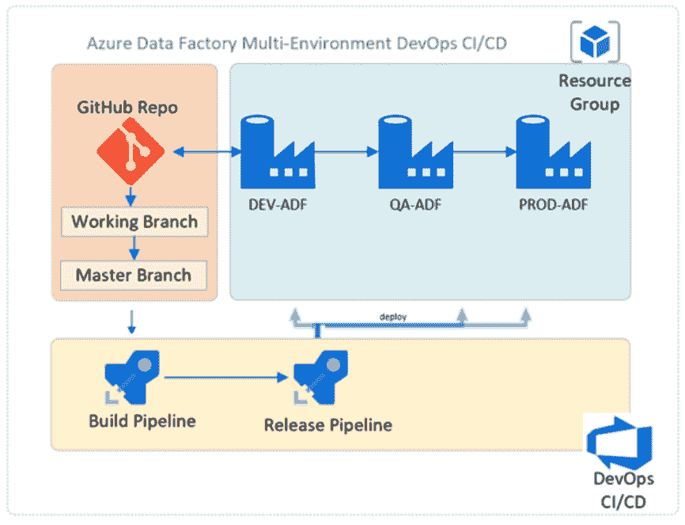

# 先决条件

*   ADF 和 Azure DevOps CI/CD 管道的基本知识(参考。[https://docs . Microsoft . com/en-us/azure/data-factory/简介](https://docs.microsoft.com/en-us/azure/data-factory/introduction)
*   Azure DevOps 项目
*   连接 Azure 数据工厂中的源代码管理(参考。[https://docs . Microsoft . com/en-us/azure/data-factory/source-control](https://docs.microsoft.com/en-us/azure/data-factory/source-control)

# ADF 参数挑战

**A.** 出于演示目的，我创建了一个与 ADF 实例链接的 Blob 服务连接。

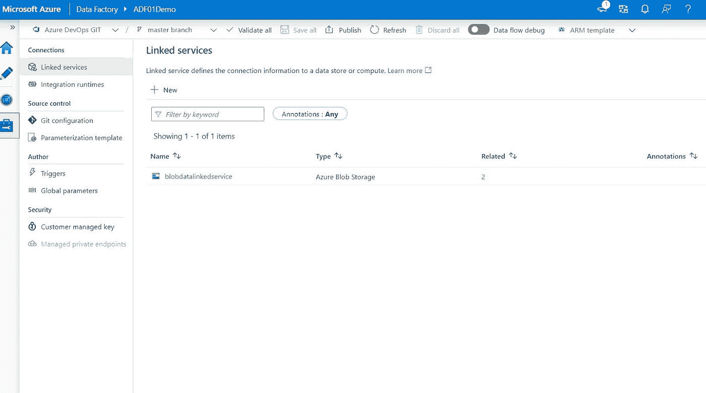

**B.** 创建了一个数据集。

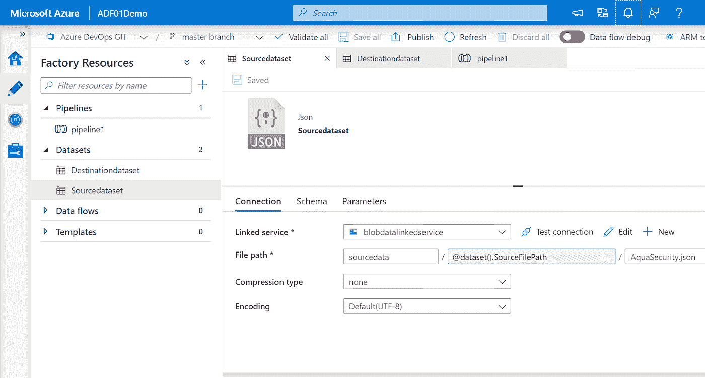

*在文件路径部分可以看到* ***@dataset()。源文件路径*** *。该路径是动态添加的，它来自参数选项卡。*

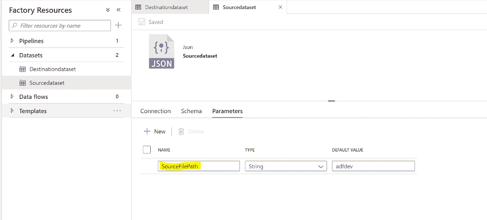

**C.** 创建一个 ADF 管道。这是一个复制数据的任务。

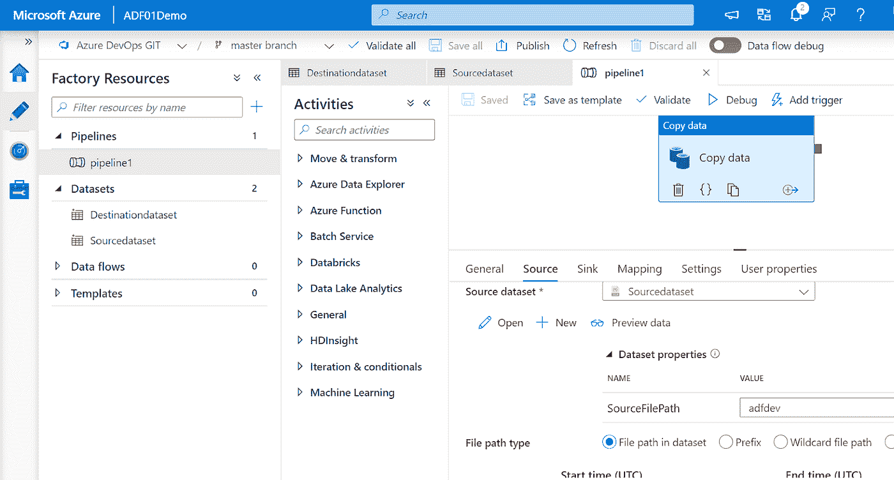

**D.** 一旦发布 ADF 管道，就会自动用 ARM 模板创建一个 **adf_publish** 分支。

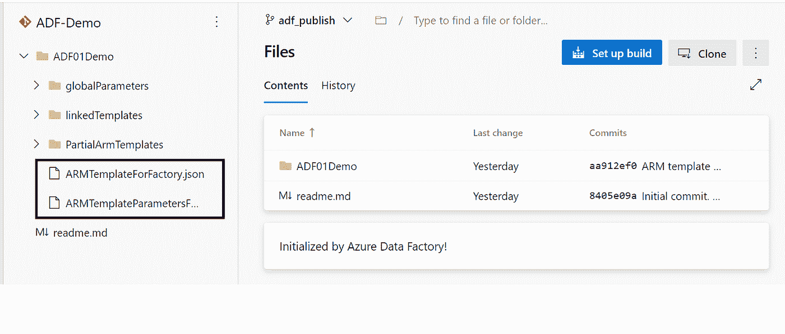

*ARM 模板参数文件将只包含链接的服务参数，不包含数据集和管道参数。*

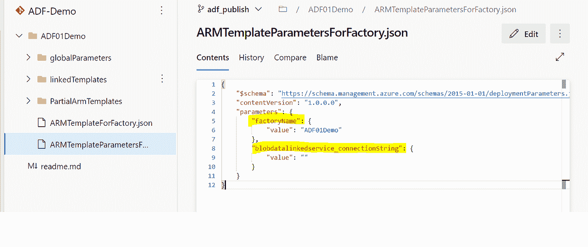

现在为不同的环境创建一个发布管道。(比如:QA)。但是在“发布管道参数”部分，您只能看到链接的服务参数。

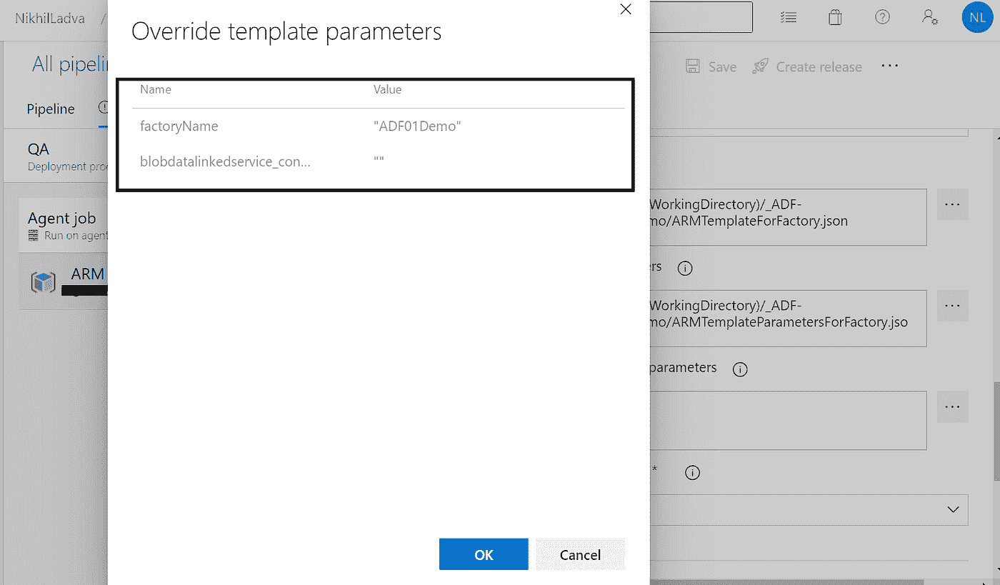

#如果我们需要更改数据集和 ADF 管道的参数，我们不能在 Azure DevOps 中更改它们，因为默认情况下它只接受链接的服务参数。

# 解决办法

以便在 Azure DevOps 发布管道中获取数据集和 ADF 管道参数值。

在协作分支的*根*文件夹中创建一个自定义 json 模板，同名*arm-template-parameters-definition . JSON a*下图中可以看到 *master* 是协作分支，在根路径中创建了一个自定义 JSON 模板。

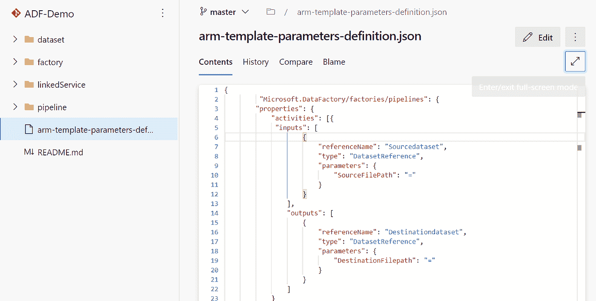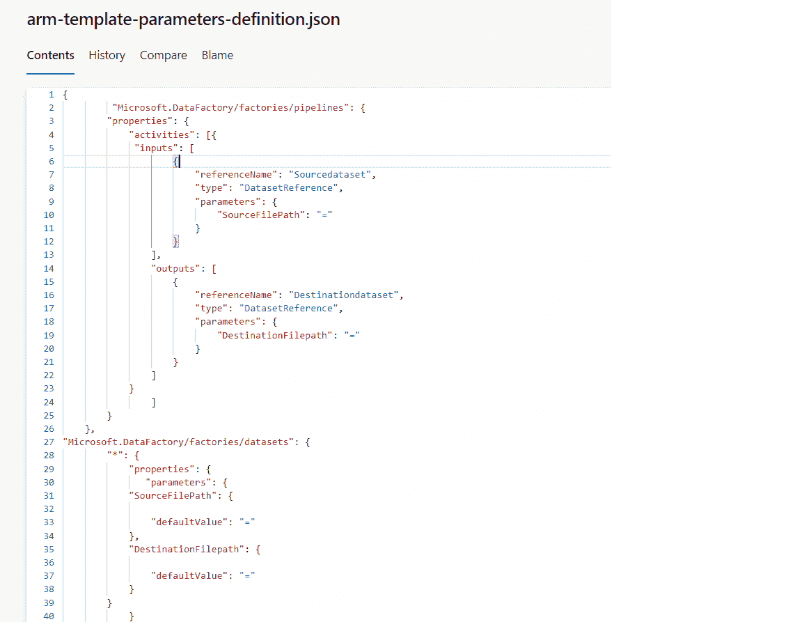

**注意:-** 一旦提交了定制的 JSON 参数模板，就刷新 ADF 管道(Azure 门户中的*)并发布 ADF 管道。*

*#现在你可以看到 JSON 模板中所有的数据集和管道参数。*

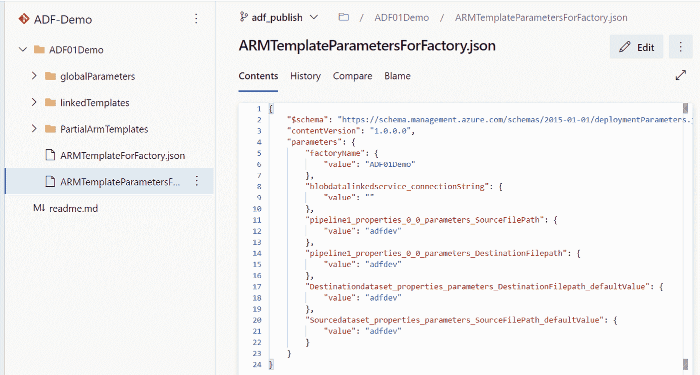

在下图中，您可以看到 Azure DevOps 管道中的所有参数，并且您可以从一个环境到另一个环境更改参数。《出埃及记》开发到质量保证。

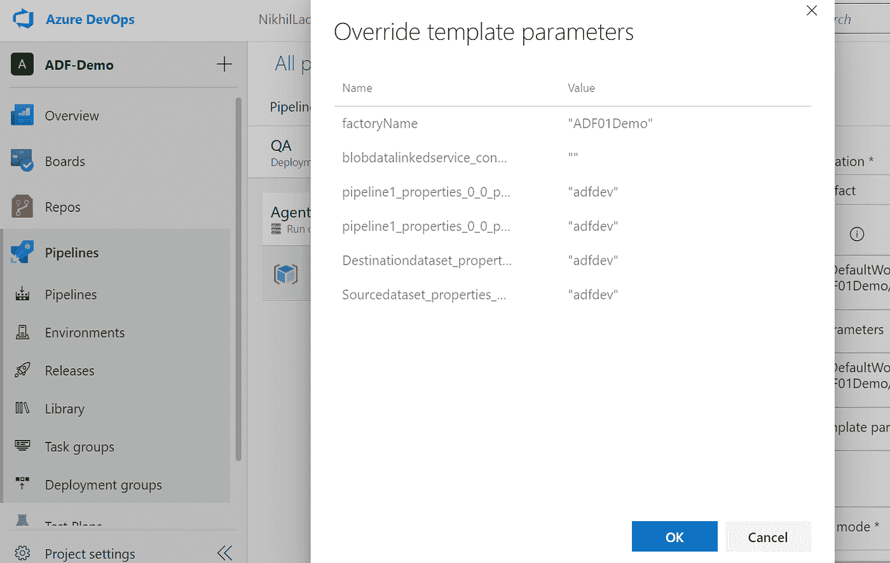

# 结论

尽管微软已经建议使用覆盖模板来实现这一点，但是，他们并没有提供在 ADF 中要做的更改。我们已经通过这篇文章展示了 ADF 中要做的改变。我们已经通过形成一个定制的 JSON 模板和发布 ADF 管道实现了它。