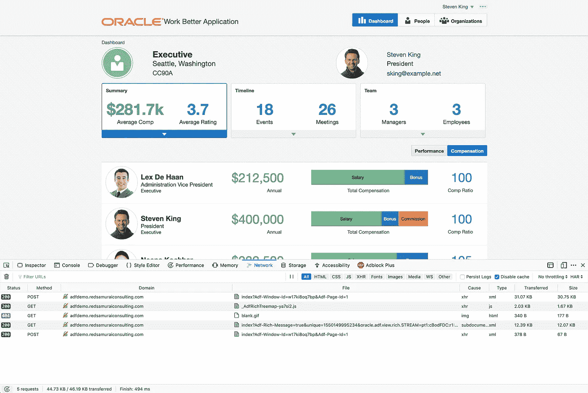

# Nginx 压缩提高 ADF 性能

> 原文：<https://medium.com/oracledevs/adf-performance-improvement-with-nginx-compression-8e880c81fec7?source=collection_archive---------1----------------------->

我们使用 [Nginx](https://www.nginx.com/) web 服务器为 Oracle ADF WorkBetter 托管[演示](http://adfdemo.redsamuraiconsulting.com/workbetter/faces/index)托管在数字海洋云服务器上。Nginx 有助于快速提供 web 应用程序内容，并提供改进的性能。重要的调优选项之一——内容压缩，Nginx 很好地完成了这项工作，并且设置简单。

内容压缩不提供直接的运行时性能，浏览器会运行相同的代码，不管它是否被压缩。但是它带来了改进的感知性能(这是非常重要的)，网络时间更快，因为减少了内容大小。Oracle ADF 是一个服务器端框架，每个请求都会从服务器获取内容，获取内容的速度越快，意味着应用程序性能越好。

**1。内容压缩=关闭**

让我们来看看没有应用内容压缩时的统计数据(使用我们的 Oracle ADF WorkBetter 托管的[演示](http://adfdemo.redsamuraiconsulting.com/workbetter/faces/index))。

传输的页面加载大小为 2.69 MB。完成时间 1.55 秒:

导航到雇员部分生成 165.76 KB，完成时间为 924 毫秒:

导航到员工薪酬生成 46.19 KB，完成时间 494 毫秒:

**2。Nginx 压缩**

压缩对于 Nginx 中的[设置](https://www.techrepublic.com/article/how-to-configure-gzip-compression-with-nginx/)来说很简单。Gzip 设置是在 nginx.conf 中设置的，请确保列出压缩必须支持的所有内容类型。在 nginx.conf 中保存新设置后，重新启动 nginx 进程:

**3。内容压缩=在**页面上加载大小为 733.84 KB 的传输。完成时间 1.48 秒:

导航到雇员部分生成 72.75 KB，完成时间为 917 毫秒:

导航到员工薪酬生成 7.59 KB，完成时间 498 毫秒:

*原载于 2019 年 2 月 15 日*[*andrejusb.blogspot.com*](https://andrejusb.blogspot.com/2019/02/adf-performance-improvement-with-nginx.html)*。*