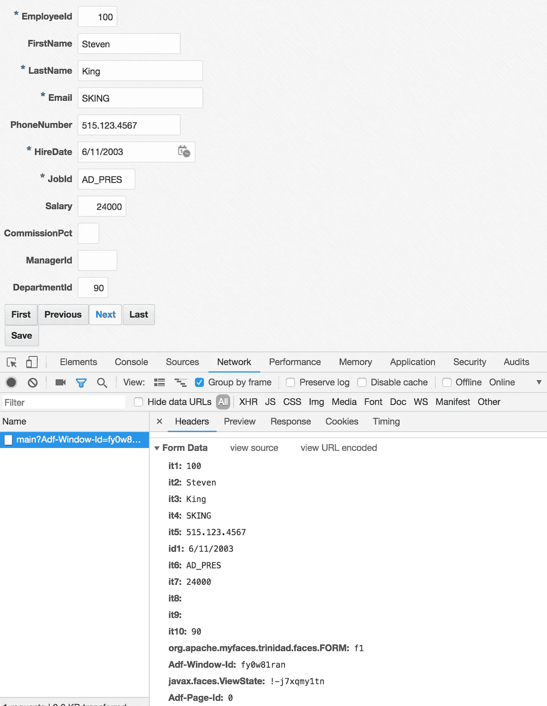
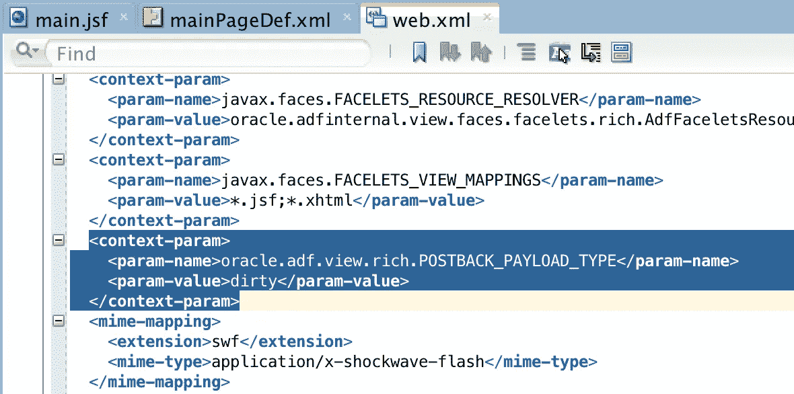
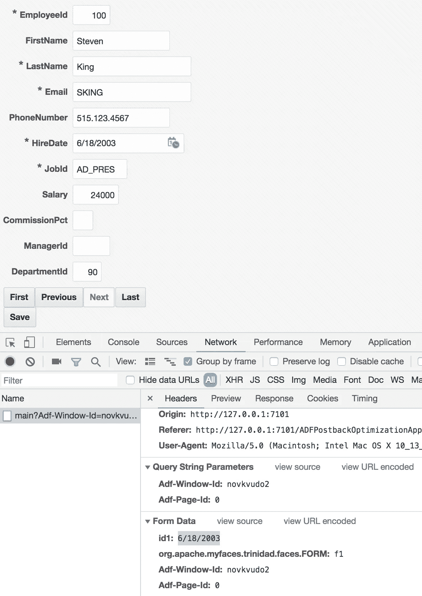

# ADF 回发负载大小优化

> 原文：<https://medium.com/oracledevs/adf-postback-payload-size-optimization-6b3a3fa232fd?source=collection_archive---------0----------------------->

最近我遇到了一个名为*Oracle . ADF . view . rich . postback _ PAYLOAD _ TYPE*的属性。此属性有助于优化回发负载大小。在 ADF Faces 配置章节— [A.2.3.16 回发净荷大小优化](https://docs.oracle.com/middleware/1221/adf/develop-faces/GUID-9F18F829-1E37-4C36-9C25-1DE334CAB330.htm#ADFUI574)中有描述。ADF 部分请求正在使用包含的所有字段的值执行 HTTP post。当回发属性设置为 *dirty* 时，它将只包含到 HTTP post 中已更改的值。因此，服务器将只获得更改的属性，这可能会减少服务器处理时间，并使 HTTP 请求变得更小。这对于包含许多字段的大型表单尤其重要。

让我们来看一个例子。单击表格中的任何按钮后，转到网络监视器并研究表格数据部分。您将看到 UI 中包含的所有字段的 ID 和值。默认情况下，所有字段都通过 HTTP 请求提交，即使这些字段没有更改:

回发优化属性可以在 web.xml 中设置，默认为 *full* ，改为 *dirty* :

将值设置为 dirty，尝试更改至少一个字段，然后按任意按钮。观察网络监视器中的表单数据部分—仅提交值已更改的字段:

试着在你的项目中测试一下，看看有什么不同。

在 [GitHub](https://github.com/abaranovskis-redsamurai/ADFPostbackOptimizationApp) 上查看我的示例应用程序。

*原载于 2018 年 7 月 15 日*[*andrejusb.blogspot.com*](https://andrejusb.blogspot.com/2018/07/adf-postback-payload-size-optimization.html)*。*