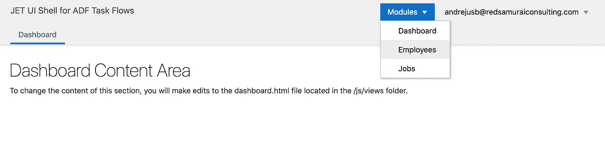
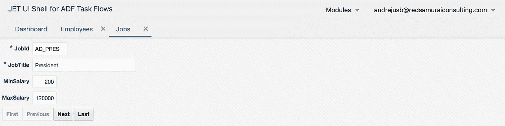

# 使用 JET UI 外壳包装器提升 ADF 任务流性能

> 原文：<https://medium.com/oracledevs/adf-task-flow-performance-boost-with-jet-ui-shell-wrapper-d6f8f82d0337?source=collection_archive---------4----------------------->

具有 UI 外壳的 ADF 应用程序和呈现在动态选项卡中的 ADF 任务流不会提供从一个选项卡到另一个选项卡的即时切换体验。这是因为切换标签的请求会发送到服务器，只有当浏览器得到响应时，切换标签才会发生。除此之外，即使 ADF 中的选项卡当前不活动(选项卡已公开)，选项卡内容(例如，从 ADF 任务流呈现的区域)仍可能参与请求处理。如果用户打开许多选项卡，这可能会导致整体请求处理时间稍慢。

如果在根级别配置了页面支持，ADF 允许通过 URL 访问 ADF 任务流来直接呈现 ADF 任务流。ADF 任务流可以通过 URL 访问，这意味着我们可以将它包含在 iframe 中。想象一下为每个选项卡使用 iframe，并在其中呈现 ADF 任务流。这将在每个选项卡中启用 ADF 任务流独立处理，类似于在单独的浏览器选项卡中打开它们。

可以在 Oracle JET 中使用普通的 JavaScript 和 HTML 代码管理 Iframe。我的示例实现了带有 iframe 支持的动态 JET 选项卡。Iframe 呈现 ADF 任务流。在选项卡之间导航时，我简单地隐藏/显示 iframes，这允许保持 ADF 任务流的状态，并在打开选项卡时返回到相同的状态。这种情况下的巨大优势是——选项卡导航和使用 ADF 任务流在选项卡之间切换的速度非常快——它只需要客户端时间处理。请看这个录制的 gif，我在带有 ADF 内容的选项卡之间导航:

主要功能如下所示。

1.添加动态 iframe。这里我们检查给定 ADF 任务流的框架是否已经创建，如果没有，我们创建它并附加到 HTML 元素

2.切换选项卡时，选择 iframe。隐藏所有框架首先，选择属于所选选项卡的框架

3.移除 iframe。当拉环关闭时，移除框架

4.移除后选择框架。此方法有助于在移除当前制表符后将焦点设置到下一帧

我们可以通过使用分配给主 div 的 flag computed 函数来控制 iframe 或常规 JET 模块的呈现时间:

在这个应用程序中，我为显示的 ADF 任务流定义了静态 URL。同样可以通过获取菜单等方式加载。：

为了能够通过 URL 加载 ADF 任务流，请确保将 ADF 任务流与页面一起使用(您可以在页面中包含带有片段 ADF 区域)。设置允许 url 调用的属性:

这是它看起来的样子。默认情况下，将显示 JET 仪表板模块，从菜单列表中选择项目以加载带有 ADF 任务流的选项卡:

使用 ADF 表呈现 iframe 的 JET 选项卡:

您可以在 JET 应用程序中监视 iframe 中的 ADF 内容加载:

使用 ADF 表单呈现 iframe 的 JET 选项卡:

从 [GitHub](https://github.com/abaranovskis-redsamurai/dynamictabsjetwrap) 库下载示例应用程序。

*原载于 2018 年 10 月 19 日*[*【andrejusb.blogspot.com】*](https://andrejusb.blogspot.com/2018/10/adf-task-flow-performance-boost-with.html)*。*