# 管理用户、角色和凭据存储— Oracle 管理云

> 原文：<https://medium.com/oracledevs/administering-users-roles-credentials-store-oracle-management-cloud-eff148dbdfae?source=collection_archive---------1----------------------->

## 作者:[mono war Mukul](https://medium.com/u/3757393c69bd?source=post_page-----eff148dbdfae--------------------------------)(OCM)[NASS yam Basha](https://medium.com/u/ba3f0a72ff81?source=post_page-----eff148dbdfae--------------------------------)(甲骨文王牌总监，OCM)

## 介绍

在本文中，我们将了解如何创建用户和基于角色类型分配所需的权限，以及如何将凭据存储添加到 OMC 存储库中，凭据存储不仅支持 Oracle 系统，还支持非 Oracle 系统，并包括其他云提供商，如 AWS、Azure 和各种其他凭据类型。

## OMC 用户类型和角色

我们可以将 Oracle 管理云用户定义为两类，即拥有 OMC 完全访问权限的超级用户和拥有有限权限/角色的普通用户。

1.  Oracle 管理云管理员

*   管理云代理
*   删除实体
*   管理云代理
*   为云代理配置增强功能
*   禁用警报通知
*   和各种其他主要角色

2.Oracle 管理云普通用户

*   查看和监控基础设施
*   探索目标、组或系统
*   自定义仪表板
*   &等

## 管理用户，Oracle 管理云中的角色

现在，我们将创建一个用户，并为该用户授予特定服务 Oracle Management Cloud 的角色。登录 Oracle cloud my services Dashboard 页面后，单击用户，如下图所示。

在此屏幕中，我们可以看到该特定云帐户已创建或可用的用户，单击“Add”为 Oracle Management Cloud service 专门创建新用户。

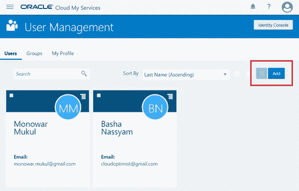

User Management

以云帐户管理员的身份连接到云用户管理页面，为 Oracle Management Cloud 服务添加用户和分配 Oracle Management Cloud 角色。在下面输入所有详细信息，然后单击“下一步”。

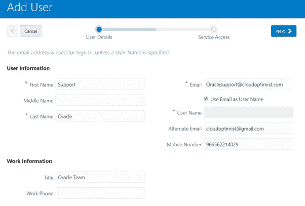

Add User for OMC

在下一页中，我们可以看到 Oracle 云的所有服务和实例。我们的目标是为 Oracle 管理云服务分配角色，因此在“按服务过滤”搜索框中选择管理云选项，并在“显示”搜索框中选择“服务和实例”与 Oracle 管理云相关—我们可以看到两个选项。

1.  **服务授权**–创建管理云服务和实例的管理员角色。
2.  **服务实例**

*   OMC 行政官
*   OMC 普通用户

根据用户限制，OMC 管理员可以为服务实例分配所需的角色。

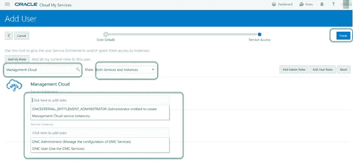

Assigning Roles for OMC

完成后，点击“完成”按钮。将来，如果要对角色进行任何更改，我们可以随时访问用户并分配所需的角色。

## 管理身份证明存储

凭证存储是敏感数据(如用户名、密码、访问密钥、密钥或企业 IT 的任何敏感数据)的存储库。Oracle 管理云不仅允许我们为 Oracle 产品创建或存储凭据，还允许我们为 AWS、Azure 等非 Oracle 供应商凭据类型创建或存储凭据。在本节中，我们将通过简单的步骤创建各种类型的凭据库。访问 Oracle 管理云控制台 URL，导航到管理→凭据存储。

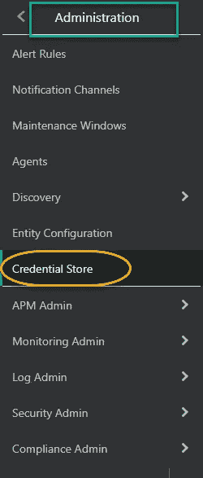

Credential Store navigation

在下一页中，您可以选择“+新凭据”或“+”按钮来创建凭据

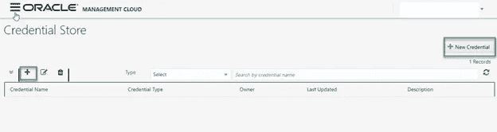

New Credential

我们将首先为“OraclePublicCloud”、“OssCred”和“AWS”创建三种类型的凭证要向 OMC 添加新凭据，所有字段都是必填的。

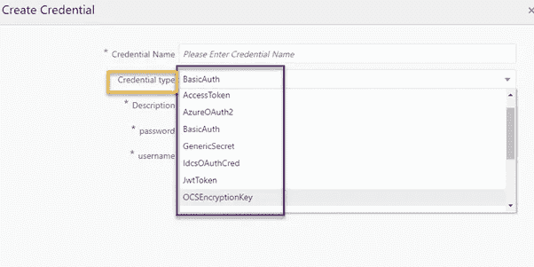

Credential Types

从下拉列表中选择凭据类型“Oracle Public Cloud ”,并输入其他必需的详细信息。除了租户 ID，大多数字段都是众所周知的。

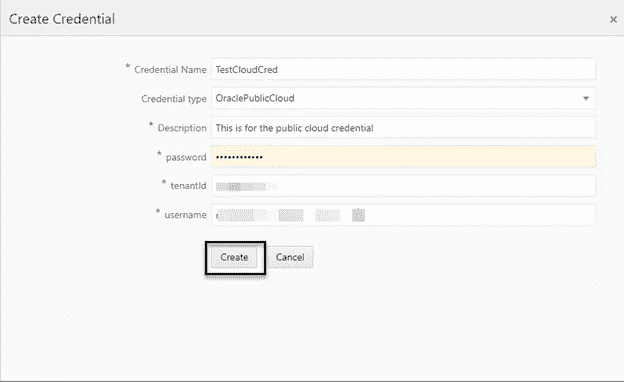

Oracle Public Cloud Credential

租户 ID 可从我的服务à身份云à附加信息à概述选项卡(或“我的服务的 URL 打开管理控制台→服务实例”)中获取

在下面的示例中，我们将为操作系统创建另一个凭证存储。根据凭据类型，字段可能会发生变化，如果我们在此示例中看到的不是租户 id，而是 rest 端点。

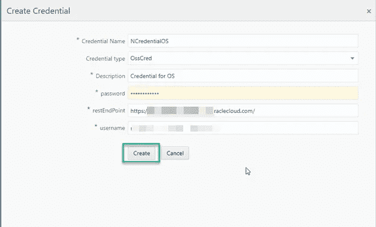

OS Credential

现在，我们将为 AWS Cloud 创建另一个凭证存储，AWS 使用其他强制常规字段处理访问和密钥。

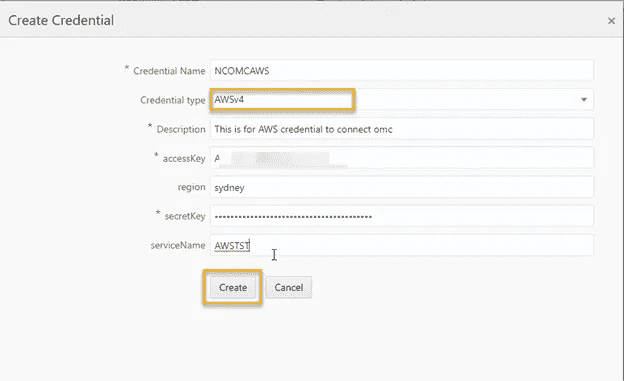

AWS Credential

提交所有三个凭证后，我们可以看到它们是按照下面的状态创建的。

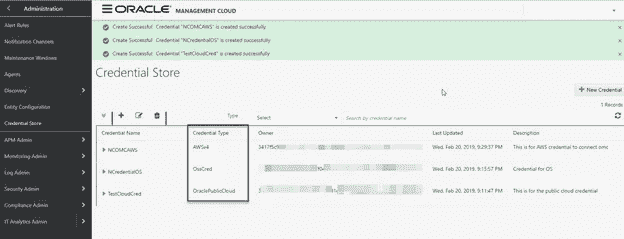

Credential Status

如果凭据有任何更改，我们可以随时使用编辑选项编辑凭据库，如下所示。

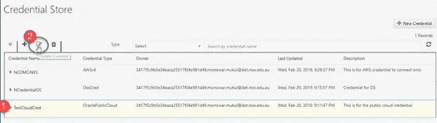

Editing Credentials

对特定凭据库进行更改后，我们可以通过单击下面的“更新”按钮来接受更改。

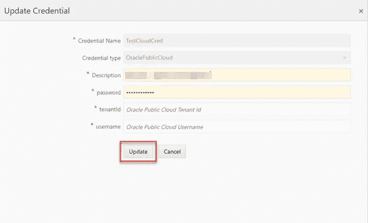

updating Credentials -II

## 摘要

我们已经了解了 Oracle 管理云管理员和普通用户之间的区别，以及如何为 Oracle 管理云服务创建用户和分配角色。在下一部分中，我们看到了灵活的 Oracle 管理云，它允许创建各种类型的凭据存储，包括具有分步说明的其他供应商凭据。

## 作者简历

***纳西姆·巴沙*** 是数据库管理员。他有大约十年的 Oracle 数据库管理员工作经验，目前是 eprosed KSA 公司的数据库专家。他拥有马德拉斯大学的计算机应用硕士学位。他是 Oracle 11g 认证大师和 Oracle ACE 总监。他以超级英雄的身份积极参与甲骨文相关论坛，如 OTN，甲骨文支持被授予“大师”称号，并担任 OTN 版主，与 OTN 一起撰写了大量关于 Toad World 的文章。他维护着一个与甲骨文技术相关的博客，www.oracle-ckpt.com，可以通过 https://www.linkedin.com/in/nassyambasha/找到他

***Monowar Mukul*** 目前担任首席 Oracle 数据库专家。我是 Oracle 认证大师(Oracle 12c 认证大师管理、Oracle 12c 认证大师 MAA 和 Oracle 11g 认证大师管理)。他在 Oracle MAA 空间担任了 17 年的 Oracle 数据库管理员顾问，负责数据库云服务器和非数据库云服务器系统、Oracle 云空间和 SOA 中间件。他曾在澳大利亚的多个商业领域工作，包括高等教育、能源、政府、采矿和运输。作为一名首席 Oracle 数据库专家，他展示了高度发展的批判性思维和分析技能。你可以在[https://www.linkedin.com/in/monowarmukul/](https://www.linkedin.com/in/monowarmukul/)找到关于他和他的工作成就的更多细节

## 参考

[https://docs . Oracle . com/en/cloud/PAAs/management-cloud/ebsms/Oracle-management-cloud-roles-and-users . html](https://docs.oracle.com/en/cloud/paas/management-cloud/ebsms/oracle-management-cloud-roles-and-users.html)