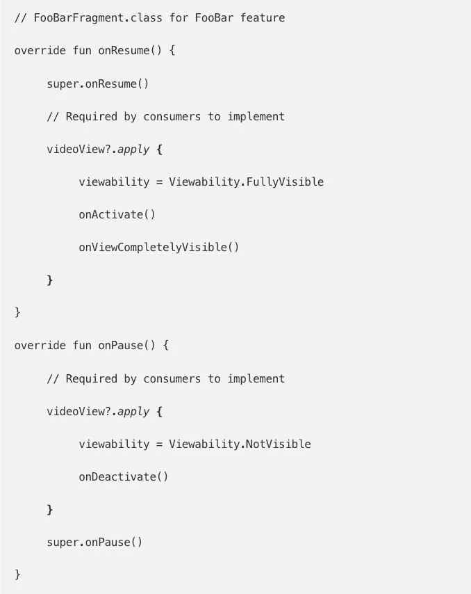
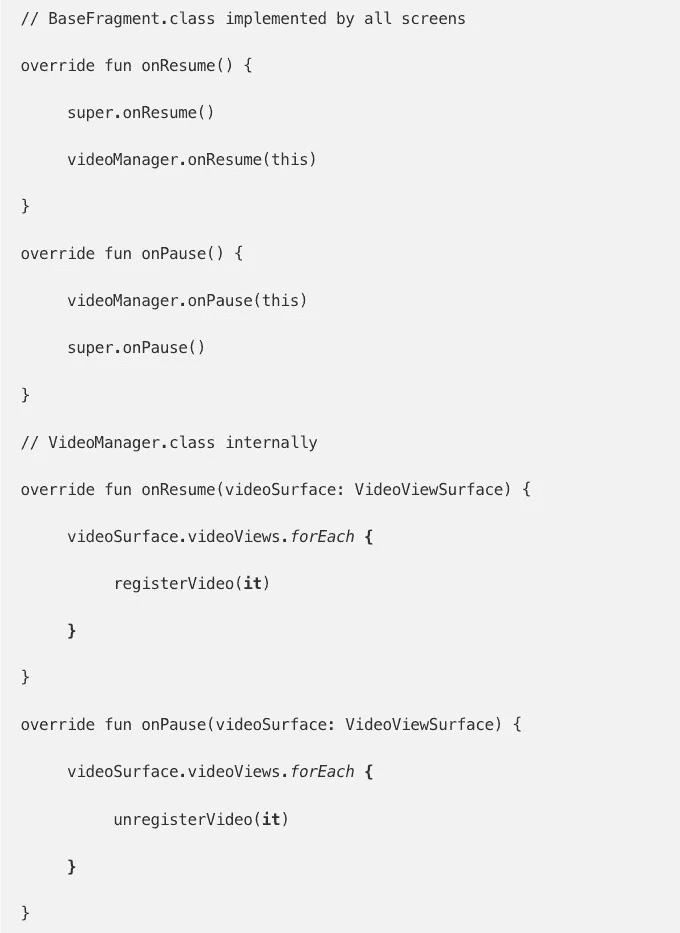
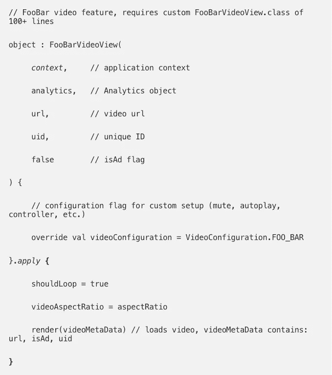
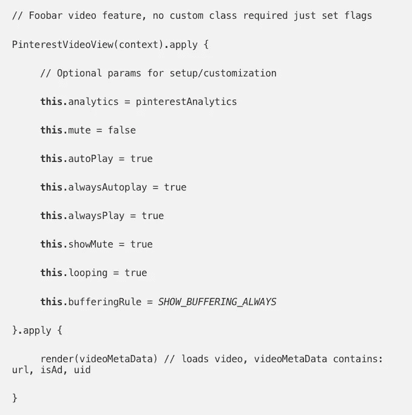
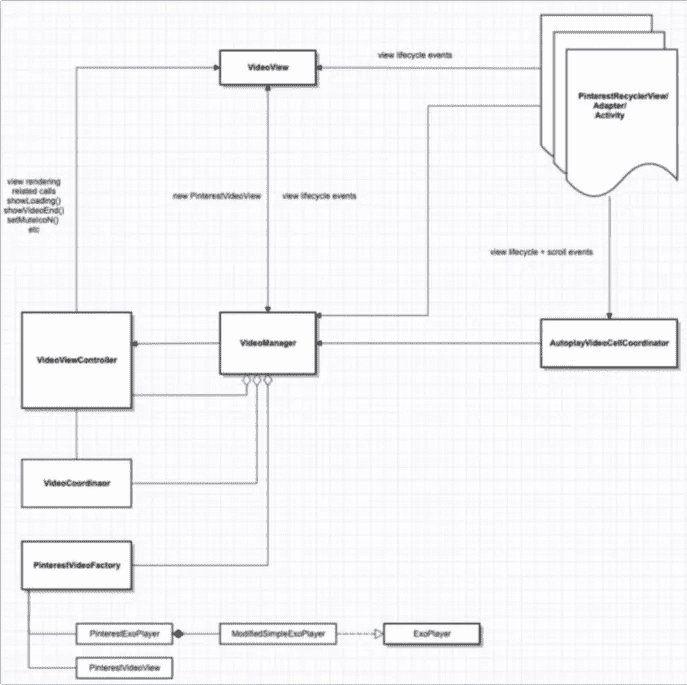
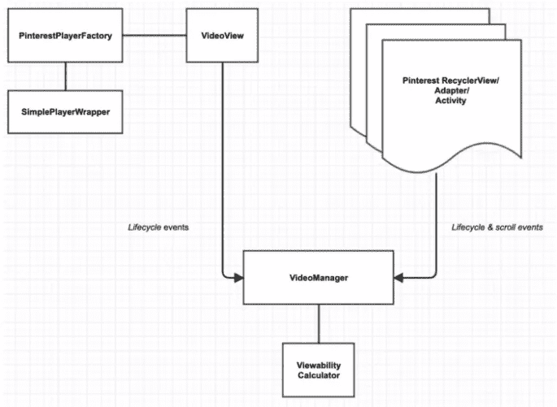

# 在 Android 中管理视频

> 原文：<https://medium.com/pinterest-engineering/administrar-videos-en-android-4163fed557b6?source=collection_archive---------5----------------------->

作者:Grey Skold | Android Video Product

这篇文章最初发表在 英语;Read the English version [here](/pinterest-engineering/managing-videos-on-android-f59da9601d5f)

视频功能于 2016 年在 Pinterest 的 Android 应用程序中推出,以提供完全集成的应用程序内视频体验。这包括在每个屏幕上支持多个视频的能力,同时通过在屏幕消失时自动暂停它们来动态控制它们的播放状态,或者控制可以同时播放的视频数量。

我们很快意识到,我们面临着许多技术挑战,其中包括:

● 管理所有当前可用的视频的播放状态。

了解视频在屏幕上的可见性百分比。

为我们的开发者提供一个易于使用的视频组件。

随着时间的推移,我们逐渐更新了我们的视频架构,以满足这些要求。接下来,我们将讨论我们如何在最新的视频模块中应对这些挑战。

# 视频管理员

在更高级别上,我们需要创建一个组件,该组件考虑到屏幕上所有可用的视频实例(即 **视图** )以及相关的表面(即 **片段** )。管理表面对于监控生命周期状态(例如: **onStart()** 等)至关重要。它们将应用于表面的子元素,并避免向消费者层添加额外的代码,以便将最新的状态更改应用于**可视化** 。

为了跟踪这些关键生命周期事件,Android 框架为我们提供了屏幕上显示的内容的当前状态,以及在视觉上影响我们应用程序的更改。我们听到的关键生命周期事件是附加的用户界面调用(例如:, **onAttachedToWindow()** ),以及当我们的主机屏幕更改其显示状态时(例如:, **onPause()** 等。的。

通过这些回调方法,我们尝试记录提供有效视频 URL 的视频。这将为我们提供当前表面内可用的视频的初始列表。

在我们的视频框架的第一个迭代中,我们依靠客户端代码自己调用这些调用,但我们注意到它是不可扩展的,因为它增加了创建视频功能的复杂性。相反,我们通过创建需要传输底层视频组件的方法来抽象回调以在**VideoManager**后面录制视频。从那里, **VideoManager**将在后台进行相应的计算。这消除了消费者对视频录制过程的预定义知识的需求,因为它现在“随时可用”。

# 以前

# 之后

此视频列表使我们能够根据应用程序的当前可见性动态设置播放状态。这也提供了灵活性,可以根据视频录制期间传输的元数据的某些属性动态更改其他功能。

例如,我们可能希望自动播放所有视频广告,但仅限于在同一表面上自动播放 1 个有机视频(即创作者生成的内容)。通过检查特定视频中记录的元数据,我们可以将这些限制应用于用户界面层。

我们还抽象了所有 Pinterest 特定的分析代码,以保持对 VideoManager(管理和播放视频)的明确关注,并使组件独立于应用程序。

# Viewability 的计算

可视性(Viewability)定义为屏幕上显示的用户界面组件的可见区域的百分比。这对于理解当前向用户显示的内容至关重要。通过这些数据,我们可以为我们的合作伙伴收集有关您的内容参与的信息。

通常,由于**VideoManager**包含对所有活动视频的引用,我们可以跟踪我们观看的确切坐标(即**getLocationInWindow()**)和设备的屏幕尺寸(参见**DisplayMetrics**),以便在屏幕上推断出它们的**Viewability**。

我们还通过以下方式处理重叠的用户界面:

● 让消费者可以选择包含可能与我们的基础视频重叠的 “阻碍”观看列表(例如:,工具栏,浮动按钮等。）

显示的弹出窗口的回调(即: **onWindowFocusChanged()** )

● 屏幕滚动组件或退出屏幕的用户界面组件(参见*RecyclerView*侦听代理)

● 在屏幕上显示视频表面时的额外回调(即**onResume()**等)的。

# 为开发者创造

虽然我们希望降低开发人员面临的视频管理复杂性,但最令人困惑的领域是实施新的视频界面。因此,我们抽象了设置视频的复杂性,以及我们使用的 Google PlayerView 提供的用户界面组件:

# 以前

# 之后

视频基础设施的另一个复杂性是 **VideoManager** 的实际架构。在重写时,我们整合了我们的大多数旧组件,以便仅包含使**VideoManager**正常工作的严格必要组件。

# 以前

# 之后

**VideoManager** 的新架构提供了清晰的事件层次结构和组件之间的关系。这不仅在理论上听起来不错,而且仅重构就删除了 4500 多行代码(不到原始实现大小的三分之一)。

# 播放视频直至日落

创建一个合适的“视频播放”工具是一个漫长而艰巨的过程,但多年来,我们创造了一些真正进化的东西,以帮助优化我们的开发流程和 Pinterest 用户体验。展望未来,我们希望我们的工作是开源的,以便其他开发人员可以为管理动态视频播放的持续努力做出贡献。我们将继续迭代我们的视频客户端架构,并解决新出现的挑战,旨在为 Pinterest 用户和开发人员创造愉快的视频体验。

我们正在构建世界上第一个视觉发现引擎。全球有超过 4.75 亿人使用 Pinterest 来梦想,计划和准备他们想要做的事情。[加入我们的团队!(T11)](https://careers.pinterest.com/careers)