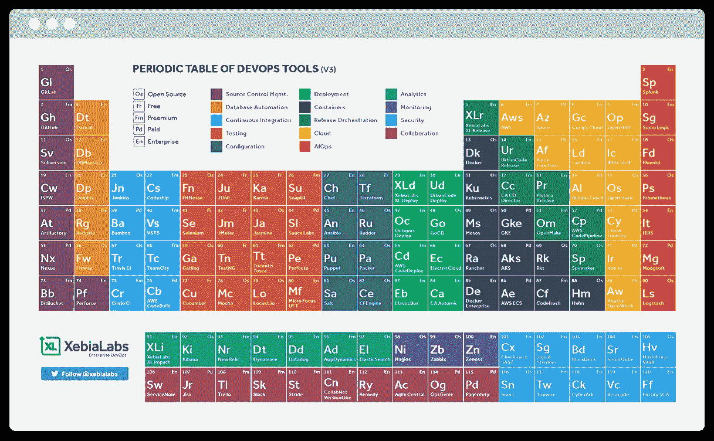
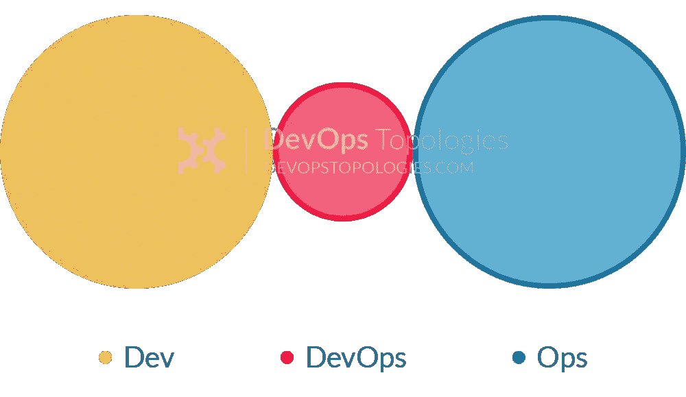

# 采用 DevOps 文化

> 原文：<https://medium.com/version-1/adopting-a-devops-culture-3699da5abe87?source=collection_archive---------5----------------------->

在过去的几年里，DevOps 改变了软件交付的方式。虽然许多人将这个术语与技术和工具(配置管理、CI/CD 管道、云和自动化)联系在一起，但是 DevOps 还有更深层次的业务优势。

[XebiaLabs](https://xebialabs.com/periodic-table-of-devops-tools/)’ has a great list of DevOps tools — but culture is the first step.

更深层次的影响在于文化、组织流程的整合，以及打破不同工程团队之间的壁垒。通过更紧密的团队协作，可以在支持上市时间、运营效率和改善客户体验等业务目标方面实现真正的改变。

DevOps 的基本原理并不新鲜，这套实践背后的想法可以追溯到丰田通过[丰田生产系统](https://www.toyota-europe.com/world-of-toyota/this-is-toyota/toyota-production-system) (TPS)带来的精益制造生产线效率。

# **更紧密的合作**

任何 DevOps 实现的关键部分是**将原本独立工作的团队**聚集在一起，包括开发人员、测试人员、基础设施和 DBA。

DevOps 不是将工作从一个团队传递到另一个团队，而是依靠团队之外的人来取得进展或实施变革，而是将混合技能的较小团队放在一起。这样，每个小团队现在可以完全负责他们自己的工作量，从想法开始到生产。

采用 DevOps 文化已被证明具有显著的商业利益，63%的公司更频繁地发布新软件，55%的公司注意到在实施这些改变后合作和协作得到了改善。

# **领养**

成功采用 DevOps 的第一步是拥有倡导这种文化的人。企业需要那些想要改变企业文化并愿意在工作场所推动这种改变的员工。

这些“DevOps 拥护者”对于任何 DevOps 实施的成功都至关重要，因为他们将为 DevOps 的集成而奋斗，并消除任何潜在的采用障碍。如果将高级利益相关者和经理列为“拥护者”,将会取得更大的成功，因为他们将拥有自上而下实施变革的权力。

尽管热情的员工会支持 DevOps 的实施，但整合现有员工的最佳方式是什么？最好是通过文化和技术方面的培训、指导和技能提升。

这将有助于提供领域知识和理解。通过提供必要的支持和培训，现有员工对 DevOps 的实施非常有价值，并有助于在工作场所内推动和推广这一应用。

引入外部服务也有助于向 DevOps 过渡，因为许多企业没有能力或资源独自采用整个 DevOps 流程。从知识共享、经验和培训资源的角度来看，雇佣像 Version 1 这样的 IT 服务提供商将使过渡更加容易。

只有 17%的公司成功采用 DevOps ，这表明在实施过程中确实存在潜在的障碍。公司需要在实施 DevOps 之前确定并消除潜在的障碍，以确保流程顺畅高效。

# **壁垒**

采用 DevOps 最常见的障碍与技术没有太大关系，而是与人有关，即抗拒改变的人。他们可能看不到变革的动力，通常比较保守，不喜欢组织变革的想法。某些团队可能比其他团队更抗拒变更，例如，软件开发人员可能不想参与任何 ops 活动。

DevOps 的另一个关键障碍是成本。由于高需求和缺乏有经验的开发运维专家，实施开发运维所需的资源和技能可能会非常昂贵。需要时间和金钱的初始投资，没有直接的回报。然而，一旦公司从初始阶段继续前进，DevOps 的实施意味着工作负载的运行成本和时间工作将变得更加便宜和容易。研究表明[与 DevOps](https://www.cio.com/article/2898032/how-devops-can-redefine-your-it-strategy.html) 相比，传统 Ops 的总体耗时多 41%。

公司经常试图雇佣一名有经验的专家，让他们立即“做开发工作”。然而，类似于试图建立一个专用的[“devo PS 团队”反模式](https://web.devopstopologies.com/)——这通常是行不通的。通常最好是培训和提升现有组织成员的技能，并在内部建立 DevOps 文化，以实现更平稳和成功的过渡。

[DevOps Silo anti-pattern](https://web.devopstopologies.com/)

如果操作正确，结果是不言自明的: [63%的人体验到了软件部署质量的提高，38%的人报告说代码生产质量有所提高](https://www.upguard.com/blog/devops-success-stats)。

感谢阅读！如果你对此感兴趣，请联系 LinkedIn 或 T2 Twitter。

如果你想了解第一版提供的 DevOps 咨询服务的更多信息，请点击这里查看[我们。](https://www.version1.com/it-service/digital-services/devops-consultancy/)

**AWS devo PS 入门**

对于那些希望开始使用 DevOps 的人来说， [AWS 为 DevOps 实践者提供了有用的工具和基础设施资源。](https://aws.amazon.com/devops/)如果您有兴趣阅读更多关于 [AWS DevOps 文化和组织的信息，请访问本页](https://aws.amazon.com/modern-apps/faqs/#Culture.2FOrganization)。