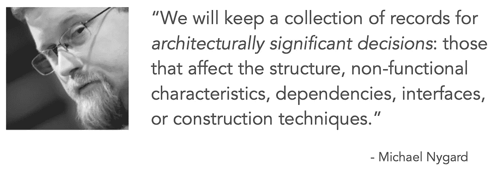
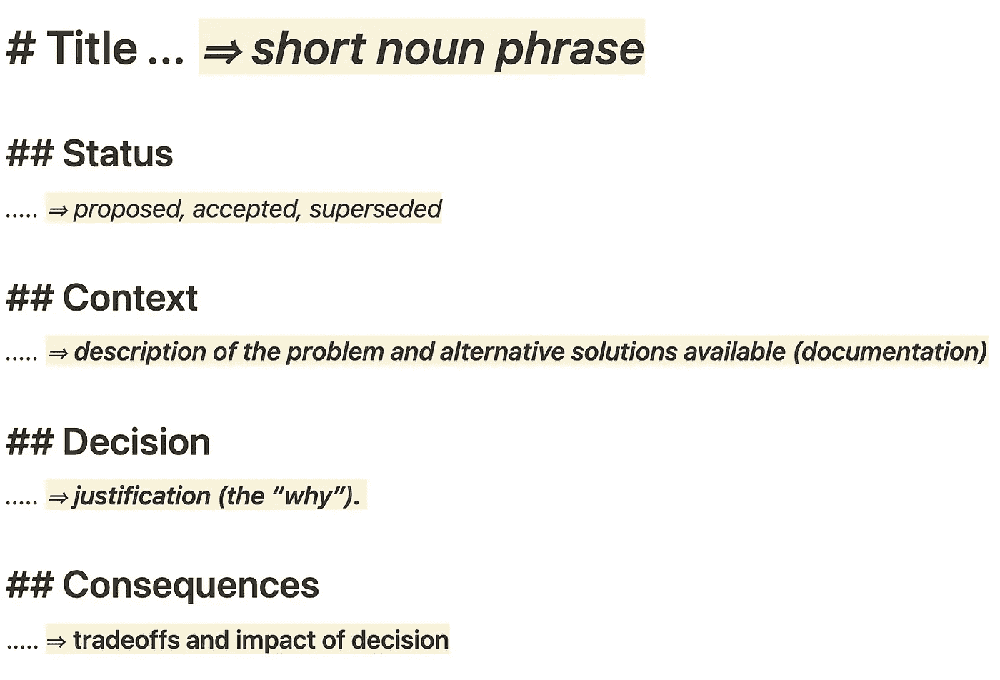
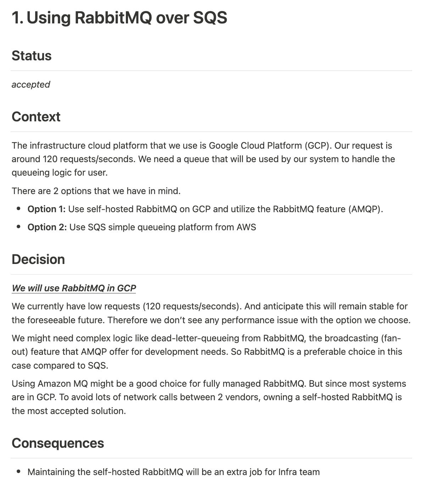
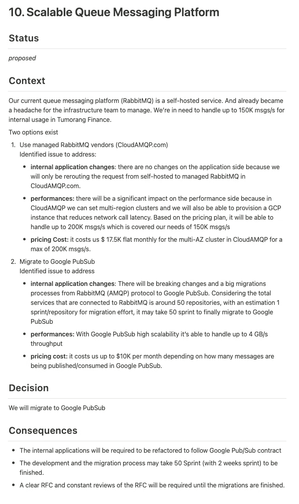
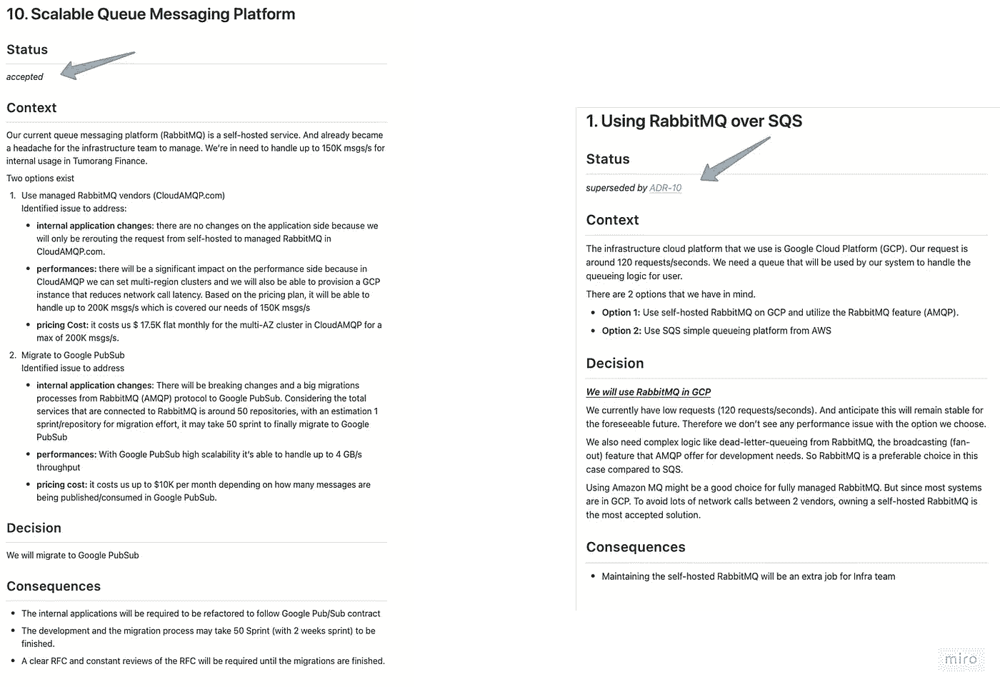

# 软件架构中的 ADR(架构决策记录)——英文版

> 原文：<https://medium.easyread.co/adr-architecture-decision-record-in-software-architecture-english-version-dcc38438257b?source=collection_archive---------0----------------------->

## 编写架构决策记录，作为软件架构中关键决策的历史记录。

Photo by [Brandon Lopez](https://unsplash.com/@itsbrandonlopez?utm_source=medium&utm_medium=referral) on [Unsplash](https://unsplash.com?utm_source=medium&utm_medium=referral)

*此处原文为印尼语*[https://medium . com/easy read/ADR-architecture-decision-record-pada-software-architecture-8f 42 b 8917184](https://medium.com/easyread/adr-architecture-decision-record-pada-software-architecture-8f42b8917184)

这篇文章是那篇文章的英文版。

大家好，回到我的博客系列，Iman Tumorang，在 SoftwareArchitect.ID

给个小背景，从 2022 年初开始，我开始主动制作自己的与软件架构和我作为(*有志*)软件架构师的生活相关的著述或日记。

在这篇文章中，这一次我想写关于软件架构相关决策时的架构决策记录(ADR)。我在[日记#2](https://notes.softwarearchitect.id/p/diary2-struktur-dan-aspek-penting) 中提到过 ADR(用巴哈萨语写的)。但是在[日记#2](https://notes.softwarearchitect.id/p/diary2-struktur-dan-aspek-penting) 中，我只是简单解释了 ADR 是什么样子的。好吧，在这篇文章中，我将更详细地解释什么是人们经常使用的 ADR，或者至少是我在工作中使用的 ADR。

# 什么是架构决策记录(ADR)？

在我们转向架构决策记录之前，首先，我们需要知道什么是架构决策。

在维基百科上，我们可以发现[架构决策](https://en.wikipedia.org/wiki/Architectural_decision)是，

> *架构决策是解决架构上重要需求的设计决策；它们被认为很难制定和/或改变成本很高。*

在他的博客文章[记录架构决策](https://cognitect.com/blog/2011/11/15/documenting-architecture-decisions)中，Michael Nygard 指出，他们维护着一个重要的架构记录集合，这些记录会影响系统开发中使用的结构和非功能特性、依赖性、接口和技术。

从这两个解释中，我们可以理解，保存在构建系统时已经做出的决策是很重要的，尤其是所有在架构上有意义的决策。

也许作为一个例子，我可以提一下。

> 有一天，在最大的数字保险公司之一的 Tumorang Finance 工作。Tumorang Finance 希望扩展到印度尼西亚，因此这个扩展计划中的主要内容是与印度尼西亚任何本地支付方式的集成。长话短说，Tumorang Finance 将集成一个支付网关，称之为 Xendit。
> 
> 然后系统就是这样设计的，直到某个时候，作为 Tumorang Finance 软件架构师的 John Snow 与工程师团队就要使用的技术选择进行了争论。工程师团队希望使用 RabbitMQ，然后软件架构师 John Snow 选择使用 SQS 作为消息队列平台，该平台将在向 Xendit(支付网关)发出支付请求时使用。
> 
> 进行了长时间的辩论，直到在某一点上，他们找到了一个令人满意的决定，他们都同意使用 RabbitMQ。

从上面的例子来看，选择 RabbitMQ 和 SQS 的决定会影响到将要构建的系统的结构和依赖关系。如果他们使用 SQS，他们自动必须使用 AWS 云提供商。如果他们使用 RabbitMQ，他们可以使用自托管或其他供应商。

现在他们选择的决定将被存储在一个记录中，它可以是 Google docs、Atlassian Confluence、Github 上的 Markdown 等形式。现在这个记录被称为架构决策记录。

随着团队和公司的成长，里面的人肯定是来来去去的。旧的人可能会辞职，新的人会加入。这将给未来加入公司的新人带来一个问题。他们可能需要知道，“为什么做出这样的决定”？为什么之前的团队选择 RabbitMQ 而不是 SQS？但是由于 ADR，他们可以清楚地阅读和理解为什么做出这个决定。

# ADR 组件

网上有很多如何写 ADR 的例子。有几个资源可能对我们有用。但是在这里我会试着用我自己的解释再次解释。

ADR components

如果我们看上图，ADR 有几个重要的组成部分。即使网上有很多版本的 ADR，这五个组件也是制作 ADR 时最重要的组件。

## 1.标题

第一个非常重要的组成部分是标题。这将是我们将要创建的 ADR 的标识符。格式是免费的，但这个组件最重要的部分是它必须有一个数字，后跟 ADR 的主标题。

示例:

> *ADR 1:使用 RabbitMQ 超过 SQS
> 或
> 1。在 SQS 上空使用 RabbitMQ】*

这个数字作为参考和决策记录版本控制非常有用，我将在本文末尾解释。

## 2.状态

该组件表示已写入的 ADR 的当前状态。通常，这些阶段从 ADR 仍在等待所有相关利益主体批准的**【提议】**开始。然后，当所有利益相关者同意时，更改为**【已接受】**。随着业务增长和公司变得更大，新法规或新流程的引入，决策可能不再相关，如果有新的 ADR 替代过时的 ADR，则状态将更改为**【已弃用】**或**由** *<新 ADR 编号>* 【取代】。

## 3.语境

该组件解释了**ADR 存在的背景**原因。通常，这个组件是中性的，只解释与某个问题相关的事实。该组件提供了现有的选项(例如:选项 1:使用 Golang，选项 2:使用 JavaScript)。如果我们也把所有的利弊放在这个组件上列出的选项之间，那就更好了。

## 4.决定

这一部分描述了所有利益相关者一致同意的决定。这里将解释作出这一决定的所有理由。这将回答所有的问题**“为什么……”**在已经做出的建筑设计上。

撰写决定时，必须以主动语态书写，**“我们将……”**声明所有利益相关方**将**通过协商一致选择 ADR 中的决定。而不是“我会…”或“首席技术官会…”因为这是个人决定，而不是共同商定的决定。

## 5.结果

该组件将解释所有决策的负面影响或缺点/权衡。以便所有的利益相关者都意识到，已经达成一致的决策必须进行权衡。

# 撰写 ADR

在上面的部分，我已经解释了一点关于 ADR 和 ADR 中包含的组件。为了练习，我会试着举一个写 ADR 的例子。

对于案例研究，我们可以使用上面关于**肿瘤金融的案例的例子。**

因此，从案例研究来看，如果我制作 ADR，它将看起来像这样。

**注:只是一个例子！**

后来，Tumorang Finance 也设法扩展到了印度尼西亚。许多客户注册并成为由 Tumorang Finance 提供的数字保险的活跃成员。

然后，两年后，infra 团队开始忙于维护他们自己的 RabbitMQ。问题的火花开始出现，因为 RabbitMQ 下降，并成为公司更积极增长的瓶颈。

Tom angfinance 的建筑师约翰·斯诺(John Snow)认为这是一个尝试解决这个问题的时机。长话短说，在与所有相关利益方讨论和开会后，得出的结论是有两种选择。

*   使用托管 RabbitMQ 供应商(如 CloudAmqp.com)
*   迁移到 Google 发布订阅

因此，John Snow 还创建了一个新的 ADR，其状态为**“建议的**”。

然后，将与所有相关利益方(CTO、工程师、基础设施等)讨论 ADR。

因此，如果 ADR 得到所有利益相关方的批准，那么 ADR 状态将变为**【已接受】，**，而之前选择 RabbitMQ 的旧 ADR 将变为**【已取代】。**

现在，在此之后，下一步是继续设计和开发过程，并遵循商定的 ADR。

# 结论

在这篇文章中，我解释了一些关于 ADR 的内容，其中有五个重要的组成部分:标题、状态、上下文、决策和后果。在制作 ADR 时，必须说明这五个组成部分。

我们还可以更有创意地添加其他组件，如日期或标签(hashtags ),以使 ADR 搜索/过滤更容易。因为该 ADR 必须易于访问，无论是通过搜索还是通过分类和标记。

很多平台都可以用，你可以用 Google Docs，Atlassian Confluence，concept，甚至是 Git (Github/Gitlab/Bitbucket)上的 Markdown。

## 更多阅读

更多关于 ADR 的阅读，你可以去下面的链接，我把它列为参考，以及更多关于 ADR 的详细阅读。

*   [https://adr.github.io/](https://adr.github.io/)
*   [https://cogn itect . com/blog/2011/11/15/documentation-architecture-decisions](https://cognitect.com/blog/2011/11/15/documenting-architecture-decisions)
*   [https://docs . AWS . Amazon . com/prescriptive-guidance/latest/architectural-decision-records/ADR-process . html](https://docs.aws.amazon.com/prescriptive-guidance/latest/architectural-decision-records/adr-process.html)
*   [https://kevinjarbt . com/start-now-architecture-decision-records/](https://kevinjalbert.com/start-now-architecture-decision-records/)
*   马克·理查兹 [Youtube 视频](https://www.youtube.com/watch?v=LMBqGPLvonU)

*   *原文发布于:*[*https://notes . software architect . id/p/diary-3-ADR-architecture-decision*](https://notes.softwarearchitect.id/p/diary-3-adr-architecture-decision)*(印度尼西亚语)*
*   *译自*[*https://medium . com/easy read/ADR-architecture-decision-record-pada-software-architecture-8f 42 b 8917184*](https://medium.com/easyread/adr-architecture-decision-record-pada-software-architecture-8f42b8917184)