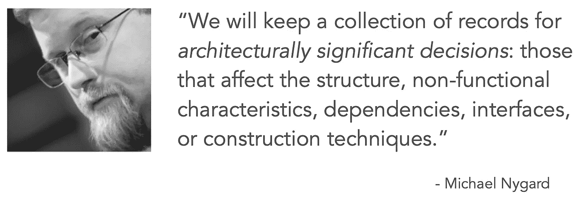
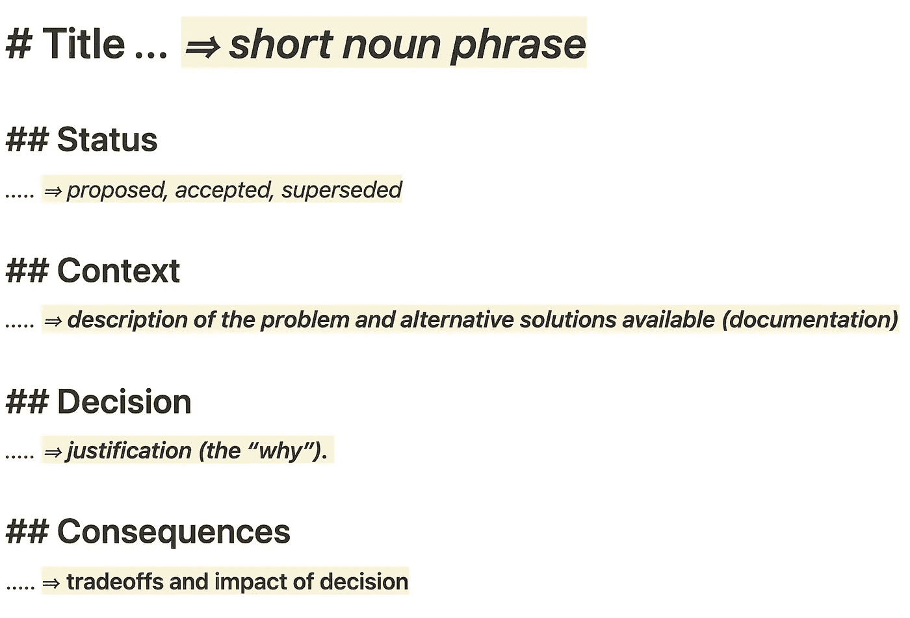
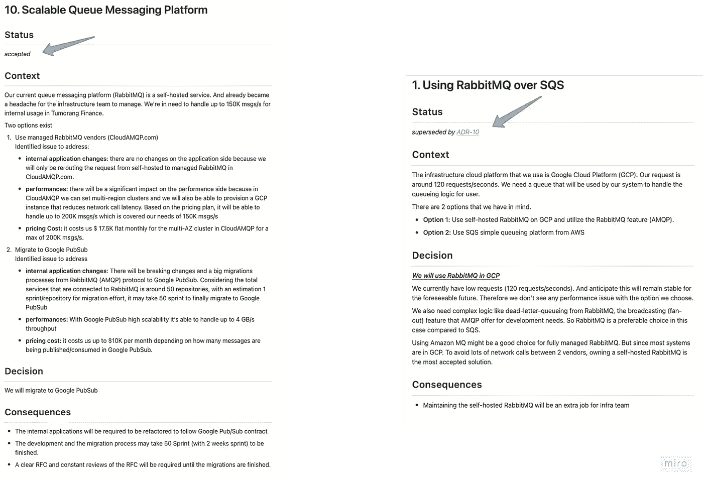

# ADR (Architecture Decision Record) pada Software Architecture

> 原文：<https://medium.easyread.co/adr-architecture-decision-record-pada-software-architecture-8f42b8917184?source=collection_archive---------1----------------------->

## Membuat Architecture Decision Record untuk sebagai rekam jejak dari keputusan yang signifikan pada software arhictecture.

Photo by [Brandon Lopez](https://unsplash.com/@itsbrandonlopez?utm_source=medium&utm_medium=referral) on [Unsplash](https://unsplash.com?utm_source=medium&utm_medium=referral)

*English Readers? Can goes to the English version here* [*https://medium.com/easyread/adr-architecture-decision-record-in-software-architecture-english-version-dcc38438257b*](https://medium.com/easyread/adr-architecture-decision-record-in-software-architecture-english-version-dcc38438257b)

Hey semua, kembali lagi dengan saya, Iman Tumorang di series diary saya sendiri di SoftwareArchitect.ID.

Buat teman yang baru melihat tulisan saya ini, sedikit konteks, dari awal tahun 2022, saya memulai suatu inisiatif sendiri untuk membuat tulisan ataupun diari saya pribadi terkait software architecture dan kehidupan saya sebagai (aspiring) software architect.

Kali ini di tulisan ini, saya ingin menulis sedikit tentang Arhictecture Decision Record (ADR) ketika membuat keputusan software architecture. ADR sudah pernah saya singgung di [diary#2](https://notes.softwarearchitect.id/p/diary2-struktur-dan-aspek-penting) sebelumnya. Namun di [diary#2](https://notes.softwarearchitect.id/p/diary2-struktur-dan-aspek-penting) saya hanya menjelaskan sekilas bentuk dari ADR seperti apa. Nah, di tulisan ini saya akan menjelaskan lebih detail bentuk dari ADR yang lumayan sering digunakan orang, atau setidaknya, yang saya gunakan dipekerjaan saya.

# Apa Itu Architecture Decision Record (ADR)?

Sebelum masuk ke Architecture Decision Record, kita perlu tahu apa itu Architectural Decision?

Pada Wikipedia, kita dapat menemukan bahwa [Architectural Decision](https://en.wikipedia.org/wiki/Architectural_decision) adalah,

> Architecture Decision are design decisions that address architecturally significant requirements; they are perceived as hard to make and/or costly to change.

Merupakan keputusan terhadap requirement arsitektur yang signifikan atau yang bersifat susah untuk dibuat ataupun diubah. Dimana jika dilakukan pengubahan akan berdampak pada cost pengembangan sistem.

Pada tulisannya di [Documenting Architecture Decisions](https://cognitect.com/blog/2011/11/15/documenting-architecture-decisions) , Michael Nygard menyatakan bahwa mereka menyimpan koleksi records arsitektur yang signifikan yang dapat mempengaruhi struktur, non-fungsional, karakteristik, dependencies, interfaces dan teknik yang digunakan pada pengembangan sistem.

Dari kedua penjelasan tersebut dapat kita artikan, bahwa pentingnya untuk meyimpan keputusan-keputusan yang pernah dilakukan ketika membangun sistem, khususnya semua keputusan yang signifikan secara arsitektur.

Mungkin sebagai contoh, saya bisa sebutkan.

> *Suatu hari diperusahaan Tumorang Finance yang merupakan perusahaan Digital Insurance terkini. Tumorang Finance hendak melakukan expansi ke Indonesia, sehingga hal yang utama dalam expansi ini adalah integrasi dengan pembayaran versi lokal yang ada di Indonesia. Singkat cerita, Tumorang Finance akan integrasi dengan sebuah Payment Gateway, sebut saja Xendit.*
> 
> *Lalu sistem pun didesign sedemikian rupa, hingga disuatu titik, John Snow selaku Software Architect di Tumorang Finance berdebat dengan tim engineer terkait pemilihan teknologi yang akan digunakan. Tim Engineer ingin menggunakan RabbitMQ, lalu John Snow selaku software architect memilih untuk menggunakan SQS sebagai message queueing platform yang akan di gunakan ketika melakukan payment request ke Xendit (Payment Gateway).*
> 
> *Debat panjang pun dilakukan, hingga pada suatu titik, mereka pun menemukan titik terang dan setuju akan menggunakan RabbitMQ.*

Dari contoh diatas, keputusan memilih RabbitMQ dan SQS akan berpengaruh pada struktur dan dependencies sistem yang akan dibangun. Jika menggunakan SQS, maka secara otomatis mereka pun harus menggunakan AWS Cloud provider. Jika menggunakan RabbitMQ maka mereka bisa saja menggunakan self-hosted, ataupun memakai vendor lainnya.

Nah keputusan yang mereka pilih ini akan disimpan dalam record bisa berbentuk Google docs, Atlasian Confluence, Markdown di Github, dsb. Nah record inilah disebut dengan Architecture Decision Record.

Sehingga dengan perkembangan tim dan perusahaan, orang-orang didalam pasti datang dan pergi. Orang lama mungkin akan resign, orang baru akan join. Sehingga jika suatu saat dikemudian hari orang-orang baru yang join dapat mengerti kenapa keputusan dilakukan. Mengapa tim terdahulu memilih RabbitMQ daripada SQS?

# Komponen ADR

Untuk menulis ADR sendiri sudah banyak contoh di Internet. Ada beberapa resource yang mungkin berguna untuk kita ikutin. Namun disini saya akan coba jelaskan kembali dengan bahasa saya sendiri.

ADR components

Jika kita lihat gambar diatas, terdapat beberapa komponen penting pada ADR. Jika pun banyak versi ADR yang ada di internet, namun ke 5 komponen tersebut adalah komponen paling penting ketika membuat ADR.

## 1\. Title

Komponen pertama yang sangat penting adalah Title. Ini akan menjadi identifier dari ADR yang akan kita buat. Formatnya bebas, namun yang wajib kita ketahui, harus memiliki nomor, lalu diikuti dengan judul utama dari ADR tersebut.

Contoh:

> *ADR 1: Using RabbitMQ over SQS
> atau
> 1\. Using RabbitMQ over SQS*

Nomor ini berguna untuk urutan dan referensi nantinya yang akan saya jelaskan nanti di akhir tulisan ini.

## 2\. Status

Komponen ini menyatakan status ADR yang telah ditulis. Biasanya tahapannya dimulai dari **“proposed”** ketika ADR tersebut masih menunggu approval dari semua stakeholders yang terlibat. Lalu diubah menjadi **“accepted”** ketika semua stakeholders setuju. Dan jika dikemudian hari seiring dengan perkembangan bisnis, keputusan tersebut tidak relevan lagi, maka statusnya akan diubah menjadi **“deprecated”** atau “ **superseded by** *< new ADR number >* ” jika terdapat ADR baru yang menjadi pengganti ADR yang sudah usang tersebut.

## 3\. Context

Komponen ini menjelaskan latar belakang dari mengapa ADR tersebut hadir. Biasanya pada komponen ini sifatnya netral dan hanya menjelaskan fakta yang ada terkait sebuah masalah. Bisa juga pada komponen ini, kita memberikan opsi pilihan yang ada, (contoh: opsi 1: menggunakan Golang, opsi 2: menggunakan JavaScript).

## 4\. Decision

Komponen ini menjelaskan keputusan yang telah disepakati oleh semua stakeholders yang terlibat. Disini akan dijelaskan semua alasan mengapa keputusan tersebut diambil. Yang akan menjawab semua pertanyaan **“Why ….”** pada design arsitektur yang telah dibuat.

Dan ketika menulis decission harus ditulis dengan kalimat aktif, **“We will …”** menyatakan bahwa secara konsensus semua stakeholders **akan** memilih decision yang ada pada ADR tersebut. Bukan “I will …” atau “The CTO will …” karna ini bersifat individual decission bukan keputusan secara bersama yang disepakati.

## 5\. Consequences

Komponen ini akan menjelaskan semua effect negative atau drawback/tradeoffs dari keputusan yang diambil. Sehingga semua stakholders sadar bahwa keputusan yang telah disepakati ternyata memiliki tradeoffs yang harus disiasati.

# Menulis ADR

Pada bagian diatas saya sudah menjelaskan sedikit tentang ADR dan komponen-komponen yang terdapat pada ADR. Untuk latihan, saya akan coba buat contoh penulisan ADR.

Studi kasusnya dapat kita gunakan contoh kasus yang ada diatas yang ada pada Tumorang Finance.

Nah dari studi kasus tersebut, maka jika saya buatkan ADRnya, kira-kira akan berbentuk seperti ini.

**Notes: hanya contoh ya!**

Lalu kemudian, Tumorang Finance pun berhasil ekspansi ke Indonesia. Banyak client mendaftar dan menjadi aktif member dari digital insurance yang ditawarkan Tumorang Finance.

Lalu, 2 tahun berlalu, ternyata tim infra pun mulai kewalahan memantain RabbitMQ yang mereka host sendiri. Sehingga mulai muncul percikan-percikan issue karena RabbitMQ down yang kini menjadi bottleneck perusahaan untuk growing lebih aggresive.

John Snow, selaku architect di Tumorang Finance, melihat ini sebagai momen untuk mencoba solve masalah ini. Singkat cerita, setelah diskusi dan meeting dengan semua stakeholders yang terlibat, disimpulkan terdapat 2 pilihan.

*   Use managed RabbitMQ vendors (eg. CloudAmqp.com)
*   Migrate to Google Pubsub

Maka John Snow pun membuat ADR baru dengan status “ **proposed”** berikut.

Nah selanjutnya ADR tersebut pun akan didiskusikan ke semua stakeholders yang terlibat, CTO, Engineers, Infrastructure, dsb.

Nah semisal singkat cerita ADR tersebut disetujui oleh semua pihak, maka status ADR tersebut akan berubah menjadi **“accepted”** , sementara ADR yang lama, yang sebelumnya untuk memilih RabbitMQ akan menjadi status **“superseded”.**

Nah setelah ini selanjutnya adalah melanjutkan proses design dan development yang akan mengikuti ADR yang telah disepakati.

# Conclusion

Dari tulisan ini saya menjelaskan sedikit gambaran tentang ADR, dimana terdapat 5 komponen penting yaitu, Title, Status, Context, Decision, dan Consequences. Ke 5 komponen ini wajib ada ketika pembuatan ADR.

Kita juga bisa lebih kreatif menambah komponen lainnya seperti date, atau tagging (hastag) untuk memudahkan pencarian/filter ADR. Karena ADR ini haruslah mudah untuk diakses, baik secara searching maupun secara kategorisasi dan *tagging* .

Platform yang dapat digunakan ada banyak beragam, dapat menggunakan Google Docs, Atlassian Confluence, Notion, atau bahkan Markdown di Git (Github/Gitlab/Bitbucket).

## More Reading

Untuk bacaan lebih banyak tentang ADR, kamu bisa meluncur ke link berikut yang sudah saya list sebagai referensi dan bacaan lebih detail tentang ADR.

*   [https://adr.github.io/](https://adr.github.io/)
*   [https://cognitect.com/blog/2011/11/15/documenting-architecture-decisions](https://cognitect.com/blog/2011/11/15/documenting-architecture-decisions)
*   [https://docs.aws.amazon.com/prescriptive-guidance/latest/architectural-decision-records/adr-process.html](https://docs.aws.amazon.com/prescriptive-guidance/latest/architectural-decision-records/adr-process.html)
*   [https://kevinjalbert.com/start-now-architecture-decision-records/](https://kevinjalbert.com/start-now-architecture-decision-records/)
*   Mark Richards [Youtube Video](https://www.youtube.com/watch?v=LMBqGPLvonU)

Demikian Diary #3 dari SoftwareArchitecture.ID, semoga berguna kepada yang membutuhkan.

*Tulisan ini merupakan hasil republikasi dari* [*https://notes.softwarearchitect.id/p/diary-3-adr-architecture-decision*](https://notes.softwarearchitect.id/p/diary-3-adr-architecture-decision)