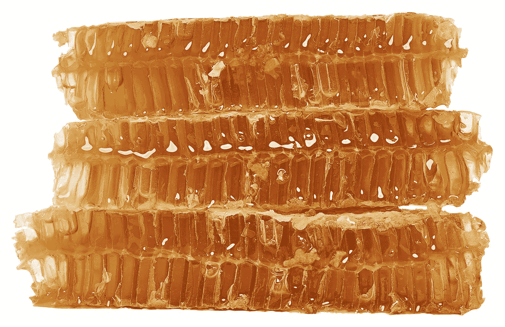

# 企业蜂的高级 FP:更高级的类型

> 原文：<https://medium.com/google-developer-experts/advanced-fp-for-the-enterprise-bee-higher-kinded-types-c6742e24527?source=collection_archive---------3----------------------->



A Stack of Honeycomb

# 介绍

这是我们系列文章的第三篇，涵盖了典型 Kotlin 开发人员的高级 FP 概念。在第一篇文章中，我们展示了*遍历*操作符是多么有用。在这个过程中，我们遇到了三个陌生的概念——*应用*、*半群*和*高级类型* (HKT 的)。

我们的[第二篇文章](/google-developer-experts/advanced-fp-for-the-enterprise-bee-applicatives-be76e4b6803c)处理了*应用*和*半群*。本文将通过解释*更高级的种类*来完善这一套。我们将从重温最初的问题开始，然后从头解释 HKT 的问题。

一如既往，本系列的所有代码都可以在这个库中找到。

# 最初的问题

检查下面的代码。特别要考虑函数*输出 1* 、*输出 2* 和*输出 3* 的参数类型。

我们看到*数据 1* 是从一到五的映射结果，为每个数字生成一个*右*。所以想必 *output1* 可以带某种 *List <要么>要么*。事实确实如此。

当我们查看*数据 2* 时，我们看到它是遍历相同范围的结果。所以我们希望结果是某种*或者<列表>* 。不幸的是，正如对 *fix* 的调用所暗示的，情况并非完全如此。

以下是匹配函数:

如果我们在列表及其内容上调用 *fix* ，那么我们可以调用 *output2* ，传入一个*或者< Int，List < Int > >* 。没有这些神奇的咒语，实际类型是令人困惑的:

```
Kind<EitherPartialOf<Nothing>, Kind<ForListK, Int>>
```

理解这里发生的事情是学习 Arrow 的最大障碍之一，并且困惑了我很长一段时间。所以，让我们慢慢地梳理一下这些概念。

# 一个更简单的例子

看看这个有点做作的例子。

我们有一个竞争对象，它将判断一个*或者*或者一个*验证过的*对象是代表赢家还是输家。对于*或者*来说，正确的*案例代表赢家，而对于*有效的*来说，它是*有效的*案例。*

下面是生成的输出:

```
winner
loser
winner
loser
```

让我们假设这种逻辑对当前的应用程序很重要，所以我们决定定义一个接口来表示竞赛的想法。看看你是否能找出这次尝试的问题所在:

合乎逻辑。我们用三个类型参数来声明我们的接口，然后给出一个方法，该方法采用一个 *U* 和 *V* 的 *T* 。遗憾的是，这将无法编译。问题是在 Kotlin 和大多数编程语言中，**不可能嵌套类型参数**。

# 为什么这很重要

使用类型参数作为泛型类型的参数最初是很奇怪的。这不是我们这样的工蜂会做的事情。但事实证明，这对围绕 FP 构建的库的设计者来说非常重要。

正如我们已经看到的，许多 FP 都是围绕以下内容构建的:

*   容器(*选项*、*任一*、*已验证*、*未来*、 *IO* 等)
*   我们放在容器中的类型(*客户、*等)
*   对值容器列表的操作(*映射*、*遍历*等)

因此，我们想要定义代表这些交互“形状”的接口。当用英语解释类似*的 FP 形状时，我们可以这样说:*

> 此操作适用于一个或多个 *T* ，其中每个 *T* 都是一个容器，容纳一个 *U* 或一个 *V* 。

我们希望能够在代码中做同样的事情。这需要嵌套类型参数的能力。当创建像 Arrow 这样的库时，我们无法做到这一点是一个大问题。特别是它阻止你创建一个叫做*类型类*的东西。但这是另一篇文章的主题。

# Scala 的一个简短的题外话

如果我们用 Scala 写这段代码，那么*更高级的类型*将直接为我们所用。

下面是我们的*竞赛*接口(又名。特质):

最重要的一点是这个语法:

```
Competition[T[_,_]]
```

它表明*竞争*类型需要一个类型参数 T，而 T 又需要自己的两个类型实参。在*判断*的实现中，我们可以自由地声明输入是*【U，V】*或*验证的【U，V】*。

这是 Kotlin 和 Scala 不同价值主张的一个很好的例子。Kotlin 提供了一般开发人员所需的 FP，但并不是库作者想要的所有东西。这保持了语言的极简主义和浅的学习曲线。

相反，Scala 给了你 FP 和 OO 范例的所有特性，假设你会明智地结合它们。这意味着可能性更大，但学习曲线更陡峭。

假设我们已经把我们的小马套在了科特林的马车上，我们可以用什么来代替 *T[ _，_ ]* ？

# 解决科特林的问题

以下是科特林问题的解决方案。我在下面完整地展示了它，所以我们可以逐步地把它分开:

如你所见，我们的竞争接口采用标准类型参数 *T* ，而*判断*方法采用 *U* 和 *V* 。到目前为止一切顺利，但是我们需要通知编译器 *U* 和 *V* 嵌套在 *T* 中。

实现这一点的方法是:

```
input: Kind2<T, U, V>
```

**当我们在 Arrow 中使用*种类*类型时，我们对第一个类型参数是后面类型的容器这一事实进行了编码。我们根据需要递归嵌套*类*实例，使用类型别名来简化命名。**

下面是来自 Arrow 源代码的声明:

```
interface Kind<out F, out A>
typealias Kind2<F, A, B> = Kind<Kind<F, A>, B>
```

目前，别名上升到第 22 类第 22 类第 23 类。看起来已经很多了。

我们正在做的是**用一个组合关系**取代一个层级关系。Kotlin 不提供前者，所以我们使用后者。

如果你够老了，这可能会让你想起遥远的过去——这类似于我们在 90 年代用过程语言模拟继承的方式。C 和 Visual Basic 6 是最常见的例子。如果这对你来说太复古了，这也类似于 JavaScript 如何通过原型链接来模拟继承。

当我们实现接口时，我们用所谓的“见证对象”替换了类型。按照惯例，这些对象的名称以“For”开头。因此，我们用*代替*，用*代替已验证的*。

以下是匹配的声明:

```
class ForEither private constructor() { companion object }
class ForValidated private constructor() { companion object }
```

如你所见，这些类型并不起眼。它们的存在只是为了用作键值。如果我们检查我们的容器类型的声明，就可以看到它们将事物联系在一起的方式。

以下是*或*的声明:

```
sealed class Either<out A, out B> : EitherOf<A, B> { ... }
typealias EitherOf<A, B> = arrow.Kind2<ForEither, A, B>
typealias EitherPartialOf<A> = arrow.Kind<ForEither, A>
```

以下是经过验证的的声明:

```
sealed class Validated<out E, out A> : ValidatedOf<E, A> { ... }
typealias ValidatedOf<E, A> = arrow.Kind2<ForValidated, E, A>
typealias ValidatedPartialOf<E> = arrow.Kind<ForValidated, E>
```

正如你可以看到的，一旦我们解开类型别名，无论是还是*验证的*都继承自 *Kind2* 。一个*或者一个*扩展*种类 2 <用于验证 A、B >而一个*验证*扩展*种类 2 <用于验证 A、B>。*这是一种模式，我们可以根据需要在自己的容器类型中重复使用。*

有了这样的安排，我们就能在科特林模仿更高级的种类。这里有一个简单的客户端来证明它的工作:

```
winner
loser
winner
loser
```

# 缺失的元素

如果你真的注意了，那么你可能已经注意到我漏掉了一步。这是我们不得不手动插入的对 *fix* 的多次调用。

Arrow 将尽可能管理从*类*实例到匹配容器的转换。但是当这不可能时，你调用 *fix* 方法，它执行运行时强制转换。

这里是*或者*的定义，你可以看到它并不复杂:

```
@Suppress("UNCHECKED_CAST", "NOTHING_TO_INLINE")
inline fun <A, B> EitherOf<A, B>.fix(): Either<A, B> =
  this as Either<A, B>
```

因为*或者*类型是从 *Kind2* 扩展而来的，所以子类型的标准 OO 规则适用。当需要一个 *Kind2* ，但提供了一个*或*时，自动进行向上转换。

然而，当你有一个类型为 *Kind2，*的引用，但是需要一个*或者*时，你必须向编译器保证你愿意承担向下转换的风险。这通常是通过调用 *fix，*来完成的，但是你也可以用你喜欢的任何其他方式来完成。

# 结论

当我第一次开始使用 Arrow 时，我不知道 HKT 是怎么回事，只是简单地采用了“构建者鲍勃”的方法来处理编译器错误:


Slogan for Bob the Builder

但是希望你现在对正在发生的事情有一个更好的了解。总结一下我们所讲的内容:

*   像 Kotlin 这样的主流语言是为普通开发人员优化的，所以它们省略了不太有用的特性，比如嵌套类型参数的能力。
*   然而，这些更高级的类型对于试图表现 FP 中使用的公共容器和操作的库作者来说非常有用。
*   幸运的是，有一种方法可以使用复合来模拟这种类型参数的层次结构。大多数时候这并不是一个不便。
*   然而，当浏览 Arrow 文档时，您会看到对*类*实例的频繁引用。A *类< A、B>是对 *A < B >的替代。**
*   在箭头容器类型中，比如*或者*继承*种类。*该模式的一个限制是，有时你需要执行手动向下转换，通常是通过 *fix* 方法。

目前就这些。下次我们将调查克雷斯利。

# 参考

您可能会发现查看以下内容会有所帮助:

*   这些概念的描述在[箭头词汇表](https://arrow-kt.io/docs/patterns/glossary/)中
*   这是用低级语言谈论高级类型
*   关于'[轻量级高级多态](https://www.cl.cam.ac.uk/~jdy22/papers/lightweight-higher-kinded-polymorphism.pdf)的原始论文

# 谢谢

感谢 [Richard Gibson](https://twitter.com/rickityg) 和 [Instil 培训团队](https://instil.co/training/team/)对这一系列文章的评论、评论和鼓励。所有的错误当然是我自己的。