# 高级 Java 教程-通过示例学习 JDBC、Java Servlets 和 JSP

> 原文：<https://medium.com/edureka/advanced-java-tutorial-f6ebac5175ec?source=collection_archive---------0----------------------->

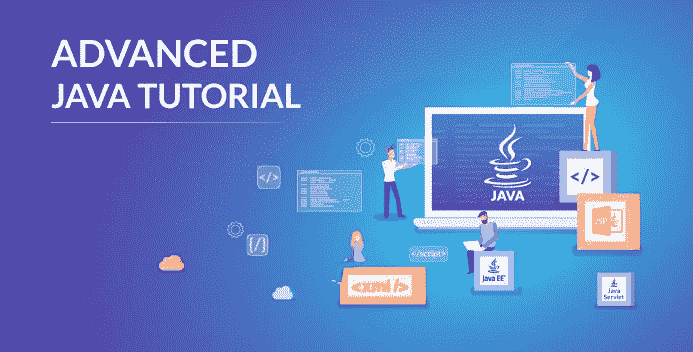

Advanced Java Tutorial - Edureka

我们大多数人已经知道，使用核心 Java 概念可以很容易地构建普通的应用程序。但是，当涉及到开发 web 应用程序时，高级 Java 基础，如 JSP、Servlets、JDBC 等。，可以增加应用程序的功能和特性，因此对开发人员来说是必不可少的。通过这篇关于高级 Java 教程的博客，我将让你对高级 Java 的基本概念有一个完整的了解。

*   高级 Java 简介

**JDBC**

*   什么是 JDBC？
*   JDBC 建筑
*   创建 JDBC 应用程序的步骤
*   JDBC 驱动程序类型和连接

**Java servlet**

*   Java Servlets 简介
*   Servlet 生命周期
*   创建 Servlet 的步骤
*   Servlets 中的会话跟踪

**JSP**

*   JSP 简介
*   JSP 的生命周期
*   JSP 脚本元素

# **高级 Java 简介**


**高级 Java** 是超越核心 Java 的一切 **-** 最重要的是 Java 企业版中定义的 API，包括 Servlet 编程、Web 服务、持久性 API 等。它是一个 Web &企业应用开发平台，基本遵循客户端&服务器架构。

# 对高级 Java 的需求

***下面我列举了 Advance Java 的几大优势:***

1.  *高级 Java* 即 *JEE (Java 企业版)*给你了解核心 Java 不支持的 Web 应用开发的 ***客户端-服务器架构*** 。
2.  J2EE 是独立于平台的、以 Java 为中心的环境，用于开发、构建和部署基于 Web 的在线应用程序。它还包含一组服务、API 和协议，为开发多层的、基于 web 的应用程序提供了必要的功能。
3.  您将能够使用 ***Web 和应用服务器*** 如 Apache Tomcat、Glassfish 等，并理解 HTTP 协议上的通信。但是，在核心 Java 中，这是不可能的。
4.  有很多高级的 Java 框架，比如 Spring、JSF、Struts 等等。使您能够为电子商务、银行、法律、金融、医疗保健、库存等领域开发安全的基于交易的 web 应用程序。
5.  为了工作和理解像 *Hadoop* *和云服务**这样的**热门技术**，你应该准备好核心和高级的 Java 概念。*

*我希望你明白为什么高级 Java 是必不可少的。为了让你更好的理解，我把这篇文章分成了三个部分。每一节都涉及高级 Java 的一个最重要的概念:*

1.  *JDBC (Java 数据库连接)*
2.  *Java Servlets*
3.  *JSP (Java Servlet 页面)*

*所以，现在让我们开始讨论并理解 Java 数据库连接的概念，这是一个与数据库交互的有用工具。*

# *JDBC 简介*

*JDBC 是一个标准的 Java API，用于 Java 编程语言和各种数据库之间的独立于数据库的连接。这个应用程序接口允许您用结构化查询语言(SQL)对访问请求语句进行编码。然后，它们被传递给管理数据库的程序。它主要包括打开一个连接、创建一个 SQL 数据库、执行 SQL 查询，然后到达输出。*

*我们可以使用 JDBC API 来访问存储在任何关系数据库中的表格数据。在 JDBC API 的帮助下，我们可以保存、更新、删除和读取数据库中的数据。它类似于微软提供的***【ODBC】***。*

*为了更好地理解 JDBC 的工作方式，让我们更深入地探讨这个主题，理解 Java 数据库连接背后的架构。*

## *JDBC 建筑*

*JDBC API 支持数据库访问的两层和三层处理模型，但一般来说， ***JDBC 架构由两层*** 组成*

*   ****JDBC API:*** 这提供了应用程序到 JDBC 管理器的连接。*
*   ****JDBC 驱动 API:*** 支持 JDBC 管理器到驱动的连接。*

*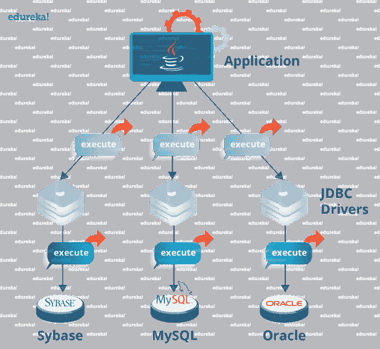*

*JDBC Architecture - Advanced Java Tutorial*

*JDBC API 使用驱动程序管理器和特定于数据库的驱动程序来提供到异构数据库的透明连接。JDBC 驱动程序管理器确保使用正确的驱动程序来访问每个数据源。驱动程序管理器能够支持连接到多个异构数据库的多个并发驱动程序。*

## *常见的 JDBC 组件*

*JDBC API 提供了以下接口和类*

> ****1。驱动管理器*** 用于管理数据库驱动列表。识别 JDBC 下某个子协议的第一个驱动程序将用于建立数据库连接。*
> 
> ***2。驱动程序** 是处理与数据库服务器通信的接口。它还抽象了与使用驱动程序对象相关的细节。*
> 
> ****3。Connection*** 是一个接口，包含连接数据库所需的所有方法。连接对象表示通信上下文，即所有与数据库的通信都只通过连接对象进行。*

*现在让我们进入下一个主题，看看创建 JDBC 应用程序所需的步骤。*

## *创建 JDBC 应用程序的步骤*

*为了创建 JDBC 应用程序，我们需要遵循几个步骤。让我们看看它们是什么。*

*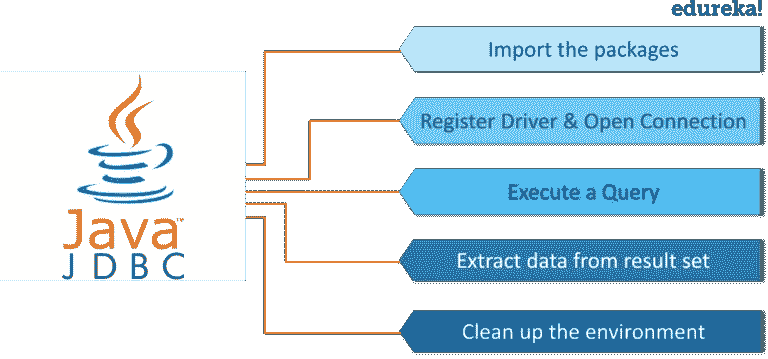*

*Steps To Create JDBC Application - Advanced Java Tutorial*

1.  ***导入包:**您需要包含包含数据库编程所需的 JDBC 类的包。大多数情况下，使用*导入 java.sql.** 就足够了。*
2.  ***注册 JDBC 驱动:**这里你要初始化一个驱动，这样你就可以打开与数据库的通信通道。*
3.  ***打开一个连接:**这里可以使用***getConnection()***方法创建一个连接对象，表示与数据库的物理连接。*
4.  ***执行查询:**需要使用语句类型的对象来构建 SQL 语句并提交给数据库。*
5.  ***从结果集中提取数据:**要求您使用适当的 ***getXXX()*** 方法从结果集中检索数据。*
6.  *清理环境:需要明确关闭所有数据库资源，而不是依赖 JVM 的垃圾收集。*

*现在，您已经看到了创建 JDBC 应用程序的各个步骤，让我们看看创建数据库和建立连接的示例代码。*

```
*package Edureka;
import java.sql.*;
import java.sql.DriverManager;
public class Example {
// JDBC driver name and database URL
static final String JDBC_DRIVER = "com.mysql.jdbc.Driver";
static final String DB_URL = "jdbc:mysql://localhost/emp";
//  Database credentials
static final String USER = "root";
static final String PASS = "";
public static void main(String[] args) {
Connection conn = null;
Statement stmt = null;
try{
//STEP 2: Register JDBC driver
Class.forName("com.mysql.cj.jdbc.Driver");
//STEP 3: Open a connection
System.out.println("Connecting to database...");
conn = DriverManager.getConnection(DB_URL,"root","");
//STEP 4: Execute a query
System.out.println("Creating statement...");
stmt = conn.createStatement();
String sql;
sql = "SELECT id, first, last, age FROM Employees";
ResultSet rs = stmt.executeQuery(sql);
//STEP 5: Extract data from result set
while(rs.next()){
//Retrieve by column name
int id  = rs.getInt("id");
int age = rs.getInt("age");
String first = rs.getString("first");
String last = rs.getString("last");
//Display values
System.out.print("ID: " + id);
System.out.print(", Age: " + age);
System.out.print(", First: " + first);
System.out.println(", Last: " + last);
}
//STEP 6: Clean-up environment
rs.close();
stmt.close();
conn.close();
}catch(SQLException se){
//Handle errors for JDBC
se.printStackTrace();
}catch(Exception e){
//Handle errors for Class.forName
e.printStackTrace();
}finally{
//finally block used to close resources
try{
if(stmt!=null)
stmt.close()
}catch(SQLException se2){
}// nothing can be done
try{
if(conn!=null)
conn.close();
}catch(SQLException se){
se.printStackTrace();
}//end finally try
}//end try
System.out.println("Goodbye!");
}//end main
} // end Example*
```

*上面的代码在本地主机数据库中创建了一个表。要在创建的数据库中插入值，可以参考下面的代码。我将只为第 4 步编写代码。代码的其余部分与上面相同。*

```
*//STEP 4: Execute a query
System.out.println("Creating table in given database...");
stmt = conn.createStatement();
String sql = "CREATE TABLE EMPLOYEES " +
"(id INTEGER not NULL, " +
" first VARCHAR(255), " +
" last VARCHAR(255), " +
" age INTEGER, " +
" PRIMARY KEY ( id ))";
stmt.executeUpdate(sql);
System.out.println("Created table in given database...");
System.out.println("Inserting records into the table...");
stmt =conn.createStatement();
String sql ="INSERT INTO Employees VALUES (100, 'Kriss', 'Kurian', 18)";
stmt.executeUpdate(sql);
sql = "INSERT INTO Employees VALUES (101, 'Enrique', 'John', 25)";
stmt.executeUpdate(sql);
sql= "INSERT INTO Employees  (102, 'Taylor', 'Swift', 30)";
stmt.executeUpdate(sql);
sql= "INSERT INTO  Employees VALUES(103, 'Linkin', 'Park', 28)";
stmt.executeUpdate(sql);
System.out.println("Inserted records into the table...");*
```

*这就是如何建立到数据库的连接并在表中插入值的方法。现在，让我们进一步了解各种 JDBC 驱动程序类型*

## *JDBC 驱动程序类型*

*JDBC 驱动程序实现了 JDBC API 中定义的接口，用于与数据库服务器交互。本质上，一个 **JDBC 驱动**使得**做**三件事成为可能:*

1.  *建立与数据源的连接。*
2.  *向数据源发送查询和更新语句。*
3.  *处理结果。*

*例如，使用 JDBC 驱动程序使您能够通过发送 SQL 或数据库命令来打开数据库连接并与之交互。*

*有 4 种类型的驱动程序，即:*

> ***1 型:** JDBC-ODBC 大桥潜水员*
> 
> ***类型 2:** JDBC 本地 API*
> 
> ***类型三:**JDBC-纯 Java 网*
> 
> ***4 型:** 100%纯爪哇咖啡*

## *类型 1: JDBC-ODBC 大桥潜水员*

*在类型 1 驱动程序中，JDBC 桥访问安装在每台客户机上的 ODBC 驱动程序。此外，ODBC 配置代表目标数据库的数据源名称(DSN)。*

*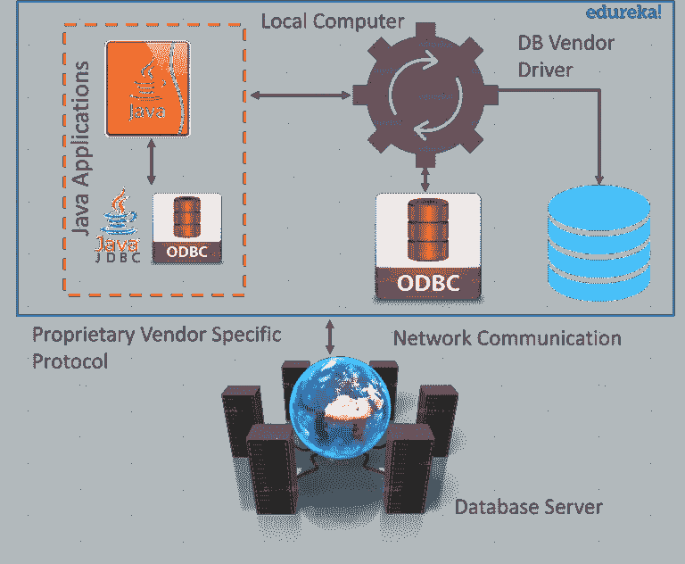*

*Type 1: JDBC-ODBC Bridge Diver- Advanced Java Tutorial*

*当 Java 第一次出现时，这是一个有用的驱动程序，因为大多数数据库只支持 ODBC 访问，但是现在这种类型的驱动程序只被推荐用于实验或者当没有其他选择时。*

## *类型 2: JDBC 本地 API*

*在 Type 2 驱动程序中，JDBC API 调用被转换为本地 C/C++ API 调用，这对于数据库是唯一的。这些驱动程序通常由数据库供应商提供，使用方式与 JDBC-ODBC 桥相同。供应商特定的驱动程序必须安装在每台客户机上。*

*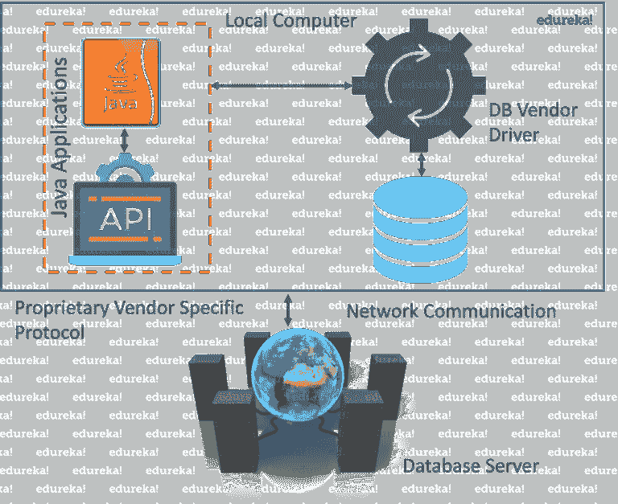*

*Type 2: JDBC-Native API- Advanced Java Tutorial*

*Oracle 调用接口(OCI)驱动程序是类型 2 驱动程序的一个示例。*

## *类型 3: JDBC-Net 纯 Java*

*在 Type 3 驱动程序中，使用三层方法来访问数据库。JDBC 客户端使用标准网络套接字与中间件应用服务器通信。然后，中间件应用服务器将套接字信息翻译成 DBMS 所需的调用格式，并转发给数据库服务器。*

*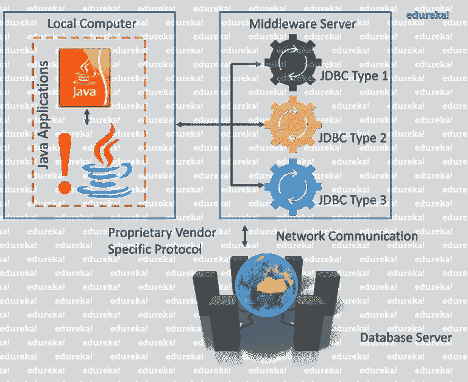*

*Type 3: JDBC-Net pure Java - Advanced Java Tutorial*

*这种驱动程序非常灵活，因为它不需要在客户机上安装任何代码，而且一个驱动程序实际上可以提供对多个数据库的访问。您可以将应用服务器视为 JDBC“代理”，这意味着它调用客户端应用程序。因此，您需要了解应用服务器的配置，以便有效地使用这种驱动程序类型。您的应用服务器可能使用类型 1、2 或 4 驱动程序与数据库通信。*

## *类型 4: 100%纯 Java*

*在 Type 4 驱动程序中，纯 Java 驱动程序通过套接字连接直接与供应商的数据库通信。这是数据库可用的最高性能驱动程序，通常由供应商自己提供。*

*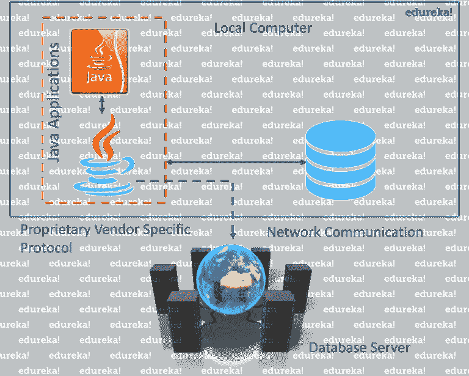*

*Type 4: 100% Pure Java - Advanced Java Tutorial*

*这种驱动程序非常灵活，你不必在客户端或服务器上安装特殊的软件。此外，这些驱动程序可以动态下载。*

**MySQL 的 Connector/J* 驱动是 4 类驱动。由于网络协议的专有性质，数据库供应商通常提供 type 4 驱动程序。*

****那么问题来了，应该用哪个驱动呢？****

> *如果您正在访问一种类型的数据库，如 Oracle、Sybase 或 IBM，首选的驱动程序类型是 4。*
> 
> *如果您的 Java 应用程序同时访问多种类型的数据库，类型 3 是首选的驱动程序。*
> 
> *类型 2 驱动程序在类型 3 或类型 4 驱动程序不可用于您的数据库的情况下很有用。*
> 
> *type 1 驱动程序不被视为部署级驱动程序，通常仅用于开发和测试目的。*

*现在，让我们跳到 JDBC 的最后一个话题，了解各种类型的连接。*

## *JDBC 关系*

1.  ***导入 JDBC 包:**将 **import** 语句添加到 Java 程序中，以导入 Java 代码中所需的类。*
2.  ***注册 JDBC 驱动程序:**这一步使 JVM 将所需的驱动程序实现加载到内存中，以便它能够满足您的 JDBC 请求。 ***注册司机有 2 种方法。****

*   *注册驱动程序最常见的方法是使用 Java 的 **forName()** 方法将驱动程序的类文件动态加载到内存*中，内存会自动注册它。*这种方法更可取，因为它允许您使驱动程序注册可配置和可移植。参考下面的代码。*

```
*try {
Class.forName("oracle.jdbc.driver.OracleDriver");
}
catch(ClassNotFoundException ex) {
System.out.println("Error: unable to load driver class!");
System.exit(1);
}*
```

*   *注册驱动程序的第二种方法是使用静态的 **registerDriver()** 方法。*

```
*try {
   Driver myDriver = new oracle.jdbc.driver.OracleDriver();
   DriverManager.registerDriver( myDriver );
 }
catch(ClassNotFoundException ex)
{ 
System.out.println("Error: unable to load driver class!");
System.exit(1);
}*
```

*如果您使用的是不符合 JDK 标准的 JVM，比如微软提供的 JVM，那么您应该使用 *registerDriver()* 方法。*

***3。数据库 URL 公式:**这是为了创建一个格式正确的地址，指向您希望连接的数据库。加载驱动程序后，可以使用**driver manager . getconnection()**方法建立连接。*

****driver manager . getconnection()方法有*—***

*   **getConnection(字符串 url)**
*   **getConnection(字符串 url，属性属性)**
*   **getConnection(字符串 url，字符串用户，字符串密码)**

*这里每个表单都需要一个数据库 URL。数据库 URL 是指向数据库的地址。*

*一个表格列出了流行的 JDBC 驱动程序名称和数据库 URL。*

*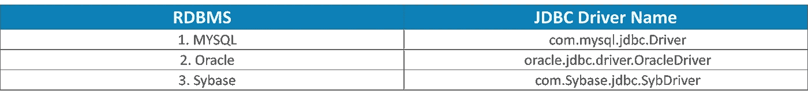*

*Popular JDBC Driver Names - Advanced Java Tutorial*

***4。创建一个连接对象***

*您可以简单地使用数据库 url、用户名和密码以及属性对象创建或打开一个连接。Properties 对象包含一组关键字-值对。它用于在调用***getConnection()***方法期间将驱动程序属性传递给驱动程序。*

***5。关闭***

*在 JDBC 程序结束时，我们必须关闭所有数据库连接，以结束每个数据库会话。但是，如果您忘记了，Java 的垃圾收集器会在清理过时对象时关闭连接。*

```
*conn.close();// Used to close the connection*
```

*这就是 Java 数据库连接的全部内容。现在继续学习***servlet***。*

# *Servlets 简介*

*servlet 是一个Java 编程语言类，用于扩展服务器的功能，这些服务器托管通过请求-响应编程模型访问的应用程序。尽管 servlets 可以响应任何类型的请求，但它们通常用于扩展 web 服务器托管的应用程序。
Servlet 可以描述如下:*

*   *Servlet 是一种用于创建 web 应用程序的技术。*

**

*Servlets in Java - Advanced Java Tutorial*

*   *它是一个 API，提供了许多接口和类，包括文档。*
*   *Servlet 是创建任何 Servlet 都必须实现的接口。*
*   *它也是一个扩展服务器功能并响应传入请求的类。它可以响应任何请求。*

## *Servlet 生命周期*

*Servlet 的整个生命周期由 *Servlet 容器*管理，该容器使用 *javax.servlet.Servlet* 接口来理解 Servlet 对象并管理它。*

****Servlet 生命周期的阶段:****

*Servlet 生命周期主要经历四个阶段，*

*   *加载 Servlet。*
*   *初始化 Servlet。*
*   *请求处理*
*   *破坏 Servlet。*

*让我们详细了解一下每个阶段:*

*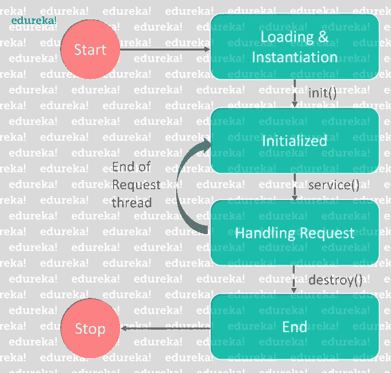*

*Stages of Servlet Life Cycle - Advanced Java Tutorial*

***加载 Servlet**:Servlet 生命周期的第一个阶段涉及到 Servlet 容器加载和初始化 Servlet。Web 容器或 Servlet 容器可以在以下两个阶段加载 Servlet:*

*   *在用零或正整数值配置 Servlet 时初始化上下文。*
*   *如果 Servlet 不在 stage 之前，它可能会延迟加载过程，直到 Web 容器确定需要这个 Servlet 来服务请求。*

***初始化 Servlet**:Servlet 实例化成功后，Servlet 容器初始化实例化的 Servlet 对象。容器通过调用接受 ServletConfig 对象引用作为参数的 *init(ServletConfig)* 方法来初始化 Servlet 对象。*

***处理请求**:初始化之后，Servlet 实例准备好服务客户端请求。当定位到 Servlet 实例来服务请求时，Servlet 容器执行以下操作:*

*   *它创建了 **ServletRequest** 和 **ServletResponse。**在这种情况下，如果这是一个 HTTP 请求，那么 Web 容器创建 **HttpServletRequest** 和 **HttpServletResponse** 对象，它们分别是 **ServletRequest** 和 **ServletResponse** 对象的子类型。*

***销毁 Servlet** :当 Servlet 容器决定销毁 Servlet 时，它执行以下操作:*

*   *它允许当前在 Servlet 实例的服务方法中运行的所有线程完成它们的任务并获得释放。*
*   *在当前运行的线程完成它们的任务后，Servlet 容器调用 Servlet 实例上的 **destroy()** 方法。*

*在执行了 **destroy()** 方法之后，Servlet 容器释放这个 Servlet 实例的所有引用，这样它就可以进行垃圾收集了。*

*现在您已经理解了 servlet 的基础知识，让我们进一步理解创建 Servlet 应用程序的步骤。*

## *创建 Servlet 的步骤*

1.  *创建目录结构*
2.  *创建一个 Servlet*
3.  *编译 Servlet*
4.  *向 web.xml 文件添加映射*
5.  *启动服务器并部署项目*
6.  *访问 servlet*

*现在，基于以上步骤，让我们编写一个程序，并了解 servlet 是如何工作的。*

***步骤 1:** 要运行 servlet 程序，我们应该安装并配置 Apache tomcat 服务器。一旦配置好服务器，您就可以开始运行您的程序了。*

***第二步:**对于一个 servlet 程序，你需要 3 个文件——*index.html 文件，Java*[*class*](https://www.edureka.co/blog/java-tutorial/?utm_source=medium&utm_medium=content-link&utm_campaign=advanced-java-tutorial)*文件，web.xml 文件*。第一步是创建动态 Web 项目，然后继续*

***步骤 3:** 现在让我们看看如何使用 servlets 将两个数字相加，并在浏览器中显示输出。*

*首先，我会写**index.html**文件*

```
*<!DOCTYPE html>
<html>
<body>
<form action ="add">
  Enter 1st number: <input type="text" name="num1"><br>
  Enter 2nd number: <input type="text" name="num2"><br>
<input type ="submit">    
</form>
</body>
</html>*
```

*上面的程序创建了一个表单来输入加法运算的数字。*

***第四步:**现在没有 Java 类文件，不能对 2 个数进行加法运算。所以我们来写一个**类文件**。*

```
*import java.io.IOException;
import java.io.PrintWriter;
import javax.servlet.http.HttpServlet;
import javax.servlet.http.HttpServletRequest;
import javax.servlet.http.HttpServletResponse;
public class Add extends HttpServlet{
       public void service(HttpServletRequest req, HttpServletResponse res) throws IOException
       {
              int i = Integer.parseInt(req.getParameter("num1"));
              int j = Integer.parseInt(req.getParameter("num2");
              int k= i+j;
              PrintWriter out = res.getWriter();
              out.println("Result is"+k);
       }
}*
```

***第五步:**编写完 Java 类文件后，最后一步是添加映射到 ***web.xml*** 文件。让我们看看如何做到这一点。*

***第六步: *web.xml*** 文件将出现在您的 web 内容的 WEB-INF 文件夹中。如果它不存在，那么您可以点击部署描述符并点击*生成部署描述符存根。**

***第 7 步:**之后，您可以继续向其中添加映射。*

```
*<?xml version="1.0" encoding="UTF-8"?>
<web-app xmlns:xsi="http://www.w3.org/2001/XMLSchema-instance" xmlns=<"http://java.sun.com/xml/ns/javaee" xsi:schemaLocation="http://java.sun.com/xml/ns/javaee http://java.sun.com/xml/ns/javaee/web-app_3_0.xsd"</em> version=<em>"3.0"</em>>
  <display-name>Basic</display-name>
  <servlet>
   <servlet-name>Addition</servlet-name>
   <servlet-class>edureka.Add</servlet-class>
  </servlet>
  <servlet-mapping>
   <servlet-name>Addition</servlet-name>
   <url-pattern>/add</url-pattern>
</servlet-mapping>
<welcome-file-list>
    <welcome-file>index.html</welcome-file>
 </welcome-file-list>
</web-app>*
```

***第八步:**做完这一切，就可以启动服务器运行程序了。您将在浏览器上获得所需的输出。*

*基本上，servlet 应该是这样配置的。现在让我们进一步了解会话跟踪的概念。*

# *会话跟踪*

****时段*** 简单来说就是特定的时间间隔。而 ***会话跟踪*** 是维护用户状态(数据)的一种方式。在 servlet 中也被称为*会话管理*。我们知道 HTTP 协议是无状态的，所以我们需要使用会话跟踪技术来维护状态。每次用户向服务器请求时，服务器都将该请求视为新请求。所以我们需要维护用户的状态来识别特定的用户。*

*如图所示，当您发送一个请求时，它被视为一个新请求。*

*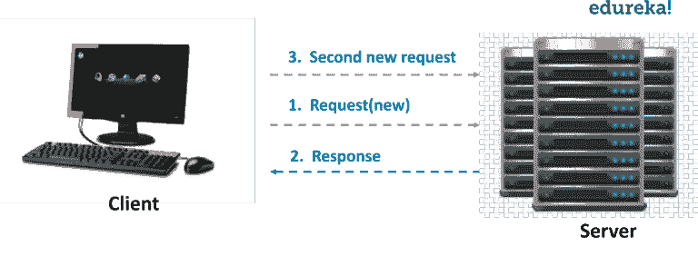*

*Session Tracking - Advanced Java Tutorial*

*为了识别特定的用户，我们需要会话跟踪。所以这都是关于 Servlets 的。*

*现在，让我们深入到我们博客的最后一部分，了解什么是 JSP。*

# *Java 服务器页面*

*JSP 或 Java Server Pages 是一种用于创建 web 应用程序的技术，就像 Servlet 技术一样。它是 servlet 的扩展——因为它提供了比 Servlet 更多的功能，如表达式语言、JSTL 等。JSP 页面由 HTML 标记和 JSP 标记组成。JSP 页面比 Servlet 更容易维护，因为我们可以将设计和开发分开。它提供了一些额外的功能，如表达式语言、自定义标签等。*

*现在让我们在下图的帮助下看看 JSP 的各种特性。*

*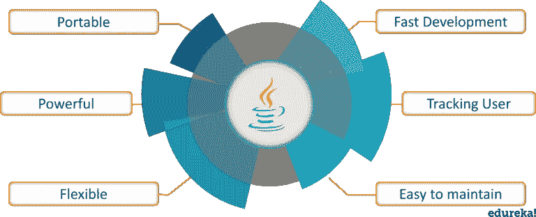*

*Java Server Pages - Advanced Java Tutorial*

*   ***可移植:** JSP 标签将由服务器端的 web 容器处理和执行，因此它们是独立于浏览器和 J2EE 服务器的。*
*   ***强大:JSP** 由字节码组成，因此所有 Java 特性都适用于 JSP，比如健壮、动态、安全、平台无关。*
*   *灵活:它允许定义自定义标签，这样开发者可以在 JSP 中使用任何种类的基于框架的标记标签。*
*   ***快速开发:**如果修改了 JSP 页面，我们不需要重新编译和重新部署项目。如果我们必须改变应用程序的外观，Servlet 代码需要更新和重新编译。*
*   ***跟踪用户:** JSP 允许我们通过维护会话或 cookies 中的信息来跟踪用户在与网站交互时所做的选择*
*   ***简单:** JSP 易学、易懂、易开发。JSP 比 Servlets 更便于编写，因为它们允许您将 Java 代码直接嵌入到 HTML 页面中。*

*现在你已经理解了什么是 JSP，让我们看看 JSP 和 servlet 之间有什么不同，以及为什么 JSP 比 servlet 更好。*

*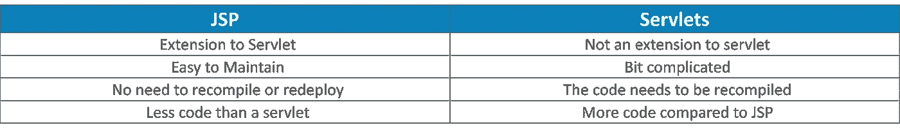*

*Difference Between JSP and Servlets- Advanced Java Tutorial*

*现在让我们更深入地研究 Java 服务器页面，理解 JSP 的生命周期。*

## *JSP 的生命周期*

*JSP 页面遵循以下阶段:*

1.  *JSP 页面的翻译*
2.  *JSP 页面的编译*
3.  *类加载(类加载器加载类文件)*
4.  *实例化(创建生成的 Servlet 的对象)*
5.  *初始化(容器调用 jspInit())*
6.  *请求处理(容器调用 _jspService())*
7.  *Destroy(容器调用 jspDestroy())*

*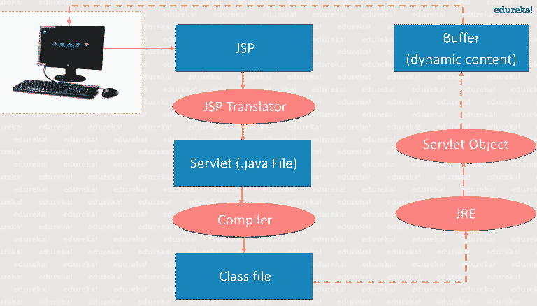*

*Life Cycle of JSP - Advanced Java Tutorial*

*如上图所示，JSP 页面在 JSP translator 的帮助下被翻译成 Servlet。然后，JSP translator 是 web 服务器的一部分，负责将 JSP 页面翻译成 Servlet。之后，Servlet 页面被编译器编译并转换成类文件。此外，Servlet 中发生的所有过程都是稍后在 JSP 上执行的，比如初始化、向浏览器提交响应和销毁。*

## *JSP 脚本元素:*

*脚本元素提供了在 JSP 中插入 java 代码的能力。有三种类型的脚本元素:*

*   ***scriptlet 标签**—script let 标签用于在 JSP 中执行 Java 源代码。
    语法是: **< % java 源代码% >***
*   ***表达式标签** —放置在 *JSP 表达式标签*中的代码*被写入响应*的输出流。所以不需要 write out.print()来写数据。它主要用于打印变量或方法的值。
    语法: **< %=语句% >***
*   ***声明标签**—JSP 声明标签用于*声明字段和方法*。JSP 声明标记内编写的代码被放在自动生成的 servlet 的 service()方法之外。所以它不会在每次请求时都获得内存。
    语法: **< %!字段或方法声明% >***

*这就把我们带到了高级 Java 教程博客的结尾。我希望你发现这个博客信息丰富，增加了你的知识价值。
如果你想查看更多关于人工智能、DevOps、道德黑客等市场最热门技术的文章，你可以参考 Edureka 的官方网站。*

*请留意本系列中的其他文章，它们将解释 Java 的各个方面。*

> *1.[面向对象编程](/edureka/object-oriented-programming-b29cfd50eca0)*
> 
> *2.[Java 中的继承](/edureka/inheritance-in-java-f638d3ed559e)*
> 
> *3.[Java 中的多态性](/edureka/polymorphism-in-java-9559e3641b9b)*
> 
> *4.[Java 中的抽象](/edureka/java-abstraction-d2d790c09037)*
> 
> *5. [Java 字符串](/edureka/java-string-68e5d0ca331f)*
> 
> *6. [Java 数组](/edureka/java-array-tutorial-50299ef85e5)*
> 
> *7. [Java 集合](/edureka/java-collections-6d50b013aef8)*
> 
> *8. [Java 线程](/edureka/java-thread-bfb08e4eb691)*
> 
> *9.[Java servlet 简介](/edureka/java-servlets-62f583d69c7e)*
> 
> *10. [Servlet 和 JSP 教程](/edureka/servlet-and-jsp-tutorial-ef2e2ab9ee2a)*
> 
> *11.[Java 中的异常处理](/edureka/java-exception-handling-7bd07435508c)*
> 
> *12. [Java 教程](/edureka/java-tutorial-bbdd28a2acd7)*
> 
> *13. [Java 面试问题](/edureka/java-interview-questions-1d59b9c53973)*
> 
> *14. [Java 程序](/edureka/java-programs-1e3220df2e76)*
> 
> *15. [Kotlin vs Java](/edureka/kotlin-vs-java-4f8653f38c04)*
> 
> *16.[依赖注入使用 Spring Boot](/edureka/what-is-dependency-injection-5006b53af782)*
> 
> *17.[Java 中的可比性](/edureka/comparable-in-java-e9cfa7be7ff7)*
> 
> *18.[十大 Java 框架](/edureka/java-frameworks-5d52f3211f39)*
> 
> *19. [Java 反射 API](/edureka/java-reflection-api-d38f3f5513fc)*
> 
> *20.[Java 中的 30 大模式](/edureka/pattern-programs-in-java-f33186c711c8)*
> 
> *21.[核心 Java 备忘单](/edureka/java-cheat-sheet-3ad4d174012c)*
> 
> *22.[Java 中的套接字编程](/edureka/socket-programming-in-java-f09b82facd0)*
> 
> *23. [Java OOP 备忘单](/edureka/java-oop-cheat-sheet-9c6ebb5e1175)*
> 
> *24.[Java 中的注释](/edureka/annotations-in-java-9847d531d2bb)*
> 
> *25.[Java 中的图书管理系统项目](/edureka/library-management-system-project-in-java-b003acba7f17)*
> 
> *26.[Java 中的树](/edureka/java-binary-tree-caede8dfada5)*
> 
> *27.[Java 中的机器学习](/edureka/machine-learning-in-java-db872998f368)*
> 
> *28.[Java 中的顶级数据结构&算法](/edureka/data-structures-algorithms-in-java-d27e915db1c5)*
> 
> *29. [Java 开发者技能](/edureka/java-developer-skills-83983e3d3b92)*
> 
> *30.[前 55 个 Servlet 面试问题](/edureka/servlet-interview-questions-266b8fbb4b2d)*
> 
> *31. [](/edureka/java-exception-handling-7bd07435508c) [顶级 Java 项目](/edureka/java-projects-db51097281e3)*
> 
> *32. [Java 字符串备忘单](/edureka/java-string-cheat-sheet-9a91a6b46540)*
> 
> *33.[Java 中的嵌套类](/edureka/nested-classes-java-f1987805e7e3)*
> 
> *34. [Java 集合面试问答](/edureka/java-collections-interview-questions-162c5d7ef078)*
> 
> *35.[Java 中如何处理死锁？](/edureka/deadlock-in-java-5d1e4f0338d5)*
> 
> *36.[你需要知道的 50 大 Java 集合面试问题](/edureka/java-collections-interview-questions-6d20f552773e)*
> 
> *37.[Java 中的字符串池是什么概念？](/edureka/java-string-pool-5b5b3b327bdf)*
> 
> *38.[C、C++和 Java 有什么区别？](/edureka/difference-between-c-cpp-and-java-625c4e91fb95)*
> 
> *39.[Java 中的回文——如何检查一个数字或字符串？](/edureka/palindrome-in-java-5d116eb8755a)*
> 
> *40.[你需要知道的顶级 MVC 面试问答](/edureka/mvc-interview-questions-cd568f6d7c2e)*
> 
> *41.[Java 编程语言的十大应用](/edureka/applications-of-java-11e64f9588b0)*
> 
> *42.[Java 中的死锁](/edureka/deadlock-in-java-5d1e4f0338d5)*
> 
> *43.[Java 中的平方和平方根](/edureka/java-sqrt-method-59354a700571)*
> 
> *44.[Java 中的类型转换](/edureka/type-casting-in-java-ac4cd7e0bbe1)*
> 
> *45.[Java 中的运算符及其类型](/edureka/operators-in-java-fd05a7445c0a)*
> 
> *46.[Java 中的析构函数](/edureka/destructor-in-java-21cc46ed48fc)*
> 
> *47.[爪哇的二分搜索法](/edureka/binary-search-in-java-cf40e927a8d3)*
> 
> *48.[Java 中的 MVC 架构](/edureka/mvc-architecture-in-java-a85952ae2684)*
> 
> *49.[冬眠面试问答](/edureka/hibernate-interview-questions-78b45ec5cce8)*

*最初发表于[www.edureka.co](https://www.edureka.co/blog/advanced-java-tutorial)201 年 12 月 6 日 *8。**