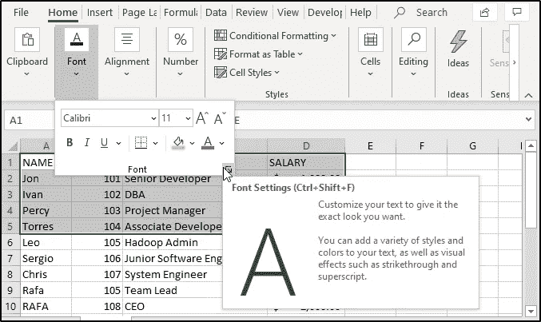
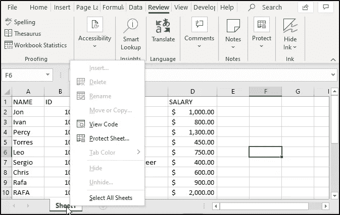
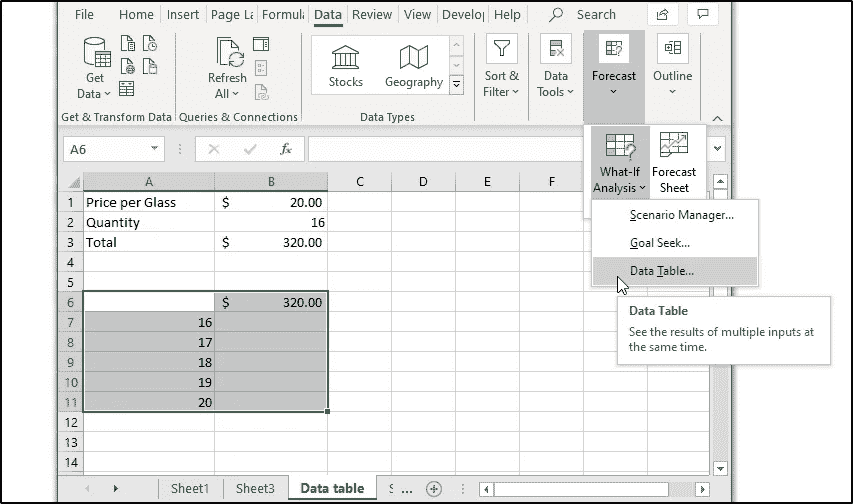
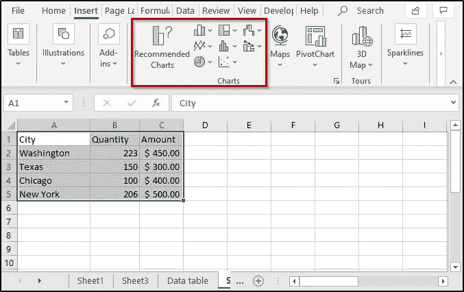
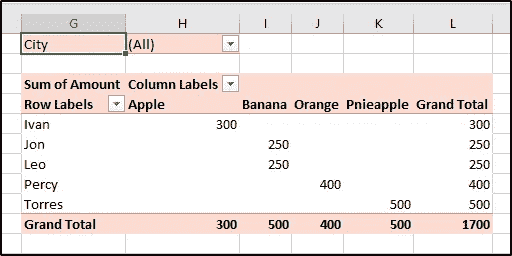

# Excel 高级教程:如何掌握 MS Excel？

> 原文：<https://medium.com/edureka/advanced-ms-excel-a2661817790c?source=collection_archive---------1----------------------->

只需点击几下鼠标就能管理大量数据，这真的很好，Excel 绝对是让你做到这一点的工具。如果你还不知道 Excel 的神奇之处，这里有一个高级 Excel 教程，可以帮助你深入学习 Excel。

看一看本文中讨论的所有主题:

*   安全性
*   MS Excel 主题
*   模板
*   制图法
*   打印选项
*   数据表
*   图表
*   数据透视表
*   透视图表
*   数据有效性
*   过滤数据
*   数据分类
*   Excel 中的交叉引用
*   语言翻译

所以，这是你在这个高级 Excel 教程中需要知道的第一个也是最重要的方面。

# 安全性

Excel 提供三个级别的安全性:

*   文件级
*   工作表级别
*   工作簿级别

## 文件级安全性:

文件级安全性是指通过使用密码来保护您的 Excel 文件，以防止其他人打开和修改它。为了保护 Excel 文件，请遵循以下步骤:

1:点击**文件**标签
2:选择**信息**选项
3:选择**保护工作簿**选项
4:从列表中选择**用密码加密**选项

5:在出现的对话框中输入**密码**

6: **重新输入**密码，然后点击**确定**

输入密码时，请记住以下几点:

1.  不要忘记您的密码，因为 Excel 中没有密码恢复功能
2.  没有任何限制，但是 Excel 密码区分大小写
3.  避免分发带有敏感信息(如银行信息)的密码保护文件
4.  用密码保护文件不一定能防止恶意活动
5.  避免共享您的密码

## 工作表级安全性:

为了防止工作表中的数据被修改，您可以锁定单元格，然后保护您的工作表。不仅如此，您还可以有选择地允许或禁止不同用户访问您的工作表的特定单元格。例如，如果您有一个包含不同产品销售详细信息的表，并且每个产品由不同的人处理。您可以允许每个销售人员只修改他负责的产品的详细信息，而不修改其他产品的详细信息。

要保护您的工作表，您必须遵循 2 个步骤:

1:解锁用户可以编辑的单元格

*   在要保护的工作表中，选择用户可以编辑的所有单元格
*   打开“主页”标签中的字体窗口
*   选择保护
*   取消选中锁定选项

2:保护工作表

*   要保护板材，点击**查看**选项卡，然后选择**保护板材**选项
*   您将看到以下对话框

*   从“**允许此工作表的所有用户进行**”选项中，选择您希望的任何要素
*   给出您选择的密码，然后单击 OK(密码的设置是可选的)

**取消导出工作表:**

如果您想取消工作表保护，您可以从**审核**选项卡中选择**取消工作表保护**选项。如果您在保护工作表时指定了密码，Excel 将要求您输入相同的密码以取消对工作表的保护。

## 工作簿级安全性:

工作簿级安全性将帮助您防止其他用户添加、删除、隐藏或重命名您的工作表。以下是在 Excel 中保护工作簿的方法:

**1:** 从**的**选项卡中，选择**保护工作簿**选项，会看到如下对话框:

**2:** 输入您选择的某个**密码**并点击**确定**(这是可选的，如果您不输入任何密码，任何人都可以解除对您的工作簿的保护)
**3:重新输入**密码并点击**确定**

当您的工作簿受到保护时，您将看到“保护工作簿”选项将突出显示，如下所示:

此外，如果您右键单击任何工作表，您将看到所有选项，如隐藏、插入、重命名等将不再可用。请看下图:

# MS Excel 主题

MS Excel 提供了许多文档主题来帮助您创建正式文档。使用这些主题，你将很容易协调不同的字体、颜色或图形。根据你的选择，你也可以选择改变整个主题或者只是颜色或者字体等等。在 Excel 中，您可以:

*   使用标准的颜色主题
*   创建您的主题
*   修改主题的字体
*   改变效果
*   保存您的自定义主题

## 利用标准颜色主题:

为了选择一个标准主题，您可以执行以下操作:

*   从功能区中选择**页面布局**标签
*   从**主题**组中，点击**颜色**
*   选择你喜欢的任何颜色

你看到的第一组颜色。是默认的 MS Excel 颜色。

## 创建您的主题:

如果您想自定义自己的颜色，请单击上图所示下拉列表末尾的自定义颜色选项，您将看到一个对话框，如下图所示:

从上面的对话框中，为强调、超链接等选择任何颜色。您也可以点击**更多颜色**选项创建自己的颜色。您将能够在对话框右侧的**样本**窗格中看到您所做的所有更改，如上图所示。不仅如此，你还可以在**名称**框中给你创建的主题命名，然后**保存**它。如果您不想保存您所做的任何更改，单击 R **eset** ，然后单击 **Save** 。

## 修改主题的字体:

就像你可以改变主题颜色一样，Excel 允许你改变主题的字体。这可以通过以下方式完成:

*   从**功能区**选项卡中点击**页面布局**
*   打开**字体的下拉列表**
*   选择您喜欢的任何字体样式

您也可以通过单击自定义字体选项自定义自己的字体样式。当您点击它时，您将打开以下对话框:

给任何你选择的**标题**和**正文字体**，然后给它起一个名字。完成后，点击**保存**。

## 更改效果:

Excel 提供了大量的主题效果，如线条、阴影、倒影等，您可以添加这些效果。要添加效果，点击**页面布局**并从**主题**组中打开**效果**下拉列表，然后选择您想要的任何效果。

## 保存您的自定义主题:

您可以通过保存当前主题来保存您所做的所有更改，如下所示:

1:点击**页面布局**，选择**主题** 2:选择**保存当前主题**选项
3:在**名称**框中给你的主题命名
4:点击**保存**

**注意:**您保存的主题将保存在本地驱动器的 Document Themes 文件夹中。thmx 格式。

# 模板

一般来说，模板是一种模式或模型，它构成了某些东西的基础。Excel 模板可以帮助您提高生产率，因为它们可以帮助您节省创建文档的时间和精力。为了使用 Excel 模板，您应该点击**文件、**然后 **s** 选择**新建。在这里，您可以看到许多 Excel 模板，您可以选择用于任何类型的文档，如日历、每周考勤报告、简单发票等。你也可以在网上找一个模板。例如，如果您选择个人月度预算模板，您的模板将如下图所示:**

# 制图法

与许多人认为的不同，Excel 不仅仅允许您处理数据，还允许您向数据中添加图形。要添加图形，点击**插入**选项卡，您将能够看到许多选项，如添加图像、形状、数据透视表、数据透视图、地图等。

**插入图像:**

在这个高级 Excel 教程中，我将向您展示如何将图像添加到 Excel 文档中。首先点击**插入**，然后打开**插图**列表，选择**图片**。

选择您希望添加到文档中的任何图片。在下图中，我添加了 Excel 的徽标:

同样，您也可以在文档中添加形状、图标、SmartArts 等。

# 打印选项:

要打印您的 MS Excel 工作表，点击**文件**，然后选择**打印**选项。在打印文档之前，您会看到许多选项，允许您以不同的模式和布局打印文档。您可以更改页面方向、添加页边距、更改打印机等。

# 数据表

创建 Excel 中的数据表是为了试验公式的不同值。您可以在 Excel 中创建一个或两个可变数据表。数据表是 Excel 中可用的三种假设分析工具之一。

在这个高级 Excel 教程中，我将向大家展示如何创建单变量和双变量数据表。

## 创建单变量数据表:

比方说，你以每只 20 美元的价格购买了 16 只玻璃杯。这样的话，你将不得不分别为 16 个玻璃杯支付总共 320 美元。现在，如果您想要创建一个数据表来显示同一商品不同数量的价格，您可以执行以下操作:

1:按如下方式设置数据:

2:然后，将 B3 中的结果复制到另一个单元格中

3:写下不同数量的项目，如下所示:

4:选择新创建的范围，点击**数据**选项卡，从**预测**组中选择**假设分析**。然后选择**数据表**选项。

5:从下面显示的对话框中，指定列输入单元格。(这是因为新数量是在列中指定的)

6:一旦完成，您将看到所有的结果值。选择具有输出值的所有像元，并为它们指定$符号:

## 双变量数据表:

要为上一个示例中的相同数据创建一个双变量数据表，请按照给定的步骤操作:

1:将 B3 中的结果复制到某个单元格中，并指定测试行和列的值，如下所示:

1:选择范围，点击**数据**选项卡

2:从预测组中选择**假设分析**

3:在出现的窗口中，输入行和列输入单元格，如下所示:

4:单击“确定”后，您将看到完整表格的结果

5:选择所有输出单元格，然后指定$符号

# 图表

图表为您的数据提供了图形表示。这些图表以一种非常有意义且易于理解的方式将数值可视化。图表是 Excel 的一个非常重要的组成部分，它们在 MS Excel 的每个新版本中都有很大的改进。您可以使用许多类型的图表，如条形图、折线图、饼图、面积图等。

这个高级 Excel 教程将帮助您学习如何在 Excel 中创建图表。

## 创建图表:

要插入图表，请按照给定的步骤操作:

1:准备您的图表数据

2:选择准备好的数据，点击功能区选项卡中的插入显示

3:从图表组中，选择您选择的任何图表

# 数据透视表:

Excel 数据透视表是一种统计表，它浓缩了具有大量信息的表格中的数据。这些表格可帮助您根据数据表中的任何字段来可视化数据。使用数据透视表，您可以通过更改字段的行和列来可视化您的数据，添加筛选器，对数据进行排序等。

**创建数据透视表:**要创建数据透视表，请遵循以下步骤:

1:选择要创建数据透视表的 rage

2:点击**插入**

3:从表组中选择透视表

4:检查给定范围是否正确

5:选择要创建表格的位置，即新工作表或相同的工作表

6: Excel 将创建一个空的数据透视表

7:拖放您希望添加的字段，以便自定义您的数据透视表

您将看到创建了下表:

# 透视图表

Excel 数据透视表是数据透视表的内置可视化工具。数据透视表可以按如下方式创建:

1:创建数据透视表

2:点击**插入**标签

3:从**图表**组中选择**透视表图表**

4:这将打开一个窗口，显示所有可用的数据透视图

5:选择任何类型的图表并点击**确定**

如您所见，已经为我的数据透视表创建了一个数据透视表图表。

# 数据有效性

本高级 Excel 教程最重要的主题之一是数据验证。顾名思义，这个特性允许您配置 Excel 工作表的单元格来接受某种特定类型的数据。例如，如果您希望工作表中有一定数量的单元格，并且希望它们只接受日期，则可以使用 Excel 的数据有效性功能轻松实现。为此，请遵循给定的步骤:

1:选择您希望分配特定数据类型的所有单元格:

2:点击**功能区**中的**数据**选项卡

3:从**数据工具**组中选择**数据验证**

4:您将看到一个带有三个选项的弹出窗口，即设置、输入信息和错误警告

*   设置将允许您选择希望所选区域接受的任何数据类型

*   输入消息部分将允许您为用户输入一条消息，向他提供关于可接受数据的一些细节

*   错误消息部分将通知用户他在给出期望的输入时犯了一些错误

现在，如果您选择选定区域中的任何单元格，您将首先看到一条消息，要求用户输入大于 1 的整数。

如果用户没有这样做，他将看到如下所示的相应错误消息:

# 数据过滤

过滤数据指的是获取满足某些给定标准的特定数据。下面是我将用来过滤数据的表格:

现在，如果您想只过滤出纽约的数据，您所要做的就是选择城市列，点击功能区选项卡中的**数据**。然后，从**排序&滤镜**组中选择**滤镜**。

完成后，City 列会显示一个下拉列表，其中包含所有城市的名称。要过滤纽约的数据，打开下拉列表，取消选择**选择所有**选项，并选中**纽约**，然后点击**确定**。您将看到以下过滤后的表格:

同样，您也可以通过选择要应用滤镜的区域，然后选择“滤镜”命令来应用多个滤镜。

# 整理

Excel 中的数据排序是指根据列中的数据排列数据行。例如，您可以从 A-Z 重新排列姓名，或者分别从升序或降序排列数字。

例如，考虑前面示例中显示的表格。如果您想从 A 开始重新排列供应商的名称，您可以执行以下操作:

*   选择所有要排序的单元格

*   点击**数据**选项卡中的**排序**，您将看到如下所示的对话框:

*   在这里，您有两个选项，基于您希望扩展您的选择以获得完整的数据或仅获得当前选择(我选择第二个选项)
*   完成后，您将看到以下对话框:

*   在这里，您可以添加更多列、删除列、更改顺序等。因为我想从 A-Z 对列进行排序，所以我将单击 **OK** 。

该表如下所示:

同样，您可以使用多个级别和顺序对表进行排序。

# MS Excel 中的交叉引用

如果您想在工作簿的多个工作表中查找数据，可以使用 VLOOKUP 函数。Excel 中的 VLOOKUP 函数用于从电子表格中查找和显示所需的数据。VLOOKUP 中的 v 指的是垂直的，如果你想使用这个函数，你的数据必须垂直组织。

# 使用 VLOOKUP 从多个工作表中提取数据:

为了使用 VLOOKUP 函数提取不同工作表中的值，您可以执行以下操作:

如图所示准备 bo 表的数据:

**第三张:**

**第四张:**

现在，为了从 sheet4 到 sheet3 获取这些雇员的工资，可以使用 VLOOKUP，如下所示:

您可以看到 sheet3 和 sheet4 都被选中。当您执行此命令时，您将获得以下结果:

现在，要获取所有雇员的工资，只需复制如下所示的公式:

# 宏指令

宏是 Excel 中必学的。使用这些宏，您可以通过将它们记录为宏来自动执行您定期执行的任务。Excel 中的宏基本上是一个或一组可以自动重复执行的操作。

在这个高级 MS Excel 教程中，您将学习如何创建和使用宏。

**创建宏:**

在下面的示例中，我有一些关于商店的信息，我将创建一个宏来创建一个数据图，显示商品的销售额及其金额和数量。

*   首先，创建如下所示的表:

*   现在，点击**视图**选项卡
*   点击**宏**并选择**记录宏**选项
*   在出现的对话框中输入要创建的宏的名称，如果需要，还可以为此宏创建快捷方式
*   接下来，点击**确定(一旦完成，Excel 开始记录您的操作)**
*   选择“金额”列下的第一个单元格
*   键入“=产品(B2，B3)”并按回车键
*   从“主页”选项卡“数字”组中插入一个$符号
*   然后，将公式复制到其余的单元格中

*   现在，点击插入，选择你喜欢的图表。上图所示表格的图表如下所示:

*   一旦操作完成，点击查看并从宏中选择停止记录选项

当您这样做时，您的宏将被记录下来。现在，每当您希望执行所有这些操作时，只需运行宏，您将能够看到相应的输出。另外，请注意，每次对单元格中的值进行更改时，宏都会在运行时进行相应的更改，并自动显示更新后的结果。

# 语言翻译

Excel 出色地允许用户将数据翻译成不同的语言。它可以自动检测数据中的语言，然后将其转换为 Excel 语言列表中的任何所需语言。按照给定的步骤执行语言翻译:

*   点击**评审**选项卡
*   从**语言**组中选择**翻译**
*   您将看到一个翻译窗口，在这里您可以让 Excel 检测工作表中的语言或给出某种特定的语言
*   然后，从“**到**”下拉列表中，选择您希望将数据转换成的任何语言

如你所见，我的文本已经被转换成了印度语。如果你想查看更多关于人工智能、DevOps、道德黑客等市场最热门技术的文章，那么你可以参考 [Edureka 的官方网站。](https://www.edureka.co/blog/?utm_source=medium&utm_medium=content-link&utm_campaign=advanced-excel-tutorial)

请留意本系列中解释 Excel 其他各方面的其他文章。

> *1。* [*使用 Excel 进行数据可视化*](/edureka/data-visualization-using-excel-724b96a8f85e)

*原载于 2019 年 12 月 6 日*[*https://www.edureka.co*](https://www.edureka.co/blog/advanced-excel-tutorial/)*。*