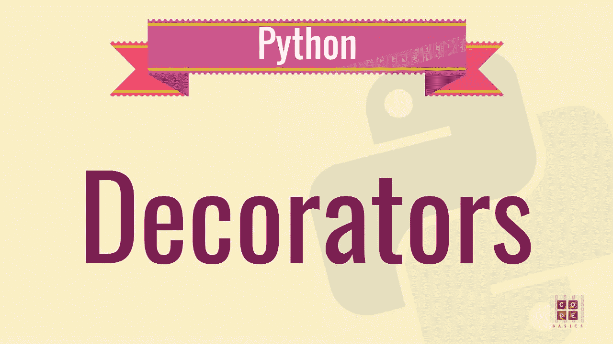

# 高级 Python 变得简单— 2

> 原文：<https://medium.com/quick-code/advanced-python-made-easy-2-d5a7ffb4e658?source=collection_archive---------3----------------------->



[Source](https://www.google.com/url?sa=i&source=images&cd=&cad=rja&uact=8&ved=2ahUKEwjdpuO72K3eAhUPTY8KHaPSDlMQjB16BAgBEAQ&url=https%3A%2F%2Fwww.youtube.com%2Fwatch%3Fv%3DnYDKH9fvlBY&psig=AOvVaw15dGMwvmWMVNU4HgKcVb_m&ust=1540972559079869)

在[上一篇文章](/quick-code/advanced-python-made-easy-eece317334fa)中，我们已经大致了解了 python 编程语言的几个有用特性。所以，把这看作是前一篇文章的延续，我们会用一些额外的概念来扩展它，很明显是使用了装饰符，也就是说，不会扰乱前一篇文章的实际内容。

## 装修工

装饰器的概念不仅在 python 领域，而且在整个软件设计领域，呈现了最美丽和最强大的设计可能性之一。装饰者本质上只是包装者，主要通过扩展功能来修改代码的行为，而不需要改变它所包装的内容。为了让概念变得清晰，让我们从建立基础开始。

**函数又名第一类对象**

函数只是根据给定的参数返回一个值。在 python 中，这些函数被赋予了额外的荣誉**一级对象**。考虑到函数可以像普通对象一样传递和用作参数，这一荣誉被恰当地授予了函数。例如，它们可以作为参数传递给其他函数，也可以用作函数的返回值。

**充当自变量**

```
def greet(name):
    print ('Hello ' + name)def send_greetings(fun, name):
    fun(name)send_greetings(greet, 'John')
```

**内部函数**

内部函数是在其他函数内部定义的。因此，在调用父函数之前，内部函数不会被定义，或者它们的局部范围是父函数，或者它们只作为局部变量存在于父函数中。

```
def send_greetings(name):
    def greet_message():
        return ‘Hello ‘
    result = greet_message() + name
    print (result)

send_greetings(‘John’)
```

**从函数中返回函数**

Python 也允许使用 function 作为其他函数的返回值。本质上，我们只是返回对内部函数的引用，我们稍后可以调用它。

```
def classify(element):
    def even_number():
        print ('Element is even.')
    def odd_number():
        print ('Element is odd.')
    if element%2 == 0:
        return even_number
    else:
        return odd_numberclassify(2)()
```

**装修工**

现在，有了所有这些基本概念，让我们把这些部分组合起来，形成一个完整的画面。

```
def my_decorator(fun):
    def wrapper():
        print (‘Before calling the function…’)
        fun()
        print (‘After calling the function…’)
    return wrapperdef say_hello():
    print (‘Hello!’)say_hello = my_decorator(say_hello)
```

就是这样！！！。这是我们能找到的最简单的室内设计师。我们实际上只是应用了目前为止所学的知识。所以装潢师是

> 一个函数将另一个函数作为参数，生成一个新函数，增加原始函数的功能，最后返回生成的函数，这样我们就可以在任何地方使用它。

此外，python 使得程序员创建和使用 decorators 变得更加干净和友好。

```
def my_decorator(fun):
    def wrapper():
        print (‘Before calling the function…’)
        fun()
        print (‘After calling the function…’)
    return wrapper@my_decorator
def say_hello():
    print (‘Hello!’)
```

## 上下文管理器

简而言之，上下文管理器是一种资源获取和释放机制，它可以防止资源泄漏，并确保即使在面临致命异常时也能进行适当的清理。例如，确保文件打开后关闭，获取后释放锁。这个概念在许多其他编程语言中被清楚地表达和恰当地使用，比如 C++中的[RAII](https://stackoverflow.com/questions/2321511/what-is-meant-by-resource-acquisition-is-initialization-raii)。

从技术上讲，这是一个对象需要遵循的简单协议。此协议要求对象作为上下文管理器，实现 __enter__ 和 __exit__ 方法。

> __enter__ 返回要管理的资源，而 __exit__ 执行任何清理工作，不返回任何内容。

```
class File:
    def __init__(self, name):
        self.name = name

    def __enter__(self):
        self.file = open(self.name, 'w')
        return self.file def __exit__(self, type, value, trace_back):
        if self.file:
            self.close()
```

现在上面的类可以在带块的**内安全使用。更一般地，使用**和**，我们可以调用任何返回上下文管理器的东西。**

```
with File('example.txt') as f:
    f.write('Hey hello')
    f.write('See you later. Bye!!!')
```

__enter__ 在执行用语句进入**的上下文时调用。当执行用**块离开**时，调用 __exit__。**

上下文管理器也可以用于更复杂的问题。让我们看另一个例子，对上下文管理器的需求几乎是不可避免的。正在讨论的资源是*锁*，我们可以避免的问题是巨大的*死锁*。

```
from threading import Lock
lock = Lock()def do_something():
    lock.acquire()
    raise Exception('Oops I am sorry. I have to raise it!')
    lock.release()try:
    do_something()
except:
    print ('Got an exception.')
```

注意，这个异常是在释放锁之前引发的。这样做的明显后果是，所有其他调用 *do_something* 的线程将永远被阻塞，导致系统死锁。使用上下文管理器，我们可以摆脱这种糟糕的情况。

```
from threading import Lock
lock = Lock()def do_something():
    with lock:
        raise Exception('Oops I am sorry. I have to raise it!')try:
    do_something()
except:
    print ('Got an exception.')
```

哇哦。即使面对某些异常，清理也会正常进行。显然，没有合理的方法可以使用上下文管理器获得锁，而最终不释放它。就应该是这样。

## 链式异常

考虑这样一种情况，由于试图将一个数除以零，一个方法抛出了`ZeroDivisionError`。显然，我们有一套很好的工具来处理 python 中的异常。然而，如果这个异常的原因是这个函数调用的其他函数中的`TypeError` 呢？在这种情况下，仅仅报告顶级异常是不够的，因为我们将失去异常链的起源和主要原因。为了证明这个概念，让我们举一个简单的例子。

```
def chained_exceptions():
    try:
        raise ValueError(17)
    except Exception as ex:
        raise ValueError(23) from ex

if __name__ == "__main__":
    chained_exceptions()
```

在 python 2.0 中，类似上面的情况会导致后一个异常被报告，而前一个异常丢失，如下图所示。

```
Traceback (most recent call last):
File “test.py”, line 3, in chained_exceptions
    raise ValueError(23)
ValueError: 23
```

显然，我们已经失去了一条有价值的信息，因为我们失去了异常的实际原因，即它的起源。然而，用 python 3.0 运行相同的脚本，我们会得到完整的异常堆栈跟踪。

```
Traceback (most recent call last):
File “test.py”, line 3, in chained_exceptions
    raise ValueError(17)
ValueError: 17The above exception was the direct cause of the following exception:Traceback (most recent call last):
File “test.py”, line 8, in <module> chained_exceptions()
File “test.py”, line 5, in chained_exceptions
    raise ValueError(23) from ex
ValueError: 23
```

请通过您的评论让我知道文章中需要的任何修改/改进。