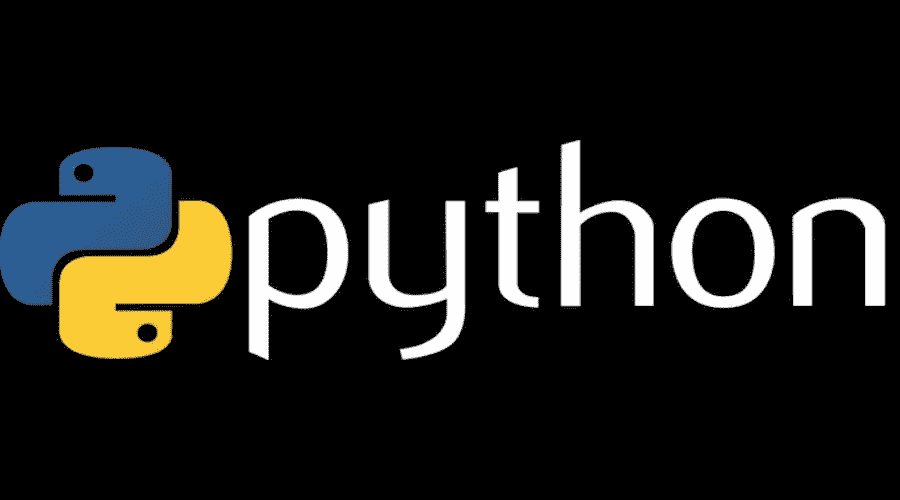

# 高级 Python 变得简单

> 原文：<https://medium.com/quick-code/advanced-python-made-easy-eece317334fa?source=collection_archive---------0----------------------->



Python 是一种面向对象的语言，非常类似于英语，这使它成为初学者学习的好语言。它的高级特性和支持的库包甚至使得困难的任务可以写成一堆代码行。在本文中，我们将介绍 python 的一些高级特性。

## **列表理解**

列表理解为无处不在的循环提供了一个更短更好的替代*。它用在迭代的环境中，我们需要对列表中的每个元素执行操作。*

**语法:-**

```
 **[some_operation(element) for element in sequence]
                                - returns list of elements.**
```

**示例:-**

List comprehension example

我们连接了从两个列表理解返回的列表。第一个是在列表的每个元素上应用*偶数校验*，而第二个执行*奇数校验*。

## **切片**

切片用于从给定序列中提取元素的连续序列/子序列。默认情况下*步长*为 1，因此生成连续序列。然而，我们可以为 *step_size* 提供任何值来获得非连续的元素序列。

**语法:-**

```
 **list[start_index : end_index : step_size]**     
                           **- returns list of elements.
                           - default start_index is 0.
                           - default end_index is -1.
                           - default step_size is 1.**
```

**例子:-**

List slicing example with step size as 1

这里，我们再次连接两个切片操作的结果。首先，我们从索引' d '到结尾对列表进行切片，然后从开始到索引' d'。

展示 step_size 用例的另一个例子。步长为-1 意味着切片将从结束到开始。

## **λ**

Lambda 是一个匿名函数，只能保存一个表达式。它基本上是函数的简写，可以用在任何需要表达式的地方。

**语法:-**

```
 **lambda arguments : expression**
```

**举例:-**

Lambda expression for square root.

## 地图

Map 用于我们需要对一系列元素应用函数/lambda 的场景。尽管您几乎总是可以用列表理解来代替使用映射的需要。

**语法:-**

```
 **map(function , sequence)
                                           - returns an iterable.**
```

**示例:-**

*映射*用于对序列的每个元素求平方。由于*映射*返回一个 iterable，我们需要用期望的类型包装结果(上例中的*列表*)。

## 过滤器

另一方面，Filter 对元素序列应用函数/lambda，并返回函数/lambda 为其返回 *True* 的元素序列。

**语法:-**

```
 **filter(function, sequence)
                                    - returns an iterable.**
```

**例子:-**

这里，我们应用 filter 只返回序列中的偶数。强烈推荐 2021 年[学 Python](https://blog.coursesity.com/learning-plan-learn-coding-in-python-like-a-tiger/) 编程。

## 迭代协议

贯穿 python 编程语言的一个重要概念是迭代协议和可迭代对象。用最简单的术语来说，iterable 是可以使用迭代协议进行迭代的东西。理解迭代协议的一个最简单的方法是看它如何与内置类型一起工作。让我们以文件为例。我们要用的样本文件是 *script.py* ，内容如下 *:-*

在 python 中，我们有很多种读取文件的方法，有些方法比其他方法更有效。不属于后一类的一种方法是使用*读取线*。

另一种更好也更有效的方法是使用 for 循环:-

这只是读取整个文件的一行代码。但是它是如何工作的呢？到底 for 循环是如何知道逐行读取文件的？

好了，迭代协议来了。总结如下

> 任何使用 __next__ 方法前进到下一个结果并在一系列结果结束时引发 StopIteration 异常的对象，在 python 中都被认为是迭代器。任何这样的对象也可以用 for 循环或其他迭代工具来单步执行。

在上面的例子中，文件对象本身是一个迭代器(因为它实现了所需的接口)，而 for 循环是一个迭代工具。下面是 python 中我们称之为迭代协议的 most 接口( *most 在这里确实有意义，如下文*所述)。

这就是 for 循环内部或一般任何迭代工具将做的事情，即调用 *__next__* 方法，直到到达结尾。除了 for 循环，python 中还有其他迭代工具，如 *list comprehension、map、zip* 等。

到目前为止一切顺利，然而迭代协议还有一步，那就是获取底层对象的迭代器。*文件对象不需要这一步，因为它有自己的迭代器*。但是对于像 list 这样的其他对象，我们需要通过这个额外的步骤来获取迭代器。

## **发电机**

生成器是创建迭代器的一种简单方式。更正式地说，生成器是返回一个对象(迭代器)的函数，我们可以迭代这个对象(一次迭代一个值)。如果我们用 python 从头开始编写同样的功能，它会是这样的

**示例:-**

然而，python 让我们变得很容易。下面是一些类似的使用发电机。可以看到，上面提到的所有开销(*调用 __iter__()和 __next__()* )都是由生成器自动处理的。

> *生成器是通过用 yield 语句而不是 return 语句*定义一个普通函数来创建的，即如果该函数包含至少一个 yield 语句，它就成为一个生成器函数。yield 和 return 都将从函数中返回一些值。尽管函数在执行 return 时终止，但 yield 语句会暂停函数，保存它的所有状态，然后在后续调用中继续执行。

本质上是发电机，

*   至少有一条 yield 语句。
*   返回一个对象(迭代器)，但不立即开始执行。
*   记住局部变量及其在连续调用之间的状态。
*   实现迭代协议。

## **发电机表情**

正如 lambda 是函数，生成器表达式是 python 中的生成器，即生成器表达式创建一个匿名的生成器函数。它的语法非常类似于列表理解。

**举例:-**

列表理解和生成器之间的主要区别在于，列表理解生成整个列表，而生成器表达式一次生成一个项目。从本质上说，它们是列表理解的一个懒惰的对抗部分。

**为什么用 python 写生成器？**

*   它们很容易实现。正如你所看到的，在生成器的帮助下，我们能够将几十行代码转换成 3 行代码
*   它们的内存效率极高。返回 2 的下一次幂的普通函数会在内存中创建一个完整的序列。在数十亿个数字的情况下，成本将是巨大的。生成器可以以更友好的方式实现它们，因为它们一次生成一个元素，而不是整个序列
*   生成器也可以用来表示无限的数据流。因为无限流不能存储在内存中，所以生成器在这种情况下也很有用。

请通过您的评论让我知道文章中需要的任何修改/改进。