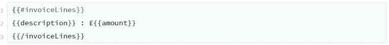

# 带有{ { Handlebars.java } }的 Mendix 中的高级字符串模板

> 原文：<https://medium.com/mendix/advanced-string-templates-in-mendix-with-handlebars-java-807327adfffa?source=collection_archive---------0----------------------->

# 使用 Mendix 时，有许多情况需要动态字符串模板。常见用途是管理电子邮件模板。

容纳动态值的标准方法是通过使用令牌，将令牌映射(通过模型反射)到允许在运行时替换数据的属性或微流。这种方法在大多数情况下都很有效，但在处理以下情况时会有一些限制:

*   重复节(如信息表)
*   条件部分
*   令牌值的数据格式

通过使用封装了复杂性的微流，可以解决这些限制，例如构建一个 HTML 表，该表存储在具有相应令牌的属性中。然而，这从模板中抽象出了一些内容和逻辑，这可能会对可维护性产生影响，并且可能会强制进行小的内容更改部署。

这篇博客介绍了一种不同的方法，使用 Handlebars.java，允许您定义语义模板并解决上述限制。

# { { Handlebars.java } }

Handlebars.java([https://github.com/jknack/handlebars.java](https://github.com/jknack/handlebars.java))是小胡子([http://mustache.github.io/mustache.5.html](http://mustache.github.io/mustache.5.html))的 java 实现，提供了一个多用途的模板引擎，允许你定义语义模板。

可以使用三种最常用实现的语法来定义模板:

*   mustache . js(【https://github.com/janl/mustache.js/】T4)
*   霍根. js([http://twitter.github.io/hogan.js/](http://twitter.github.io/hogan.js/))
*   handlebars . js([https://handlebarsjs.com/](https://handlebarsjs.com/))

使用此语法的模板由一系列标记组成，用双花括号中的值表示，例如{{tagName}}

标签可以是变量名，可以改变评估上下文(即访问相关数据)，还可以应用辅助功能来控制诸如条件性、数据转换和数据格式化之类的事情。

[https://bit.ly/MXW21](https://bit.ly/MXW21)

# AQ 车把

我们已经创建了 [AqHandlebars](https://marketplace.mendix.com/link/component/116688) ，这是一个基于 Handlebars.java 构建的简单 Mendix 模块，允许 Mendix 开发人员在他们的应用程序中使用这种模板语法。

数据作为 JSON 对象或 JSON 数组提供给模板，模块处理模板的转换，返回合并的字符串。

因此，给定一个如下所示的域模型:

我们可以将 JSON 中的发票数据表示如下:

## 构建模板—标准功能

我们可以通过名称访问一个根级属性，如下:
`{{invoiceNumber}}`

要访问一个嵌套的属性，我们可以使用点符号:
`{{customer.customerName}}`

或者(如果我们想要访问多个属性，这很有用)我们可以在按名称访问属性之前更改上下文:

添加重复节与更改上下文的语法相同:

标准情况下有三种条件，这三种条件都只受布尔值支持。

if 语句:

if/else 语句:

一个除非语句(检查假值):

## 重复使用部分模板片段

如果您希望在多个模板中使用动态文本的某些部分，那么您可以定义和引用部分模板。

因此，一个名为“发票”且包含以下内容的分部模板:

然后可以在我的模板中引用如下:
`{{>invoices}}`

## 通过自定义助手扩展语法

标准功能已经解决了本文开头描述的一些限制，但是，我们可以通过创建自定义助手来扩展模板支持的功能，从而进一步解决这些限制。

自定义助手可用于许多不同的用途，例如:

*   检查值的相等性(扩展条件功能)
*   数据格式化(日期、小数等的格式化。)
*   数据转换(用 html 元素替换值，例如将链接转换为锚标记)

要定义一个定制的助手，你需要创建一个 Java 类来实现 com.github.jknack.handlebars 的助手接口。

将值转换为锚标记的自定义帮助器示例如下:

AqHandlebars 提供了一个额外的接口 ICustomHelperRegister，它允许 Mendix 应用程序注册这些助手以在模板中使用。

使用我们上面的自定义助手，这个接口的一个示例实现是:

最后一步是通过 Mendix 前端注册这个实现:

现在，我们可以在我们的模板中使用它:
`{{anchor customer.website "tache"}}`

由此产生的`<a href='https://www.handlebarclub.co.uk/'>tache</a>`

# 结论

Handlebars 提供了一种强大的语义方法来在 Mendix 应用程序中构建动态字符串模板。

简介中描述的令牌限制可以得到解决，模块可以完全扩展以支持您的应用程序所需的任何逻辑。

然而，标记和把手语法并不相互排斥。它们可以一起使用，所以没有必要重写现有的模板；它们可以根据需要随时进行调整，以支持更复杂的场景。

[立即从 app store](https://marketplace.mendix.com/link/component/116688) 下载模块并获取模板！

## 阅读更多

 [## Mendix World 2021 |召集您的应用开发团队 2021 年 9 月 7 日至 9 日

### 好像你需要说服…在一个全球制造商社区，他们想通过探索什么来相互学习…

bit.ly](https://bit.ly/MXW21) 

*来自发布者-*

*如果你喜欢这篇文章，你可以在我们的* [*媒体页面*](https://medium.com/mendix) *或我们自己的* [*社区博客网站*](https://developers.mendix.com/community-blog/) *找到更多类似的文章。*

*希望入门的创客，可以注册一个* [*免费账号*](https://signup.mendix.com/link/signup/?source=direct) *，通过我们的* [*学苑*](https://academy.mendix.com/link/home) *即时获取学习。*

有兴趣更多地参与我们的社区吗？你可以加入我们的 [*Slack 社区频道*](https://join.slack.com/t/mendixcommunity/shared_invite/zt-hwhwkcxu-~59ywyjqHlUHXmrw5heqpQ) *或者想更多参与的人，看看加入我们的* [*遇见 ups*](https://developers.mendix.com/meetups/#meetupsNearYou) *。*