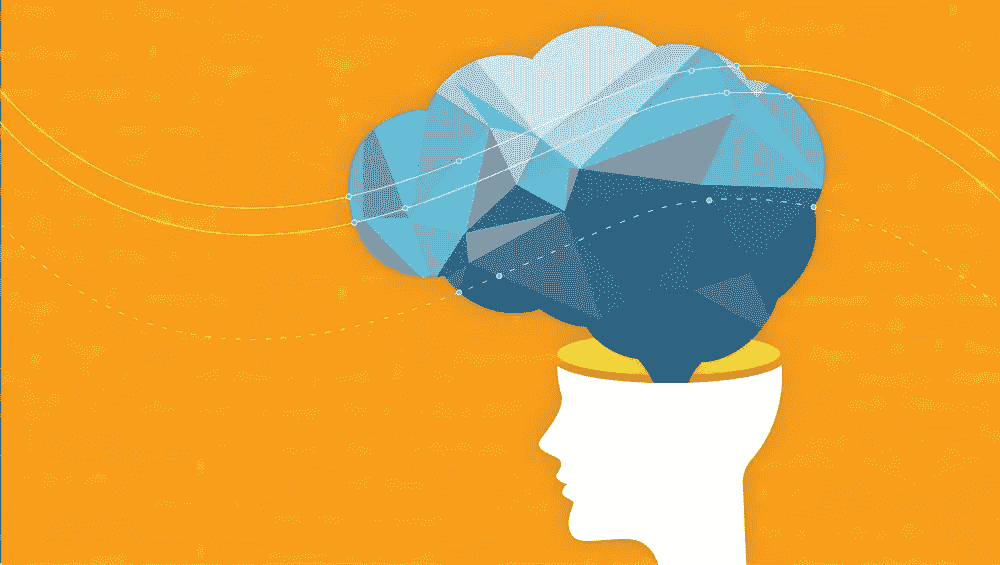

# 在整个银行业推进人工智能和机器学习的更大公平性和可解释性

> 原文：<https://medium.com/capital-one-tech/advancing-greater-fairness-and-explainability-for-ai-and-machine-learning-across-the-banking-6a71423476fe?source=collection_archive---------0----------------------->

在过去的几年里，人工智能和机器学习(AI/ML)在一些以前认为计算机不可能超越的领域展示了令人印象深刻的进步，例如下棋和围棋等游戏、智能助手、自动驾驶汽车，甚至经营一家[全自动快餐店](https://wtop.com/food-restaurant/2018/05/robot-fast-food-chefs-hype-or-a-sign-of-industry-change/slide/1/)。紧随这些进步之后，其他人正在探索 AI/ML 在医学、执法、大学招生和其他可能对人们日常生活产生深远影响的领域的高级应用。

在 Capital One，我们相信在银行业利用数据分析和机器学习有巨大的潜力，尤其是在转变客户体验和增强业务流程的能力方面。然而，许多受监管的、行业范围的商业决策可以受益于 AI/ML 的应用，如信贷决策，都与可解释性密切相关:企业必须能够解释特定机器学习模型做出决策的原因。

> 开发人员如何证明做出这些决定的 AI/ML 系统是合乎道德、公平的，并且符合相关法律？

开发人员如何证明做出这些决定的 AI/ML 系统是合乎道德、公平的，并且符合相关法律？

像 [FAT/ML 会议](http://www.fatml.org/)系列这样的组织，主要技术公司的研究小组，非营利组织和其他组织，以及学术界，已经做出了机构承诺，以确保 AI/ML 应用程序是公平的，可问责的，透明的，可解释的，安全的。机器学习研究人员，包括 Capital One 的团队，一直在努力解决人工智能/人工智能开发中的道德和可解释性问题。

虽然在 Capital One，我们在业务的几乎每个方面都利用人工智能/人工智能来关注客户的财务状况，帮助他们在财务上更有能力，并更好地管理他们的支出，但我们希望确保我们在使用更复杂的技术与适当的开发和应用之间保持平衡，以确保公平、公正和可解释的结果，让我们的所有利益相关者都能理解。此外，我们希望确保我们不只是满足该领域的监管要求，而是帮助在金融服务领域广泛建立公平和道德的机器学习开发和部署标准。

我们和行业继续为信贷决策等更复杂的用例建立透明、道德和公平的模型的能力的一个基本方面是理解构成 AI/ML 算法多层的黑盒的必要条件。在像信用决策这样的用例中，为了理解和满足行业的显式公平性和可解释性要求，解开这些黑盒是至关重要的。

进行这项工作的第一个明确挑战是证明旨在做出信贷决策的机器学习模型符合公平贷款法。像平等信贷机会法(ECOA) [这样的法律要求所有银行](https://www.consumer.ftc.gov/articles/0347-your-equal-credit-opportunity-rights)表明他们向客户提供信贷的方式不会基于种族、肤色、宗教、国籍、性别、婚姻状况和年龄等受保护的阶层而有所歧视。然而，将这些法律概念转化为精确的数学陈述，马上就出现了公平的多种法律概念的问题。

有*不同的待遇*，根据受保护的属性区别对待人们，还有*不同的影响*，在这种情况下，政策的结果可能是歧视的证据。银行希望在决策的输入和决策的输出两个方面都是公平的。然而，机器学习研究人员最近的工作表明，在[实际决策](https://arxiv.org/abs/1609.05807)中同时满足两种公平理念存在挑战。在此使用案例中，完全缓解不同处理和不同影响风险的挑战需要业务领导、数据科学家和法律专家进行讨论，以确定每个应用程序的最佳风险管理策略。它还需要一种明确的以人为中心的方法来灌输信心，即机器生成的决策是在考虑客户利益的情况下做出的。

考虑到公平解释的需要，几个问题开始出现:银行可以使用深度神经网络等复杂模型吗？一家银行给了申请人“A”一张信用卡，但没有给申请人“B”一张信用卡，原因是他们输入决策算法的 294，012 个系数不同，法院会接受这种解释吗？银行如何从法律和数学的角度证明它做出这些决定的方式是公平的？

结论是，我们的行业需要对黑盒算法有一个更清晰的理解，这样开发者就可以用一种所有利益相关者都能理解他们的决策的方式来构造它们；我们还需要更精确地阐明什么构成了模型及其决策的可接受的解释。通过实现这些目标，该行业可以更好地将透明、公平和公正的设备纳入其模型和系统。

最终，客户、法院、数据科学家和其他利益相关者需要不同层次的解释。这是我们 Capital One 正在积极应对的挑战，以确保我们能够保持可解释性的最高标准——以一种道德和公平的方式，将人类放在第一位——因为我们为更多的用例开发了更先进的模型。

我最近的一篇[论文更深入地研究了这个话题](https://arxiv.org/abs/1809.04684)，最近在 [ACM RecSys](https://recsys.acm.org/) 的 [FATREC 研讨会](https://recsys.acm.org/recsys18/fatrec/)上发表；它更深入地总结了我在这里提到的在金融服务行业中使用 AI/ML 的一些挑战。Capital One 的研究人员还将在即将到来的 NeurIPS 会议上联合举办一场名为“金融服务中人工智能的挑战和机遇:公平性、可解释性、准确性和隐私的影响”的研讨会如果您有兴趣与我们一起解决这个问题，我们邀请您加入并参与讨论。

*以上观点为作者个人观点。除非本帖中另有说明，否则 Capital One 不隶属于所提及的任何公司，也不被其认可。使用或展示的所有商标和其他知识产权都是其各自所有者的所有权。本文为 2018 首都一。*