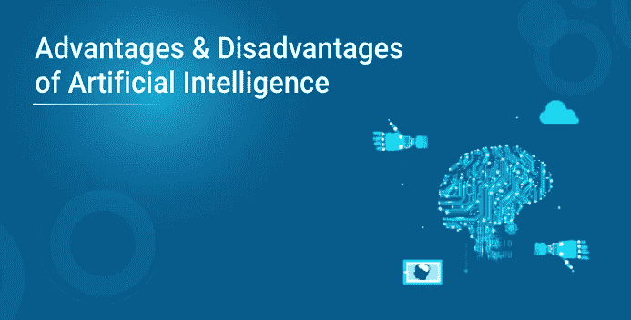

# 人工智能的优势和劣势

> 原文：<https://medium.com/edureka/advantages-and-disadvantages-of-ai-b01533ffbcb8?source=collection_archive---------2----------------------->

人工智能是试图在人工智能系统中模拟人类推理的新兴技术之一。约翰·麦卡锡在 1950 年发明了人工智能这个术语。

学习的每一个方面或智力的任何其他特征原则上都可以如此精确地描述，以至于可以制造一台机器来模拟它。人们将试图发现如何让机器使用语言，形成抽象概念，解决现在留给人类的各种问题，并改进它们自己。

人工智能是计算机程序学习和思考的能力。如果一个程序做一些我们通常认为依赖于人的智能的事情，那么一切都可以被认为是人工智能。在本文中，我们将讨论人工智能的不同优势和劣势。

*   人工智能的优势
*   人工智能的缺点

人工智能应用的优势是巨大的，可以彻底改变任何专业领域。让我们看看其中的一些。

# 人工智能的优势

## 1)减少人为错误

“”这个短语的诞生是因为人类时不时会犯错误。然而，如果程序设计得当，计算机就不会犯这些错误。有了**人为失误**人工智能，决策是通过应用一套特定的算法从先前收集的信息中做出的。因此减少了误差，并且有可能达到更高精度的准确度。

**例子:**在使用人工智能进行天气预报时，他们已经减少了大多数人为错误。

## 2)代替人类承担风险

这是人工智能最大的优势之一。我们可以通过开发一个人工智能机器人来克服人类的许多危险限制，而人工智能机器人反过来可以为我们做危险的事情。让它去火星，拆除炸弹，探索海洋的最深处，开采煤和石油，它可以有效地用于任何种类的自然或人为灾害。

**举例:**你听说过乌克兰**切尔诺比** l 核电站爆炸事件吗？在那个时候，没有人工智能驱动的机器人可以帮助我们通过在早期阶段控制火势来最小化辐射的影响，因为任何接近核心的人都会在几分钟内死亡。他们最终从直升机上远距离倾倒沙子和硼。

人工智能机器人可以用于人工干预可能有危险的情况。

## 3)24×7 可用

除去休息时间，普通人每天工作 4-6 小时。人类生来就有这样一种方式，可以抽出一些时间来恢复精力，为新的一天的工作做好准备，他们甚至每周休息一次，以保持他们的工作生活和个人生活不变。但是使用人工智能，我们可以让机器 24×7 不间断地工作，它们甚至不会感到无聊，不像人类。

例如:教育机构和帮助热线中心收到了许多可以使用人工智能有效处理的查询和问题。

## 4)帮助重复性的工作

在我们的日常工作中，我们将执行许多重复的工作，如发送感谢信、验证某些文档的错误，以及许多其他事情。使用人工智能，我们可以高效地自动化这些平凡的任务，甚至可以为人类移除“T2”无聊的“T3”任务，让他们解放出来，变得越来越有创造力。

**举例:**在银行里，我们经常会看到为了获得贷款而对文件进行多次核实，这对银行的所有者来说是一项重复的任务。使用人工智能认知自动化，所有者可以加快验证文件的过程，客户和所有者都将从中受益。

## 5)数字辅助

一些高度先进的组织使用数字助理与用户进行交互，从而节省了对人力资源的需求。许多网站也使用数字助理来提供用户想要的东西。我们可以和他们聊聊我们在找什么。一些聊天机器人的设计方式使得我们很难确定我们是在和聊天机器人还是人类聊天。

**示例:**我们都知道，组织有一个客户支持团队，需要澄清客户的疑惑和疑问。使用人工智能，组织可以建立一个语音机器人或聊天机器人，帮助客户解决所有问题。我们可以看到许多组织已经开始在他们的网站和移动应用程序中使用它们。

## 6)更快的决策:

使用人工智能和其他技术，我们可以让机器比人更快地做出决定，更快地执行行动。在做出决定时，人类会从情感和实践两方面分析许多因素，但人工智能机器会按照编程工作，并以更快的方式交付结果。

**举例:**我们都在 Windows 下过一盘棋。由于游戏背后的人工智能，在硬模式下击败 CPU 几乎是不可能的。它会根据背后使用的算法在很短的时间内采取可能的最佳步骤。

## 7)日常应用

苹果的 **Siri** 、Window 的 **Cortana** 、谷歌的 **OK Google** 等日常应用在我们的日常生活中频繁使用，无论是搜索位置、自拍、打电话、回复邮件等等。

大约 20 年前，当我们计划去某个地方时，我们会向已经去过那里的人问路。但是现在我们所要做的就是说“**好的谷歌**维萨卡帕特南在哪里”。它会向你显示维萨卡帕特南在谷歌地图上的位置，以及你和维萨卡帕特南之间的最佳路径。

## 8)新发明:

人工智能正在推动几乎每个领域的许多发明，这些发明将帮助人类解决大多数复杂的问题。

**例子:**最近，医生能够利用先进的人工智能技术预测早期女性乳腺癌。

# 人工智能的缺点

## 1)创作成本高

由于人工智能每天都在更新，硬件和软件需要随着时间的推移而更新，以满足最新的要求。机器需要修理和维护，这需要大量的费用。它的创造需要巨大的成本，因为它们是非常复杂的机器。

## 2)让人类变懒

人工智能正在让人类变得懒惰，它的应用程序自动完成了大部分工作。人类倾向于对这些会给后代带来问题的发明上瘾。

## 3)失业:

由于人工智能正在用机器人取代大多数重复性任务和其他工作，人类的干预正在变得越来越少，这将导致就业标准方面的一个主要问题。每个组织都在寻求用人工智能机器人取代最基本的合格人员，这些机器人可以更有效地做类似的工作。

## 4)没有情绪

毫无疑问，机器在提高工作效率方面要好得多，但它们无法取代组成团队的人际关系。机器无法与人建立联系，而这是团队管理的一个重要特征。

## 5)缺乏创新思维

机器只能执行那些它们被设计或编程去做的任务，任何超出这些任务的东西，它们都会崩溃或给出不相关的输出，这可能是一个主要的背景。

# **总结:**

以上是人工智能的一些优缺点。每一项新的发明或突破都将两者兼而有之，但我们人类需要注意这一点，并利用发明的积极方面来创造一个更美好的世界。显然，人工智能具有巨大的潜在优势。对人类来说，关键是确保机器人的崛起不会失控。也有人说，人工智能如果落入坏人之手，会毁灭人类文明。但是，没有一个如此大规模的人工智能应用可以毁灭或奴役人类。

说到这里，我们关于人工智能的各种优缺点的文章就到此为止了。

至此，我们结束了这篇关于数据科学与机器学习的博客。就这样，我们到了这篇文章的结尾。如果你对这个话题有任何疑问，请在下面留下评论，我们会尽快回复你。如果你想查看更多关于 Python、DevOps、Ethical Hacking 等市场最热门技术的文章，你可以参考 Edureka 的官方网站。

请留意本系列中解释数据科学各个方面的其他文章。

> *1。* [*数据科学教程*](/edureka/data-science-tutorial-484da1ff952b)
> 
> *2。* [*数据科学的数学与统计*](/edureka/math-and-statistics-for-data-science-1152e30cee73)
> 
> *3。*[*R 中的线性回归*](/edureka/linear-regression-in-r-da3e42f16dd3)
> 
> *4。* [*数据科学教程*](/edureka/data-science-tutorial-484da1ff952b)
> 
> *5。*[*R 中的逻辑回归*](/edureka/logistic-regression-in-r-2d08ac51cd4f)
> 
> *6。* [*分类算法*](/edureka/classification-algorithms-ba27044f28f1)
> 
> *7。* [*随机森林中的 R*](/edureka/random-forest-classifier-92123fd2b5f9)
> 
> *8。* [*决策树中的 R*](/edureka/a-complete-guide-on-decision-tree-algorithm-3245e269ece)
> 
> *9。* [*机器学习入门*](/edureka/introduction-to-machine-learning-97973c43e776)
> 
> *10。* [*朴素贝叶斯在 R*](/edureka/naive-bayes-in-r-37ca73f3e85c)
> 
> *11。* [*统计与概率*](/edureka/statistics-and-probability-cf736d703703)
> 
> *12。* [*如何创建一个完美的决策树？*](/edureka/decision-trees-b00348e0ac89)
> 
> *13。* [*关于数据科学家角色的 10 大误区*](/edureka/data-scientists-myths-14acade1f6f7)
> 
> *14。*[*5 大机器学习算法*](/edureka/machine-learning-algorithms-29eea8b69a54)
> 
> 15。 [*数据分析师 vs 数据工程师 vs 数据科学家*](/edureka/data-analyst-vs-data-engineer-vs-data-scientist-27aacdcaffa5)
> 
> 16。 [*人工智能的种类*](/edureka/types-of-artificial-intelligence-4c40a35f784)
> 
> *17。*[*R vs Python*](/edureka/r-vs-python-48eb86b7b40f)
> 
> *18。* [*人工智能 vs 机器学习 vs 深度学习*](/edureka/ai-vs-machine-learning-vs-deep-learning-1725e8b30b2e)
> 
> 19。 [*机器学习项目*](/edureka/machine-learning-projects-cb0130d0606f)
> 
> 20。 [*数据分析师面试问答*](/edureka/data-analyst-interview-questions-867756f37e3d)
> 
> *21。* [*面向非程序员的数据科学和机器学习工具*](/edureka/data-science-and-machine-learning-for-non-programmers-c9366f4ac3fb)
> 
> *22。* [*十大机器学习框架*](/edureka/top-10-machine-learning-frameworks-72459e902ebb)
> 
> *23。* [*用于机器学习的统计*](/edureka/statistics-for-machine-learning-c8bc158bb3c8)
> 
> *24。* [*随机森林中的 R*](/edureka/random-forest-classifier-92123fd2b5f9)
> 
> *25。* [*广度优先搜索算法*](/edureka/breadth-first-search-algorithm-17d2c72f0eaa)
> 
> *26。*[*R 中的线性判别分析*](/edureka/linear-discriminant-analysis-88fa8ad59d0f)
> 
> *27。* [*机器学习的先决条件*](/edureka/prerequisites-for-machine-learning-68430f467427)
> 
> *28。* [*互动 WebApps 使用 R 闪亮*](/edureka/r-shiny-tutorial-47b050927bd2)
> 
> *29。* [*机器学习十大书籍*](/edureka/top-10-machine-learning-books-541f011d824e)
> 
> *三十。* [*无监督学习*](/edureka/unsupervised-learning-40a82b0bac64)
> 
> *31.1* [*0 最佳数据科学书籍*](/edureka/10-best-books-data-science-9161f8e82aca)
> 
> 32。 [*监督学习*](/edureka/supervised-learning-5a72987484d0)

*原载于 2019 年 7 月 22 日*[*https://www.edureka.co*](https://www.edureka.co/blog/what-are-the-advantages-and-disadvantages-of-artificial-intelligence/)*。*