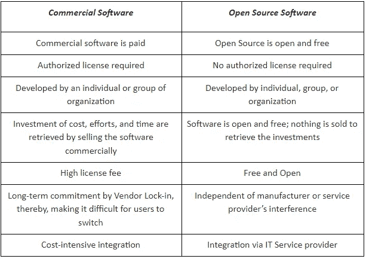

# 开源软件的优缺点，解释！

> 原文：<https://medium.com/quick-code/advantages-disadvantages-of-open-source-software-explained-2fd35acd413?source=collection_archive---------0----------------------->

*Source: Google*

一个新软件的引入需要一个终极问题的答案——商业软件还是开源软件。选择 apt 软件确实有影响(长期的)，因此应该谨慎从事。说到这里，让我们向您展示如何消除这种选择最佳软件的顾虑，并发现达成成功交易的最佳解决方案。

“开源软件”是如何定义的？

开放源代码被恰当地定义为对用户免费公开的软件。人们可以根据需要修改它，包括查看、编辑和修改。此外，除非您希望体验部署了“独有功能”和“广泛支持”的“企业版”，否则您无需花费任何成本

[开源软件](https://en.wikipedia.org/wiki/Open-source_software)已经使用多年，允许用户自由使用该软件。名单上的一些名人都经历过它的好处。少数是 Apache、Linux、Android、Mozilla Firefox、LibreOffice。

***“开源软件有改变世界的力量。”—彼得·莉莉，Instaclustr*** 公司首席执行官

**利用开源的细节**

大量的理由使得 OSS 对所有人来说都是不可或缺的。最重要的是“不受成本影响”和“自由改变”此外，技术能力、有竞争力的特性、强大的支持和高质量的软件也是考虑使用开源软件的原因。卓越的“定制和修复”能力也是其持续使用背后的另一个主要动机。

75%的公司使用开源——这是一个依靠开源的巨大数字。加速使用 OSS 的另一个驱动力是它不仅仅局限于自由修改和使用；它的好处不仅仅是自由改变。OSS 允许快速修复错误，研究软件源代码，并发布更新版本。大型支配者，包括脸书和谷歌，利用开源。

**为什么开源软件比商业软件更划算？**

**Reasons Why Open Source Software is a Better Deal than Commercial.**

开源软件部署解决方案，包括稳定性、高性能、放大的安全级别和高端源代码。在这种情况下，安全漏洞会被迅速发现和破解。它也得到了一个庞大社区的支持。

**使用开源软件的优缺点**

听说过“硬币的两面”吗？开源软件也是如此。这种技术在过程中有它自己的优点和缺点。

让我们逐一探索这两者。

**开源软件的好处**

推动创新

高端可靠性

培养更好的学习

简单的 Bug 删除和跟踪

**1。推动创新**

技术和互联网的进步引发了创新。这项技术也是如此。事实上，开源软件提供了一个平台，新手和专业人士都可以使用。因此，操作开放源码软件不需要特定的经验；是不偏不倚的。

投资开源软件鼓励学习，提高生产力，并导致软件的积极发展。“开源软件对用户开放”培养了分享和关爱的文化。此外，对操作源代码或应用任何修改几乎没有任何限制。

如果你仍然怀疑这项技术是否适合你，读读这些大牌可能会消除你所有的疑虑。Apache HTTP、Mozilla Firefox、Cloudera、Docker、Google、GitHub 以及其他许多大牌都依赖于开源软件。

**2。高端可靠性**

开源软件的可靠性可以通过软件服务于前提规范的效率来定义。如果任何软件或技术能够提供规范中的东西，那么，人们可以高度依赖它。

开源系统能识别过程中的错误吗？OSS 有可能最大限度地避免、解决或改进流程吗？如果这些问题的答案是肯定的，那么恭喜你，你已经依赖于 apt 技术了。OSS 识别过程中的问题，甚至预防和提高可靠性。

考虑到 OSS 是由无数专家分析和管理的，很难看到任何无法修复的错误。这难道不使它成为一个非常值得信赖的软件吗？

“开源软件”是才华横溢、技术娴熟的专业人士的努力成果。他们喜欢为社区服务，这也是开发 OSS 的目的。因此，低质量的可能性微乎其微。想象一下成百上千的专家为构建软件做出贡献——这将是多么的创新和非凡？不过，开源软件非常可靠。

**3。培养更好的学习能力**

开源软件是集体贡献的成果。可以期待对源代码的直接支持和真实反馈，尤其是当数百名专家在这样一个开放的环境中工作时。鉴赏家欣赏并积极实施反馈、建议和真诚的建议。总的来说，这促进了更好的学习。

对用户有什么帮助？好吧，即使是用户也倾向于以教程、实时会话、持续聊天支持、讨论、甚至博客和文章的形式体验相当多的支持。开源软件的坦率是非常值得赞赏的，因为这样一个开放的环境开创了一种学习文化——知识被分享和接受。

开源软件为每个人提供了成长的空间。当你知道你的反馈得到了重视、欣赏和考虑时，这就变成了一种双向交流，产生了一个积极的学习环境。

**4。简单的 Bug 移除&跟踪**

同样，来自全球各地的先锋积极参与其中。这模糊了软件中出现错误和问题的可能性。由于专家已经在分析和修复所有的 bug、问题和故障，所以几乎没有机会遇到。

对于这些鉴赏家来说，修复漏洞并像丝绸一样流畅地运行软件只是几个小时的事情。*还有什么？*使用该软件时，几乎没有任何修复错误或面临任何重大问题的麻烦。专家不仅修复错误和故障，还向维护人员报告最新的更新。

*开源软件是独立、高质量、稳定、安全的技术投资。这些是利用开源软件的一些显著优势。现在，让我们探索硬币的另一面。*

**开源软件的负面影响**

*   有点冒险
*   较低的定制支持
*   不便于用户使用
*   不存在广泛的技术支持

**1。有点冒险**

不过，每项技术都是如此。所有的技术和软件都有最小的风险。重点是，瑕疵处理的有多好。想一想，“为全世界的每个人发布你的源代码。”那不是给桌子带来了一定的弊端吗？它带来了脆弱性——以如此快的速度，在某一点上可能无法控制。

开源软件可以通过各种方式被使用和滥用。这就是我们变得没有建设性的地方。有了 OSS，我们可以预期伤害、病毒转移、身份盗窃和许多其他恶意行为会伤害这个过程。

**2。下部定制支架**

开源代码中没有代码的文档。因此，这会给用户完全理解它带来困难。用户可以根据自己的需求和理解，自由地修改、编辑和升级软件。这非常令人担忧。

**3。不便于用户使用**

对 GUI 或图形用户界面的忽视给开源软件用户带来了一个缺点。由于 GUI 效率低下，非技术人员可能对 OSS 感到不舒服。这种低效率可能需要特殊的团队培训来加速软件程序的每一个新版本。

GUI 的低效甚至可能会恳求软件开发公司为进一步集成开发一个合适的 GUI。这将花费时间、精力和金钱——因为没有合适的 GUI，进展仍然是不充分的。虽然技术专业人员可能会适应这种不足，但对于非技术人员来说，找到合适的解决方案可能会有点令人恼火。

**4。不存在广泛的技术支持**

老实说，社区并没有承诺在故障升级的情况下提供即时解决方案或 24x7 支持。因此，如果出现问题，您可能需要等待社区的回应。社区在向软件用户提供解决方案方面没有得到任何回报。如果没有任何回报，他们为什么对帮助任何人如此感兴趣？然而，并不是每个人都有相同的信仰。最终，这取决于他们为用户服务的意愿。

这个问题的另一个解决方案是雇佣你自己的专门团队来管理软件。

- *因为持续的发展是必须的，你必须投资一个专门的团队来完成它。*

- *充分利用开源软件在这里需要产生额外的成本。*

**外卖信息**

毫无疑问，投资开源软件是一个非常明智的举动。这带来了大量的优势，包括低成本投资、更好的创新、更智能的学习和容易的错误删除跟踪等等。然而，开源软件也有一定的缺点，包括没有持续的支持，风险较小，以及软件的非友好性。

然而，没有哪项技术如此不畏惧，以至于它不会影响过程或结果。为什么人们对 OSS 或任何其他技术如此着迷，是因为它带来了一些新颖的、创新的、创造性的、现代的解决方案。如果你雇佣一个专门的团队来管理这些过程，开源软件的大部分负面影响都可以得到解决。因此，这项技术非常可靠。