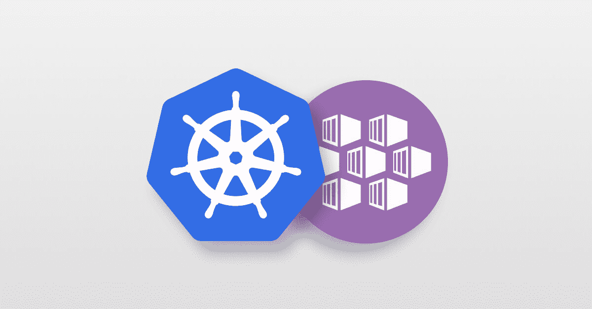
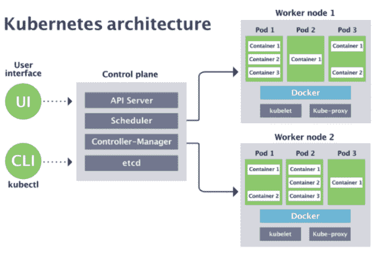
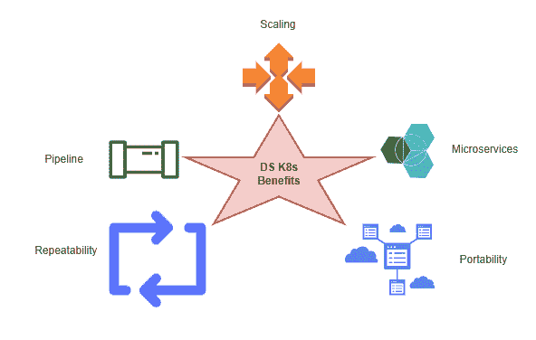
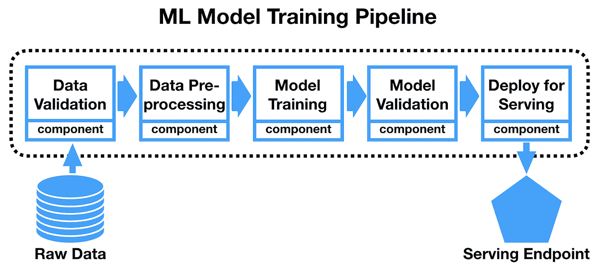
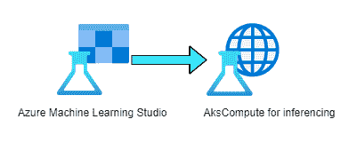
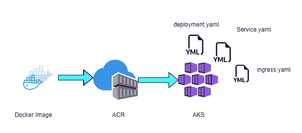

# 使用 Kubernetes 部署机器学习模型的优势

> 原文：<https://medium.com/globant/advantages-of-deploying-machine-learning-models-with-kubernetes-8454cc7c565e?source=collection_archive---------0----------------------->

使用 Azure Kubernetes 服务部署 ML 模型的三种不同方式

Source: [https://bit.ly/3a5CLCk](https://bit.ly/3a5CLCk)

一个[机器学习](https://en.wikipedia.org/wiki/Machine_learning) [数据科学家](https://en.wikipedia.org/wiki/Data_scientist)努力构建模型。该模型有助于解决业务问题。然而，在部署模型时，存在一些挑战，如如何扩展模型，模型如何与应用程序内外的不同服务进行交互，如何实现重复操作等。要克服这个问题，Kubernetes 是最合适的。

在这篇博客中，我将帮助你了解 Kubernetes 的基础知识，它对部署[机器学习](https://en.wikipedia.org/wiki/Machine_learning) (ML)模型的好处，以及如何使用 Azure Kubernetes 服务实际进行部署。

## Kubernetes 是什么——为什么团队喜欢它

[Kubernetes](https://kubernetes.io/docs/concepts/overview/what-is-kubernetes/) ，通常缩写为 K8S，是一个用于管理容器化工作负载和服务的开源平台，由 Google 于 2014 年开源。(K8S 作为缩写，是从“K”到“S”这八个字母数出来的。)它主要使用大规模运行的生产工作负载。

source: [https://securesql.info/cloud-security/2020/11/19/kubernetes-basics](https://securesql.info/cloud-security/2020/11/19/kubernetes-basics)

Kubernetes 集群包含运行容器化应用程序的工作节点。这些工作节点是一组机器。这些应用程序是 [pods](https://kubernetes.io/docs/concepts/workloads/pods/) (代表运行容器集)的一部分。每个群集必须至少有一个工作节点。控制平面管理集群中的工作节点和单元。控制平面由不同的组件组成，即:

**a. API 服务器:**公开 Kubernetes API。( [kube-apiserver](https://kubernetes.io/docs/reference/command-line-tools-reference/kube-apiserver/) )它可以通过部署更多实例来进行水平扩展。

**b .调度器:**控制平面使用调度器来分配新创建的没有分配节点的 pod，并选择一个节点让它们在**上运行。**

**c .控制器管理器:**控制平面使用控制器管理器运行不同的控制器进程，如节点、作业、端点、服务帐户和令牌控制器。

**d. etcd:** 存储 Kubernetes 集群配置和状态数据，比如 pod 的数量、它们的状态、名称空间等。它还存储 Kubernetes API 对象和服务发现细节。

这些服务通常协同工作，并且需要满足可伸缩性和云安全方面的需求。这篇[文章](https://kubernetes.io/docs/concepts/overview/components/)概述了 Kubernetes 中的所有组件。

## Kubernetes 的优势

以下是 Kubernetes 在部署 ML 或[深度学习](https://en.wikipedia.org/wiki/Machine_learning)模型时提供的好处。

Source: Own

**缩放:**在 MLOPS 中，模型再培训是流程中不可或缺的一部分。这需要 GPU 支持加速训练和验证。由于 GPU 培训的成本很高，Kubernetes 提供了扩展集群的功能，以便在模型进入再培训阶段时将 GPU 包括在内，并在培训结束后退出使用。因此，我们可以使用 Kubernetes 根据工作负载自动扩展集群。

**微服务:**生产中的企业应用是多个组件的混合体，用不同的语言和独特的框架编写。每种语言都使用 API 调用和认证令牌在其他服务之间进行通信。Kubernetes 保护这些通信，支持服务之间的平稳运行，并处理负载平衡和故障管理。

大多数 ML 项目都是用 Python 或 R 之类的编程语言编写的，为了数据交换、安全性和可视化，应用程序也可以用其他编程语言编写。基于容器的解决方案微服务在这种情况下起着至关重要的作用，因为开发人员可以独立运行不同的实验。

**可移植性**:基于容器的架构的基本支柱是一次编写，到处复制和运行。容器允许我们在生产中采用经过测试的模型，而不需要改变测试环境的配置

**重复性:** ML 和深度学习模型包含高度重复性操作。在这种情况下，Kubernetes 将完全控制所有资源，如数据集、库和模型。

**流水线**:ML 流水线依次执行[数据验证](https://en.wikipedia.org/wiki/Data_validation)、[数据预处理](https://en.wikipedia.org/wiki/Data_pre-processing)、[模型训练、模型验证、服务](https://en.wikipedia.org/wiki/Training,_validation,_and_test_data_sets)等各种操作。

source: [https://bit.ly/3r0S2t3](https://bit.ly/3r0S2t3)

容器架构最适合，管理这些容器 Kubernetes 会有很大帮助。

## 如何监控 Kubernetes 基础设施

基于人工智能的系统本质上是非常动态的，因此监控包含人工智能模型的 Kubernetes 是至关重要的。这将有助于 K8S 集群的规模、性能、响应时间和再培训策略。Prometheus 是一款 Kubernetes 监控工具。它提出了自己的查询语言工具(PromQL)

在 Kubernetes 环境中部署了一个 Prometheus 服务器，并将它们的指标放入数据库。这些使用 HTTP 协议发布的指标是人类可读的，并且可以通过 API 调用轻松访问。Prometheus 还提供了 PromQL 查询结果的基本可视化。对于丰富的经验和额外的能力，我们可以使用[格拉夫纳](https://grafana.com/)。当超过预定义的性能阈值时，Prometheus 会提供实时警报。

## 如何使用 Kubernetes 部署机器模型

几乎所有的云提供商，如 AWS、GCP 和 AZURE，都提供了 Kubernetes 即服务。大多数公司利用这些云服务。它建议使用他们的 Kubernetes 服务。在这篇博客中，我将解释使用 Azure Kubernetes 服务部署 ML 模型的三种方式。

**答:Azure ML workspace:**Azure ML 服务使用以下步骤，无论您在哪里部署模型，都是相似的:

Source: own

1.  注册模型。
2.  准备一个入门脚本。
3.  准备推理配置。
4.  在本地部署模型以确保一切正常。
5.  选择一个计算目标。
6.  将模型部署到云中。
7.  测试产生的 web 服务。

在步骤 5 中，我们将使用 AK Compute(Azure Kubernetes 服务计算)进行推理。有关 python 代码，请参考本文。

 [## Azure ml . core . compute . aks . aks compute 类- Azure 机器学习 Python

### 管理 Azure 机器学习中的 Azure Kubernetes 服务计算目标。Azure Kubernetes 服务(AK compute)…

docs.microsoft.com](https://docs.microsoft.com/en-us/python/api/azureml-core/azureml.core.compute.aks.akscompute?view=azure-ml-py) 

如果您不知道如何遵循步骤 1 到 7，那么请参考本文以获得详细的实现。

 [## 部署机器学习模型- Azure 机器学习

### 适用于:Azure CLI ml 扩展 v1 Python SDK azureml v1 了解如何部署您的机器学习或深度学习…

docs.microsoft.com](https://docs.microsoft.com/en-us/azure/machine-learning/how-to-deploy-and-where?tabs=azcli) 

**B.** **将 Docker 映像部署到独立的 Azure Kubernetes 服务**

source: own

下面是步骤。

1.  [为你的 ML 模型建立一个 docker 图像。](https://www.youtube.com/watch?v=hTacGMfL8lc&list=PLZoTAELRMXVNKtpy0U_Mx9N26w8n0hIbs)
2.  [将 docker 映像推送到 Azure 容器注册中心](https://docs.microsoft.com/en-us/azure/devops/pipelines/ecosystems/containers/acr-template?view=azure-devops)
3.  创建 Azure Kubernetes 服务。(或者您可以使用现有的)
4.  写一个[**deployment . YAML**](https://kubernetes.io/docs/tasks/run-application/run-stateless-application-deployment/)[**service . YAML**](https://kubernetes.io/docs/concepts/services-networking/service/)文件。
5.  为这些 Yaml 文件运行 Kubernetes 来创建一个 pod。

Azure Kubernetes 服务将负责如果 pod 被删除或被高度利用，它将创建另一个 pod。因此，高可用性和可扩展性的机会总是存在的。

有关详细的实现，请参考本文

 [## Kubernetes on Azure 教程-准备应用程序- Azure Kubernetes 服务

### 在本教程(共七部分的第一部分)中，准备了一个多容器应用程序用于 Kubernetes。现有的…

docs.microsoft.com](https://docs.microsoft.com/en-us/azure/aks/tutorial-kubernetes-prepare-app)  [## Kubernetes on Azure 教程-部署应用程序- Azure Kubernetes 服务

### Kubernetes 为容器化的应用程序提供了一个分布式平台。您可以构建和部署自己的应用程序…

docs.microsoft.com](https://docs.microsoft.com/en-us/azure/aks/tutorial-kubernetes-deploy-application?tabs=azure-cli) 

**C .使用 Kubeflow 的端到端 ML 生命周期**

[Kubeflow](https://www.kubeflow.org/) 是在 Kubernetes 上管理完整的 ML 生命周期的最流行的方法之一。遵循以下步骤:

1.  将 ML 模型打包到一个容器中，并发布到 Azure Container Registry (ACR)。
2.  Azure Blob 存储托管训练数据集和训练模型。
3.  使用 Kubeflow 将培训工作部署到 Azure Kubernetes Services(AKS)；AKS 的分布式训练作业包括参数服务器和工人节点。
4.  使用 Kubeflow 服务生产模型，促进跨测试、控制和生产的一致环境。
5.  AKS 支持支持 GPU 的虚拟机。
6.  开发人员构建功能来查询在 AKS 集群中运行的模型。

有关详细的实现，请参考本文

 [## 使用 Kubeflow - Azure 解决方案理念将机器学习模型部署到 AKS

### 将机器学习模型部署到 Azure Kubernetes 服务(AKS)进行大规模生产推理。

docs.microsoft.com](https://docs.microsoft.com/en-us/azure/architecture/solution-ideas/articles/machine-learning-model-deployment-aks) 

虽然我给出了一种不同的方法来使用 Kubernetes 部署 ML 模型，但是人们可以根据自己的需求使用任何方法将模型部署到 Kubernetes。

## 总结/结论

本文帮助您熟悉 Kubernetes 以及它们与模型的集成。ML 模型需要并行运行许多不同的实验。每次资源需求发生变化时，Kubernetes 都是最佳选择。它将有助于资源管理、监控、作业调度等。

# 未来的阅读、参考和建议

*   为什么使用 Kubernetes？https://www.sumologic.com/blog/why-use-kubernetes/
*   以下是 Kubeflow 的讲解和部署:[https://www.kubeflow.org/](https://www.kubeflow.org/)[https://www . arrikto . com/blog/kube flow/news/minikf-a-fast-and-easy-way-to-deploy-kube flow-on-your-laptop/](https://www.arrikto.com/blog/kubeflow/news/minikf-a-fast-and-easy-way-to-deploy-kubeflow-on-your-laptop/)
*   K8S 默认调度器不足以处理人工智能工作负载:[https://www . cncf . io/blog/2020/08/10/why-the-kubernetes-scheduler-is-not-suffith-for-your-AI-workloads/](https://www.cncf.io/blog/2020/08/10/why-the-kubernetes-scheduler-is-not-enough-for-your-ai-workloads/)
*   Kubernetes 日程安排:[https://www . run . ai/guides/kubernetes-architecture/kubernetes-scheduling](https://www.run.ai/guides/kubernetes-architecture/kubernetes-scheduling)