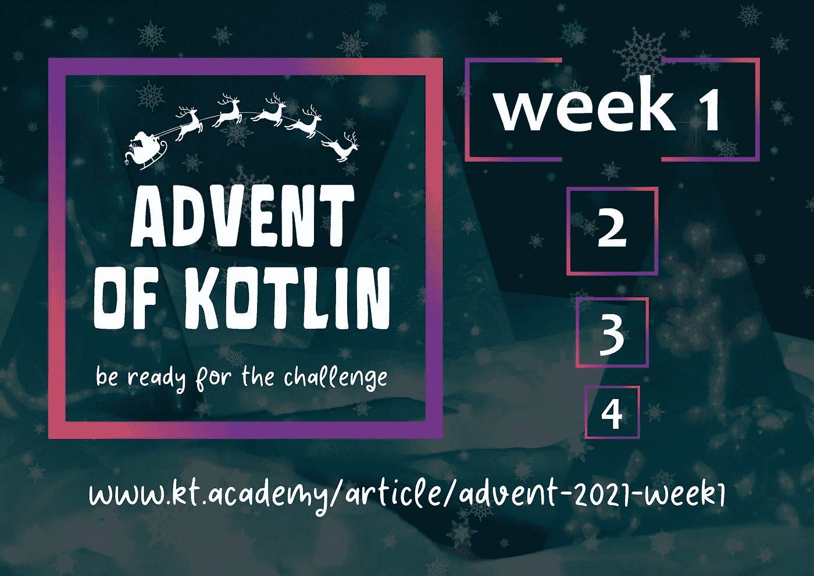

# 科特林降临节:第一周🔥

> 原文：<https://blog.kotlin-academy.com/advent-of-kotlin-week-1-f42e39b41211?source=collection_archive---------1----------------------->

# 你好 Kotliners！

这是我们新闻简报的一个特殊的 **4 周版本。它将包含只有一个特殊主题的内容。**

激动吗？
看看我们准备了什么！🤩

我们很高兴地宣布**科特林**第二版降临的开始🎄

每周我们将分享一个挑战，你的工作是写出解决方案。
在 Twitter 上发布答案的人**可以赢得特殊礼物**🤫

我们将在我们的网站上分享这些任务。学院 —每周三、周四我们会给你发这个简短的简讯，周一我们会发布其他带解答的文章。

更多的解释可以在文章中找到。

准备好了吗？下面是第一部分！👇

[Advent of Kotlin: Week 1](https://kt.academy/article/advent-2021-week1)

# 祝你好运！🎅

## #科特林的冒险

谢谢大家，下周见！

卡帕头。学院团队

www: [kt.academy](https://kt.academy/)
博客:[blog.kotlin-academy.com](http://blog.kotlin-academy.com/)
Twitter EN:[@ ktdotsacademy](https://twitter.com/ktdotacademy)
Twitter PL:[@ ktdotsacademypl](https://twitter.com/ktdotacademyPL)
FB:[@ ktdotsacademy](https://www.facebook.com/KtDotAcademy)
LinkedIn:[@ Kt。学院](https://www.linkedin.com/company/kt-academy/)

