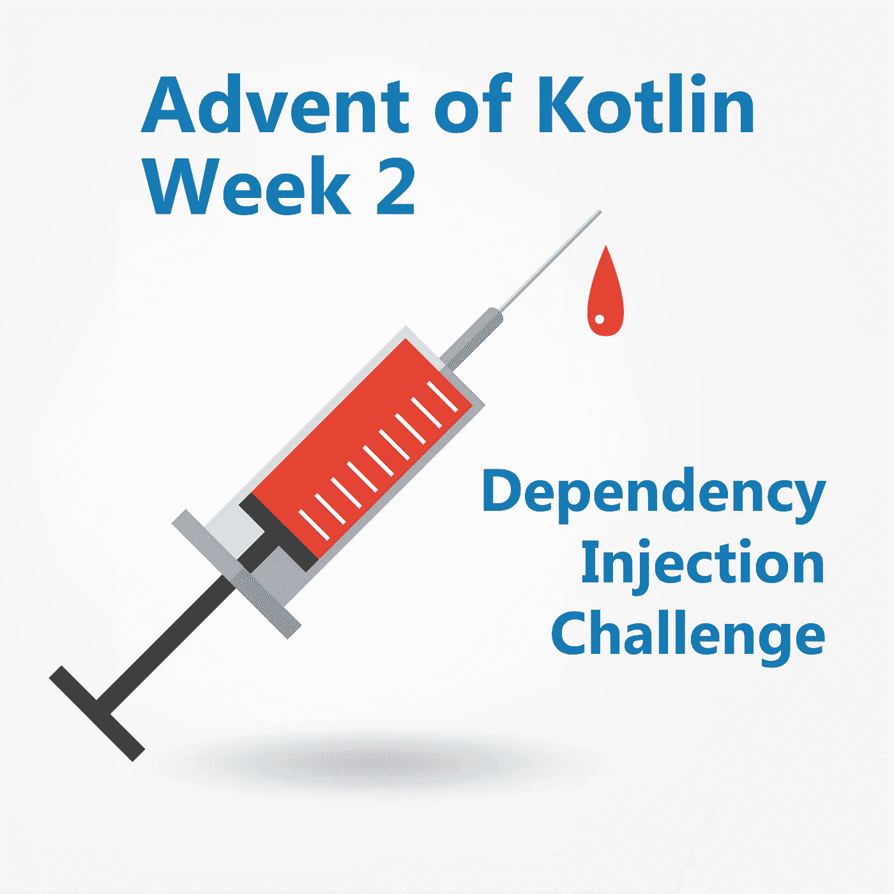

# Kotlin 的出现，第 2 周:依赖注入

> 原文：<https://blog.kotlin-academy.com/advent-of-kotlin-week-2-dependency-injection-351f615da2e1?source=collection_archive---------3----------------------->

Created by Macrovector — Freepik.com

这是科特林挑战来临的第二周。上周我们收到了许多申请，我们可以继续了解更多令人惊奇的事情。这个挑战的所有具体规则你都可以在[上一篇文章](/the-advent-of-kotlin-2018-week-1-229e442a143)中找到。

Kotlin，这种相对年轻的语言，已经拥有了种类繁多的依赖注入库(举几个例子: [Koin](https://github.com/InsertKoinIO/koin) 、 [KodeinDI](https://github.com/Kodein-Framework/Kodein-DI/) 、 [Injekt](https://github.com/kohesive/injekt) 、 [Kapsule](https://github.com/traversals/kapsule) )。我完全理解。在 Java 或 JS 中实现这种模式是非常具有挑战性的，而在 Kotlin 中这是一个美好而愉快的挑战。这就是为什么本周我们都要实现一个简单的 DI 库。这个任务将帮助我们了解一些不太为人所知的 Kotlin 特性，练习 DSL 创建，并让我们了解这些库是如何工作的。

注意:我们不会使用注释处理，严格来说，我们将实现资源加载器，而不是依赖注入，与所有注意到的库一样。

如果你对 DI 概念不熟悉，[这里有一个简短的介绍](https://www.youtube.com/watch?v=IKD2-MAkXyQ)，[这里有一个 Salomon Brys 的演示](https://www.youtube.com/watch?v=OvqPGaj3C58)，而[这里有一个匕首般的解释，以为我 DI 最初几年前](http://square.github.io/dagger/)。

# 类别创建者注册表

关键部分是注射。我们应该允许直接或延迟注入:

(这只是一个例子。您可以用不同的方式命名这些函数，并且可以在某个对象上调用它们，而不是将它们定义为顶级函数。)

那些注入函数怎么可能知道属性类型呢？由于类型推断:

当我们额外使这个函数内联，并且它的类型参数具体化时，我们将能够对它进行操作，就像我们有一个真实的类型一样:

这样，您可以从所有类创建者的注册表中本地化类型。这个注册表看起来会是什么样子？最简单的方法是制作一些映射，将一个类名与创建者方法相关联:

请记住，属性可以有一个可空类型。那么它应该如何行动呢？自己决定。

# 数字式用户线路

为了使注入成为可能，我们首先需要指定应该如何创建每种类型。这通常是使用一些 DSL 来完成的。例如，这是来自 [Koin](https://github.com/InsertKoinIO/koin) 的一个例子:

这里有一个来自 [Kodein](https://github.com/InsertKoinIO/koin) 的例子:

这里有一个来自 Injekt 的例子:

这是你的决定，你想如何 DSL 看起来像和行为。注意还有一个区别，有些库有一个全局寄存器，而有些库允许有许多寄存器，并在其中一个上使用注入。这两种方法都很好，但是最好设置两个默认寄存器，并且有可能指定不同的模块。

# 工作

进行简单的依赖注入，并展示一些使用示例。可以通过 [Koin](https://github.com/InsertKoinIO/koin) 、 [KodeinDI](https://github.com/Kodein-Framework/Kodein-DI/) 、 [Injekt](https://github.com/kohesive/injekt) 、 [Kapsule](https://github.com/traversals/kapsule) 来启发。做一个你喜欢使用的依赖注入。玩得开心:)

完成后，发布您的实现(例如在 Github 或 Github Gist 上)并在 Twitter 上与标签#AdventOfKotlin18 共享，或者发送到 contact@kt.academy。通过发送到那里，您允许我们发布此代码和您的全名。我们将在下周日(12 月 9 日)在这里公布最佳解决方案和一些荣誉奖，并附上作者姓名或昵称。

# 评论结束

你应该在你的项目中实现你自己的 DI 吗？答案是:视情况而定，但在大多数情况下并非如此。在你的项目中实现它会给你更多的自由。另一方面，对于新开发人员来说，使用成熟且经过测试的解决方案更安全、更方便。这也是我一般推荐这个选项的原因。在最坏的情况下，所有这些框架都非常相似，当您使用项目范围的 replace with Regex 时，迁移会很顺利。测试过；)

# 结果

我们收到了许多优秀的作品，每一件都代表了它的风格和品味。以下是几个例子:

Balázs Németh 提出了一个[久经考验、干净且非常强大的解决方案](https://bitbucket.org/nbali75/di/src/master/)。

克里斯蒂安·福赫斯发了一个[非常简短简洁的解决方案](https://github.com/fuchsch1234/AdventOfKotlin2018/blob/master/src/main/kotlin/adventofkotlin/week2/Injector.kt)。

Timothy Earley 发了一个[原创的并且更加面向 OOP 的](https://gitlab.com/TimothyEarley/advent-of-kotlin-2018/tree/master/week2)解决方案。

何塞·伊格纳西奥·阿辛·波佐发来了一个简洁、干净、经过测试的解决方案( [SO](https://stackoverflow.com/users/6783451/jose-ignacio-acin-pozo) ， [Github](https://github.com/Ganet) )。

最后，我决定选择由 [Olivier Perez](https://github.com/olivierperez) 提出的解决方案，他不仅做出了令人敬畏的 injection 和 DSL，而且[还在 Github](https://github.com/olivierperez/AdventOfCode2018/tree/master/src/main/kotlin/fr/o80/week2) 上记录了一切。以下是他在推特上的投稿:

我们非常喜欢的几个附加元素:

*   不同种类的工厂——每次创建一个新实例，每个模块一次或所有模块一次。
*   他使用了`InjectionDsl`注释，这是他的 [DSL 标记](https://kotlinlang.org/api/latest/jvm/stdlib/kotlin/-dsl-marker/index.html)。它防止在内部 lambda 表达式中使用 InjectModule 块中的方法。
*   创建类来表示不同种类的生成器(而不是收集不同种类的 lambda 表达式)。
*   DSL 中未声明类型时的特殊错误消息。

我们来分析一下。进样位于模块中。以下是惰性注射和正常注射的例子:

他实施了不同种类的注射:

简单实用的用法，但是代码呢？这是一样清楚！下面是 DSL 的定义:

对于那些不熟悉 DSL 的人来说，模块块是一个带有接收者的 lambda 表达式。这意味着`module`后面的括号是一个 lambda 表达式，但是就像在扩展函数中，扩展对象是接收者，所以我们可以使用`this`来访问它。在这个解决方案中，lambda expression 也有一个不同的接收器。在这种情况下，接收器类型为`InjectModule`。得益于此，我们可以直接使用来自`InjectModule`的所有方法，如`factory`、`scope`或`singleton`。这些方法在`InjectModule`的实例上被调用，它们修改它的内部状态——在本例中是通过添加新的方法来创建一个对象。然后我们需要得到一个对象。我们使用以下方法:

这是一个很好的解决方案，我推荐给任何想了解 DSL 工作原理的人。这不是一个简单的挑战，每个解决它的人都是赢家。恭喜你！

## 单击👏说“谢谢！”并帮助他人找到这篇文章。

你需要 Kotlin 工作室吗？请访问我们的网站,看看我们能为您做些什么。

了解卡帕头最新的重大新闻。学院、[订阅时事通讯](https://kotlin-academy.us17.list-manage.com/subscribe?u=5d3a48e1893758cb5be5c2919&id=d2ba84960a)、[观察 Twitter](https://twitter.com/ktdotacademy) 并在 medium 上关注我们。

