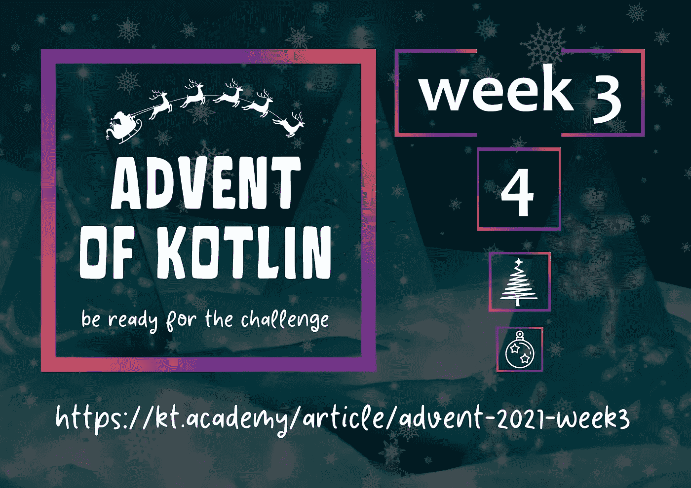
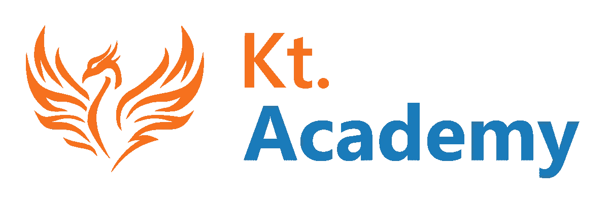

# 科特林降临节:第三周🔥

> 原文：<https://blog.kotlin-academy.com/advent-of-kotlin-week-3-a671a0ec01d0?source=collection_archive---------5----------------------->

# 你好 Kotliners！

ℹ️:这是我们时事通讯的一个特殊的、为期 4 周的版本。它将包含只有一个特殊主题的内容——kot Lin 的出现。

**欢迎来到**的第三周

# 科特林的出现🎄

我们希望你玩得开心！

别忘了在推特上发布你的答案👉[@ ktdotsacademy](https://twitter.com/ktdotacademy)。只有这样你才能赢得一些特别的奖励🎁

准备好迎接新的挑战了吗？给你！👇

[**科特林第三周来临:k-means 聚类**](https://kt.academy/article/advent-2021-week3)

[Advent of Kotlin Week 3: k-means clustering](https://kt.academy/article/advent-2021-week3)

# 祝你好运！🎅

# #科特林的冒险

谢谢大家，下周见！

卡帕头。学院团队

www: [kt.academy](https://kt.academy/)
博客:[blog.kotlin-academy.com](http://blog.kotlin-academy.com/)
Twitter EN:[@ ktdotsacademy](https://twitter.com/ktdotacademy)
Twitter PL:[@ ktdotsacademypl](https://twitter.com/ktdotacademyPL)
FB:[@ ktdotsacademy](https://www.facebook.com/KtDotAcademy)
LinkedIn:[@ Kt。学院](https://www.linkedin.com/company/kt-academy/)

