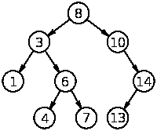

# 科特林降临，第三周:排序列表

> 原文：<https://blog.kotlin-academy.com/advent-of-kotlin-week-3-sortedlist-2ff49c250aad?source=collection_archive---------2----------------------->

Kotlin 中我真正缺少的一点是内置的 SortedList 实现。的确，在 Kotlin 中排序非常容易，但这并不等同于拥有一个默认排序的集合。一个关键原因是，当正确的顺序在内部实现时，添加和查找元素的速度会更快。

让我们从基线开始。我经常看到，当开发人员需要一个排序的集合时，他们只是在每次插入元素后对集合进行排序。他们首先在末尾添加一个元素，然后对整个集合进行排序。

效率有多高？一点也不，但是为了给你一个具体的数字，让我们做一个实验。

要添加一个元素，我们必须进行 10 万次以上的比较。很明显，这个数字必须大于集合的大小，因为 comparator 需要检查集合的其余部分是否已经排序。

如果我们知道这个集合在加法之前是排序的，需要进行多少次比较？在这种情况下，17 左右应该足够了。怎么可能呢？假设我们将所有的元素放在一个数组中(在内存中，一个接一个地放置)。当我们需要为一个新元素找到一个位置时，我们应该跳到这个集合的中间，并与它进行比较。那么我们知道我们的元素不是更大就是更小。总之，我们只是把可能性缩小了一半。说我们知道它更大。然后我们可以重复上一步，与中间的元素(在整个集合的 3/4 处)进行比较。这样，每一步我们都将搜索空间缩小 2，因此我们可以在 log2(n)步中找到正确的位置，其中 n 是该集合的大小。log2(100 000) = 16.6，所以我们应该在 17 步中找到正确的位置。

相同的算法可以应用于元素查找。在一个普通的列表中，我们需要逐个元素地检查。如果我们知道列表已经排序，我们可以使用与插入相同的算法，在 log2(n)步中检查整个集合。

正如您所看到的，保持正常的集合排序和拥有一个排序的集合在效率上有很大的不同。尽管它有用吗？我们可以在哪里使用这样的集合？

只是提醒自己第一周。A*算法在每一步中都开发出最短的尚未开放的路径。它创造了一些新的可能性，也关闭了一些。然后它需要再次找到最短的一个。当我们将所有新路径的集合作为一个排序集合时，效率会更高。我们不能使用 SortedSet，因为我们会有许多相同大小的路径，我们会丢失它们。因此，我们需要一个排序列表。

# 怎么会？

有许多方法可以实现这一点。我认为最简单的解决方案是使用数组。如果你需要如何处理数组的灵感，请阅读 Java `ArrayList`。例如，以下是在具体位置添加的有效元素:

实现可变排序列表的一个更简单的方法是组合`ArrayList`，并以正确的方式处理一些操作。

尽管还有其他选择。我发现实现和操作一个特别有趣的数据结构是二叉查找树。下面是二叉树实现:

虽然我们也需要一个类来保存比较器并强制正确的顺序:

我们预先假设，当我们取任何一个节点时，在它左边的子树中只有更小的元素，在右边只有更大的元素:

从这一点来看，很容易找到元素:我们只需要在每个节点进行检查，然后递归地检查`smaller`或`bigger`:

同样，其他所有操作都相对容易。你可以在这里找到完整的算法描述。

您完全可以选择自己喜欢的数据结构。您可以实现一个排序数组列表。

# 挑战

本周的挑战是实现一个排序列表。它应该在内部保存一个比较器，并且总是基于这个比较器对元素进行排序。检查这样的集合是否包含元素，或者添加元素应该有大约 log2(大小)的比较。(实际上还要多一点，因为如果我们有许多元素根据比较器相等，我们需要将元素与它们中的每一个进行比较。我们假设仅仅因为比较器说元素相等，并不意味着它们真的相等，我们应该使用`equals`函数来检查相等性。

你可以选择任何你想要的数据结构。

这里有一些测试可以帮助你进行开发:(这里还有是 REPL)

祝你好运！

# 结果

给定的任务给了很大的自由度，我很高兴看到各种各样的解决方案。从基于数组列表组合的简单解决方案开始，到具有良好定义的抽象的完整二叉树实现。

让我们从这个简单的例子开始，在这里我们重用`ArrayList`并尽可能优化那些操作。下面是何塞·伊格纳西奥·阿辛波佐( [SO](https://stackoverflow.com/users/6783451/jose-ignacio-acin-pozo) ， [GitHub](https://github.com/Ganet) )发来的解决方案:

请注意，这并不真正包括二分搜索法实施。这是因为这个实现已经在标准库中了。嗯，那很好。为什么要在 stdlib 中实现一些东西？Jose 的实现很简单，但也非常聪明和优雅。

Balázs Németh 提出了概念上类似的解决方案。

我们还有一个由 Péter Gulyás 提交的精彩作品。他实现了完整的二叉树并将文件上传到他的 GitLab:

 [## src/main/kotlin/bst 大师 Peter Gulyas/the-advent-of-kot Lin-2018-week-3

### GitLab.com

gitlab.com](https://gitlab.com/gulyaspeter/the-advent-of-kotlin-2018-week-3/tree/master/src/main/kotlin/bst) 

这种方式要求更高。你可以清楚地看到，要正确地实现这一切，他需要做多少工作。它并不复杂。它实际上是一个优雅且相对简单的实现。只是以这种方式实现这项任务并不容易。算法看起来不错，抽象设计的也不错。这就是为什么本周我们决定最喜欢彼得·古利亚斯的[实现:)](https://gitlab.com/gulyaspeter/the-advent-of-kotlin-2018-week-3)

## 单击👏说“谢谢！”并帮助他人找到这篇文章。

你需要 Kotlin 工作室吗？访问[我们的网站](https://www.kt.academy/)，看看我们能为您做些什么。

了解卡帕头最新的重大新闻。学院，[订阅时事通讯](https://kotlin-academy.us17.list-manage.com/subscribe?u=5d3a48e1893758cb5be5c2919&id=d2ba84960a)，[观察 Twitter](https://twitter.com/ktdotacademy) 并在 medium 上关注我们。

