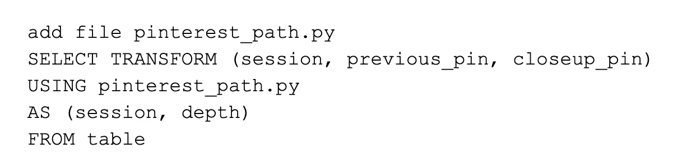

# 大数据奇境历险记:沿着 Pinterest 之路前行

> 原文：<https://medium.com/pinterest-engineering/adventures-in-big-data-wonderland-going-down-the-pinterest-path-49f6af21f6b5?source=collection_archive---------6----------------------->

Tamara Louie |数据科学家，Discovery

你有没有开始在 Pinterest 上寻找植物，却以购买枕头而告终？你有没有发现自己在寻找一个新想法时陷入重重困境，不知道自己是如何到达那里的，也不知道自己是从哪里开始的？

当品酒人处于探索心态时，他们可能不确定他们想要什么，直到他们看到它。他们可以从一个总的想法开始，探索相邻的兴趣，深入到一个更具体的想法，或者转向一个完全不同的焦点。

这种行为表现的一种方式是通过“Pinterest 路径”，这是一个描述会话中一系列点击的术语(“特写”)。例如，你可能开始搜索一个徒步旅行背包，转而寻找在马丘比丘徒步旅行的灵感，然后寻找秘鲁食物的创意。你不仅找到了一个可以购买的徒步旅行背包，现在你也受到了启发，正在制定旅行和美食计划。通常，Pinterest 路径有助于将可能不太相似的想法联系起来，从而帮助 Pinners 发现新想法。

# 如何进入 Pinterest 路径？

Pinterest 是一个发现引擎，它通过品味图连接各种想法，因此对于 Pinterest 上的每个 Pin，都有相关的 Pin(在视觉和语义上与该 Pin 相似的 Pin)，我们一直在努力[保持新鲜](/@Pinterest_Engineering/keeping-related-pins-fresh-6b0e2876d7e)。

相关图钉允许您浏览与原始图钉直接相关的一个又一个想法。输入 Pinterest 路径从相关大头针开始，这是当你点击一个大头针并在“更像这样”下看到相关推荐时所看到的内容(参见下面的图 1)。

*Figure 1\. Example of a Related Pins session.*

# 一个 Pinterest 路径是如何发挥出来的？

Pinterest 路径的一个例子如图 2(下图)所示。

1.  Pinner 用植物点击了一个大头针。
2.  此人在下面产生的“相关大头针”部分看到了其他想法，并决定单击与最初单击的大头针具有相似颜色主题和整体美感的客厅大头针。
3.  Pinner 然后在起居室中找到对特定枕头的兴趣，并在相关的 Pins 部分中找到该枕头。

*Figure 2: Example of a Pinterest Path.*

Pinners 可以在 Pinterest 路径上深入数百层，花几个小时浏览数千个 pin，一路上寻找灵感。

# **将 Pinterest 路径构建成图**

当考虑如何可视化和构建这些复杂的 Pinterest 路径时，将 Pinterest 路径想象成一个图会很有用。该图中的节点是单个引脚，边是一个引脚和另一个引脚之间发生的特写动作。鉴于潜在的 Pin 交互数据是如何存储的，将 Pinterest 路径构建为一个图被证明有点棘手。

## 很难直接从关系数据库中的数据创建图表

我们经常以处理过的 Hive 表的形式访问非常大的数据源。我们感兴趣的信息存储在 Hive 表的许多行中，表示单个 Pinner 会话的行不存储标识 Pinterest 路径中第一个 Pin 的信息。因此，很难将所有不同的行归属于同一个原始 Pinterest 路径 Pin(参见下面的图 3)。

*Figure 3\. Example of a Pinterest Path stored in Hive. In this case, it would be difficult to know in Hive that row 3 was part of the same Pinterest Path, originating from Pin A.*

我们希望避免向会话数据中添加新的日志记录，因此我们需要弄清楚如何使用 Hive 来有效地聚合识别和量化 Pinterest 路径所需的信息。这需要识别 Hive 数据中源自原始 Pin 的所有行，并创建关于每个 Pinterest 路径的深度和宽度的摘要信息。虽然描述起来很简单，但这种类型的操作在 SQL 中可能非常笨拙且效率低下。

## **使用 Python map-reduce 脚本创建解决方案**

解决方案是在 Hive 中创建一个自定义 Python map-reduce 脚本，以读入 Pinterest 路径数据，对其进行处理，并将聚合的网络数据写入另一个 Hive 表。

*Figure 4\. Example of using a Python map-reduce script in Hive for a Pinterest Path example.*

来自 Apache Hive 团队的文档被用作资源。图 5(如下)显示了用于调用定制 Python map-reduce 脚本的 Hive 语法示例

*Figure 5\. Example Hive syntax to utilize custom Python map-reduce script.*

## **在扩大生产规模时识别并修复错误**

当使用单个示例进行测试时，我们的第一个解决方案运行良好，输出了预期的 Pinterest 路径统计数据。但是，在生产数据上运行时，输出不正确。

我们在生产中遇到这个问题的一个原因是需要将来自相同会话的行发送到相同的 reducer，以执行定制的 reduce 操作。如果给定会话的一些行被发送到不同的归约器，结果可能是同一会话的两个或更多条目(每个条目来自不同的归约器)，每个条目都低估了最终的网络统计数据。

在 Hive 中通过子句指定 [CLUSTER 通过指定应该将哪些行分组发送给每个 reducer 解决了这个问题。该解决方案实现了离线测试中观察到的预期输出，这使我们能够安全地将这项工作启动到每天处理数百万行数据的生产数据作业中，以找到 Pinterest 路径。](https://cwiki.apache.org/confluence/display/Hive/LanguageManual+SortBy#LanguageManualSortBy-SyntaxofClusterByandDistributeBy)

*Figure 6\. Example of using CLUSTER BY syntax to send rows from the same session to the same reducers.*

最终的 Hive 查询如下图 7 所示。

*Figure 7\. Example Hive syntax to utilize custom Python map-reduce script, incorporating CLUSTER BY syntax. In this case, sent all rows with the same value of field “session” to the same reducers.*

这项工作强调了在生产中验证数据查询功能与在开发期间使用的示例数据相同的重要性，以及在从 Hive 数据构建复杂的网络统计数据时可能出现的挑战。

现在，我们已经解决了这些数据处理问题，并使我们的工作流程生产化，我们能够更好地理解 Pinterest 用户的口味。Pinterest 路径的一些常见切入点来自 DIY、家居装饰和女性时尚别针。Pinners 可以在这些 Pinterest 路径上花费数小时，深入到单个主题或多个主题的数百个层次，在此过程中发现新的想法。

Pinterest 的本质是给每个人带来创造他们热爱的生活的灵感，让人们探索，直到找到最适合他们的答案。无论是在相关的大头针中从一个想法跳到另一个想法，从镜头视觉搜索中缩小推荐范围，还是在新的“更多想法”标签中浏览类似的大头针，我们都在继续寻找方法来帮助人们找到最适合他们的想法——立即，或者冒险进入他们自己的 Pinterest 之路。

鸣谢:我要感谢相关的 Pins 团队，以及黄芝琪和丹·弗兰科斯基，感谢他们的广泛讨论、指导和帮助，使这个项目成为现实。