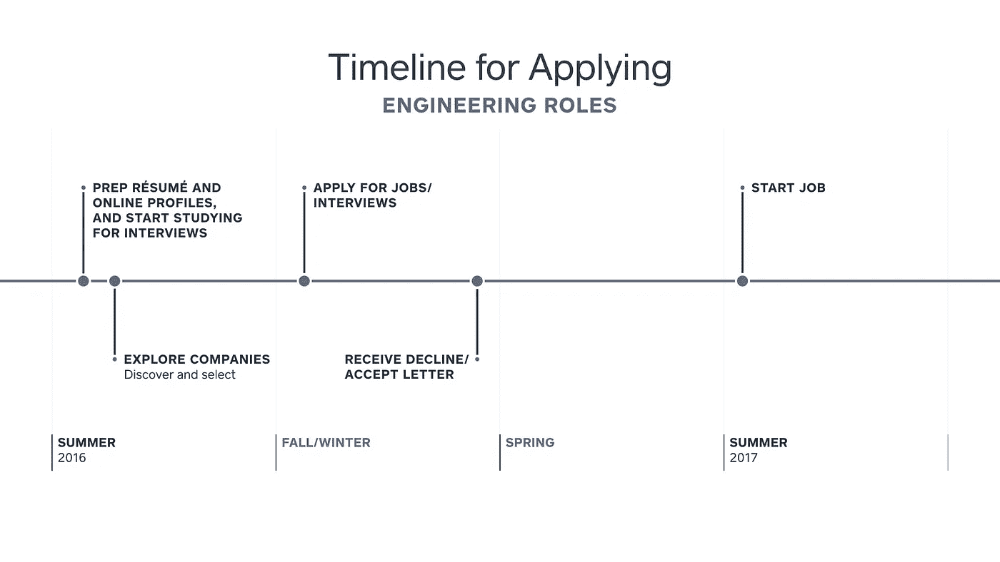

# 来自内部人士的建议:获得你梦想中的工程工作

> 原文：<https://medium.com/square-corner-blog/advice-from-the-insider-landing-your-dream-engineering-job-f90ba6475c89?source=collection_archive---------2----------------------->

这篇博文源于 Alyssa Pohahau 在巴纳德学院的一次演讲。

> 注意，我们已经行动了！如果您想继续了解 Square 的最新技术内容，请访问我们在 https://developer.squareup.com/blog[的新家](https://developer.squareup.com/blog)

当谈到获得全职工程师职位时，竞争非常激烈已经不是什么秘密了。也就是说，如果加入一个创新的、前沿的、思想敏锐的团体让你心动，那么一点点准备和决心将会让你在通往梦想角色的道路上受益匪浅。

在 Square，我们相信简单的艺术。本指南将把看似令人生畏的求职过程分解成四个简单的步骤。好奇吗？让我们开始吧。

1.  **了解你的时间线**

根据你要找的角色，申请时间表会有所不同，所以首先要做的是:熟悉关键日期，提前计划。给自己足够的时间及时准备所有相关的材料。

下面，您将找到一个工程应用时间表示例。具体的年份并不重要；重要的是，对于计划在夏天开始的工程职位(例如 2017 年夏天)，你的申请过程应该提前一年开始(例如 2016 年夏天)。

**2。策划**

一旦你确定了最适合你求职的时间表，你就准备好进入正题，策划你的职业形象了。是时候修改你的简历、求职信和网上形象了，以适应你所寻找的角色和公司。

一些快速提示:

*   磨砺你的简历:包括班级项目、在线作品集或网站的链接、领导角色和实习经历。
*   *在线展示是关键*:把 LinkedIn 和 GitHub 页面想象成一个扩展——而不仅仅是重复——你简历上列出的技能、项目和成就的机会。
*   *熟能生巧:*当你润色你的纸质和网络形象时，不要忽视面试准备和学习。

**3。探索**

下一步:探索和发现你想为之工作的公司。

*   从你每天访问的网站和应用程序开始，或者从你看到你的朋友和家人使用的网站和应用程序开始。
*   你的朋友在哪里工作？他们的朋友呢？开始提问和对话。你会惊讶地发现，在一家公司里，你只需要很少的关系就能找到某个人。
*   参加那些对你的行业特别感兴趣的人的聚会。例如，从事工程的女性可以查看[写代码的女性](https://www.womenwhocode.com/)、[写代码的女性](http://www.womenwhogo.org/)、[写代码的女性](http://railsgirls.com/)或[写代码的女性](http://www.pyladies.com/)。
*   查看你感兴趣的公司的探索性或介绍性项目，以及开放参观、新兵训练营和公司赞助的黑客之夜。比如 Square，给高中生和大学生上[码营](https://squareup.com/code-camp)。
*   参加相关会议，如[格蕾丝·赫柏庆典](http://ghc.anitaborg.org/)、 [PyCon](https://us.pycon.org/2017/sponsors/why-sponsor/) 、 [RubyConf](http://rubyconf.org/) 、 [WWDC](https://developer.apple.com/wwdc/) 、DroidCon、 [AfroTech](http://www.afrotechconference.com/) 或[Barnard Women in Tech Conference](https://barnard.edu/student-services/career-development/students/tech-conference-career-fair)。
*   参加黑客马拉松，例如[全国公民黑客日](https://www.codeforamerica.org/events/national-day-2016)、 [TechCrunch Disrupt](https://techcrunch.com/event-type/disrupt/) ，或者你当地的学校黑客马拉松。

**4。决定**

有了在第三步中获得的知识，是时候通过权衡手头的各种选择并对最重要的事情进行排序来做出明智的决定了。

有多个重要因素值得考虑。花时间优先考虑和评估你愿意在哪些方面做出妥协，比如:

*   位置
*   大小
*   师徒制
*   内部团体
*   影响
*   代表团
*   人
*   全职员工还会考虑:
*   补偿
*   利益

如果可能的话，联系公司里的某个人，不管是朋友、熟人还是校友，让他们知道你在申请那里的一个职位。大多数公司都有内部提交流程，现有员工可以推荐某个职位的候选人。通过电子邮件、Twitter 或 LinkedIn 联系他们，告诉他们你正在找工作，询问是否可以在面试过程中保持联系。

现在，摆脱应用程序焦虑，一头扎进去。统计数据显示，平均而言，男性仅在符合 60%的资格条件时申请工作，而女性则等待申请符合 100%资格条件的工作。尝试绝对不会有什么损失。

你已经仔细阅读，计划，润色，准备。去申请吧。

我们提到过[我们正在招聘](https://squareup.com/careers)吗？