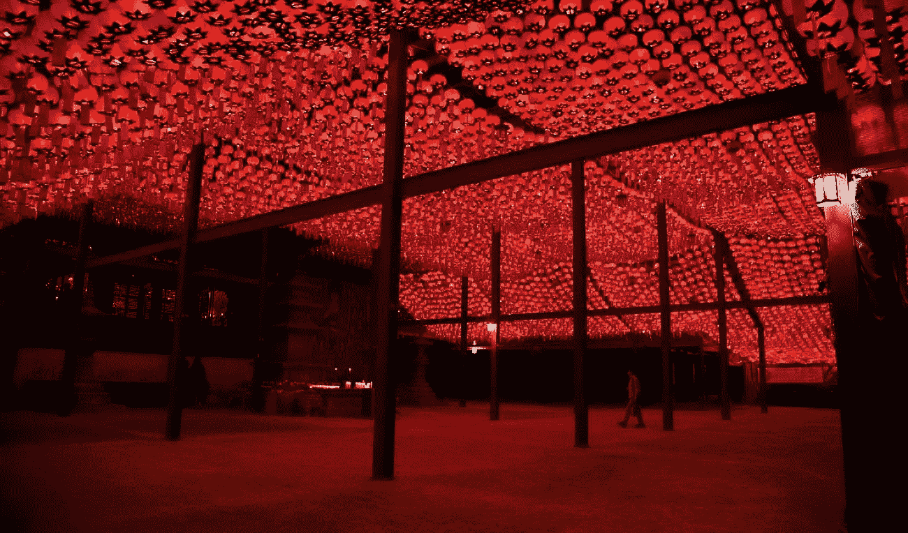
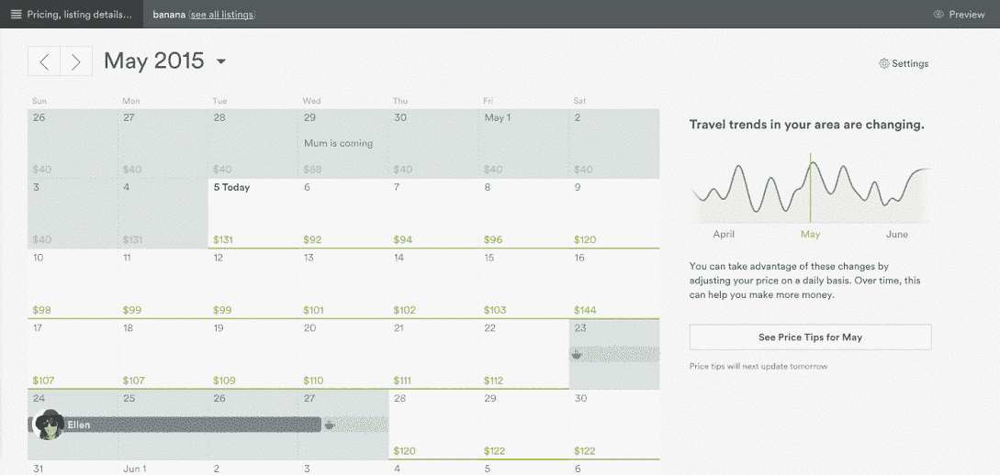
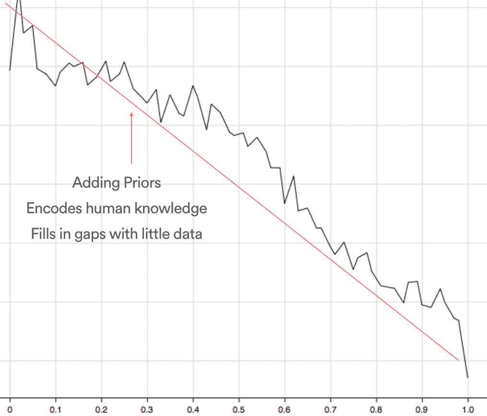
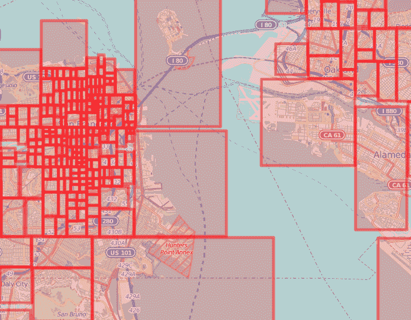
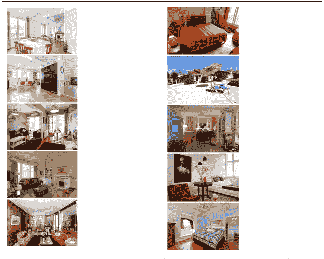
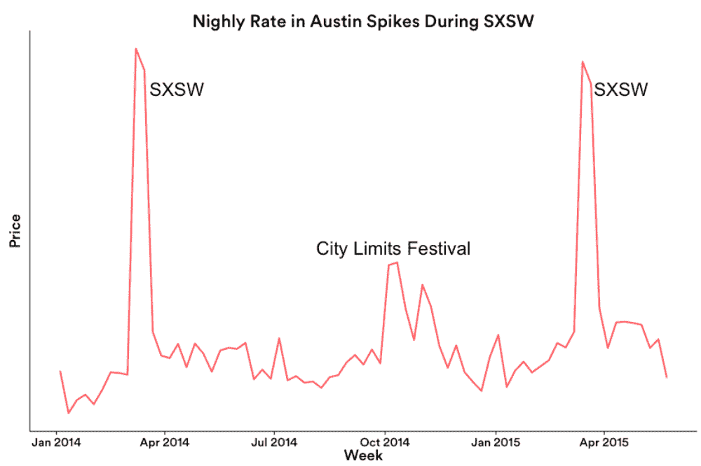
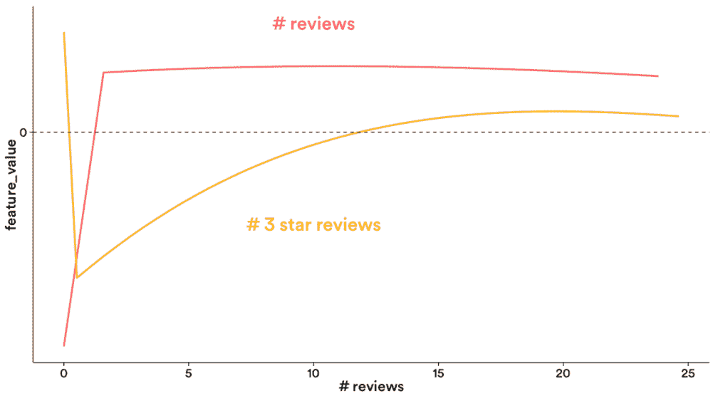
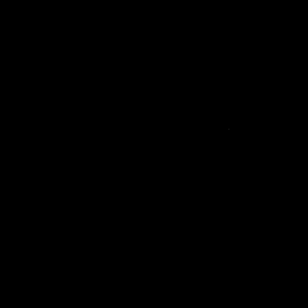

# Aerosolve:人类的机器学习

> 原文：<https://medium.com/airbnb-engineering/aerosolve-machine-learning-for-humans-55efcf602665?source=collection_archive---------1----------------------->

由[赫绮](https://twitter.com/eigenhector)和[巴夫拉赫](https://twitter.com/bifrach)

你有没有想过 Airbnb 对主机的价格提示是如何运作的？

在这个[动态定价](http://en.wikipedia.org/wiki/Dynamic_pricing)功能中，我们向主机显示获得预订的概率(绿色表示机会较高，红色表示机会较低)，或者预测的需求，并允许他们通过点击一个按钮轻松地动态定价他们的列表。

许多特征用于预测对列表的需求，其中包括季节性、列表的独特特征和价格。这些特征以复杂的方式相互作用，并可能导致难以解释的机器学习模型。因此，我们着手构建一个包来产生机器学习模型，以促进解释和理解。这对我们，开发者，也对我们的用户是有用的；这些解释对应于我们向主人提供的解释，即为什么他们面临的需求可能比他们预期的要高或低。

介绍 Aerosolve:为人类构建的机器学习包。

我们一直坚信，让人类以共生的方式与机器合作，超越了人类或机器单独的能力。

从项目开始，我们就致力于通过帮助人们用易于理解的模型解释复杂的数据来提高对数据集的理解。Aerosolve 模型不是将意义隐藏在模型复杂性的许多层之下，而是将数据暴露在理解之光之下。

例如，我们可以很容易地通过检查下图来确定市场中某个列表的价格与该列表的需求之间的负相关性。我们没有通过非线性变换的许多深层隐藏层传递特征，而是将模型做得非常宽，使用[加法函数](http://en.wikipedia.org/wiki/Generalized_additive_model)对每个变量或变量组合进行显式建模。这使得模型易于解释，同时仍然保持大量的学习能力。

**Figure 1.** *Plot of model weight vs price percentile in market.*

红线编码的是看数据前的普遍信念，或者说先验。在这种情况下，我们通常认为需求会随着价格的上涨而减少。在训练期间，我们能够通过将它们添加到一个简单的文本配置文件中来告知模型我们在 Aerosolve 中的先前信念。黑色曲线是模型从数十亿个数据点学习后的信念。它可以用实际的市场数据来修正使用模型的人的任何假设，同时允许人们反馈他们对某个变量的最初信念。

我们还非常小心地为世界各地的独特社区建模，通过创建算法来根据 Airbnb 房源的位置自动生成本地社区。这些与手工制作的[邻近多边形](http://nerds.airbnb.com/mapping-world/)有两个不同之处。首先，它们是自动生成的，因此我们能够为刚刚打开的[新市场快速构建这些。其次，它们是以分层的方式构建的，因此我们能够以可扩展的方式快速积累点状(例如列表视图)或多边形(例如搜索框)的统计数据。](http://blog.airbnb.com/cuba/)

这种层次结构也让我们可以从父邻域中借用统计优势，因为它们完全包含子邻域。这些 Kd 树构造的邻域对用户不可见，但是用于计算机器学习模型的局部特征。在下图中，我们展示了 Kd 树结构自动创建本地邻域的能力。请注意，我们在通知算法它不应该穿过大型水体时非常小心。即使是金银岛也有自己的邻居。为了避免沿邻域边界的突然变化，我们注意以多尺度方式平滑邻域信息。你可以在 Github 上的 Aerosolve 的[图像印象主义演示中读到更多，并直观地看到这种平滑。](https://github.com/airbnb/aerosolve/tree/master/demo/image_impressionism)

**Figure 2.** *Automatically generated local neighborhoods for San Francisco*

因为每个列表都有其独特的方式，我们在 Aerosolve 中构建了图像分析算法，以说明主人在装饰他们的家园时投入的细节和爱心。我们根据两种训练数据来训练 Aerosolve 模型。在左边，我们根据专业摄影师给出的分数训练了模型，在右边，我们根据有机预订训练了模型。专业摄影师倾向于喜欢装饰华丽、灯光明亮的客厅，而客人似乎更喜欢暖色和舒适的卧室。

**Figure 3.** *Learning to rank images. On the left, image ordering trained from professional photographer ratings. On the right, image ordering trained from organic books, clicks and impressions.*

在计算需求时，我们会考虑许多其他因素，其中一些包括本地事件。例如，在下图中，我们可以发现在 SXSW 节日期间奥斯汀住宿需求的增加，也许可以要求主人考虑在高需求期间开放他们的住所。

**Figure 4.** *Seasonal demand for Austin*

一些特征，比如季节性需求，自然会出现峰值。其他特征，比如评论的数量，通常不应该表现出同样的尖锐性。我们使用三次多项式样条平滑这些更平滑的特征，同时使用 Dirac delta 函数保留端点尖峰。例如，在评论数量和 3 星(满分 5 星)之间的关系中，没有评论和有评论之间有很大的不连续性。

**Figure 5.** *Smoothing features using polynomial splines*

最后，在所有的功能转换和平滑之后，所有这些数据被组装到一个具有成千上万个交互参数的定价模型中，以便为主机提供一个仪表板，通知他们自己以给定价格获得预订的可能性。

请在 Github 上查看 [Aerosolve。有一些](https://github.com/airbnb/aerosolve)[演示](https://github.com/airbnb/aerosolve/tree/master/demo)你可以找到如何应用 Aerosolve 为你自己建模，例如教算法如何在点画风格的绘画。还有一个基于美国人口普查数据的收入预测演示，你也可以看看。

**Figure 6.** *Aerosolve learning to paint pointilism style*

## 在 [airbnb.io](http://airbnb.io) 查看我们所有的开源项目，并在 Twitter 上关注我们:[@ Airbnb eng](https://twitter.com/AirbnbEng)+[@ Airbnb data](https://twitter.com/AirbnbData)

*原载于 2015 年 6 月 4 日 nerds.airbnb.com***。**