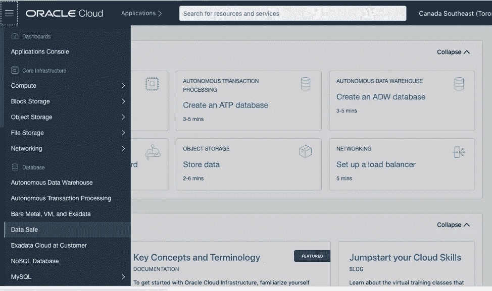
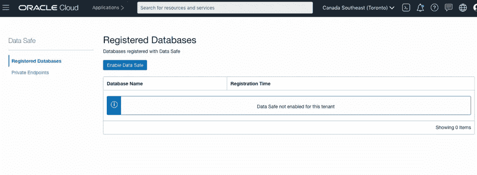
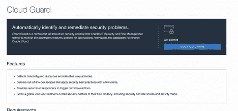
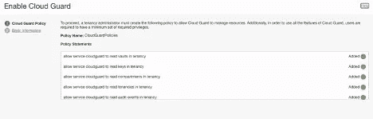
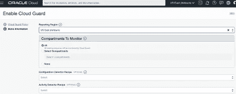
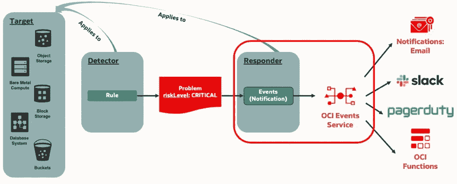

# 迁移后—免费的安全工具

> 原文：<https://medium.com/oracledevs/after-a-migration-security-tools-at-no-additional-cost-9e930cd560cf?source=collection_archive---------6----------------------->

Oracle 数据安全和 Oracle 云卫士

完成从 Oracle Cloud Classic 或其他平台的迁移后，考虑启用作为该环境的一部分提供的安全工具 Oracle Cloud Infrastructure (OCI ),以保持强大的安全态势。这些安全工具将识别风险并建议配置来保护您的云租赁。好消息是，这两个工具都在租用级别启用，并且随时可以使用。这是在迁移后启用这些工具的一个简单步骤。Oracle Data Safe 针对数据库安全性，使用数据库中的审计数据将数据库上执行的配置和操作与安全标准和法规进行比较。一旦在租赁中启用，就需要在 Oracle Data Safe 中注册数据库。“数据安全”收集由数据库审核的访问和操作。Data Safe 中的另一个功能是数据发现，以及针对测试和开发环境的屏蔽选项数据库列。

进入租赁状态后，从页面左上角的菜单中选择数据安全。

Dashboard Menu with Data Safe

这将带您到数据保险箱下的注册数据库。对于租赁，此任务只需完成一次。您会注意到该租户没有启用数据安全。

您将看到“启用数据安全”按钮。单击开始启用数据安全。如果变灰，则表示已经启用。

启用数据安全后，您将看到“没有注册数据库”

现在，您可以注册数据库以用于数据安全。注册数据库后，执行数据库安全评估。这是开始使用该工具来验证环境中数据库安全性的最佳方式。[查看其他实验室，了解有关数据安全的更多信息。](https://apexapps.oracle.com/pls/apex/dbpm/r/livelabs/view-workshop?p180_id=598)

Oracle Cloud Guard 可以监控并与其他安全解决方案配合使用，以管理风险并在 OCI 提供安全配置。Oracle managed recipes 有一个标准化的实现，它是一组针对检测器和响应器的规则。Oracle Cloud Guard 在租用级别实施，允许指定的角色和用户组管理来自部分(即特定隔离专区)的捕获。默认情况下，新添加的隔离专区也将包括在安全管理中。当然，这也是使用 OCI 现有安全工具的原因之一，因为随着使用量的增加，可以实现更多的服务。最好开始用检测器收集细节，并设置响应器只通知问题。

以下是如何开始使用云卫士:

[Oracle Cloud Guard 文档](https://docs.oracle.com/en-us/iaas/cloud-guard/using/part-start.htm)提供了如何在环境中启用。

在租赁中启用后，Cloud Guard 具有检测器和响应器，不仅可以执行检查和识别潜在的安全问题，还具有可以对这些问题采取行动的响应器。当最初为租户配置 Cloud Guard 时，还需要设置检测器和响应器，以使用受管或自定义配方。

甲骨文和 OCI 提供一套强大的开箱即用检测器，通过利用其识别风险和安全问题的集体专业知识来识别风险或安全问题。下一步是计划出需要由响应者执行的行动。在开始使用 Oracle Cloud 时，将响应者设置为在设置自动操作之前通知和捕获报告是有意义的。

检测器适用于 OCI 环境中的目标，响应器是事件，即通知和补救。每个都可以启用，并且应该仔细选择响应器中的事件以避免通知噪音，或者在补救的情况下，这是环境的预期行为。查看 cloud guard 中三个区域的示意图:目标、检测器和响应器。

受管理的检测器方法可以是配置或活动。配置将关注各种问题和配置，从过期密钥到 VCN 安全列表。Activity 捕获执行的操作，如导出映像或更改和更新网络配置。一个环境可能并不需要所有的管理方法，但是在捕捉到问题和安全顾虑之后，可以对规则和方法进行评估以用于未来的配置。关于探测器配方的列表，[查看文档。](https://docs.oracle.com/en-us/iaas/cloud-guard/using/detect-recipes.htm#detect-recipes-reference)

这些工具不会给 OCI 环境带来额外的成本。他们以多年的安全专业知识为后盾。借助 Oracle Data Safe 和 Oracle Cloud Guard 这两款工具，OCI 租户可以拥有并保持强大的安全态势。这篇博文展示了如何启用这些工具以及它们的一些特性。下一篇博文将分享更多关于安全区域的细节，这是云卫士的一个重要功能，也是如何在数据安全中使用数据库评估工具。