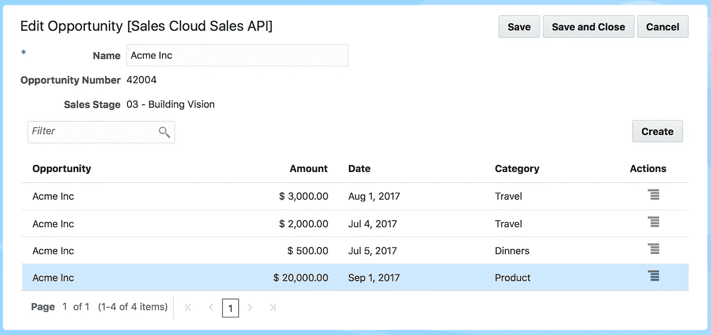
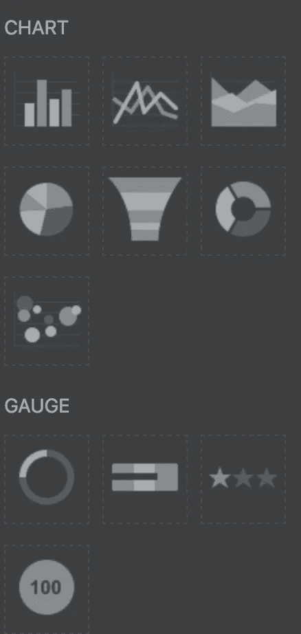
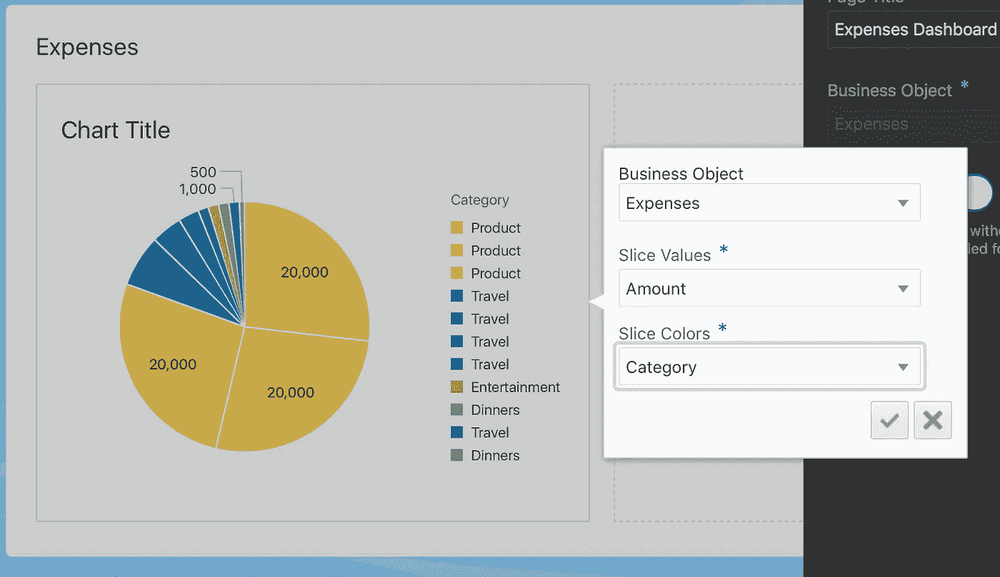
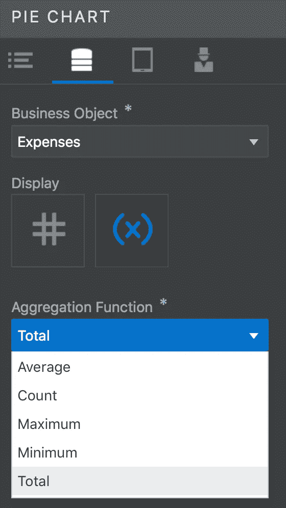
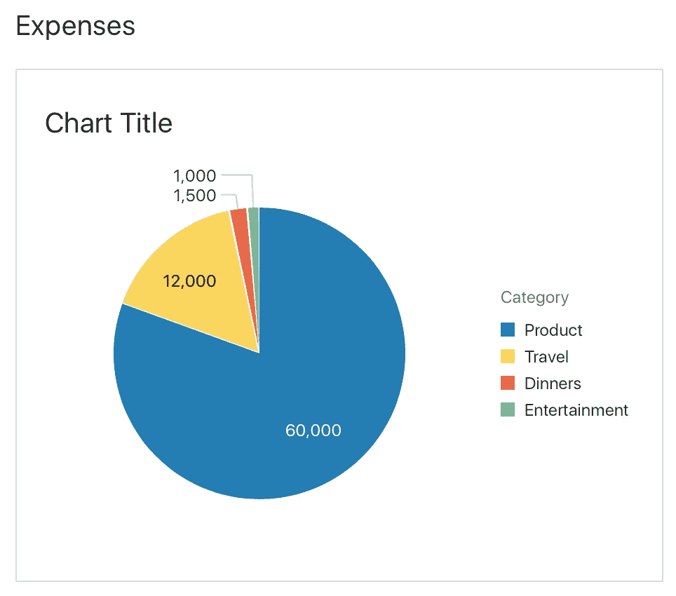
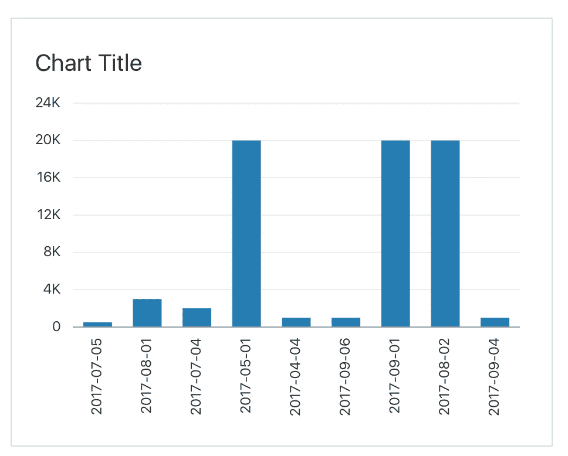
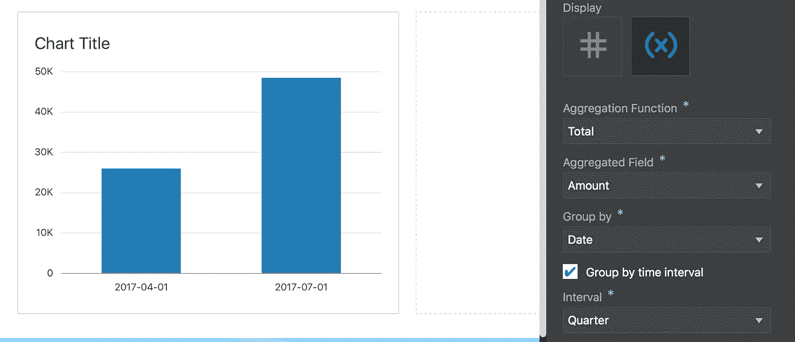

# 使用 Visual Builder 聚合图表中的数据— Oracle 云

> 原文：<https://medium.com/oracledevs/aggregating-data-on-visual-builder-charts-9ebc868c5a7d?source=collection_archive---------0----------------------->

图表是帮助用户可视化数据的好方法。然而，有时可能会有太多的信息或某些类型的信息，最终使图表过于繁忙，最终用户无法从中快速获得有用的信息。为了帮助解决这一难题，Visual Builder 月发布版提供了一种在图表中聚合数据的声明性方法。

让我们看一个具体的用例。假设我们是销售组织，需要跟踪与客户相关的费用。使用 Visual Builder，我们快速创建了一个表格格式来编辑和查看费用信息，但现在我们希望用图表来可视化。

如果有几个客户(机会)和费用，这些信息会很快变得难以处理。让我们用图表来看看可视化。Visual Builder 提供了几种图表类型:条形图、折线图、面积图、饼图、漏斗图、圆环图和气泡图。

将饼图拖放到表单上允许我选择业务对象(费用)、切片值(金额)和切片颜色(类别)。请注意，图表因为有几个条目而变得非常繁忙。

让我们看看一些聚合选项。一个显而易见的方法是合计单个类别条目，以获得类别的总和。这将提供一个类似的图表，但只有 4 个条目，每个类别一个。

另一种有趣的汇总方式是查看特定时间段内的费用。让我们用一个条形图来说明，看看显示某个日期的所有费用与汇总某个时间段(如每个季度)的费用之间的区别。

因此，总而言之，现在您可以在图表上使用几种类型的聚合；平均值、计数、最小值、最大值和总计。根据“分组依据”字段，您可以使用日期字段进一步组织数据，如按季度、月或年。