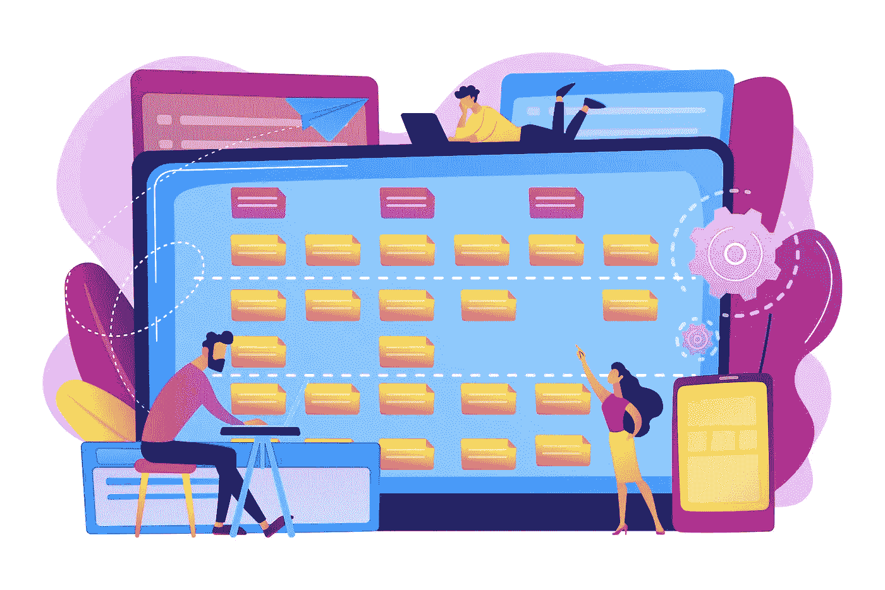
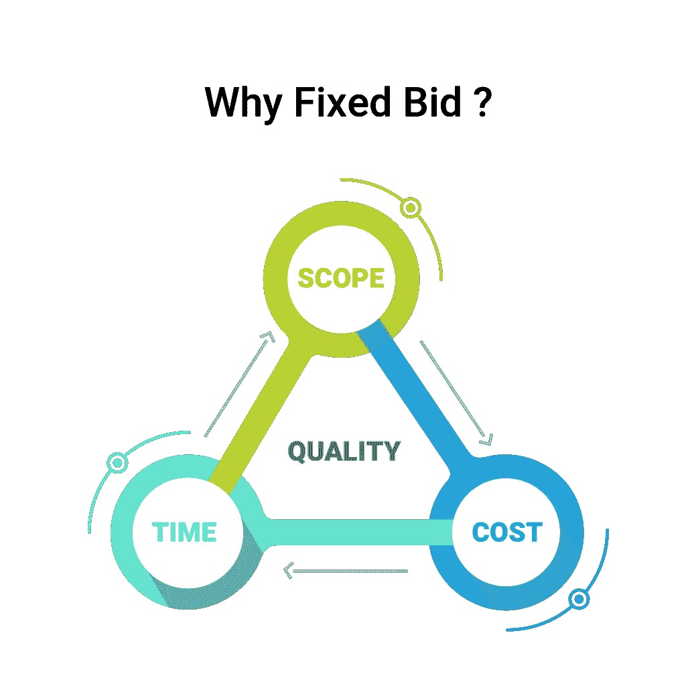
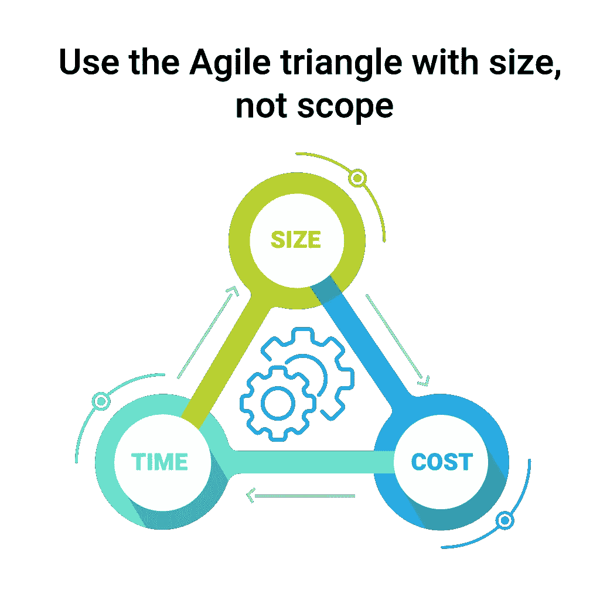
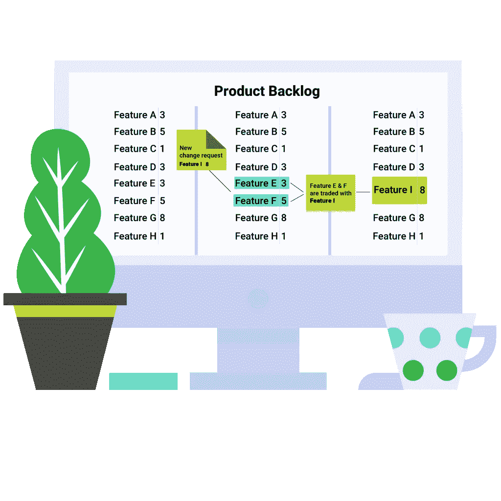

# 敏捷和固定价格项目:如何让它工作

> 原文：<https://medium.com/globant/agile-and-fixed-price-projects-how-to-make-it-work-55e84ac920a4?source=collection_archive---------0----------------------->

敏捷已经成为项目执行的一个非常流行的工具。无论是时间和材料、固定价格还是类似的项目，组织都在以越来越快的速度采用敏捷方法。

虽然敏捷对于时间和材料项目的有用性有广泛的共识，但是关于它与固定价格合同的兼容性的观点仍然引起了一些争论。

这篇博客强调了团队目前面临的困难以及他们如何应对这些挑战。让我们从探索团队为什么首先选择敏捷和固定价格项目开始。

# 为什么是敏捷？

与瀑布顺序模型相反，敏捷专注于较小但频繁的价值增量。客户和供应商一致选择它的多框架方法作为他们开发、维护和支持项目的灵活、快速和响应的方法。

# 为什么是固定价格？

固定价格合同被定义为以固定价格向客户提供服务的协议。在固定价格项目中，所有三个组成部分(成本、时间和范围)在项目开始时都是固定的。任何一个组件的变更都会不可避免地影响到其他两个组件，这就是变更控制变得至关重要的原因。在项目开始时设定的成本预计不会在产品开发阶段发生变化。

财务确定性的前景使得这种类型的合同对客户特别有吸引力。然而，领导者通常会认为固定价格意味着有保证的具体时间表和精确的工作范围。但在现实中，这种情况很少发生，特别是因为经常发生变化以更好地满足客户和市场的期望。

我们将在本博客的后面部分讨论如何使用敏捷成功地交付一个固定价格的项目。

# 误解:敏捷在固定价格的项目中不起作用

人们普遍认为敏捷不能在固定价格的项目中工作。有一种观点认为，尽管敏捷在要做的工作方面提供了灵活性(即范围变更)，但是固定价格项目已经有了所有 3 个固定的组成部分(成本、范围和时间)。不管选择的方法是什么(敏捷还是瀑布)，固定价格的项目都会带来挑战，比如新的变更、项目延迟和成本超支等等。如果他们要成功，团队将无法修复所有三个组件。相反，他们需要通过增加额外资源、缩小范围或延长时间表来增加成本，以实现他们的目标。

敏捷实际上可以成为固定价格项目的福音，因为成本和日期是固定的，但是范围是可变的。团队的责任是确保需求被正确地优先排序和组织。团队可以按照待办事项列表中的顺序交付高优先级的项目，而低优先级的项目可能永远都不会被开发。

# 敏捷固定价格项目中的挑战

敏捷也不是一种简单的方法。因此，我们需要讨论如何克服与使用敏捷相关的许多挑战。一个常见的问题是，当一个组织刚接触敏捷时，希望项目在固定的范围和成本内按时完成。项目进行到一半时，客户可能会联系开发团队，要求根据最新的市场趋势进行一些调整。固定的范围和时间表使得这些变化难以实施。此外，我们今后还可能面临其他挑战。

## 范围

*   **不明确或一句话的要求。**团队可能面临的主要挑战是固定价格项目的范围发生变化。在项目开始时，固定价格项目的要求有时不清楚或定义不明确。团队通常根据他们自己的经验和理解来确定一行程序需求的大小，这通常会被低估。当项目的后期暴露出挑战的真正复杂性时，团队通常别无选择，只能加班来弥补低估。
*   **项目进行到一半时出现了新的变化。**在大型固定价格项目中，基于当前市场趋势或新优先事项的突然变化几乎是一条经验法则。客户认为这种变化是适当的产品推出和营销的组成部分，但不希望在成本或时间表上有任何修改。面对这样的变化，项目团队通常会犹豫不决，这反过来会影响客户关系和信任。

## 属国

*   **其他内部团队和第三方供应商的所有权。**大型固定价格项目最有可能涉及多个团队，甚至可能涉及额外的第三方供应商。需要有一个框架，让所有团队都有相同的紧迫感和对各自任务的所有权。虽然他们是相互依赖的，但只要一个团队与其他团队不同步，就会立即阻碍进展。

# 客户参与

有时，客户在开发阶段不积极参与会带来挑战。他们通常有这样的印象，在项目早期的需求披露使得所有的主动参与都是不必要的。这阻碍了有效的沟通(例如解决可能的疑问和询问),并可能导致延迟。客户倾向于不太关注 sprint 审查或演示，但是在最终产品审查时，他们最终声明这不是他们想要的。这可能会导致进一步的延迟，因为团队不得不返工特性以满足期望。

# 团队和客户缺乏敏捷知识

尽管敏捷方法已经存在了近二十年，但是一些组织仍然没有意识到或者犹豫要不要采用它们。当需要在固定价格和其他类似的项目中实施敏捷时，这就带来了挑战。正如已经解释过的，没有敏捷知识的组织有时认为，一旦他们向供应商提供了固定价格合同和需求列表，他们的工作就完成了。然后，他们不仅期望项目能够按时交付，而且所有的变更请求都不会影响最终的成本。

一个没有适当敏捷知识的团队对项目的成功构成了更大的威胁。他们可能继续通过瀑布技术进行开发，而基本上完全忽略了敏捷仪式(例如 sprint 回顾和演示)。这是许多特性在项目结束时无法满足客户期望的主要原因。这反过来要求返工，团队最终加班以满足不灵活的截止日期。在大多数情况下，这将导致质量和关键特性都无法在原定的截止日期前完成。

在下一节中，我们将讨论如何应对和克服这些挑战。

# 应对敏捷固定价格项目中的挑战

# 使用灵活的三角形来衡量大小，而不是范围

传统的瀑布固定价格项目有三个固定的组成部分(范围、时间和成本)，而敏捷固定价格项目用项目的规模代替了范围。众所周知，敏捷项目通常以故事点来衡量。因此，固定规模(以故事点为单位)将有助于客户根据市场趋势改变范围，前提是新的范围不会增加整个项目的规模(以故事点为单位)。

# 贸易变化

敏捷甚至在开发的后期阶段也能促进变化。许多变化可能与市场趋势和重新优先排序有关。最佳的适应策略是与客户协商交易产品待办事项列表中的低优先级项目，这些项目的大小值等于新变更的大小值。这简化了团队接受新变更请求的过程。在这个框架中，固定的规模对于所有阶段(包括最终结果)都是有意义的，团队现在交付具有附加值的相同规模的产品。

# 初步分析阶段研讨会

固定价格项目的早期阶段总是至关重要。在这一阶段，团队与客户召开研讨会，仔细检查待办事项列表，并详细了解需求。然后，团队将要求客户为每个待定项定义验收标准。研讨会结束后，团队可以得出一个准确的规模，并对照项目合同中定义的初始规模进行核对。如果大小有偏差，团队可以与客户协商清除积压的低优先级项目。

# 使用莫斯科技术

莫斯科优先化是一种与涉众就如何管理和交付需求达成谅解的流行技术。

敏捷总是促进一个健康的产品积压——一个在故事点中对所有项目进行优先排序和大小调整的产品积压。一旦团队完成了最初的分析研讨会，他们就可以与客户一起使用莫斯科技术来对积压项目进行分类。

一般来说，基本的待办事项不应该超过整个项目规模的 60%。不重要但重要的积压项目不应超过 20%。简而言之，“必须”和“应该拥有”的项目应该占项目规模的 80%左右。因此，团队需要提前计划来完成所有待定项。如果项目执行顺利，团队应该能够提供“必须”和“应该”，并在过程中加入一些额外的“可能”。

这种技术不仅允许团队交付高价值的工作产品，还允许客户在交付高价值产品的早期创造市场价值。

# 团队协作和第三方供应商

最重要的是，所有团队对项目都有相同的紧迫感和主人翁意识。这个框架中的一个关键策略是定义频繁的里程碑，并将每个里程碑的所有权分配给不同的团队。每个团队的定期状态更新对于确定跨团队挑战的共同模式至关重要，从而允许早期的联合解决方案。如果一个团队要警告客户潜在的延迟并按时完成他们的任务，对依赖跟踪器和风险登记簿的一致审查也是必不可少的。

随着每个团队处理不同的项目，许多不同的待办事项可能会同时开始。这使得客户可以提前了解最终产品。团队还可以努力实现更好的代码可重用性:无论任何一个团队实现什么，其他团队都可以重用那些相同的组件，从而节省过程中的时间和精力。

# 与客户合作

没有每个人的持续参与，任何项目都不可能成功。即使在项目一开始就已经定义了产品待办事项，客户仍然可以探索当前的市场趋势以进行后续的待办事项更新。类似地，当客户定期参加 sprint 评审时，他们可以在项目早期向团队提供宝贵的反馈。这也可以防止后期的返工。客户也应该随时准备解决团队可能有的任何问题或疑虑。

# 敏捷团队培训

在任何项目开始时，团队接受敏捷方法的全面培训是至关重要的。这是他们改变工作方式并获得最大利益的唯一途径。通过敏捷，团队可以根据 sprint 计划工作，并且可以定期向客户交付工作产品。与传统的瀑布方法(客户直到过程的最后才能看到最终产品)形成鲜明对比的是，敏捷让团队通过让客户将产品视为正在进行的实际工作来赢得客户的信任。

# 敏捷客户培训

客户培训同样重要。与传统的瀑布方法不同，客户需要理解，如果一个项目要成功，敏捷需要他们的持续参与。他们还需要在帮助团队在 sprint 中对待办事项进行优先级排序和计划他们的工作时，掌握产品所有者角色及其工作的重要性。

# 结论

无论采用何种方法，固定价格项目总是具有挑战性。如果一个项目在敏捷中被恰当地执行，它会成为这些项目的福音，因为它们更有可能成功。

我参与过多个固定价格的项目，经历过失败和成功。在项目的所有阶段都会遇到挑战，为了克服这些挑战，我使用了上面描述的许多技术。我还得到了一个了不起的团队的帮助，他们自始至终都支持我。