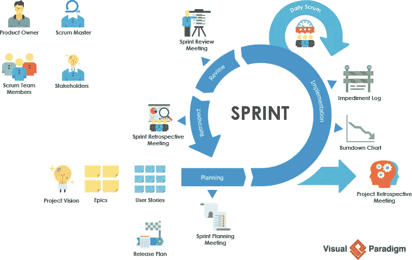
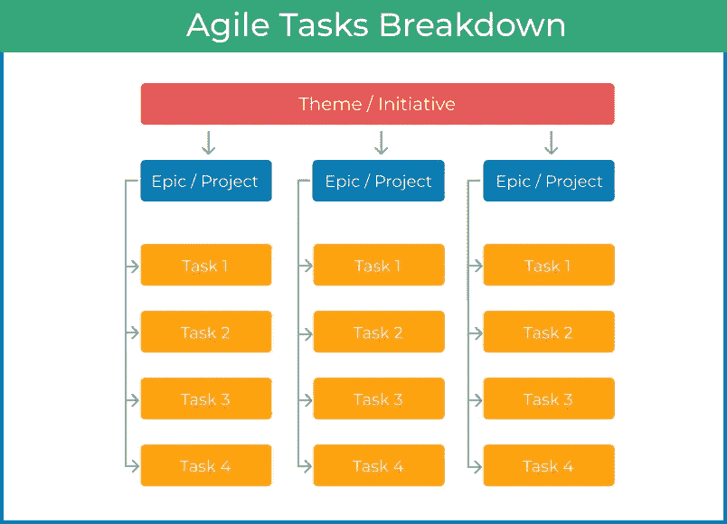

# 简而言之，敏捷

> 原文：<https://medium.com/globant/agile-components-acccfb6e8d10?source=collection_archive---------0----------------------->

(Image Ref: [https://www.visual-paradigm.com/scrum/what-is-scrum/](https://www.visual-paradigm.com/scrum/what-is-scrum/))

因为许多组织都在研究敏捷方法，所以在敏捷环境中工作时，了解这些日常实践中使用的基本术语非常重要。在敏捷方法中，跨职能的项目团队在一段固定的时间内一起工作，或者“冲刺”，来完成最终目标需要完成的任务。下面是敏捷方法的每一部分的含义。

事不宜迟，我们开始吧。

**冲刺**

Sprint Flow

*   sprint 是一个持续时间不超过一个月的时间盒，团队在这个时间盒内生产一个潜在的可发布产品
*   固定冲刺的核心好处是整个团队保持专注于几个优先目标，而不是试图理解系统的每一个细节

**用户故事**

User Story Representation

*   用户故事是从最终用户的角度对软件特性的非正式和一般性的解释

**史诗**

(Image Ref: [https://kanbanize.com/agile/project-management/tasks-epics-initiatives-themes](https://kanbanize.com/agile/project-management/tasks-epics-initiatives-themes))

*   敏捷史诗是一个大的工作系列，可以被分解成更小的、更有针对性的任务，有时被称为用户故事

**特性**

Feature List

*   在敏捷开发中，特性是交付商业价值的功能块
*   它描述了一个需求的具体解决方案，并再次交付一个或多个故事
*   随着客户、测试人员和开发人员一起工作，sprint 的特性变得更加详细

**产品积压**

“产品待办事项列表是一个团队为了实现特定结果而可能交付的新功能、对现有功能的更改、错误修复、基础架构更改或其他活动的列表。”

*-由敏捷联盟*

**站立会议**

*   每日站立是一个有时间限制的事件，每天在团队开会的同一时间和地点发生，以便让每个人都了解对协调至关重要的信息
*   该会议通常有时间限制，最长持续时间为 15 分钟，但对于大型团队，这可能需要调整

**冲刺复习**

在每个 sprint 结束时，scrums 们聚在一起向他们产品的用户展示他们的工作，并可能展示功能。这可能是指公司里的其他人或实际客户。

**冲刺回顾**

在 Sprint 回顾之后，团队将再次会面，就他们认为在 Sprint 中进展顺利的地方、他们可以改进的地方以及需要在下一次 Sprint 中执行的任务(如果有的话)进行对话。

**敏捷板**

*   敏捷板是软件项目进展的可视化表示。它帮助您和您的团队跟踪项目的进展，并确保透明度
*   公告板分为几栏，如待办事项、进行中、完成
*   每列中的卡片反映了任务的当前状态

**敏捷团队**

敏捷团队中的四个重要角色包括:

1.  **产品负责人**

*   产品所有者对产品有一个愿景，他/她有责任将产品的价值最大化
*   定义每个冲刺或迭代的目标
*   管理和优先处理产品积压
*   需要优秀的沟通技巧

**2。Scrum 大师或团队领导**

scrum 大师/团队领导扮演着教练、促进者、导师和老师的角色

对…负责

*   促进团队和要求的事件
*   获取团队所需的资源
*   免受阻碍和障碍

**3。团队成员**

*   自我组织和跨职能的团队，从事开发和测试产品的实践工作
*   团队成员接受任务，独立并协作地完成任务
*   按照产品负责人提供的要求，在 scrum masters 的协调下，执行工作冲刺

**4。利益相关方**

*   利益相关者不直接参与产品开发过程
*   这里的角色可以是业务主管、生产支持人员、投资者、外部审计师、项目或投资组合经理或维护专业人员
*   来自涉众的输入是将项目进展引向不同方向的关键

**敏捷指标**

使用度量标准，您可以测量开发过程，测量生产率，工作质量，团队的可预测性和健康，以及正在开发的产品。

**冲刺烧毁**

(Image Ref: [https://community.atlassian.com/t5/Jira-questions/Burn-Down-Chart-Not-Showing-Progress/qaq-p/734904](https://community.atlassian.com/t5/Jira-questions/Burn-Down-Chart-Not-Showing-Progress/qaq-p/734904))

*   Sprint burndown 图表是一种图形方式，显示 Sprint 中还有多少工作，通常以任务小时数表示。
*   时间和需要完成的工作是衡量的两个主要参数

**速度**

(Image Ref: [https://confluence.atlassian.com/jirasoftwareserver085/velocity-chart-981156731.html](https://confluence.atlassian.com/jirasoftwareserver085/velocity-chart-981156731.html))

*   Velocity 是一种非常简单、强大的方法，可以精确地度量 scrum 开发团队持续交付商业价值的速度
*   速度是强大的，因为它是一个结果度量
*   它不是衡量有效性、效率、能力或其他任何东西的标准
*   它仅仅是给定数量的问题陈述被转化为测试软件的速率的度量。

**提前期和周期时间:**

Lead and Cycle Time

*   交付周期向您显示了从故事进入系统的那一刻起，在积压中，直到它作为 sprint 的一部分或与客户相关的部分完成的总时间
*   为每个流程提供精确的端到端时间计算
*   周期时间衡量任务从“开始”或“进行中”到“完成”的时间
*   这是一个非常简单的指标，当 sprints 中的项目没有进展时，它可以提醒团队。

**累积流量图**

(Image Ref: [https://kanbanize.com/kanban-resources/kanban-analytics/cumulative-flow-diagram](https://kanbanize.com/kanban-resources/kanban-analytics/cumulative-flow-diagram))

*   这是一个看板度量，它显示了任务的状态——在一个冲刺、一个发布或者跨软件团队
*   提供瓶颈的清晰可视化表示
*   这一指标的强大之处在于其直观的简单性。你可以抓住一个立即识别的问题

**控制图**

(Image Ref: [https://www.atlassian.com/blog/jira-software/6-key-ways-optimize-development-control-chart](https://www.atlassian.com/blog/jira-software/6-key-ways-optimize-development-control-chart))

*   控制图关注任务从“进行中”到“完成”状态的持续时间
*   这是改进团队流程的有效而灵活的方法，因为如果有任何变化，你可以立即看出结果，并立即做出进一步的调整

**吞吐量**

(Image Ref: [https://getnave.com/throughput-run-chart-for-jira](https://getnave.com/throughput-run-chart-for-jira))

*   吞吐量通常指的是对迭代故事点的度量，并用于度量每个单位时间内进行的平均任务
*   您了解工作流对业务绩效的影响，并且可以更好地了解您的团队的能力

**Scrum 生产力工具**

今天市场上有各种各样的 scrum 生产力工具。每一个都旨在帮助产品开发团队高效准确地遵循 scrum/sprint 方法。

流行的 scrum 工具包括:

*   吉拉
*   nTask
*   快速巡航
*   斯库姆多
*   Scrumwise
*   生动活泼的 Scrum

所以在结束之前，我想给你一个开发 ToDo 应用程序的例子。假设你正在做一个项目，有一个由 scrum master、iOS 开发人员、Android 开发人员和 QA 团队组成的团队。因此，项目从以下阶段开始

*   **要求**

**用户故事**:创建一个 ToDo App，可以创建、编辑、删除用户的任务。

在这个阶段，所有的故事需求都来自于最终用户或者涉众。

*   **设计**

设计团队开始针对给定的需求进行设计，并在设计就绪后获得项目干系人的批准。设计师可能会建议多个选项，最终确定其中一个用于开发。

*   **发展**

一旦设计完成，在 sprint 规划会议上，所有的故事及其故事点都将被考虑进行开发，这取决于 sprint 的范围和可用的资源。

这个给定的用户故事被分成多个故事，如果需要，故事可以被分成多个子任务。

例如

**故事 1** :任务列表屏
**故事 2** :创建任务屏
**故事 3** :更新或删除现有任务
**故事 4** :编写任务列表屏
**测试用例故事 5** :编写创建任务屏
**故事 6** :编写更新或删除现有任务测试用例

如果个人愿意，上述故事可以分成子任务

例如，一个人可以将故事 3 设计成以下子任务:
**子任务 1** :在点击任务
**时显示编辑/删除任务的用户选项子任务 2** :处理编辑任务设计并将任务保存在数据库中
**子任务 3** :从数据库中删除任务并在 UI 上显示更新的结果
**子任务 4** :在编辑任务时添加文本字段验证

根据故事的复杂性，故事点被赋予它。

在这个阶段，开发人员开始处理故事或子任务，QA 团队开始为这些故事编写测试用例。

*   **测试**

一旦该功能被开发出来，它将被发送到 QA 团队进行测试。QA 团队验证产品是否满足所有的故事需求。如果他们发现缺少任何需求，他们会重新打开故事，并将其分配给各自的开发人员。如果 QA 人员看到了错误，他会在 JIRA 上创建一个新的错误。

*   **维护**

开发人员负责重新开放的故事或新添加的 bug，在修复它们之后，他们向 QA 交付新产品。

如果 QA 团队批准，则该产品将在实际环境中发布。

在这些阶段，scrum master 负责跟踪故事的进展。每天团队都有 scrum 会议，在会议中，团队成员讨论故事进展，如果他们有任何障碍，或者有时他们需要对开发过程中出现的一些场景进行批准。如果任何这样的场景出现在 sprint 范围影响的情况下，如果你希望 sprint 范围不影响，那么新的故事将在未来的 sprint 中创建。

在 sprint 结束时，scrum master 又开了一次会议，叫做 sprint 回顾会。在这次会议中，讨论了哪些事情进展顺利，哪些事情需要改进。当他们有任何用户故事要处理时，这就是敏捷的工作方式。

**包装**

Scrum sprints 比瀑布阶段更具协作性和适应性，因为 sprint 将软件特性和需求分解成在短时间内处理的迭代。通过频繁的测试、即时的反馈、每日的会议、持续的输入以及对最终用户故事和需求的考虑，sprints 产生了具有极其相关特性的产品。

所以，如果你觉得这个故事有帮助，请给我一些掌声👏。快乐阅读！！