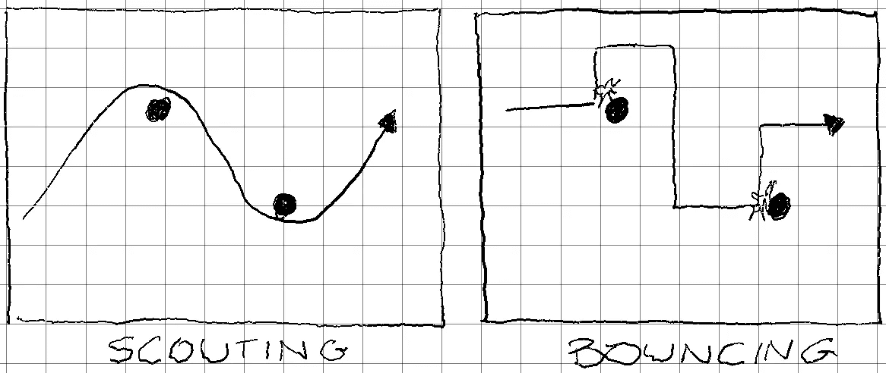

# 敏捷并不意味着非结构化

> 原文：<https://medium.com/capital-one-tech/agile-does-not-mean-unstructured-57c0d16da737?source=collection_archive---------6----------------------->

## 把牛仔开发者留在牧场

> ***敏捷并不意味着无组织，它意味着拥抱结构变化的必然性。***

这个概念在今天的开发环境中非常重要，在这个环境中，每个人都在寻找圣杯——最小化 MTTD(平均部署时间)和最大化交付的新特性的数量。

我建立分布式系统。我建造了很多*和*。我为工作而建，为副业和创业而建，甚至为业余爱好项目和书籍而建。这些癖好对我来说是否健康是另一篇博文的主题。我也已经做了很长时间了。我记得[瀑布](https://en.wikipedia.org/wiki/Waterfall_model)过程的日子，在手指碰到键盘之前，每个人都花了几个月(或者更糟)来设计、记录、详述和规划一个系统。我见过用户手册和开发者指南在任何代码被编写之前被校对和打印。

当事情进展顺利时，看起来很壮观——但事情很少进展顺利。瀑布的类比应该让人们知道它最大的弱点:一旦你开始划下急流，在到达终点之前几乎不可能离开水面。我们都经常错过最后期限，我们经常告诉我们的业务利益相关者，我们不能发布一个新的功能，直到所有的水从当前的[VI 级](https://wetplanetwhitewater.com/rafting/class-system/)激流中排出。

我们想要避开这些无情的、西西弗式的时间线，我们需要改变方向或在开发中轻松创建分叉的能力，以发布一个意想不到的补丁或功能。于是一个带大写‘A’的*gile*T12 诞生了。

敏捷哲学的核心是对不断变化的市场、消费者需求和令人眼花缭乱的快速技术创新做出敏捷反应的能力。不幸的是，我看到这个原则被称赞为一些非常糟糕的开发实践背后的原因。

我想在这篇博文中谈论的一个负面模式是敏捷工作流中固有的设计或正式架构的缺乏，以及不实现它们对开发的影响。

> 敏捷不会将你从糟糕的系统设计中解救出来。

告诉我这个场景听起来是不是很熟悉:一个有才华的开发团队被要求构建一个产品。他们有足够的需求和客户案例来开始。拥抱像*敏捷*甚至*极限编程*这样的现代概念，团队打开一些 GitHub 库，开始构建。他们每天发布站立式更新，也许他们坚持 scrum(这是*的另一篇*博客文章的主题…)，每周都有展示可衡量成就的演示。震荡式的过程修正经常发生，尽管这些挫折被诸如“我们是敏捷的！”这样的评论合理化了和“我们正在学习！”，所以没事。这都是计划的一部分…或者反计划，视情况而定。

上面的流程缺了什么？ ***一个侦察兵；一张地图，或者任何一种由严格程序确定的方向*。**

在过去的几十年里(我说过我已经这样做了一段时间)，我注意到随着正式的瀑布过程被避开，它的许多其他形式也被避开，即关键系统组件和概念的*文档*。这些被误导的团队(通常被戏称为“牛仔”)已经不再试图在我称之为 ***的侦察*** 和瀑布之间找到一个好的平衡——提前做好计划，不要让你的团队陷入困境。牛仔队只是拥抱极端。

这些“牛仔队”不是基于合理的侦察情报和一些粗略的地图或者指南针来修正航向，而是仅在它们从障碍物上反弹回来时才修正航向。就像 Roomba 在碰壁后选择新的方向一样，这些团队反弹并转向生产，很少停下来问是否有更好的方式。

我们真的想教新开发人员构建整个微服务生态系统的最佳方式是简单地打开一个 IDE 并开始编码吗？为了回答这个问题，让我们比较两个团队使用不同方法的典型路径。

一队是*球探；*用架构图、交互图、序列图和粗略的里程碑记录前进的道路，所有这些都导致团队*达成共识*。另一个团队是*弹跳—* 他们勇往直前，直到撞上一堵墙，然后运用他们从撞上那堵墙中学到的东西来修正航向。

My amazing, free-range, artisanal, hand-illustrated charts comparing “scouting” versus “bouncing”

在被误导的纯粹主义者中有一种普遍的态度，如果你花时间停下来画一个你的系统的图，或者你停下来标记一个系统如何交互的序列图，那么你是在浪费时间；你不够灵活。这种视角忽略了更大的图景。

在我对软件开发中的*侦察*形成任何定义之前，我在一些团队中开始画图表和写文档，因为我觉得有必要。在每个关键点，我会画出我认为我们要去的地方的愿景，并与团队进行交流。这不仅迫使我们达成共识，同意无处不在的语言，而且简单的绘制我们正在构建的东西的行为几乎总是迫使我们面对设计的延迟方面，从而导致调整——为了使我们的旅程绕过障碍而进行的航向修正。我们不需要牺牲任何灵活性来实现这一点。

分布式系统是复杂的 T2。基于微服务的系统有成百上千的移动部件。您必须处理身份验证、入口和出口、服务间通信和服务内通信，以及可观察性和弹性……此类问题不胜枚举。在如此深刻而复杂的环境中，我们应该盲目地在黑暗中摸索，直到我们通过运气和意外收获最终实现生产吗？

我并不提倡瀑布，也不认为对我们的最终状态架构有一个永久固定的看法是现实的。我提倡一种敏捷实践，在这种实践中，我们定期绘制我们将要构建的东西，就该绘制达成一致，并开始朝着它构建——s*couting*刚好足够向前移动。假设文档是流动的*将有助于这种实践，并鼓励我们使记录系统的行为变得愉快。*

*真正的*敏捷方法意味着接受基于新信息对这些工件不可避免的改变；尖峰、原型和新技术的结果。但是没有真正的路点而盲目建造是没有意义的。也许更重要的是，仅仅是让人们在图表上达成共识的行为就会产生*难以置信的*有意义的问题，并且通常会给你更多关于你的系统的洞察力，这比你通过找出障碍所能收集到的还要多。这种共识往往比绘画本身更有益。**

*因此，总之，向前迈进，保持敏捷——但首先要探路。*

*把牛仔们留在牧场。*

## *相关:*

*   *[在敏捷世界中积累经验](/capital-one-tech/building-experiences-in-an-agile-world-d949c63dcd5e)*

**以上观点为作者个人观点。除非本帖中另有说明，否则 Capital One 不隶属于所提及的任何公司，也不被其认可。使用或展示的所有商标和其他知识产权都是其各自所有者的所有权。本文为 2019 首都一。**