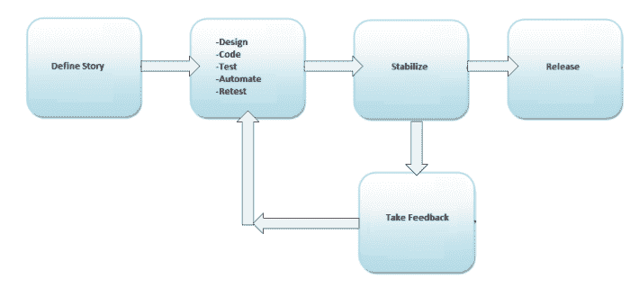
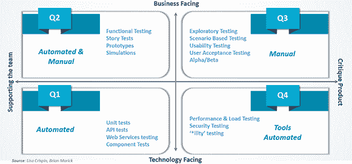

# 敏捷测试及其本质！！

> 原文：<https://medium.com/globant/agile-testing-and-its-nitty-gritty-42347c50a535?source=collection_archive---------0----------------------->

敏捷测试是一种新时代的方法。跨不同 pod 的所有交付团队都专注于灵活和持续的测试，而不是像古老的传统 SDLC 那样只在周期结束时测试一次，然而它交付的是高质量的产品。随着我们构建越来越复杂的软件，开发过程也变得越来越复杂。因此，软件测试方法需要发展，以跟上开发方法的复杂性。

有了这种需求，敏捷测试方法需要开发人员和测试人员之间更高层次的合作。在软件开发周期中，测试人员必须为测试和开发方法之间的持续集成提供准确、正确和建设性的反馈。

这个博客讨论了敏捷开发和测试的基础，敏捷软件交付的好处和重要性。

# 敏捷测试方法

敏捷测试是遵循敏捷开发的质量标准、规范和规则的软件测试。

与瀑布方法不同，在瀑布方法中，我们遵循传统的生命周期，每个下一个阶段都是在 SDLC 的前一个阶段完成后开始的，这在整个开发和交付工作代码的过程中产生了依赖性并增加了延迟。但是在敏捷测试中，测试团队从项目本身开始就参与其中，开发和测试是齐头并进的，因为敏捷测试方法是一个不断发展的过程，而不是像传统模型那样按顺序进行。

敏捷测试包括测试的增量方法。在这种类型的软件测试中，特性是在开发周期中开发出来的，以达到高质量的产品。

# 敏捷测试原则

让我们看看驱动敏捷测试过程的一些原则，如下所列。这些原则已经被证明对软件开发总是有效的，并且与传统的模型相比，独特地确定了敏捷测试的优势:

*   **持续测试**:敏捷测试团队持续测试，以确保持续的产品进展，并确保反馈得到整理，并与 N+1 方法相结合。

在敏捷模型中，当我们在 sprint 定义的时间线/窗口内工作时，sprint 的范围对整个 scrum 团队来说是清楚的，所以测试团队可以在每个 sprint 中关注已确定的 Sprint 项目。这就是连续测试如何在每个 sprint 中发生，以产生迭代代码作为 sprint 可交付成果。在这样做的时候，单个团队有时可以考虑在回归测试周期之间进行覆盖先前交付的代码，并确保他们建立稳定性。从长远来看，这些稳定性检查有助于避免单独的稳定性冲刺窗口。

*   **持续迭代反馈**:由于敏捷是一个持续的过程，敏捷测试在持续的基础上提供反馈，确保被测系统满足业务需求。

作为每个 sprint 评审的一部分，它始终有助于在生命周期的早期从所有涉众那里收集关于已开发代码的反馈，并且新的建议/修正可以根据业务优先级合并到当前或即将到来的迭代中。

*   **测试运行是团队独立的**:在传统的 SDLC 中，只有 QA 团队负责测试，但在敏捷测试中，它不局限于一个团队，并行测试也由开发人员、业务分析师、产品所有者、UAT/阿尔法/贝塔阶段的客户执行。因此，它增加了不同的角度来测试应用程序，并产生更好的质量。
*   **减少反馈响应的时间**:由于业务团队参与到敏捷测试的每个迭代中&持续的反馈缩短了反馈响应的时间。目标是获得积极和消极的反馈，这些反馈可以立即整合到流程中。尽快这样做可以加速和改进整个开发过程。
*   **简化的&干净的代码**:敏捷测试团队提出的大多数缺陷都在同一次迭代中得到修复。它有助于保持代码的整洁、简化和可追溯性。单元测试和组件测试是用来衡量代码质量的。
*   最少的文档:敏捷团队使用可重用的清单，团队关注测试而不是附带的细节。需求详细描述发生在 backlog 整理阶段，这在后来有助于计划交付。敏捷开发方法期望团队记录他们需要的所有东西，并在必要时尽可能简单可行地维护文档。不同的矩阵，如冲刺能力、燃尽图、速度，通常是用来衡量冲刺目标的。此外，不同的项目管理和测试管理工具有助于获得史诗、相关故事及其工件的可追溯性，因此不需要维护单独的文档。
*   **测试驱动**:敏捷测试与实现同时进行，这种主动的方法有助于早期发现错误，从而最小化开发成本。测试用例是在开发任何功能之前编写的，并且每次软件都根据这些测试用例进行验证，以尽早识别缺陷。

记住以上这些原则，让我们看看这些原则是如何真正应用在敏捷开发方法中的，以及它是如何驱动敏捷测试策略、测试计划和交付的。

敏捷测试帮助测试人员从最终用户的角度开始思考。首先，测试人员必须了解真实的业务场景或旅程，以及应用程序数据流的不同工作流，以便在 QA 环境中模拟相同的工作流。这种方法有助于测试人员尽早识别实时生产问题。在敏捷测试中，更多的责任在于测试团队有更多的跨团队交流来理解领域，强调相互依赖、风险和测试数据需求，以便他们理解和有效地测试被测试系统架构的所有不同层。

# 敏捷测试计划

在敏捷测试中，测试计划是为每个版本和高资源计划编写和更新的。它包含:-

*   范围
*   测试中的特性
*   测试策略
*   测试设置
*   资源规划
*   风险和缓解
*   可交付成果

# 敏捷测试生命周期

敏捷测试生命周期包括以下 5 个阶段:

*   **影响评估**-确定范围
*   **测试计划**——确定测试过程和可交付成果
*   **发布就绪**——审核发布的特性就绪
*   **每日检查**——跟踪工作项目
*   **审查**-从利益相关者处获取关于已开发功能、风险和缓解措施的反馈

# 敏捷测试策略

有了上面的图表，让我们分析在项目的整个过程中为定义敏捷测试策略而执行的分步活动。

**定义故事**

*   确定可能的架构
*   确定项目范围、成本、风险
*   执行初始设置任务，如确定测试人员、安装测试工具、安排资源(可用性测试实验室)等
*   概述将推动设计权衡的关键需求和用例

**实施和稳定**

*   优先需求
*   设计和编码
*   使用行为驱动开发(BDD)、探索性测试或测试驱动开发(TDD)技术的测试计划和执行
*   缺陷修复和重新测试
*   自动化测试
*   通过 E2E 测试实现持续反馈和稳定

**生产发布和维护**

*   将系统成功部署到生产中
*   最终用户、支持人员和操作人员的培训
*   支持生产

# 敏捷测试象限

和传统测试一样，敏捷测试也需要覆盖所有的测试层次。这些测试可以是完全手动的、完全自动的、手动和自动的组合，或者由工具支持的手动。为了决定什么时候执行什么测试，我们需要确定一个测试是否

*   **面向业务**——测试探索可以在实时场景中解释的系统行为。
*   **面对的技术**——来自技术领域的测试。例如:构建自动化、单元测试、源代码控制或任何非功能性测试。基于技术上的澄清，程序员理解需要实现什么。

测试类型的这两个方面可以使用 Brian Marick 定义的敏捷测试象限来分析。因此，让我们讨论在敏捷象限部分中执行的不同测试，以及它如何帮助头脑风暴。

让我们看看上面的敏捷测试象限是如何对测试进行分类的。

**第一象限**—

内部代码质量是这个象限的主要焦点，它由技术驱动的测试用例组成，并被实现来支持团队。它包括:-

*   单元测试
*   组件测试

通过运行这些测试，我们可以确定代码的可维护性、互操作性，并且可以发现与此相关的任何问题。

**象限二**—

它包含业务驱动的测试用例，并被实现来支持团队。这个象限关注需求。在此阶段执行的测试种类有

*   测试可能的场景和工作流示例
*   测试用户体验，如原型
*   配对测试
*   用户界面指南/线框/视觉设计

**象限三**—

该象限向象限一和象限二提供反馈。这些测试用例可以作为执行自动化测试的基础。在这个象限中，许多轮迭代评审被执行，这建立了对产品的信心。在这个象限中完成的测试类型是

*   可用性测试
*   探索性测试
*   与客户配对测试
*   协作测试
*   用户接受度测试

**象限四**--

这个象限关注非功能性需求，如性能、安全性、稳定性等。在这个象限的帮助下，应用程序可以交付非功能性的质量和预期的价值。它包括

*   压力和性能测试等非功能性测试
*   关于认证和黑客攻击的安全测试
*   基础设施测试
*   数据迁移测试
*   可扩展性测试
*   负载测试

在大多数软件开发项目中，我们或多或少遵循上述类型的测试。这些象限有助于理解不同测试及其输出的重要性。它还强调了在每个阶段积极主动的团队沟通的重要性。在将解决方案移交给客户之前，所有依赖项、风险和先决条件都已正确识别，没有留下任何盲点。通过遵循这一点，敏捷测试团队可以对各种测试类型所实现的测试覆盖范围有信心，并满足满足退出标准的期望。

# 结论

敏捷测试通过早期发现问题并修复它们来帮助提高可交付产品的质量。它用更少的文档节省了时间和金钱。持续的反馈过程有助于满足客户的期望，帮助建立一个强大的系统。因此，及时的沟通在决定整个敏捷测试的成功方面起着重要的作用。