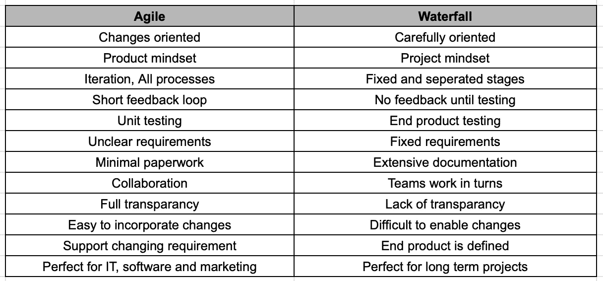

# 敏捷与瀑布

> 原文：<https://medium.com/globant/agile-vs-waterfall-c32e07350282?source=collection_archive---------0----------------------->

(Image Ref: [https://project-management.com/agile-vs-waterfall/](https://project-management.com/agile-vs-waterfall/))

在开始项目开发的时候，组织面临着选择敏捷还是瀑布的问题。软件项目遵循明确定义的过程或软件开发生命周期(SDLC)的方法来构建高质量的最终产品。软件开发生命周期包括不同的阶段和从一个阶段到另一个阶段的结构化流程。

敏捷和瀑布是两种流行但不同的开发过程。两者都已经存在了一段时间，瀑布在大约 50 年前出现，而敏捷是一个相对较新的东西，大约 20 岁。两者都是作为主要管理软件开发的工具出现的，但是现在广泛应用于不同类型的项目。我们来看看敏捷和瀑布的对比。

**瀑布模型**

瀑布模型是软件开发的线性方法。它主要是为了取得成功的结果，因为在过程中的每个阶段都进行了精心的规划。

Software development phases in Waterfall model. (Image Ref: [https://www.javatpoint.com/jira-waterfall-model](https://www.javatpoint.com/jira-waterfall-model))

1.  **需求**:设定项目需求和工作范围
2.  **设计**:根据预先确定的需求设计产品
3.  **开发**:构建产品
4.  **测试**:测试最终产品
5.  **部署**:投放成品
6.  **维护:**为交付的产品提供支持

**瀑布模型的优势**

*   **简单的规划和设计**由于在项目开始时就可交付成果达成一致
*   **采用全系统方法进行更好的设计**
*   **界定工作范围**
*   更简单的成本计算
*   清晰的进度测量
*   定义的团队角色
*   专用资源可以针对特定任务并行工作

**瀑布模型的缺点**

*   难以融入新的需求和变化
*   直到生命周期的后期，才生产出可工作的软件
*   将测试阶段推迟到项目的后半部分
*   不包括参与项目开发的客户或最终用户或利益相关者的反馈

**敏捷**

敏捷开发是一种基于团队的方法，强调快速部署功能性应用程序，关注客户满意度。它定义了一个有时间限制的阶段，称为 sprint，持续时间为两周。

**敏捷宣言-**

1.  **流程和工具上的个人和互动**
2.  **工作软件**综合文档
3.  **客户协作**合同谈判
4.  **响应变化**超过计划

**基于敏捷宣言的 12 条原则-**

1.  **客户满意度**:最高优先级是通过早期和持续交付有价值的软件来满足客户。
2.  **欢迎变更**:即使在开发后期也欢迎变更需求。敏捷过程为客户的竞争优势驾驭变化。
3.  **频繁交付**:频繁交付工作软件，从几个星期到几个月，优先选择较短的时间尺度。
4.  合作:利益相关者和开发人员必须在整个项目中每天合作。
5.  激励团队:围绕被激励的个人建立项目。给他们需要的环境和支持，相信他们能完成工作。
6.  **面对面**:向开发团队传达信息的最有效的方法是面对面的交谈。
7.  **工作软件**:是进度的首要衡量标准。
8.  **不变的步伐**:敏捷过程促进可持续发展。发起人、开发人员和用户应该能够无限期地保持恒定的步调。
9.  **良好的设计**:持续关注技术优势和良好的设计可以增强敏捷性。
10.  简单:最大化未完成工作量的艺术是至关重要的。
11.  自组织:最好的架构、需求和设计来自自组织的团队。
12.  反思和调整:团队定期反思如何变得更有效，然后相应地调整自己的行为。

**什么是敏捷？**

“敏捷是敏捷宣言中包含的价值观和敏捷宣言背后的 12 条原则所形成的思维模式”
- *敏捷联盟*

Agile is a mindset defined by values, guided by principles and enabled with various practices. (Image Ref: [https://zenexmachina.com/agile-as-a-mindset-agile-as-behaviour/](https://zenexmachina.com/agile-as-a-mindset-agile-as-behaviour/))

**敏捷方法**

Software development phases in Agile

*   敏捷方法采用迭代的方式进行软件开发。
*   与简单的线性瀑布模型不同，敏捷项目由许多更小的周期组成，我们通常称之为冲刺或迭代。

**敏捷与瀑布**

**敏捷方法的优势**

*   改进的**利益相关者参与**以交付高质量的工作软件。
*   允许项目团队响应客户的反应，并不断地**改进产品**。
*   敏捷是高度透明的。与项目相关的每个人都可以看到 WIP(在制品)限制。
*   新特性快速而频繁地**发布**，具有高度的可预测性。
*   **成本是可预测的**，并且受限于团队可以完成的工作量。
*   有机会**不断完善**整个**的产品积压**。
*   允许项目团队敏锐地**关注商业价值**和**客户需求**。
*   由于其透明性和质量控制，敏捷允许对项目进行更好的控制。
*   敏捷实施减少了产品交付**较低产出或失败**的机会。
*   团队对他们的决策有了更大的自主权和权威。

**敏捷方法的缺点**

1.  **不太具体的计划**:敏捷是围绕着一个有时间限制的方法来构建的，优先级是不断变化的。这使得很难确定项目的交付日期。
2.  强烈的承诺:只有当整个开发团队在整个过程中都致力于项目时，敏捷开发才能很好地工作。
3.  团队成员也知道其他流程:敏捷团队一般都很小，所以所有团队成员都必须了解各种流程。
4.  **最终产品可能有所不同**:由于最初的敏捷计划可能没有确定，实际的最终产品可能会与提议的有很大差异。
5.  有限的文档:敏捷文档有偏差，这给新成员跟上速度带来了困难。
6.  心态:采用敏捷方法的心态是困难的，但是如果不及时适应，那么及时交付高质量的产品就变得困难。

**最佳选择-**

**敏捷方法，如果:**

*   您预见到不断变化的需求和要求。
*   在很长一段时间内需要多种可交付成果。
*   改进流程和工作流是您的团队和组织的首要任务。

**瀑布方法，如果:**

*   截止日期和资源限制是已知的。
*   这个项目很简单，不过分复杂。
*   没有必要与利益相关者密切合作

**结论**

敏捷和瀑布方法是软件开发方法的不同形式。它们中的每一个在某些场景中都很棒，而在另一些场景中却不切实际。具有不确定需求的软件项目应该用敏捷方法来完成，相反，具有明确需求的项目发现瀑布模型是最好的选择。

希望这些内容对你有用。快乐阅读:)！！