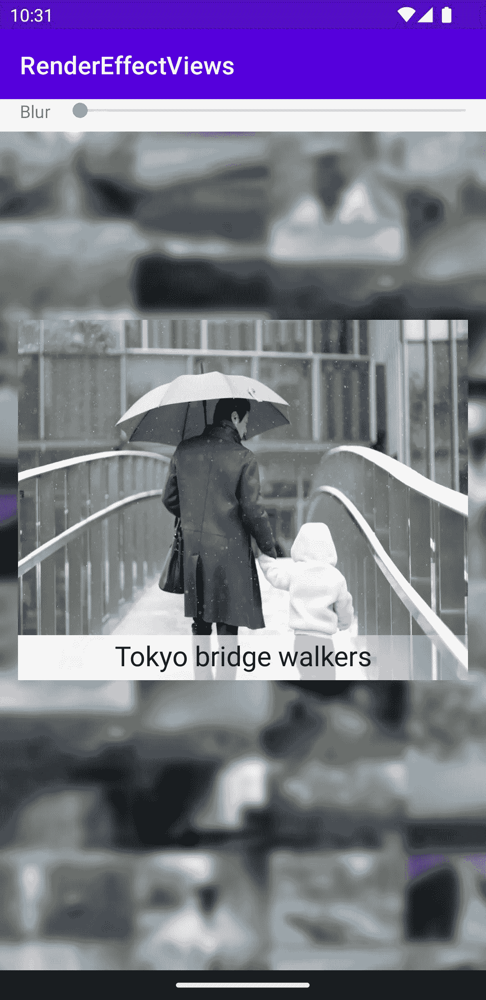
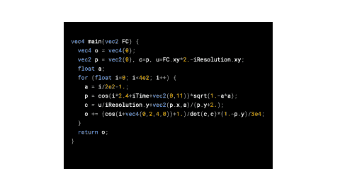
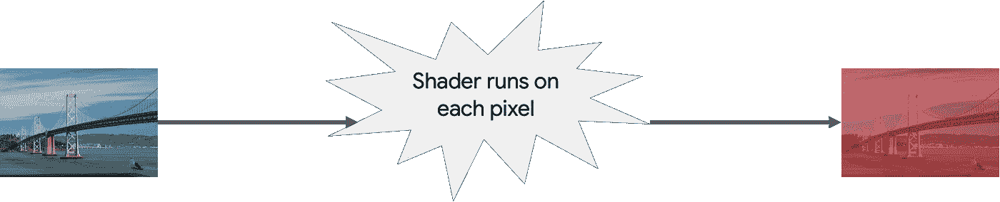
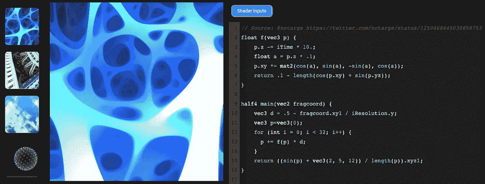
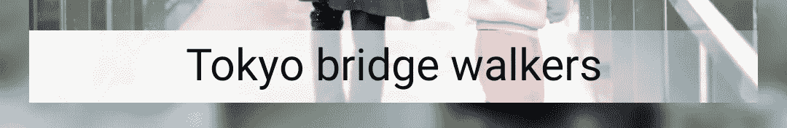
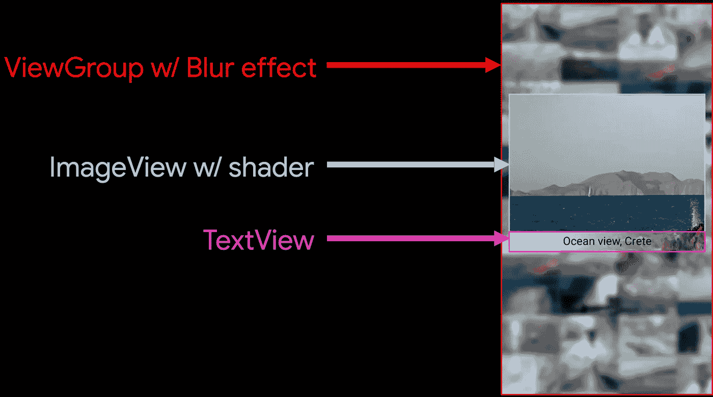
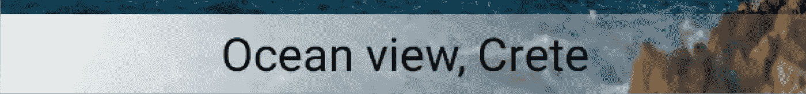

# AGSL:在阴影中制造

> 原文：<https://medium.com/androiddevelopers/agsl-made-in-the-shade-r-7d06d14fe02a?source=collection_archive---------2----------------------->

## 渲染效果# 2:Android 13 中的像素着色器

在[的上一篇文章](/@chethaase/blurring-the-lines-4fd33821b83c)中，我展示了如何创建一个模糊`RenderEffect`来轻松模糊`View`中的所有东西。这种效果虽然有趣，但它本身并不十分有用。我们希望事物看得更清楚，而不是更模糊。这就是我们戴眼镜的原因。以及为什么我们要不断清理眼镜上的污渍。

和上一篇文章一样，这篇文章基于(阅读:是更详细的版本)我和 Sumir Kataria 为最近的 Android 开发者峰会制作的 Android 图形视频的一部分。但不要相信我的话；你可以在这里观看:

The video version of these two articles, which also includes information on Pen & Stylus, and SurfaceView vs TextureView. It’s a lot to cover in a 16 minute video. We talk fast.

# 模糊推理

模糊是一种有用的效果，可以将用户的注意力吸引到场景中的其他元素上。这是摄影中一种常见的技术，视觉效果被用来帮助观众理解该往哪里看。摄影师通过聚焦特定的对象来做到这一点，而前景或背景中的其他元素由于景深而变得模糊。被聚焦的物体的较硬的边缘会立刻吸引我们的注意力，而未聚焦的元素会逐渐消失在背景中。

类似地，在卡通动画中，人们希望在特定的时间将注意力吸引到关键的主题上，以确保观众跟随重要的动作。然而，实现这种效果的技术不一定涉及聚焦/模糊，所以我将动画的话题放在一边。我提到它是因为有趣的是，所有这些领域都存在相同的优先事项——快速引导有限的人类注意力范围，以帮助传递任何视觉场景的重要信息。

我创建上一篇文章中看到的模糊效果的原因是因为我希望模糊的图像容器成为我希望观众关注的实际事物的背景:画廊中一张图片的特写。在我的演示中，当用户点击一张图片时，会出现一个弹出窗口，显示该图片的放大图。弹出版本是清晰的，而背景是模糊的。这有助于消除所有这些不相关图像背景中的噪声信息，因此用户可以专注于他们选择的图片。



Having the background blurred allows the viewer to focus on the larger image that is shown on top.

但是在这个演示中不仅仅是背景模糊。除了`RenderEffect`提供的模糊背景，我想使用 Android 13+中启用的新`RuntimeShader`效果。你可以在上图的标签中看到结果。标签是半透明的，因此您可以看到它所覆盖的图像的底部，但标签背景是磨砂的，并且(稍微)模糊，以使标题更清晰。这两种效果都是用 AGSL 着色器实现的。

# Android 中的碎片着色器！

AGSL 是 Android 13 中的一项新功能，通过[也是新的] `RuntimeShader` API 访问。我将介绍所有这些是什么以及如何使用它们。但首先，我们来谈谈碎片着色器。

首先，我应该指出，*片段*基本上与*像素*相同，除了片段指的是实际出现在屏幕上的几何图形片段(并且没有被裁剪掉或忽略)。另一方面，像素就是屏幕上的每个像素(“图片元素”)。片段着色器最初(有时仍然)被称为*像素着色器*，但*片段着色器*是更通用、更正确的术语。

随着冗长乏味的术语的消失…什么是着色器？

片段着色器是在图像的每个片段上运行的小程序，用于计算应该出现在那里的颜色值。这是一个形象化的例子。想象一下在视图的每个像素上运行的代码产生的 nean 球体效果…因为这正是正在发生的事情。



Shader code runs on every fragment to determine the resulting colors. (shader source: [@XorDev](http://twitter.com/XorDev) [https://twitter.com/XorDev/status/1475524322785640455](https://twitter.com/XorDev/status/1475524322785640455))

> 此时你可能会想:等等，一个程序正在每一个像素上运行？工作量不是很大吗？嗯，是的。但这只是 GPU 的工作方式；片段着色器是计算 GPU 渲染的最终像素颜色的机制。自从我们的第一个硬件加速渲染器在 Android 3.0 Honeycomb 中出现以来，我们已经在 Android 上为所有渲染运行片段着色器很多年了。与 AGSL 的唯一区别是，我们现在允许您将自己的代码注入到着色器中，这些着色器已经由渲染器代表您进行了构建。

让我们看一个例子:

```
uniform shader input;vec4 main(vec2 coords) {
    vec4 red = vec4(1, 0, 0, 1);
    return mix(input.eval(coords), red, .5);}
```

这个着色器有一个`input`变量，它是被着色的源。着色器还接收当前像素的`coords`，通过调用输入着色器上的`eval(coords)`，我们可以从中检索该(x，y)位置的当前颜色值。

我们创建一个变量`red`来保存不透明的红色，然后通过`mix()`函数将它与当前值合并，该函数在这些颜色之间进行线性插值。在这种情况下，我们使用每种颜色的一半(. 5)来生成并返回像素的最终颜色值。结果是这样的:



The result of running the shader above on every fragment of the image on the left to produce the red-tinted image on the right.

# AGSL:Android 的碎片着色器

好了，这就是着色器。什么是 AGSL？

Android 图形着色语言(AGSL)是用于为 Android 编写着色器的语言。AGSL 本质上是 [SkSL](https://skia.org/docs/user/sksl/) ，代表 Skia Shading Language，其中 [Skia](https://skia.org/) 是 Android(以及其他客户端平台，包括 Chrome)的渲染引擎。我们将 SkSL 重命名为 AGSL，从本质上简化 API，以避免在 Android API 表面中间解释 Skia 是什么(这正是我在这里必须做的，但在文章中比在 API 参考文档中间更好一点)。

AGSL 几乎(但不完全)等同于 GLSL ES1.0，GLSL 是 OpenGL ES 的着色语言。这并不完全相同，因为 SkSL 的着色器使用与 GLSL 略有不同。在 OpenGL 中，您可以传递决定最终像素颜色的着色器。但是使用 AGSL，你可以在 Skia 渲染管道的中间插入一个着色器。Skia 已经在创建和使用着色器，这些着色器执行诸如剪切几何体和确定(和着色)几何体的抗锯齿边界的任务。一个 AGSL 着色器被添加到该着色器集中，这些着色器被组合在一起以产生由 GPU 绘制的最终像素值。

SkSL 着色器的例子可以在[shaders.skia.org](https://shaders.skia.org/)找到，在那里你也可以在线玩和调试着色器代码。



[shaders.skia.org](https://shaders.skia.org/) has several example SkSL shaders and tools for editing and debugging shaders

# 着色器与着色器

现在你的脑海中可能正在形成一个问题:Android 不是已经有了一个`Shader` API 吗？其实我之前关于`RenderEffect` s 的文章不是已经讲过了吗？是的，是的。没有。

**是的**，安卓有一个`Shader` API: `android.graphics.Shader`。引用参考文档:

> Shader 是在绘制过程中返回水平颜色范围的对象的基类。

特别是，`Shader`是`LinearGradient`和`BitmapShader`等渐变效果的超类。这些对象，当设置在一个`Paint`对象上时，将这些“着色器”应用到绘图操作中，本质上是从着色器中采样，以产生用于渲染正在绘制的对象的颜色。例如，用一个设置了`BitmapShader`的`Paint`对象绘制一条线，将会产生一条带有位图颜色纹理的线。

而且**是的**，我在上一篇文章中谈到了现有的`Shader` API，具体来说就是使用`RenderEffect`捆绑绘图属性，比如应用于整体`View`的`Shader`，而不是必须使用自定义`View`中的`Paint`对象手动绘制图元。例如，可以创建上述渐变或位图着色器之一，然后将其应用于如下视图:

```
val effect = RenderEffect.createShaderEffect(shader)
myView.setEffect(effect)
```

但是**没有**，`android.graphics.Shader`并不等同于`RuntimeShader`。但它们是相关的，无论是 API 还是概念。在 API 术语中，`RuntimeShader`是那个长期存在的`Shader`类的子类，因为它毕竟是一个着色器。所有这些着色器本质上都在做相同的工作；它们提供绘制几何图形时采样的颜色值，告诉渲染引擎生成的每个片段使用的颜色值。`RuntimeShader`和现有着色器类的区别在于它们的可编程性。所有其他`Shader`类本质上都是固定功能着色器；他们用特定的算法做特定的工作，这就是你得到的全部。你可以有一个`LinearGradient`,带有用来构造它的参数。您可以从提供给`BitmapShader`的位图中取样像素。但是你不能提供定制的算法来改变这些像素的采样方式；你只需要在那些`Shader`子类的实现中得到我们给你的任何东西。

另一方面，`RuntimeShader`给了你完全的可编程性。如果你想做一个简单的`LinearGradient`(我将在下面的代码中展示)，你可以这样做。但是你也可以根据输入的像素颜色，或者你的着色器算法，或者你的想象力的限制，做一些更加定制，复杂和动态的事情。`RuntimeShader`为 Android 带来完整的像素级动态编程逻辑。

# 回到演示

好吧，我们说到哪了？哦，对了，我想谈谈如何让图片标题看起来模糊/磨砂:



The image caption pops the text out with a shader which blurs and ‘frosts’ the underlying image

# 磨砂字幕着色器

在我的应用程序中，视图层次结构中有三个主要组件，如下所示:



Relevant view hierarchy for the overall effect of a focused, captioned picture over a blurred background

背景容器仅仅是图库的一个容器，它被我们在上一篇文章中提到的`RenderEffect`弄模糊了。当有人点击一张图片时，程序会创建一个带有`ImageView`的`PopupWindow`，其中保存了该图片的放大版本。该视图是 AGSL 着色器运行的地方(尽管它将其效果仅限于文本出现的标题区域)。最后，顶部有一个`TextView`，它将文本绘制到透明背景上，以便 ImageView 的模糊/磨砂效果显示在该标签区域的文本下。

AGSL 着色器如下。我们将一个字符串*传递给`RuntimeShader`，它在运行时被编译并缓存。

**对，一串。着色器感觉像是编程黑暗时代的回归，在那里，您可以在穿孔卡片上编写代码，然后将它们发送给管理大型机的人。至少我们不用等几个小时或几天才发现有语法错误。*

```
[@RequiresApi](http://twitter.com/RequiresApi)(Build.VERSION_CODES.TIRAMISU)
val FROSTED_GLASS_SHADER = RuntimeShader("""
    uniform shader inputShader;
    uniform float height;
    uniform float width;

    vec4 main(vec2 coords) {
        vec4 currValue = inputShader.eval(coords);
        float top = height - 100;
        if (coords.y < top) {
            return currValue;
        } else {
            // Avoid blurring edges
            if (coords.x > 1 && coords.y > 1 &&
                    coords.x < (width - 1) &&
                    coords.y < (height - 1)) {
                // simple box blur - average 5x5 grid around pixel
                vec4 boxSum =
                    inputShader.eval(coords + vec2(-2, -2)) + 
                    // ...
                    currValue +
                    // ...
                    inputShader.eval(coords + vec2(2, 2));
                currValue = boxSum / 25;
            }

            const vec4 white = vec4(1); // top-left corner of label area
            vec2 lefttop = vec2(0, top);
            float lightenFactor = min(1.0, .6 *
                    length(coords - lefttop) /
                    (0.85 * length(vec2(width, 100))));
            // White in upper-left, blended increasingly
            // toward lower-right
            return mix(currValue, white, 1 - lightenFactor);
        }
    }
""")
```

(注意:这种白色磨砂玻璃效果部分基于在[pushing-pixels.org](https://www.pushing-pixels.org/2022/04/09/shader-based-render-effects-in-compose-desktop-with-skia.html)的一个更复杂的例子)。

有三个输入变量(或“制服”)。传入的`width` / `height`变量告诉着色器该区域有多大；这允许计算底部的字幕区域。`inputShader`变量保存被着色的原始像素颜色。

第一步是简单的拒绝:如果这个位置的像素在标题区域之外，着色器只返回原始像素值(通过调用`eval(coords)`计算并存储在`currValue`中)。

如果`coords`处的像素在字幕边界上，我们避免模糊它，因为在模糊计算中使用源图像之外的颜色会使模糊边界像素遇到问题。所以在这种情况下，我们返回原始像素值。

如果像素在标题区域内，那么我们使用一个简单的[框模糊](https://en.wikipedia.org/wiki/Box_blur)算法对其进行模糊处理(为了简洁起见，上面大部分都被注释掉了)，它只是对我们正在处理的像素周围的所有像素进行平均。你可以用任何半径来做这件事；在这里，我使用 5x5 的网格作为折衷，既模糊到足以使它在视觉上明显，又不会花费太多的时间/性能(你包括的像素越多，这个操作花费的时间就越长)。

最后，我们通过使用从左上角的不透明白色到右下角的几乎半透明的线性渐变，在模糊的顶部“霜化”标签区域。这使得模糊的底层图像越来越向标签的右侧显示。

最终结果如下所示。请注意，标签区域下的岩石和海洋在标签区域内部比外部更模糊。同时，磨砂玻璃效果有助于创建足够的对比视觉区域，以便黑色文本清晰显示，同时仍显示底层图像。



The final effect, where the caption is printed on top of a blurred, frosted-glass background.

# RuntimeShader + RenderEffect

一旦你有了你的`RuntimeShader`，在一个视图上设置它类似于我们看到的模糊效果；您创建一个`RenderEffect`并在视图上设置效果。对于上面定义的`FROSTED_GLASS_SHADER`，我们像这样创建`RenderEffect`:

```
val effect = RenderEffect.createRuntimeShaderEffect(
            FROSTED_GLASS_SHADER, "inputShader")
```

参数`"inputShader”`告诉系统在传递原始像素值时要使用的制服名称。

我们还需要设置着色器中使用的其他制服，以便它知道目标的大小，从而知道标题区域的边界:

```
FROSTED_GLASS_SHADER.setFloatUniform("height", h.toFloat())
FROSTED_GLASS_SHADER.setFloatUniform("width", w.toFloat())
```

现在我们已经创建并配置了我们的`RuntimeShader`，我们用`setEffect()`将它设置在`ImageView`上:

```
setRenderEffect(effect)
```

就是这样！现在当`View`被绘制时，系统将自动调用每个像素的着色器代码，产生上面看到的结果。

# 值得注意

上面的实现中有几个细节值得注意。

## 虫子，虫子，虫子

首先，我在让我的应用程序工作时发现了当前版本中的一个 bug:在没有设置新的`RenderEffect`的情况下，`View`不会拾取对`uniform`值的任何更改。也就是说，*应该*可以创建一个着色器，然后在不更新实际着色器的情况下改变(甚至动画化)`uniform`的值。它可以做到这一点……但是`RenderEffect`没有得到那些改变。解决方法是同时调用`createRuntimeShaderEffect()`和`setEffect()`来使这些更改生效。

## 着色器与线性渐变

熟悉 Android 现有图形 API 的观察力敏锐的读者可能已经发现，我实际上不需要 AGSL 着色器来获得上面的视觉效果。我可以(也应该)使用第二个模糊`RenderEffect`来模糊想要的区域，然后使用一个简单的`LinearGradient`从不透明到半透明的白色，这将会给我用更多的代码和努力(可能更多的处理时间)实现的毛玻璃一样的外观。一般来说，我会推荐其他更简单的方法；不要仅仅因为它们很简洁就使用着色器(至少在真实的应用程序中不会)。

但是我想要一个非常简单的效果来描述，以便于理解着色器是什么，它们如何工作，以及你可以做什么，特别是在更典型的 UI 用例的上下文中，而不是你在着色器网站上可以看到的更奇特的例子。因此，不要只是复制上面的着色器代码，而是要尝试 AGSL 和着色器，以找出适合您的用例的方法。

## 一种更快的模糊方法

我在《T2》中使用的盒子模糊有两个问题。一个是不如后面图片库看到的`RenderEffect`模糊(之前文章有涉及)；它没有考虑足够多的周围像素，以获得真正模糊的结果。另一个问题是花费太多时间。我还没有对这些方法进行基准测试，但总的来说，`RenderEffect`模糊会更快(它经过了高度优化，使用了一些我在着色器中不容易做到的技术)，比手动进行简单的方框模糊要好。

不幸的是，如何使用一个`RenderEffect`模糊并不明显。我需要模糊图像所在的`View`，但我只想模糊它的一部分(标题区域)。给视图附加一个`RenderEffect`会影响整个`View`，模糊整个弹出的图像不是我们想要的。

幸运的是，有一种方法可以让它工作。但是您必须阅读本系列的下一篇文章才能找到答案。(又一个挑逗！这种无休止的折磨什么时候才能结束？！？！？！)

# 着色器资源

以下是一些网站和文档，您可以从中了解更多关于上面讨论的内容:

## Skia 着色器

*   shaders.skia.org:SkSL 着色器示例和编码/调试。
*   [SkSL 文件](https://skia.org/docs/user/sksl/)

## AGSL

*   [AGSL 概述和指南](https://developer.android.com/develop/ui/views/graphics/agsl)
*   `[RuntimeShader](https://developer.android.com/reference/android/graphics/RuntimeShader)`

## GLSL

*   [GLSL 参考](https://www.khronos.org/files/opengles_shading_language.pdf)

很快就能找到该系列的第三篇文章。当它可用时，我将在这里更新链接。