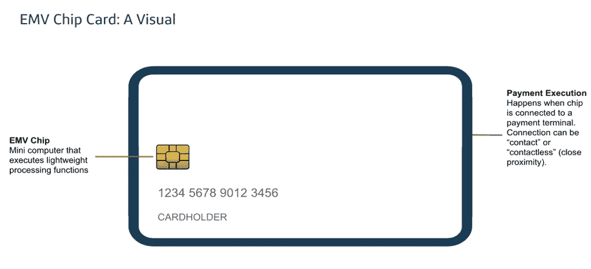
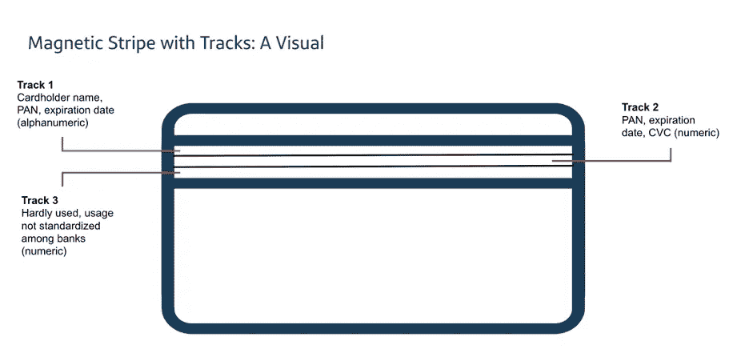
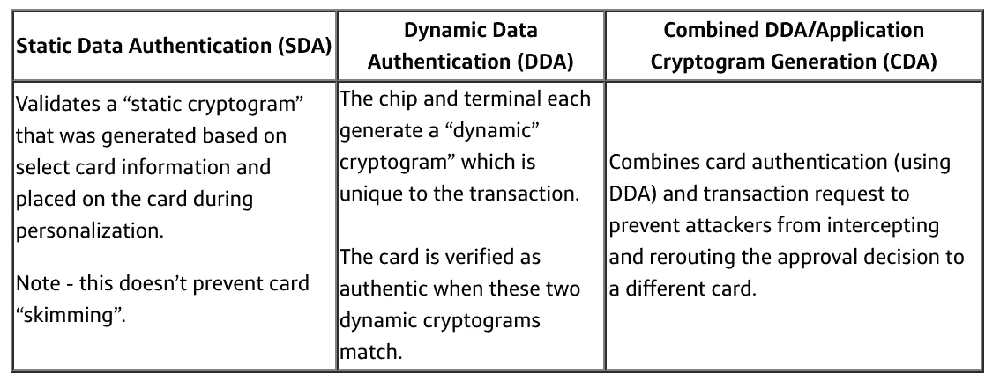

# 啊，原来这就是我钱包里的东西！

> 原文：<https://medium.com/capital-one-tech/ah-so-thats-what-s-in-my-wallet-63e11fc02c4c?source=collection_archive---------3----------------------->

## 软件工程师对 EMV 芯片技术的分析

## 由 Sahana Arya 和 Alana Alfeche 创作

信用卡是 Capital One 的主要实物产品，整个公司的团队都致力于支持这一产品，无论是以产品开发、软件工程、设计等形式。例如，Alana 是一名数据工程师，负责为外部合作伙伴开发奖励应用程序，而 Sahana 则致力于支持数据科学家开发机器学习模型，用于从信用卡客户来电中获取洞察力。像 Capital One 的许多其他人一样，我们知道需要做些什么来支持信用卡计划，但我们很好奇实体信用卡实际上是如何工作的！

我们的好奇心驱使我们更深入地挖掘和了解这项技术。我们对我们所了解的物理信用卡技术非常着迷，并认为其他软件工程师也会对学习同样的技术感兴趣。

我们汇编了我们对 EMV 芯片信用卡的所有研究，并在公司最大的内部软件工程会议(SECON)上与我们的 Capital One 同事分享。我们很兴奋地看到全公司的软件工程师都从我们的演讲中学习，我们的演讲将 EMV 的技术概念分解成易于理解的组件。今天，我们的 EMV 技术介绍视频仍然是所有 SECON 2020 视频中观看次数最多、获得最多支持的视频。

现在，通过这篇博文，我们想更进一步，与软件工程社区的其他人分享这些概念。

# EMV 信用卡技术介绍

***TL；DR —您的钱包内有一台迷你电脑，运行迷你应用程序，在销售点安全地处理交易。***

EMV 代表欧洲支付、万事达卡和维萨卡。这三个国际支付系统于 1999 年合并成立了名为 EMVCo 的有限责任公司。EMVCo 负责管理 EMV 芯片规范，并支持测试流程，帮助基于卡的支付产品在全球范围内无缝、安全地协同工作。

EMV 卡包含一个嵌入的芯片，这是一个完全运行的计算机系统。它具有存储器，并且当在销售点由终端供电时可以执行小的功能。在[磁条卡](https://en.wikipedia.org/wiki/Magnetic_stripe_card)中，磁条卡只是一个数据存储器，终端执行所有必要的处理，而在 EMV 交易中，芯片处理信息并应用发行银行在芯片卡中定义的规则。

当您的卡在芯片激活终端时，它:

*   生成仅供一次性使用的一次性代码。
*   如果首选验证不可用，提供备用持卡人验证方法。例如，它允许持卡人在不支持 PIN 的终端上签名完成交易。
*   确定交易是否必须联机以获得额外授权。

# 磁条技术—它是如何工作的？

在我们深入研究 EMV 芯片技术之前，让我们先谈谈磁条技术。磁条是 EMV 芯片的前身，因此了解它们的工作原理以及与这些卡相关的一些安全问题是有帮助的，这些问题后来被 EMV 芯片解决了。

磁条包含识别卡用户的数据，这些信息嵌入在塑料薄膜的铁颗粒中。铁颗粒具有磁性，当刷卡时，电子阅读器会处理磁场，并将其与用户的账户信息进行匹配。

条带本身包含三个水平堆叠的磁道，每个磁道可以保存不同数量和类型的数据(如下图所示)。通常，信用卡使用前两个磁道来获取信息，如帐号、持卡人姓名、到期日期等。

# 磁条技术与安全性

因为磁条上的数据是静态的，所以比 EMV 芯片更容易从卡上“提取”信息。您可能听说过欺诈者使用称为“skimmers”的设备，这种设备能够略读和复制磁条上的数据，以创建重复的信用卡或访问用户的在线帐户。

还有，磁条卡没有加密。该卡只是一个数据存储器，由支付终端按原样读取。在终端读取卡之后，终端与发卡行和/或支付系统合作执行所有的处理，并且卡不再参与其余的处理。

# EMV 芯片技术与安全

现在我们已经讨论了一些与磁条卡相关的安全问题，让我们来谈谈 EMV 芯片如何解决这些问题。

在 EMV 芯片中，对物理芯片组件的访问和操作是一项复杂的任务，需要昂贵的高科技设备。与磁条上的静态数据不同，EMV 芯片上的数据是不断变化的，这使得很难分离和提取。此外，EMV 芯片具有内置加密的优势。当芯片卡被蘸取时，它与终端建立加密连接，以执行写在芯片上的交易规则。然后，卡和终端共同决定交易的结果。

# EMV 芯片是如何工作的？

想象一下，你在最近的杂货店排队结账。您的收银员扫描完您的所有商品后，会询问您是用现金还是信用卡付款。你选择了一张卡，终端灯亮了，并显示插入你的信用卡的指令。你将卡的金属芯片朝上，将芯片插入终端。几秒钟内，付款被批准！

但是在这几秒钟内到底发生了什么呢？下面是销售点交易过程中发生的步骤:

## 1.终端+ EMV 芯片应用选择

*   终端有一个它配置支持的所有 EMV 应用程序的列表。
*   终端和芯片“同意”一个共同的应用程序，这样卡就可以为交易提供正确的数据记录。在某些情况下，如果有多个支持的应用程序，持卡人可能必须选择一个应用程序。

## 2.读取应用程序数据

*   终端从卡中读取应用程序数据记录，包括 PAN、到期日期和用于交易处理的其他信息。

## 3.数据认证

*   仅在线的终端不需要支持离线数据认证。通过这些终端，交易总是被在线发送给发行方进行验证。
*   所有其他终端根据卡和终端的功能执行三种离线数据验证方法之一(见下表):

## 4.处理限制

*   检查以确认芯片被允许进行所请求的交易。
*   验证芯片和终端之间的应用兼容性。

## 5.持卡人验证方法

*   签名
*   在线 PIN
*   离线加密 PIN
*   脱机明文 PIN
*   不需要持卡人验证方法(CVM)

## 6.终端风险管理

*   终端执行若干检查，例如下限，以确定交易是否需要在线处理。

## 7.终端动作分析

*   基于前面的步骤，终端然后请求离线批准、离线拒绝或进一步在线处理的结果。

## 8.卡片动作分析

*   基于发卡方定义的规则和限制，芯片将响应离线批准、离线拒绝或进一步在线处理的结果。

## 9.在线处理和发行者认证

*   如果芯片请求进一步的在线处理，终端向发行者发送授权和在线卡认证的请求。

## 10.交易完成

*   最后，交易完成，卡被移除。

# EMV 芯片技术毕竟没有那么复杂！

当我们开始了解 EMV 技术时，我们被这项技术复杂而优雅的设计深深吸引。诚然，这些概念起初对我们来说很难理解，但随着我们继续研究并就此技术咨询内部主题专家，我们能够将这些概念分解为易于理解的组件，从而巩固我们对 Capital One 主要产品的理解。我们希望这次 EMV 芯片技术的分解有助于我们深入了解推动今天全球 80.1%的信用卡交易的迷人技术！

【标题图片】是一张 [*背景图片*](https://www.freepik.com/photos/background) *由*[*jcomp*](https://www.freepik.com/jcomp)*——*[*www.freepik.com*](http://www.freepik.com)

*披露声明:2021 资本一。观点是作者个人的观点。除非本帖中另有说明，否则 Capital One 不隶属于所提及的任何公司，也不被这些公司认可。使用或展示的所有商标和其他知识产权是其各自所有者的财产。*

*原载于*[*https://www.capitalone.com*](https://www.capitalone.com/tech/software-engineering/how-emv-chips-in-credit-cards-work/)*。*