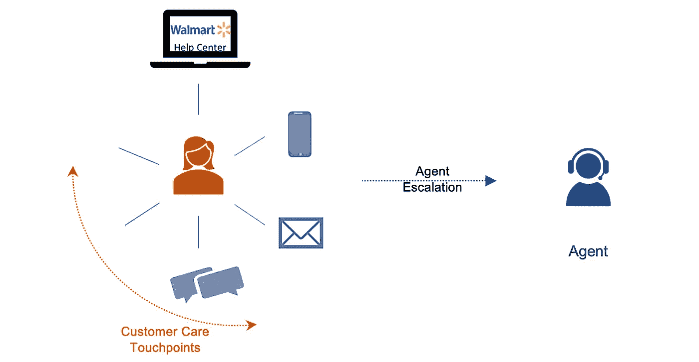
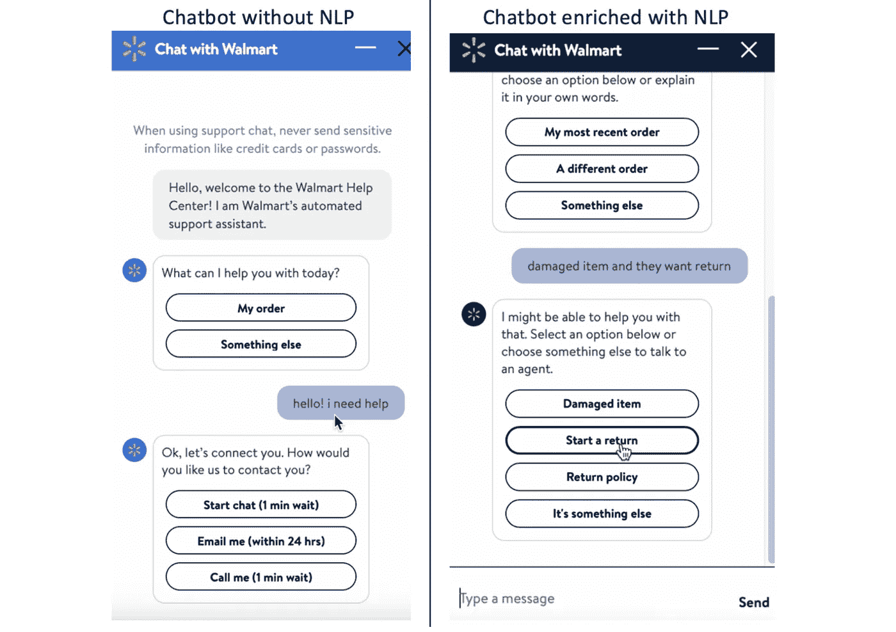
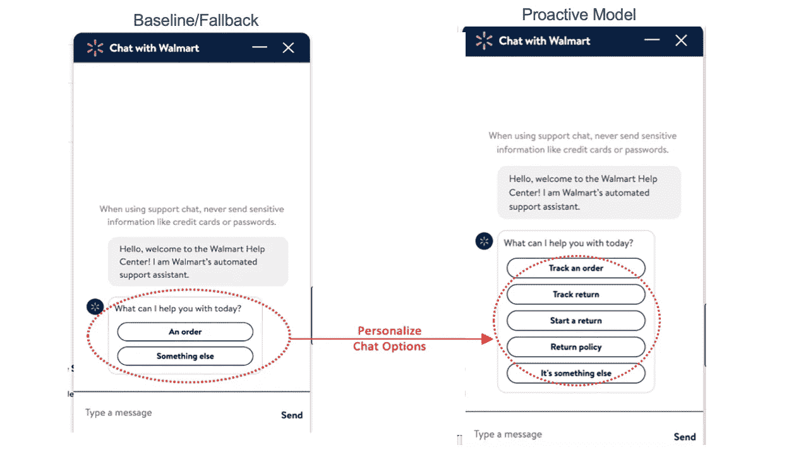

# 面向客户服务的人工智能——构建智能对话助手

> 原文：<https://medium.com/walmartglobaltech/ai-for-customer-care-building-smart-conversational-assistants-f0f527169bbb?source=collection_archive---------5----------------------->

Photo Credit: [Pixabay](https://pixabay.com/illustrations/customer-service-care-call-support-4482159/)

***客户服务是零售业的圣杯。*** 它是客户体验不可或缺的一部分，客户在购买前和购买后的旅程中会因为各种原因与企业进行互动，包括查询产品、检查订单状态、修改订单细节、提供反馈等等。

**在沃尔玛，数百万用户**通过聊天、电话、电子邮件等不同渠道联系我们的客户服务部。满足从下单帮助到订单状态检查到退货等各种需求。我们如何在用户购物旅程的这个关键时刻为他们服务是决定客户满意度的一个关键因素。*有趣的是，很大一部分用户会进行相对简单的查询，如查看订单状态，这很容易实现自动化。*此外，与客户服务互动的用户中有相当一部分是之前有订单记录的现有客户。这意味着*为我们的用户个性化和构建无缝对话体验*的自动化空间很大。

A user may browse help center or reach out via channels like chat, email, call etc. to get their queries resolved. In some cases, the user may also connect with an agent to get the resolution.

[***匡威***](/walmartglobaltech/building-a-conversational-assistant-platform-for-voice-enabled-shopping-6d174cdc4131) ***，沃尔玛的内部对话式人工智能平台，*** *是一个独特的平台，可以帮助我们的客户、员工和卖家通过使用平台的 NLU(自然语言理解)和个性化功能来解决他们的查询。* *在我们之前的博客中，我们已经*讨论了 Converse 如何实现[的对话体验](https://one.walmart.com/content/globaltechindia/en_in/Tech-insights/blog/Conversational-Commerce.html)用于[语音购物](/walmartglobaltech/building-a-conversational-assistant-platform-for-voice-enabled-shopping-6d174cdc4131)、[文本购物](https://corporate.walmart.com/newsroom/2022/01/24/how-walmart-builds-conversational-shopping-to-create-innovative-customer-experiences)、[商店员工的 AskSam 助手](/walmartglobaltech/knowledge-distillation-of-multilingual-bert-for-walmarts-conversational-ai-assistant-98ca7c2c3835)等。

***在这篇博客中，我们将深入探讨 Converse 如何为客户、销售人员和员工服务提供对话助手。*** 这些对话助手的目标是预测用户需求，理解任何反馈，提供直观和个性化的体验。了解用户意图有助于我们将用户引导至适当的自助服务流程，例如开始退货或检查订单状态。这些体验可以跨平台实现，如聊天、IVR(交互式语音应答)系统、帮助中心页面等。这种自动化不仅有助于减少客户的等待时间，而且[带来了更好的客户体验，增加了销售额](https://blog.hubspot.com/service/importance-customer-service)。它还使我们的员工、代理和合作伙伴能够随时随地快速服务和取悦客户。

> 现在让我们深入了解沃尔玛的内部人工智能解决方案，该解决方案为对话助理提供了“护理”能力。

# 人工智能解决方案

最简单的形式，我们的人工智能解决方案是双重的:

**1 —自然语言理解模型**

*匡威的自然语言理解模型旨在理解用户打字/说话时的“话语”。这有助于为用户建立直观的体验，在那里他们将被呈现并被路由到相关的流。*

Chatbot without/with NLP Models | Screenshots from two versions of Walmart Help Center’s chatbot. In the chatbot without NLP (on the left), whenever a user types, they are immediately escalated to agents. Whereas the chatbot with NLP in the backend (on the right) can comprehend the user’s utterance and suggests appropriate flows to the user for an intuitive experience.

我们有一个 NLP(自然语言处理)模型套件，其中包括以下模型:

- **意图检测:** [使用话语和来自当前/先前交互的任何上下文预测意图](/walmartglobaltech/search?q=conversational)(例如，开始退货、检查订单状态等。)
- **实体检测:** [检测话语内的实体](/walmartglobaltech/joint-intent-classification-and-entity-recognition-for-conversational-commerce-35bf69195176)(例如，项目名称、订单 id 等。)
- **情绪分析:**检测对话期间的用户情绪(例如，开心、中立等。)
- **Q & A over 知识库:**将用户查询与相关的基于知识的文章进行匹配，以提取并提供答案(例如，对“Walmart+”感兴趣的人可以被路由到相关文章)

NLP-suite 帮助我们理解用户的查询，以将其路由通过相关的自动化流程，这可以解决用户的问题。这大大减少了用户的查询解决时间，并提高了渠道的自动化率*，为用户创造了无缝体验。

(*Automation rate 是通过自动化流程解决且对话未升级至代理的联系的百分比。)

**2 —主动协助模式**

甚至在客户明确说出或键入任何内容之前，主动协助模型就可以根据客户的交易和交互数据预测客户的需求/意图。这使我们能够通过主动提供让客户满意的相关流程/选项来个性化客户体验。

这是一种 ***全方位的个性化客户关怀方法，涵盖所有接触点***——无论是在聊天中，在帮助中心，通过 IVR(交互式语音应答)或其他方式。对于聊天，用户一打开它，它就以个性化选项的形式呈现给用户。在 IVR 上，它表现为个性化的欢迎信息。以及不同渠道和平台的不同风格。

个性化是构建无缝用户体验的强大工具，尤其是因为很大一部分用户在联系客户服务之前都有一些订单历史或约定。因此，我们现在向所有用户展示最相关和最个性化的选项，而不是提供一般的流程(如订单状态),例如，订单正在运输中的客户收到的消息不同于订单中退货的客户的消息。这种“主动”信息要求我们利用用户的互动和交易历史。

我们观察到，通过跨渠道推出“主动护理”解决方案，自动化率提高了 17*–33%*。此外，它还允许更多用户“发现”新的相关流量。我们将在下一篇博客中介绍有趣的细节和见解。同时，你可以看看我们的博客，了解[主动协助](/walmartglobaltech/making-walmarts-shopping-assistant-proactive-53a1764fcdee)如何在购物体验的持续对话中发挥作用。

Chatbot without/with Proactive Models | Screenshots from Walmart.com Help Center: Baseline/Fallback flow options (on the left) are the same for all users v/s Proactive model flow options (on the right) are ‘personalized’ for a user based on their latest transaction and interaction data. A similar experience is serving customers on Walmart’s IVR, where they get ‘personalized welcome messages’ using the Proactive models.

> 用户可能会受到“主动模型”预测的“个性化”意图/流程的欢迎，随着他们进一步互动，“NLP 模型”会介入并推动对话向前发展。

适当的问题定义和数据集创建是构建任何人工智能解决方案的重要挑战。对于护理助理来说，它们也以有趣的形式表现出来。

- **问题定义:**我们正在解决哪个问题，在什么接触点？是个性化还是理解单个用户话语还是理解完整的对话？当用户打开我们的网站时，或者当他们打开我们的聊天时，或者当他们输入聊天内容时，我们是在创造即时体验吗？在上面的示例截图中，当用户打开聊天时，会调用主动模型，而当用户在聊天中键入内容时，会调用查询理解模型。

- **数据集创建:**考虑到电子商务数据的庞大规模，以及多方面的客户、全渠道产品和循环中的多个人(客户、代理商、卖家等)，存在大量的数据挑战。).

这些挑战中的每一个都很有趣，我们会在后面的文章中涉及到它们。现在，让我们更深入地了解匡威“关怀”的设计、规模和影响。

## 设计、规模和影响

***“匡威”电力公司关注美国和国际市场。*** 人工智能解决方案已经在多个市场和渠道为我们的客户部署，包括美国的 help center Chat 和 IVR、加拿大的 help center Chat、ASDA 的 help center Chat、智利的 WhatsApp 和墨西哥的 WhatsApp。我们还为美国的市场卖家推出了该解决方案。

系统架构和为其提供动力的 AI 解决方案已被构建为可插拔组件，可跨市场(例如，美国、加拿大)、渠道(例如，聊天、IVR)、语言(例如，英语、西班牙语)和最终用户(例如，客户、代理)进行利用。这允许我们在众多用例中利用相同模型的不同风格。

***【Converse for Care】***为我们的用户提供直观、无缝的对话体验，使数百万次对话能够通过自动化本身解决，即用户能够通过自助服务流程解决他们的查询，而不需要升级到代理。这也为我们的用户缩短了查询解决时间，每年节省了数百万美元。

# 下一步是什么？

在这篇博客中，我们讨论了人工智能在客户服务方面的一种风格——与构建智能对话助手相关，但我们才刚刚开始。还有更多的东西:将客户智能路由到技能适当的代理，人工智能辅助培训/再培训人工代理，主动发现缺陷并为我们的客户解决问题，等等。我们正在研究这些有趣的维度，同时进一步扩展和推广我们的模型，以便跨设备、地理位置、沃尔玛业务、语言和最终用户进行部署。

对于对上述模型的细节感兴趣的人，我们将更详细地讨论为沃尔玛的客户服务提供人工智能的算法、挑战和解决方案。敬请期待！