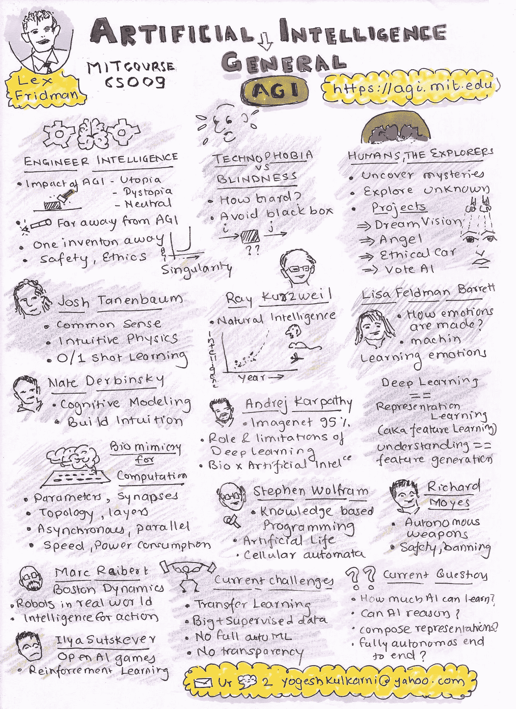

# 艾，总的来说…

> 原文：<https://medium.com/google-developer-experts/ai-generally-speaking-9163948448cb?source=collection_archive---------7----------------------->

(Image source: [Pixabay](https://pixabay.com/illustrations/header-banner-head-mannequin-915122/))

人工智能(AI)涵盖了广泛的技术，从基于规则的专家系统到机器和深度学习的最新进展。目标是模仿(甚至超越)人类的智力。人工智能大致分为三个阶段，人工狭义智能(ANI)，它的能力范围很窄，基本上是单一任务；人工通用智能(AGI)，它像人类一样具有多任务能力；人工超级智能(ASI)，其能力超过人类。

虽然有点过时，6。莱克斯·弗里德曼教授的麻省理工学院 S099 课程很好地介绍了 AGI。

以下是第一堂课的简要笔记，概述了整个课程:

许多著名的人工智能科学家被邀请作为本课程的客座讲师。所以，推荐在这里看完整播放列表[。](https://www.youtube.com/playlist?list=PL4jieTF-BpWoiVjta6VuRy5plFtDm9eRG)