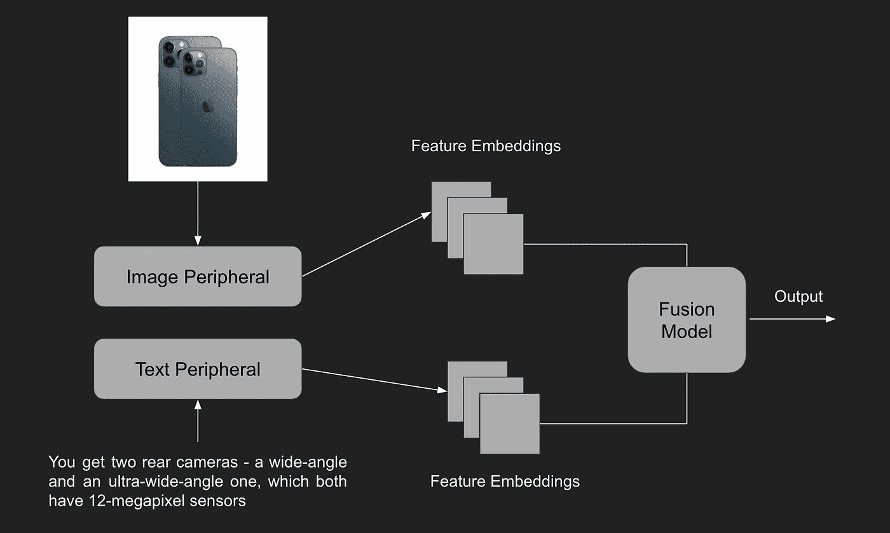

# 电子商务中的人工智能:自动视频生成

> 原文：<https://medium.com/walmartglobaltech/ai-in-e-commerce-automated-video-generation-1b93b9d17ba8?source=collection_archive---------1----------------------->


[Image Source](https://in.pinterest.com/pin/126241595790429814/)

“第一步是确定某事是可能的；那么概率就会发生。”

~ *埃隆·马斯克*

这句话来自我最崇拜的工程师。**《真正的托尼·斯塔克》**

这是我第二篇关于人工智能赛道的文章。如果你还没有看过我之前的文章，这里有一个[链接](/walmartglobaltech/tête-à-tête-the-chatbot-creator-56a5b9b36c2)。是啊！是啊！是啊！我对人工智能的神奇和巨大的应用(也对**【流行语】**)肃然起敬，着迷不已。但现在我们应该明白，这个世界既不是霍格沃茨(哈利波特参考)，也不是一根魔杖。我们都是试图使用 Tensorflow、Scikit Learn、Pytorch 等的普通麻瓜。就像菲利克斯·菲利克斯(液体运气)。


[Source](https://tenor.com/view/salt-bae-salty-saltbae-gif-7529894)

如今，组织正在将机器学习和人工智能添加到他们的应用程序中，就像 Salt Bae 在牛排中添加盐一样。这张图片也总结了谷歌 I/O 2018。

人工智能的作用不仅限于外部业务方面。它还可以用来改善组织内的工作流程。

使用人工智能的五大商业领域是:

1.  卫生保健
2.  教育
3.  营销
4.  **零售和电子商务**
5.  金融市场和服务

在本文中，我们将重点讨论电子商务中的人工智能。

人工智能在网上购物中的应用通过根据购物者购买的产品和购买时间来预测购物模式，正在改变电子商务行业。随着品牌不断完善和创新其数字战略，这一新的电子商务浪潮正在改变品牌与客户互动的方式。电子商务是发展最快的渠道，因此需要一台机器，不仅能获得洞察力，还能持续提供建议。

客户体验不仅限于超个性化，还会考虑电子商务平台上商品列表的内容质量。为买家提供身临其境的体验而制作视频是众多应用之一。利用特定商品的当前内容点燃对同一产品的新观点，提升 GMV(商品总价值)潜力。

你一定在想——“为什么是这个视频？”，“有什么影响？”**叽哩咕噜* *


[Image Source](https://www.pinterest.com/pin/416512665514052920/)

> 可视化从人类的角度来看是可行的，因为我们对视觉数据的反应和处理比任何其他类型的数据都要好。事实上，**人类大脑处理图像的速度比处理文本的速度快 60，000 倍**，传输到大脑的 90%的信息是视觉的。由于我们天生是视觉型的，我们可以利用这种技能来提高数据处理和组织效率。

回答这个问题，是的，它看起来确实有重大影响。以下指针将支持该论点:

*   96%的消费者认为视频有助于做出在线购买决策。
*   79%的网上购物者宁愿看视频来获取产品信息，也不愿阅读网页上的文字。
*   正确的产品视频可以提高 80%以上的转化率。
*   90%的顾客表示视频有助于他们做出购买决定。
*   视频也有助于减少负面评论，因为它清楚地说明了产品能提供什么，不能提供什么。

从整体来看，它通过卖家列表质量改善了顾客的购物过程，提供了更好的购物体验。以下是为电子商务平台上的报价列表制作的不同类型的视频:

1.  产品亮点视频
2.  客户体验视频
3.  解说视频
4.  对比视频

开发和管理视频所涉及的工作量和成本可能是巨大的。卖家可能很难经历视频制作的麻烦，并使其统一并遵循电子商务平台的标准。意识到这一挑战，这些平台正在提供自动化视频生成服务。他们还提供上传卖家制作的视频的功能，作为一项服务来增强客户体验。

让我们转到人工智能出现的部分。


[Source](https://giphy.com/gifs/animation-loop-demon-3oFzlVJAzNUDwvpcc0)

卖家希望该平台能制作专业视频来吸引买家。卖方提供的图像和描述指针是制作视频时需要记住的约束条件。

更好的客户体验应该包括一段欢快的背景音乐，让网上购物更加引人入胜。添加人工智能生成的画外音不仅更具解释性，还能帮助视障人士成为同一客户旅程的一部分。

下面描述了一种使用人工智能画外音自动生成视频的直观方法

一个简单的视频可以通过将提供的图像组织成一个序列，并在这些图像旁边有描述指针来生成，只需使用像 [OpenCV](https://opencv.org) 这样的开源库。同样的代码可以在[这里](https://www.geeksforgeeks.org/python-create-video-using-multiple-images-using-opencv/)找到。

为了添加 AI 画外音，有许多端到端的神经文本到语音(TTS)引擎可用。 **Tacotron2** 就是其中之一，已经达到了艺术表演的状态。它适用于短文本，但不适用于长文本。通过采用多头注意力机制来取代 Tacotron2 中的 RNN(递归神经网络)结构，可以处理长文本。

神经语音合成转换器可以使用 [LJ 语音数据集](https://keithito.com/LJ-Speech-Dataset/)进行训练，该数据集由单个说话者朗读 7 本非小说书籍中的段落的 13，100 个短音频剪辑组成。为每个剪辑提供一个转录。剪辑的长度从 1 秒到 10 秒不等，总长度约为 24 小时。LJSpeech 模型的输出可以被投射到来自 [WaveRNN](https://github.com/fatchord/WaveRNN) 和 [MelGAN](https://github.com/seungwonpark/melgan) 的预训练声码器上。它们将充当音频处理器，捕获音频特征的特征元素。

*生成 AI 画外音的 Python 代码片段*

```
# Synthesize textsentence = 'Hello World! It's Rahul Bajaj'out_normal = model.predict(sentence)############################# Pushing out put to vocodersys.path.append(MelGAN_path)import torchimport numpy as np##############################vocoder = torch.hub.load('seungwonpark/melgan', 'melgan')vocoder.eval()mel = torch.tensor(out_normal['mel'].numpy().T[np.newaxis,:,:])##############################
if torch.cuda.is_available(): vocoder = vocoder.cuda() mel = mel.cuda()with torch.no_grad(): audio = vocoder.inference(mel)############################### Display audioipd.display(ipd.Audio(audio.cpu().numpy(), rate=22050))
```

*在后台添加音频的 Python 片段*

```
import moviepy.editor as mpdef add_music_to_video(path):video = mp.VideoFileClip(path + "/transformed_video.mp4")audio = mp.AudioFileClip(path + "/presentation.mp3")audio = audio.subclip(0,video.duration)print(audio.duration,video.duration)final = video.set_audio(audio)final.write_videofile(path + "/Generated_video.mp4",codec= 'libx264' ,audio_codec='aac')print("Music is added Successfully")
```

上面的一套说明将帮助您获得一个启动和运行的原型视频。实际的挑战是在输入图像和相应的描述指针之间建立语义关系。

针对以上任务，我提出了一个**统一的多模态融合架构**。



**Unified Multi-modal Fusion Architecture**

该模型将使相关信息检索能够自动选择特定描述文本的图像。每个图像的出现顺序可以基于描述点的顺序或者每个图像与所传达的信息的相关性的置信度值来决定。

# 总结

简而言之，每个人都希望有一个主动的方法，而不是被动的方法。人工智能吸引了机构的注意，因为它的预测能力使它们能够在任何情况下都具有优势。有些人只是想找到更好的塔罗牌读卡器😜。

所以，你终于到达了电子商务中人工智能的终点:自动视频生成。是时候检查添加到我们购物车中的学习内容了。希望这篇文章有助于理解影响并提供直观的实现。

*再见！万岁，繁荣昌盛…*

# 推荐人和证明人:

[](https://datafloq.com/read/5-industries-using-artificial-intelligence/7242) [## 使用人工智能最多的 5 个行业

### 自从工业革命(IR) 4.0 开始以来，它就像一场新兴技术和…

datafloq.com](https://datafloq.com/read/5-industries-using-artificial-intelligence/7242) [](https://www.webretailer.com/b/amazon-product-videos/) [## 亚马逊产品视频:卖家需要知道的一切

### 亚马逊产品最常用的视频类型有四种。这是干净的，简单的，完全集中…

www.webretailer.com](https://www.webretailer.com/b/amazon-product-videos/) [](https://www.t-sciences.com/news/humans-process-visual-data-better) [## 人类更好地处理视觉数据

### 各种类型、形状和规模的组织都淹没在数据浪潮中。当你看到有多大…

www.t-sciences.com](https://www.t-sciences.com/news/humans-process-visual-data-better)  [## 基于变压器网络的神经语音合成

### 虽然提出了端到端的神经文本到语音(TTS)方法(例如 Tacotron2 ),并且实现了最先进的…

arxiv.org](https://arxiv.org/abs/1809.08895)