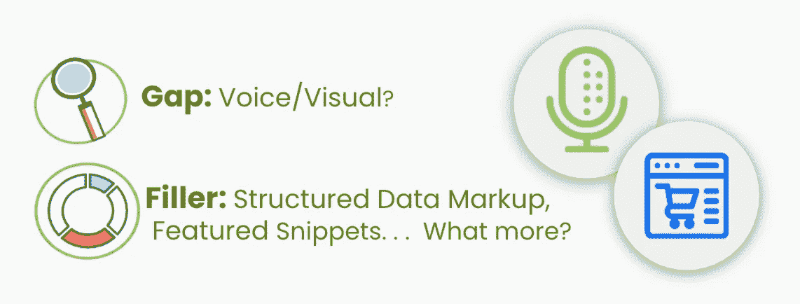

# 人工智能支持的搜索引擎优化:用人工智能改善客户体验的步骤

> 原文：<https://medium.com/globant/ai-powered-seo-steps-to-improve-customer-experience-with-ai-958290fe8670?source=collection_archive---------3----------------------->

# 优化语音视觉搜索和可访问性对于保留和转换有多重要？

网站的优化是一个持续的过程，虽然我们专注于为大多数用户优化网页，但我们往往会忘记一大部分观众(现在越来越多)，他们更喜欢使用语音或视觉搜索来搜索他们的产品/服务。

在当前情况下，如果 web 资产没有针对语音搜索和可视内容搜索进行优化，则可能会成为获得良好客户体验或转换的主要障碍之一。观众可能无法使用语音或视觉搜索在搜索引擎上搜索网站。客户体验，在这种情况下，是阴影，转换，肯定是一个遥不可及的梦想。

Gaps for voice and visual search and filling those with solutions

让我们弄清楚人工智能如何通过预测智能和自然语言处理能力，帮助创造最难忘的客户体验，同时我们要记住搜索引擎优化和网站用户可访问性的最重要规则。

**搜索引擎优化和人工智能**

网站的搜索引擎优化不可否认是至关重要的，我们不能否认传统 SEO 的重要性。保持传统的搜索引擎优化为基础，并增加人工智能的这些策略，可以是有史以来最可行的解决方案，为您的网站排名有利和有效的客户保留。

**语音搜索:走传统路线:**在网站上放置对话内容的优化技术可以非常有效地帮助网站在语音搜索中排名靠前。在内容中使用长尾关键词，创建问题/答案或常见问题解答是优化语音搜索内容的一些成功方法。

**语音搜索:结构化数据标记&人工智能:**营销人员可以通过使用 Schema.org、JSON-LD 模式生成器和谷歌的结构化数据测试工具等工具部署结构化数据来优化搜索引擎的内容。这些工具可以用标签标记内容，帮助搜索引擎理解不同页面元素的含义。这里的目标是用高度结构化的人工智能驱动的谷歌大脑来映射我们网页的优化——这赋予了关于内容的结构化信息很多重要性。

当 WordLift 等插件“连接到现有网站，阅读整个内容，并创建搜索引擎最能理解的精细和详细的表示”时，人工智能可以进一步增加这种可能性。(来源:WordPress.org)

因此，基于用户搜索查询——它的意图和相关性，搜索引擎获取这种带有模式的网页，作为 SERPs 上的丰富片段，以获得更好的可见性，这以其自身的方式表明了与观众更好的联系。这种人工智能工具甚至可以帮助在线创作者制作“与 schema.org 标记兼容的内容，允许搜索引擎最好地索引和显示*的*网站。”(来源:WordPress.org)

**视觉内容:一个不断发展的舞台，以获得更好的客户体验&保留:**人工智能已经在图像识别领域取得了显著成就——想象一下你点击你最喜欢的产品的图像，并在搜索引擎结果中看到类似的产品。这肯定是人工智能在为值得称赞的用户体验和客户保留做工作！随着视觉内容搜索的发展，优化这种搜索变得更加重要。不要忘记传统的优化，例如提供多张产品的图片，使用高分辨率的图片，拥有正确的元数据——alt 文本和关键字。

电子商务行业，特别是时尚和家居装饰零售商，已经在使用大量的应用程序和机器学习模型来理解这些图像的内容和上下文，当他们使用相关结果列表对“图像或对象作为查询”搜索进行回复时。

Pinterest Lens 是人们谈论图像和发现搜索时想到的东西。人工智能为营销人员提供了充分的机会，让他们能够使用诸如 *Lens Your Look* 和 *Shop Your Look* 等策略有效地接触到他们的受众。同样，顾客也乐于尝试这些可能性，点击并上传他们梦想中的造型，反过来，他们也很高兴看到梦想成真，因为他们看到了带有购物链接的相关图片。

**视觉搜索:人工智能是主脑:**事实上，消费者对视觉搜索的快速增长的偏好是数字商务品牌重新设计网站的指针，以促进视觉搜索，提高客户满意度。

人工智能是这里的策划者，因为零售商应该使用和部署它来将视觉搜索解决方案付诸实践。AWS 提供端到端的解决方案，包括亚马逊 S3、亚马逊 SageMaker、亚马逊 Elasticsearch 等服务。

这些服务专注于构建、训练和部署机器学习模型，然后这些模型具有识别图像上下文的能力和智能，进而将该对象与多个对象中最近的邻居进行匹配(亚马逊 es 提供的 KNN 搜索)，并在客户面前生产类似的产品，从而增加搜索意图的关联性的机会。

除了搜索，可访问性等问题对于良好的客户体验也同样重要，人工智能在其中发挥着巨大的作用。让我们检查如何？

**可访问性、用户体验和人工智能**

无障碍性是由一个启示指导的，即网络应该对残疾人平等开放，面对这样的现实，网站的无障碍优化变得非常重要。

**用于辅助功能调整的人工智能助手:**在人工智能的帮助下，营销人员可以真实地面对残疾观众。AccessiBe 等工具使用上下文理解和图像识别来扫描和分析网站上每个元素的功能，并针对屏幕阅读器的可访问性进行调整。通过对网站上数百万条过去行为记录的预测性理解，AccessiBe 提供了最有效的“人工智能驱动的屏幕阅读器和键盘导航可访问性调整”。(*来源:AccessiBe* )从导航菜单、下拉菜单、弹出菜单、图像到表单、按钮、链接，AccessiBe 管理所有。

许多品牌已经开始利用这种机器学习模型，该行业正致力于彻底改变网站的访问方式，以创造出色的用户体验，同时也不会失去一群转化的观众。

与此有些关联的是相关客户体验的概念。为了使一个网站对每一群受众都是用户友好的，即使是网站上最简单的功能也可以在他们如何与网站互动以及他们是否会转化方面发挥重要作用。

这里最简单的例子是网站上的搜索栏。

**用户体验&搜索栏:人工智能语义搜索:**一个有效的网站搜索解决方案可以通过增强客户体验来使转化率翻倍——无论是以无缝购买体验的形式，还是以获取相关内容的形式。与传统的词汇搜索不同，人工智能支持的语义搜索可以识别搜索查询的意图和上下文含义，并带来更好、更相关的结果。这种网站搜索的智能来自自然语言处理，它考虑了语言模式和单词之间的关系，以识别用户搜索查询的实际意图。

推荐的结果通常是相关和准确的，从而增加了个性化、优质客户服务和客户转化的机会。

人工智能聊天机器人:与此相关的是在网站上安装人工智能聊天机器人的重要性——这是品牌为了更好的用户体验而实施的主要优化措施之一。行业统计指出，59%的美国人愿意通过聊天机器人接收优惠券/优惠，一个月后机器人的平均保留率比应用程序高出 40%至 60%，而应用程序仅为 20%至 40%。*(来源:neilpatel)* 。

H&M 就是这样一个利用人工智能购物聊天机器人的品牌。这些机器人自动创建用户档案，与客户交谈，收集信息，细分受众，并发送有意义的信息。这些机器人不仅有助于简化受众细分，而且通过深度学习和预测模式，这些机器人还越来越擅长展示吸引客户的服装，因此有助于推动品牌参与、客户保留和转化！这种由人工智能支持的优化工作可以极大地提高转化率，我们作为数字营销人员肯定可以利用这种可能性来保持我们的客户与我们接触。

这些是一些(还是很多？我相信很多！)在人工智能为我们创造的可能性中，作为营销人员，我们有责任绘制甚至重新思考我们的优化努力，以便我们能够开拓、创造和引导我们的客户旅程，并将其转化。但是，优化没有止境。数字空间不会停止增长，人工智能将继续发展，因此优化轮应该继续转动！

**快速提示！**

2021 年 5 月 18 日，谷歌推出最新算法 MUM——多任务统一模型。这种算法被归类为“理解信息的新的人工智能里程碑”，由此可见，即使是图像搜索也不是终点！(来源:blog.google) MUM 是多模态的，因此它可以理解文本和图像之间的信息，并且在未来，可以扩展到更多的模态，如视频和音频。根据不断发展的人工智能技术和算法，准备好重新思考优化策略，为客户提供他们重视、记住和珍惜的 360 度客户体验！