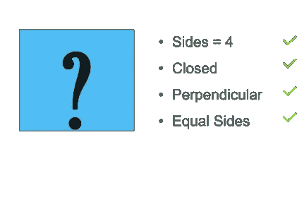

# 人工智能 vs 机器学习 vs 深度学习

> 原文：<https://medium.com/edureka/ai-vs-machine-learning-vs-deep-learning-1725e8b30b2e?source=collection_archive---------3----------------------->

AL vs ML vs DL — Edureka

AI vs 机器学习 vs 深度学习，这些术语已经让很多人困惑了。如果你也是其中之一，那么这篇文章绝对适合你。

> 人工智能是机器学习和深度学习的更广泛的保护伞。你也可以在图表中看到，即使深度学习也是机器学习的一个子集。所以他们三个 AI，机器学习和深度学习只是彼此的子集。因此，让我们继续前进，了解它们彼此之间到底有什么不同。

# **从人工智能开始**

人工智能一词最早出现在 1956 年，但是**人工智能最近变得越来越流行，为什么？**嗯，是因为数据量的巨大增长，先进的算法，计算能力和存储的提升。

我们现有的数据不足以预测准确的结果。但是现在数据量有了巨大的增长。统计数据表明，到 2020 年，大数据的累积量将从 4.4 泽字节增加到大约 44 泽字节或 44 万亿 GB 的数据。

现在我们甚至有更先进的算法和高端计算能力和存储，可以处理如此大量的数据。因此，预计 70%的企业将在未来 12 个月内实施人工智能，高于 2016 年的 40%和 2017 年的 51%。

## 什么是人工智能？

> 人工智能是一种技术，它允许机器通过复制它们的行为和自然来像人类一样行动。

人工智能使机器从它们的经验中学习成为可能。机器根据新的输入调整它们的反应，从而通过处理大量数据并识别其中的模式来执行类似人类的任务。

## 艾打了个比方:建教堂

你可以考虑建造一个人工智能就像建造一座教堂。

第一座教堂花了几代人的时间才完成，所以大多数在上面工作的工人都没有看到最终的结果。从事这项工作的人对自己的手艺感到自豪，他们砌砖、凿石头，这些都是为了建造这座伟大的建筑。因此，作为人工智能研究人员，我们应该认为自己是卑微的制砖工人，他们的工作是研究如何构建组件(例如，解析器、规划器、学习算法等)，以便有一天有人在某个地方将这些组件集成到智能系统中。

我们日常生活中人工智能的一些例子是苹果的 Siri、下棋计算机、特斯拉的自动驾驶汽车等等。这些例子是基于深度学习和自然语言处理的。

嗯，这是关于什么是人工智能以及它是如何得到大肆宣传的。因此，让我们继续讨论机器学习，看看它是什么，为什么要引入它。

机器学习在 80 年代末和 90 年代初出现。但是让**机器学习出现**的人有什么问题呢？

*   **统计:**如何高效训练大型复杂模型？
*   **计算机科学&人工智能:**如何训练更健壮版本的人工智能系统？
*   **神经科学:**如何设计大脑的运行模型？

## 什么是机器学习？

> 机器学习是人工智能的一个子集。它允许机器根据经验(数据)进行学习和预测。

## 用一个例子理解机器学习

假设您想要创建一个系统，该系统可以根据一个人的身高来预测他的预期体重。你要做的第一件事是收集数据。假设您的数据是这样的:

图上的每个点代表一个数据点。首先，我们可以根据身高画一条简单的线来预测体重。例如，简单的一行:

**W = H — 100**

其中 W 是以千克为单位的重量，H 是以厘米为单位的高度

这条线可以帮助我们做预测。我们的主要目标是减少估计值和实际值之间的差异。所以为了达到这个目的，我们试着画一条穿过所有这些不同点的直线，把误差减到最小，让它们尽可能的小。减小实际值和估计值之间的误差或差异会提高性能。

此外，我们收集的数据点越多，我们的模型就越好。我们还可以通过添加更多变量(例如性别)并为其创建不同的预测线来改进我们的模型。一旦这条线被创建，那么在将来，如果一个新的数据(例如一个人的身高)被输入到模型中，它会很容易地为你预测数据，并告诉你他的预测体重。

希望你对机器学习有了清晰的认识。所以继续前进，让我们了解一下深度学习。

## 什么是深度学习？

> 深度学习是一种特殊的机器学习，它通过学习将世界表示为嵌套的概念层次或抽象来实现强大的功能和灵活性。

你可以将深度学习模型视为火箭引擎，它的燃料是我们提供给这些算法的大量数据。

深度学习的概念并不新鲜。但最近其炒作力度加大，深度学习越来越受关注。这个领域是一种特殊的机器学习，它受到我们大脑细胞的功能的启发，称为人工神经网络。它只是将所有人工神经元之间的数据连接起来，并根据数据模式进行调整。如果数据量很大，就需要更多的神经元。它在多个抽象层次上自动学习，从而允许系统学习复杂的功能映射，而不依赖于任何特定的算法。

## 用类比理解深度学习

让我从一个简单的例子开始，它解释了事物在概念层面上是如何工作的。

**例 1:**

让我们试着理解你是如何从其他形状中识别出正方形的。

第一件事是检查是否有 4 条线与一个图形相关联(简单的概念没错！).如果是，我们进一步检查它们是否连接和闭合，如果是，我们最后检查它是否垂直和它的所有边是否相等(正确！).嗯，这只不过是一个**概念**的嵌套层次。

我们所做的是，在这种情况下，我们把一个复杂的识别正方形的任务分解成几个简单的任务。现在，这种深度学习也可以做到这一点，但规模更大。

**例二:**

让我们以识别动物的机器为例。机器的任务是识别给定图像是猫还是狗。

如果我们被要求用机器学习的概念来解决同样的问题，我们会怎么做？首先，我们将定义特征，例如检查动物是否有胡须，或者检查动物是否有尖耳朵，或者它的尾巴是直的还是弯曲的。

**简而言之**，我们将定义面部特征，并让系统识别哪些特征在特定动物的分类中更重要。

现在说到深度学习。它把这向前推进了一步。与我们必须手动给出特征的机器学习相比，深度学习会自动找出对分类很重要的特征。

到现在为止，我想我的文章已经让你清楚了人工智能是一个更大的图景，机器学习和深度学习是它的子部分，所以总结一下，我想说理解机器学习和深度学习之间的区别的最简单的方法是知道**深度学习是机器学习**。更具体地说，这是机器学习的下一次进化。

如果你想查看更多关于 Python、DevOps、Ethical Hacking 等市场最热门技术的文章，那么你可以参考 [Edureka 的官方网站。](https://www.edureka.co/blog/?utm_source=medium&utm_medium=content-link&utm_campaign=ai-vs-machine-learning-vs-deep-learning)

请留意本系列中的其他文章，它们将解释数据科学的各个方面。

> *1。* [*数据科学教程*](/edureka/data-science-tutorial-484da1ff952b)
> 
> *2。* [*数据科学*](/edureka/math-and-statistics-for-data-science-1152e30cee73) 数学与统计
> 
> *3。*[*R 中线性回归*](/edureka/linear-regression-in-r-da3e42f16dd3)
> 
> *4。* [*机器学习算法*](/edureka/machine-learning-algorithms-29eea8b69a54)
> 
> *5。*[*R 中的逻辑回归*](/edureka/logistic-regression-in-r-2d08ac51cd4f)
> 
> *6。* [*分类算法*](/edureka/classification-algorithms-ba27044f28f1)
> 
> 7。 [*随机森林中 R*](/edureka/random-forest-classifier-92123fd2b5f9)
> 
> *8。* [*决策树中的 R*](/edureka/a-complete-guide-on-decision-tree-algorithm-3245e269ece)
> 
> *9。* [*机器学习入门*](/edureka/introduction-to-machine-learning-97973c43e776)
> 
> *10。* [*朴素贝叶斯在 R*](/edureka/naive-bayes-in-r-37ca73f3e85c)
> 
> *11。* [*统计与概率*](/edureka/statistics-and-probability-cf736d703703)
> 
> *12。* [*如何创建一个完美的决策树？*](/edureka/decision-trees-b00348e0ac89)
> 
> *13。* [*关于数据科学家角色的十大神话*](/edureka/data-scientists-myths-14acade1f6f7)
> 
> *14。* [*顶级数据科学项目*](/edureka/data-science-projects-b32f1328eed8)
> 
> *15。* [*数据分析师 vs 数据工程师 vs 数据科学家*](/edureka/data-analyst-vs-data-engineer-vs-data-scientist-27aacdcaffa5)
> 
> *16。* [*人工智能的种类*](/edureka/types-of-artificial-intelligence-4c40a35f784)
> 
> *17。*[*R vs Python*](/edureka/r-vs-python-48eb86b7b40f)
> 
> *18。* [*人工智能 vs 机器学习 vs 深度学习*](/edureka/ai-vs-machine-learning-vs-deep-learning-1725e8b30b2e)
> 
> *19。* [*机器学习项目*](/edureka/machine-learning-projects-cb0130d0606f)
> 
> *20。* [*数据分析师面试问答*](/edureka/data-analyst-interview-questions-867756f37e3d)
> 
> *21。* [*面向非程序员的数据科学和机器学习工具*](/edureka/data-science-and-machine-learning-for-non-programmers-c9366f4ac3fb)
> 
> 22。 [*十大机器学习框架*](/edureka/top-10-machine-learning-frameworks-72459e902ebb)
> 
> *23。* [*用于机器学习的统计*](/edureka/statistics-for-machine-learning-c8bc158bb3c8)
> 
> *24。* [*随机森林中的 R*](/edureka/random-forest-classifier-92123fd2b5f9)
> 
> 25。 [*广度优先搜索算法*](/edureka/breadth-first-search-algorithm-17d2c72f0eaa)
> 
> *二十六。*[*R 中的线性判别分析*](/edureka/linear-discriminant-analysis-88fa8ad59d0f)
> 
> 27。 [*机器学习的先决条件*](/edureka/prerequisites-for-machine-learning-68430f467427)
> 
> *28。* [*互动 WebApps 使用 R 闪亮*](/edureka/r-shiny-tutorial-47b050927bd2)
> 
> *29。* [*机器学习十大书籍*](/edureka/top-10-machine-learning-books-541f011d824e)
> 
> 30。 [*无监督学习*](/edureka/unsupervised-learning-40a82b0bac64)
> 
> *31。* [*10 本数据科学最佳书籍*](/edureka/10-best-books-data-science-9161f8e82aca)
> 
> *32。* [*机器学习使用 R*](/edureka/machine-learning-with-r-c7d3edf1f7b)

*原载于 2018 年 6 月 8 日*[*https://www.edureka.co*](https://www.edureka.co/blog/ai-vs-machine-learning-vs-deep-learning/)*。*