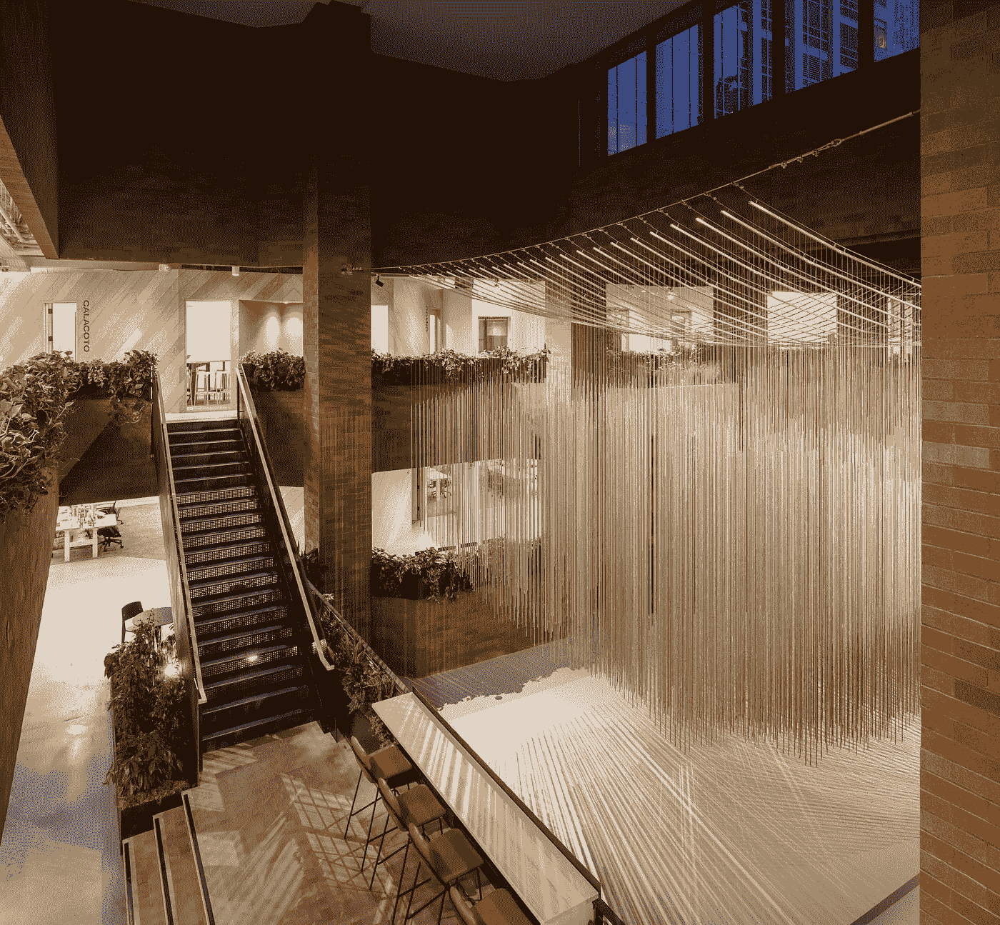
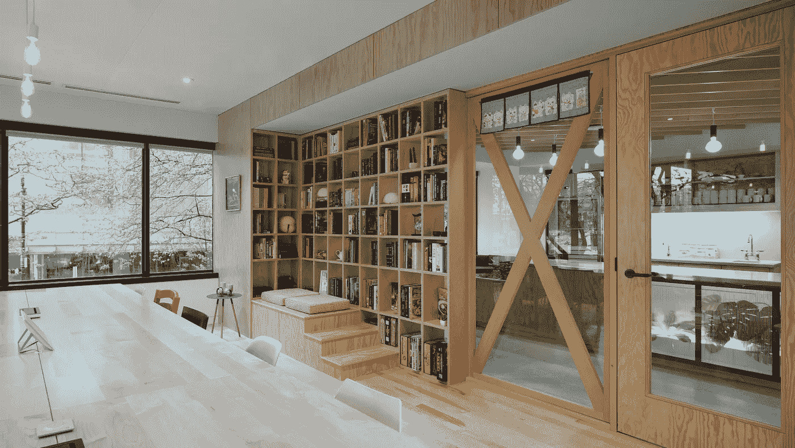
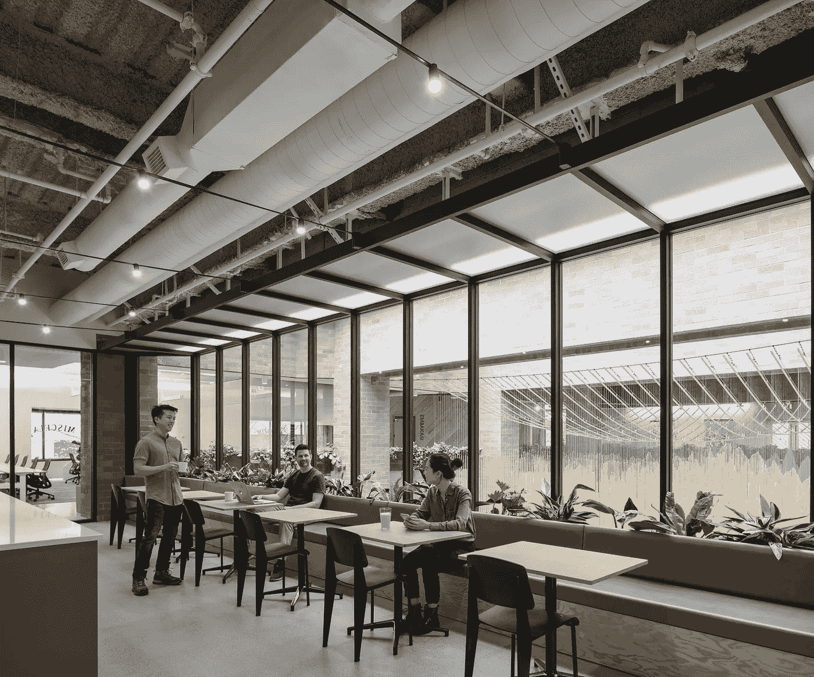
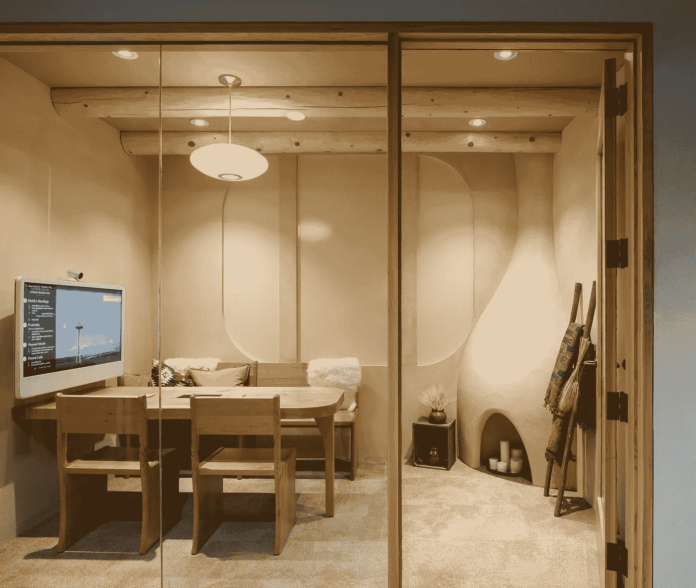
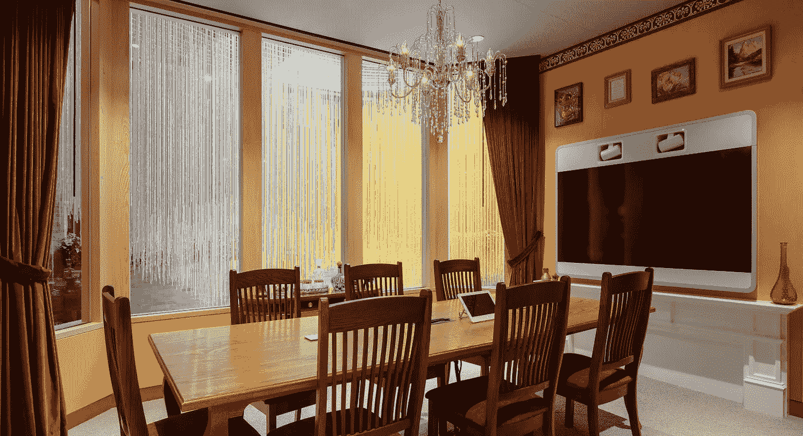

# 西雅图的 Airbnb 工程

> 原文：<https://medium.com/airbnb-engineering/airbnb-engineering-in-seattle-ee59c921b7b0?source=collection_archive---------1----------------------->

## Airbnb 专注于技术的西雅图团队已经搬进了新家。位于西雅图市中心的 42，000 平方英尺的办公室是该公司的第三个工程中心。

想知道在 Airbnb 的新办公室工作是什么感觉？

工程总监兼 Airbnb 西雅图办公室负责人 Ari Steinberg 分享了更多关于 Airbnb 西雅图业务的信息。

**Airbnb 为什么在西雅图？**

我们希望将我们的足迹扩展到旧金山以外，以吸引一些最优秀的人才，在西雅图这样做是有意义的。鉴于华盛顿大学、主要科技公司、初创公司和其他在西雅图设有办事处的湾区公司的存在，它是美国科技人才的顶级城市之一。

**Airbnb 在西雅图存在多久了？**

我们在 2016 年建立了我们的工程存在，并于本月搬进了我们的新空间。看看这些照片吧！

**是什么促使了向新空间的转移？**

当我们第一次在西雅图出现时，共同工作空间是最适合我们的。这给了我们增长和扩展的灵活性。当我们的团队规模较小时，这很好，但在我们现在的规模下，很明显我们需要更深入地定制办公空间的能力，让它成为我们自己的。此外，在我们自己的空间里，我们可以为我们的团队成员提供他们知道并喜欢的额外津贴。

**西雅图有哪些团队和角色？**

人们在广泛的团队中工作，从基础设施到具体的产品功能，如 Airbnb for Work 和我们的 [Open Homes](https://www.airbnb.com/openhomes) 计划(为因自然灾害、冲突和疾病而流离失所的人提供临时住房)。我们在工程、产品管理、数据科学、体验设计、内容策略和用户体验研究等团队中担任角色

**西雅图团队是从总部远程开展项目，还是拥有自己的项目？**

我们不断地在西雅图增加更多的团队，这样我们可以给人们更多的工作灵活性。并非每个团队都处于其发展的同一点，但我们的目标是每个团队都走上在西雅图拥有“一流”所有权的道路——这里的团队不仅包括工程师，还包括经理、设计师和其他角色，在西雅图进行全面的跨职能合作。当然，即使当一个团队达到这一点时，他们仍然倾向于与总部的其他团队进行大量的合作，该公司已经找到了使跨办公室合作更容易的方法。

**你认为五年后西雅图办公室会怎样？**

我们对这里的发展非常有雄心。我们选择这个办公空间的目的是让它成为我们长期的家，由于长期的关注，我们已经能够投资使它成为一个伟大的工作空间。

你在西雅图招人吗？

是啊！我们[目前正在招聘各种职位](https://www.airbnb.com/careers/locations/seattle-united-states)。

**Airbnb 还有哪里有工程师？**

西雅图是我们在旧金山以外唯一的通用技术中心。我们在波特兰、北京和蒙特利尔也有工程团队，这些办事处致力于特定目的，如社区支持或豪华旅行，并有工程师在那里工作，支持这些垂直领域。

