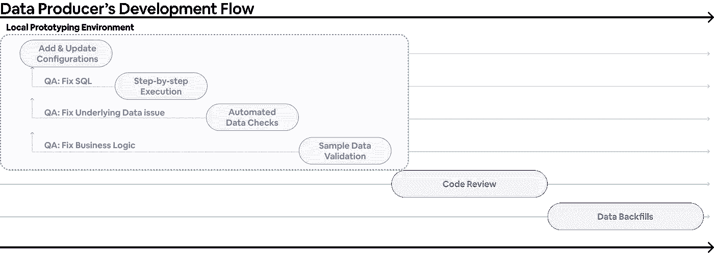

# Airbnb 如何大规模标准化公制计算

> 原文：<https://medium.com/airbnb-engineering/airbnb-metric-computation-with-minerva-part-2-9afe6695b486?source=collection_archive---------1----------------------->

## Minerva @ Airbnb 的公制基础设施

## 第二部分:Minerva 计算基础设施的六个设计原则

**通过:** [阿米特帕瓦](https://www.linkedin.com/in/apahwa/)，[克里斯蒂安菲格罗亚](https://www.linkedin.com/in/cristianrfr/)，[东寒张](https://www.linkedin.com/in/donghan-zhang-670990135/)，[海姆格罗斯曼](https://www.linkedin.com/in/haimgrosman/)，[约翰博德利](https://www.linkedin.com/in/john-bodley-a13327133/)，[乔纳森帕克斯](https://www.linkedin.com/in/jonathan-parks-15617820/)，[麦琪朱](https://www.linkedin.com/in/shengnan-zhu-89403124/)，[菲利普·韦斯](https://www.linkedin.com/in/philip-weiss-391021b1/)，[罗伯特张](https://www.linkedin.com/in/robert-ih-chang/)，[邵谢](https://www.linkedin.com/in/shao-xie-0b84b64/)，[西尔维亚富山](https://www.linkedin.com/in/sylviatomiyama/)

# 介绍

正如本系列的第一篇文章中所述，Airbnb 投入巨资构建了 Minerva，这是一个单一来源的真实指标平台，标准化了业务指标的创建、计算、服务和消费方式。我们花了数年时间迭代正确的度量基础设施，设计正确的用户体验。由于这项多年投资，当 Airbnb 的业务去年被新冠肺炎严重扰乱时，我们能够迅速将数据转化为可操作的见解和战略。

在这第二篇文章中，我们将深入探讨我们的计算基础设施。具体来说，我们将展示我们如何通过声明性配置来标准化数据集定义，解释数据版本化如何使我们能够确保跨数据集的一致性，并说明我们如何在零停机时间的情况下高效地回填数据。在这篇文章结束时，读者将清楚地了解我们如何大规模管理数据集，并为度量计算奠定坚实的基础。

# 密涅瓦的设计原则

正如在[第一部分](/airbnb-engineering/how-airbnb-achieved-metric-consistency-at-scale-f23cc53dea70)中所分享的，Minerva 诞生于多年的成长烦恼以及团队内部和团队之间发现的相关度量不一致。根据我们管理特定于[实验](/airbnb-engineering/https-medium-com-jonathan-parks-scaling-erf-23fd17c91166)的度量库的经验，我们在 Minerva 的六个设计原则上保持一致。

我们建造密涅瓦是为了:

*   **标准化**:数据在一个地方被明确定义。任何人都可以毫无困惑地查找定义。
*   用户定义“什么”而不是“如何”。计算、存储或提供指标的流程完全从最终用户那里抽象出来。
*   **可扩展** : Minerva 必须在计算上*和操作上*都是可扩展的。
*   **一致**:数据始终一致。如果定义或业务逻辑发生更改，将自动进行回填，并且数据保持最新。
*   **高度可用**:现有数据集被新数据集取代，零停机，数据消耗中断最小。
*   经过充分测试的:用户可以在将他们的变更合并到产品中之前，对其进行广泛的原型化和验证。

在接下来的部分中，我们将详细阐述这里描述的每一个原则，并重点介绍实现这些原则的一些基础架构组件。最后，当我们将用户体验整合在一起时，我们将浏览一下用户体验。

# Minerva 是标准化的

你可能还记得《T21》第一部中，Airbnb 的`core_data` 模式大受欢迎实际上是一把双刃剑。一方面，`core_data`标准化了表的使用，允许用户快速识别要构建的表。另一方面，它给集中式数据工程带来了难以完成的任务，即把关和将源源不断的新数据集加入新的和现有的核心表。此外，在`core_data`下游修建的管道产生了大量重复和分歧的指标。从这次经历中我们了解到，仅仅实现表格标准化是不够的，指标层面的标准化是实现可信消费的关键。毕竟用户不消费表；他们使用度量、维度和报告。

Minerva 专注于度量和维度，而不是表和列。当在 Minerva 中定义指标时，作者需要提供重要的自描述元数据。配置文件中需要所有权、沿袭和度量描述等信息。在 Minerva 之前，所有这些元数据通常只作为未记录的机构知识或分散在各种商业智能工具中的图表定义而存在。在 Minerva 中，所有定义都被视为受版本控制的代码。这些配置文件的修改必须经过严格的审查过程，就像任何其他代码审查一样。

Minerva 配置系统的核心是事件源和维度源，它们分别对应于星型模式设计中的事实表和维度表。

Figure 1: Event sources and dimension sources are the fundamental building blocks of Minerva.

事件源定义了构建度量标准的原子事件，维度源包含可以与度量标准结合使用的属性和切割。事件源和维度源一起用于定义、跟踪和记录 Airbnb 的指标和维度。

# 密涅瓦是宣示性的

在 Minerva 之前，创建一个有洞察力的分析或一个高保真和响应灵敏的仪表板的道路是漫长的。管理数据集以跟上产品变化、满足查询性能要求并避免指标差异很快成为团队的重大运营负担。Minerva 的关键价值主张之一是大幅简化这一繁琐耗时的工作流程，以便用户能够快速将数据转化为可操作的见解。

Figure 2: Data Science workflow improvement.

使用 Minerva，用户可以简单地定义一个维度集，这是一个从 Minerva 指标和维度连接起来的便于分析的数据集。与以即席方式创建的数据集不同，维度集具有几个理想的属性:

*   用户只定义什么，不需要关心如何做。所有的实现细节和复杂性都是从用户那里抽象出来的。
*   以这种方式创建的数据集保证遵循我们的最佳数据工程实践，从数据质量检查、连接到回填，一切都高效且经济地完成。
*   数据得到高效存储和优化，以减少下游仪表板的查询时间和响应能力。
*   因为数据集在 Minerva 中是透明定义的，所以我们鼓励指标重用并减少数据集重复。

Figure 3: Programmatic denormalization generates dimension sets which users can easily configure.

通过关注“什么”而不是“如何”，Minerva 提高了用户的工作效率，并最大限度地将时间花在他们的主要目标上:研究趋势，揭示见解，并进行深入的实验。这一价值主张一直是 Minerva 持续稳定采用的驱动力。

# Minerva 是可扩展的

Minerva 从一开始就考虑到了可扩展性。Minerva 现在为数百名用户和 80 多个团队提供 5，000 多个数据集，成本和维护开销是重中之重。

在其核心，密涅瓦的计算是建立在头脑中的干(**D**o not**R**EPE at**Y**our)原则。这意味着我们试图尽可能多地重用物化数据，以减少计算浪费并确保一致性。计算流程可以分为几个不同的阶段:

*   **摄取阶段**:分区传感器等待上游数据，数据被摄取到 Minerva 中。
*   **数据检查阶段**:运行数据质量检查，以确保上游数据没有格式错误。
*   **联接阶段**:基于联接键以编程方式联接数据，以生成维度集。
*   **后处理和服务阶段**:进一步聚合连接的输出，并为下游用例虚拟化导出的数据。

Figure 4: High-level Minerva computation flow.

在接收阶段，Minerva 等待上游表到达，并将数据接收到静态 Minerva 表中。该摄取的数据成为事实的来源，并需要修改 Minerva 配置以进行更改。

数据检查阶段确保在执行进一步处理和创建维度集之前，源数据的格式正确。以下是 Minerva 运行的一些典型检查:

*   来源不应为空
*   时间戳不应为空，并且应符合 ISO 标准
*   主键应该是唯一的
*   尺寸值与预期一致

对于联接阶段，不同维度集中引用的相同数据是从具有相同转换逻辑的相同上游表中获取、计算和联接的。在增加系统整体效率的情况下，也添加中间数据集。如上图所示，这种集中式计算是我们如何确保大规模一致且高效的数据集计算的关键。

最后，在后处理和服务阶段，可以选择针对最终用户查询性能进一步优化数据，并对派生的数据进行虚拟化。我们将在本系列的第三篇文章中深入探讨这个阶段的更多细节。

除了在计算上可扩展之外，我们还需要我们的平台能够高效运行。我们已经包含了一些允许我们这样做的关键特性。具体来说，我们将重点介绍智能自我修复、批量回填的自动化回填以及智能警报。

自我修复允许 Minerva 从各种瞬时问题中优雅地自动恢复，例如:

*   管道或平台代码中的错误
*   基础设施不稳定，如集群或调度程序中断
*   由于上游数据未达到其 SLA 而导致超时

为了实现自我修复，Minerva 必须能够感知数据。每次作业开始时，Minerva 都会检查现有数据中是否有丢失的数据。如果发现缺失数据，它会自动将其包含在当前运行中。这意味着单次运行可以动态决定计算窗口并回填数据。当任务由于暂时性问题而失败时，用户不需要手动重置任务。

Figure 5: Missing data from failed runs are identified and computed as part of future runs.

这种自我修复逻辑还会导致自动回填。如果 Minerva 发现不存在相关数据版本的数据，它会自动开始从其上游数据集生成数据。如果回填窗口很长(例如，几年)，它可能会生成长时间运行的查询。虽然我们的底层计算引擎应该具有足够的可伸缩性来处理繁重的查询，但让一个查询长时间运行仍然是有风险的:长时间运行的查询对短暂的基础设施故障很敏感，如果失败，恢复成本很高，并且会导致资源使用量激增。另一方面，使用一天这样的小回填窗口太慢，无法在更长的时间内正常工作。为了提高可伸缩性、减少运行时间和提高可恢复性，我们实现了批量回填。

Figure 6: A single job is broken up into several parallel monthly batches within the 2021–05–01 task.

通过批量回填，Minerva 根据特定数据集的可伸缩性将作业分成几个日期范围。例如，Minerva 可以将两年的数据回填分成 24 个一个月的批处理，并行运行。失败的批次会在下次运行时自动重试。

这种自动化数据集管理也导致了跨团队的责任划分。基础设施问题由平台团队负责，而数据问题由各自的产品或数据科学团队负责。不同的数据集需要不同级别的上报。Minerva 会根据错误类型智能地提醒相应的团队，并通知下游用户数据延迟。这有效地将操作负载分布到整个公司，同时将责任分配给最适合解决根本原因的团队。通过这种警报系统设计，我们避免了多个团队的并行分类。

自我修复、自动批量回填和智能报警是 Minerva 成为低维护、高效运行和弹性系统的三大特征。

# 密涅瓦是一致的

Minerva 的度量库经常被许多用户修改，并且发展非常迅速。如果我们不仔细协调这些变化，度量和维度很可能会出现分歧。我们如何确保 Minerva 生成的数据集总是一致且最新的？

我们的解决方案在于我们所谓的数据版本，它只是配置文件中指定的所有重要字段的散列。当我们更改任何影响生成数据的字段时，数据版本会自动更新。每个数据集都有一个唯一的数据版本，因此当版本更新时，会自动创建并回填一个新的数据集。下面的例子说明了这种机制是如何工作的。

Figure 7: An update on a single dimension can trigger backfills across all datasets that use this dimension.

在图 7 所示的场景中，维度源 **1** 中的某个维度被更新。假设该维度被两个维度集(即 **A123** 和 **B123** )使用，与这两个维度集相关的数据版本将相应地更新。由于数据版本现已更新，这两个维度集的回填将自动开始。在 Minerva 中，新的变化产生新的数据版本，这反过来又触发新的回填，这使得我们能够保持数据集之间的数据一致性。这种机制确保上游的变化以受控的方式传播到所有下游的数据集，并且没有 Minerva 数据集会偏离单一的真实来源。

# 密涅瓦是高度可用的

既然我们已经解释了 Minerva 如何使用数据版本控制来维护数据一致性，一个敏锐的用户可能已经观察到了一个困境:回填的速度与用户更改的速度相竞争。实际上，回填常常跟不上用户的变化，尤其是当更新影响许多数据集时。鉴于 Minerva 仅呈现一致且最新的数据，快速变化的数据集可能会永远处于回填模式，并导致大量数据停机。

为了应对这一挑战，我们创建了一个名为 Staging environment 的并行计算环境。暂存环境是生产环境的副本，从挂起的用户配置修改中构建。通过在替换其生产副本之前在共享环境中自动执行回填，Minerva 将多个未发布的更改应用到一组回填中。这至少有两个好处:1)用户不再需要跨团队协调变更和回填，2)数据消费者不再经历数据停机。

登台环境的数据流如下:

1.  用户在其本地环境中创建和测试新的变化。
2.  用户将更改合并到临时环境中。
3.  登台环境加载登台配置，用任何必要的生产配置补充它们，并开始回填任何修改的数据集。
4.  回填完成后，分段配置将合并到生产中。
5.  生产环境立即采用新的定义，并利用它们向消费者提供数据。

*Figure 8: A configuration change is first loaded into Staging and then merged to Production when release-ready.*

暂存环境允许我们对关键业务指标同时拥有一致性*和*可用性，即使当用户频繁更新定义时。这对于公司内许多大规模数据迁移项目的成功至关重要，并且有助于[改造我们的数据仓库，因为我们专注于数据质量](/airbnb-engineering/data-quality-at-airbnb-e582465f3ef7)。

# 密涅瓦久经考验

定义指标和维度是一个高度迭代的过程。用户通常会发现原始数据的不规则性，或者需要更深入地了解他们的源数据是如何生成的。作为建立在自动生成的数据集之上的度量和维度的真实来源，Minerva 必须帮助用户验证数据的正确性，清楚地解释发生了什么，并加快迭代周期。

*Figure 9: A user’s development flow using the Minerva prototyping tool.*

为了做到这一点，我们创建了一个引导式原型开发工具，它从生产中读取数据，但写入到一个隔离的沙箱中。与暂存环境类似，该工具利用 Minerva 管道执行逻辑在用户本地修改的基础上快速生成样本数据。这使用户能够利用新的和现有的数据质量检查，同时还提供样本数据，以根据他们的假设和/或现有数据验证输出。

该工具清楚地显示了 Minerva 管道生成输出将遵循的一步一步的计算。这种幕后的窥视提供了对 Minerva 计算逻辑的可见性，帮助用户独立调试问题，同时也为 Minerva 平台开发团队提供了一个优秀的测试环境。

最后，该工具使用用户配置的日期范围和采样来限制被测试数据的大小。这大大加快了执行时间，将迭代从几天减少到几分钟，同时允许数据集保留验证所需的许多统计属性。

# 综合起来:新冠肺炎案例研究

为了说明一切是如何结合在一起的，让我们通过一个例子来说明分析师 Alice 如何能够将数据转化为与 Minerva 共享的公司见解。正如我们在[的第一篇帖子](/airbnb-engineering/how-airbnb-achieved-metric-consistency-at-scale-f23cc53dea70)中所描述的，新冠肺炎已经完全改变了人们在 Airbnb 上的旅行方式。历史上，Airbnb 对城市和非城市目的地的需求约为两倍。在疫情开始的时候，爱丽丝假设旅行者会避开大城市，而去那些他们可以和其他旅行者保持社交距离的目的地。

为了证实这个假设，Alice 决定分析被`dim_listing_urban_category`维度切割的`nights_booked`度量。她知道`nights_booked`指标已经在 Minerva 中定义了，因为它是公司的顶线指标。然而，她所关心的列表维度在 Minerva 中并不容易获得。Alice 与她的团队合作，利用 NASA 创建的[全球城乡制图项目](https://sedac.ciesin.columbia.edu/data/collection/grump-v1)和 [GPW v4 世界人口密度数据](https://sedac.ciesin.columbia.edu/data/collection/gpw-v4)，用这些新的元数据标记所有列表。然后，她开始使用这个新的数据集构建一个新的 Minerva 维度的原型。

Figure 10: Alice configures the new dimension in a dimension source.

Alice 还在全公司使用的几个维度集中包含了新的维度定义，用于跟踪新冠肺炎对业务运营的影响。

Figure 11: Alice adds the new dimension to the COVID SLA dimension set owned by the Central Insights team.

为了在 Minerva 中验证这个新维度，Alice 使用上面描述的原型工具来计算这个新维度的数据样本。几分钟之内，她就能够确认她的配置是有效的，并且数据被准确地组合在一起。

Figure 12: Alice was able to share sample data with her teammate within a few minutes.

在验证数据之后，Alice 向核心主机团队提交了一个代码审查的 pull 请求，该团队拥有所有列表元数据的定义。这个“拉”请求包括执行日志、计算成本估计，以及到样本数据的链接，以便于查看。在获得批准后，Alice 将更改合并到共享的试运行环境中，在几个小时内，修改后的数据集的整个历史被自动回填，并最终合并到生产环境中。

Figure 13: With Alice’s change, anyone in the company could clearly see the shift in guest demands as travel rebounds.

使用新创建的数据集，整个公司的团队和领导开始在他们的仪表板中突出显示和跟踪用户行为的这些变化。我们关键绩效指标的这一变化也促使我们制定了新的计划来改造关键产品页面，以适应用户新的旅行模式。

Figure 14: Adoption of the new dimension source (red) across event sources (y-axis).

通过这一流程，Alice 能够定义一个新维度，将其附加到预先存在的指标，获得域所有者的批准，并在几天内跨多个团队更新大量关键数据集。所有这些都是通过几十行 YAML 配置完成的。

# 关闭

在本文中，我们探索了 Minerva 的计算基础设施及其设计原则。我们强调了用户如何能够用详细的元数据在 Minerva 中定义标准化数据。通过使用户界面具有声明性，用户只需要关注“是什么”而不是“如何”。由于 Minerva 久经考验且始终如一，我们能够培养用户的信任。最后，Minerva 的可扩展设计使我们能够扩大我们的足迹，以推动公司内部的采用和数据标准化。

随着 Minerva 在公司内变得无处不在，用户发现做数据工作变得容易多了。我们致力于在未来让 Minerva 变得更好。我们近期路线图中的一些项目包括利用 [Apache Iceberg](https://iceberg.apache.org/) 作为我们的下一代存储表格式，扩展到实时数据，支持更复杂的定义，等等！

在本系列的下一篇[文章](/airbnb-engineering/how-airbnb-enables-consistent-data-consumption-at-scale-1c0b6a8b9206)中，我们将转而讨论 Minerva 如何利用上述一致性和可用性保证将用户从底层数据集抽象出来。我们将概述挑战，强调我们在 Minerva API 上的投资，并解释我们如何将 Minerva 与 Airbnb 数据堆栈的其余部分集成，以在我们的指标层提供统一的以指标为中心的消费体验。敬请期待我们的[下期](/airbnb-engineering/how-airbnb-enables-consistent-data-consumption-at-scale-1c0b6a8b9206)！

# 承认

密涅瓦之所以成为可能，仅仅是因为那些致力于它的人们的关心和奉献。我们要感谢[克林特·凯利](https://www.linkedin.com/in/clintonkelly/)和[劳伦·奇卡斯](https://www.linkedin.com/in/lchircus/)帮助我们建造和维护密涅瓦。我们还要感谢[亚伦·凯斯](https://www.linkedin.com/in/aaronkeys/)、[迈克·林](https://www.linkedin.com/in/michaelcl/)、[阿德里安·库恩](https://www.linkedin.com/in/adriankuhn/)、[克里希纳·布帕蒂拉朱](https://www.linkedin.com/in/krishna-bhupatiraju-1ba1a524/)、[米歇尔·托马斯](https://www.linkedin.com/in/michelleethomas/)、[埃里克·里特](https://www.linkedin.com/in/erikrit/)、[瑟琳娜·江](https://www.linkedin.com/in/serena-jiang/)、[克里斯特·旺苏帕萨特](https://www.linkedin.com/in/krist-wongsuphasawat-279b1617/)、[克里斯·威廉姆斯](https://www.linkedin.com/in/chris-williams-1bb8b936/)、[肯·陈](https://www.linkedin.com/in/kenchendesign/)、  [Pala Muthiah](https://www.linkedin.com/in/palanieppan-muthiah-b7088924/) 、 [Kevin Yang](https://www.linkedin.com/in/ruiqinyang/) 、 [Ellen Huynh](https://www.linkedin.com/in/ellen-huynh/) 以及其他许多人，他们与我们合作，让 Minerva 在整个公司变得更加触手可及。 最后，感谢 [Bill Ulammandakh](https://www.linkedin.com/in/bulam/) 提供了一个很好的案例研究！

与全球城乡制图项目和 GPW v4 世界人口密度数据集相关的所有数据都是美国宇航局地球科学数据系统计划的财产；Airbnb 声称对这些数据没有所有权，并完全遵守与之相关的所有合法使用限制。

*所有产品名称、标识和品牌均为其各自所有者的财产。本网站中使用的所有公司、产品和服务名称仅用于识别目的。使用这些名称、标志和品牌并不意味着认可。*