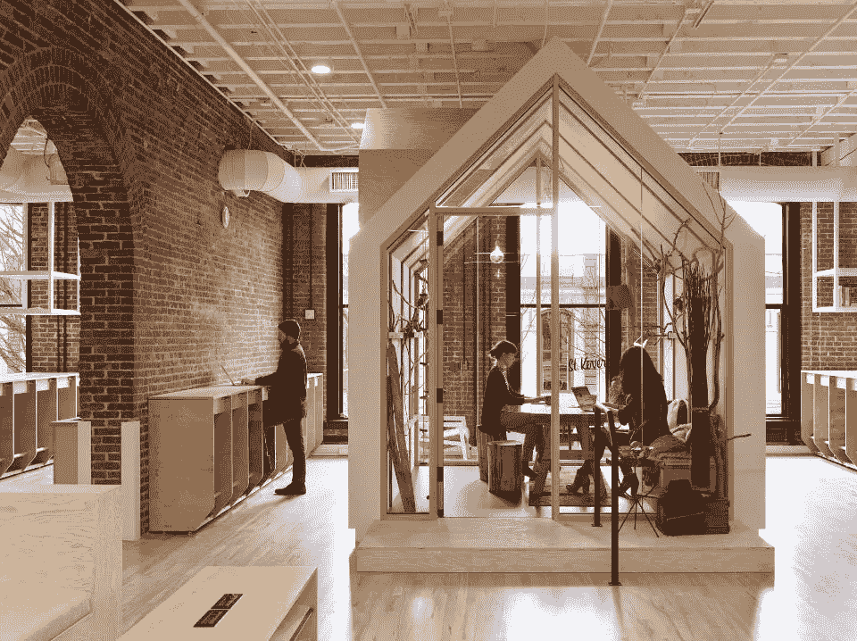

# Airbnb 产品和工程团队现在登陆波特兰

> 原文：<https://medium.com/airbnb-engineering/airbnb-product-and-engineering-teams-now-landing-in-portland-3a0bf4bf58fe?source=collection_archive---------0----------------------->

伊恩·洛根

Airbnb 的使命是帮助世界各地的人们找到归属感。为了实现这一目标，我们正在为我们的客人和主人打造一款卓越的产品，并拥有一个由业内最聪明的人组成的快速发展的团队。这就是为什么今天，我们很高兴地宣布，我们正在扩大我们的存在，包括我们在俄勒冈州波特兰市屡获殊荣的办公室的产品和工程团队。

这是我们第一次拥有旧金山以外的工程师、产品经理、设计师、可用性研究人员和数据科学家，我们希望采取一种真正深思熟虑的方法来扩展我们的团队。在过去的几个月里，我们有一个工程登陆团队，他们为团队今年将要开展的一些很酷的项目奠定了基础，并找出了摄入咖啡因的最佳地点。此外，我们通过在 12 月举办 [**HackPDX 冬季黑客马拉松**](https://www.eventbrite.com/e/hackpdx-winter-hackathon-airbnb-portland-tickets-19642377881) 结识了许多波特兰人，我们很高兴地宣布，2016 年我们将赞助[**Django Girls Portland**](https://djangogirls.org/portland/)。我们在波特兰的新产品团队将为我们的全球客户体验组织构建一个世界级的平台和一套工具。要了解更多关于该团队迄今为止处理的一些项目，请查看该团队的工程师之一 [**Emre**](http://nerds.airbnb.com/life-of-a-ticket/) 的这篇博客文章。

如果您是工程师、设计师、数据科学家或产品经理，并且您和我们一样对此感到兴奋，请 [**加入我们的**](https://www.airbnb.com/careers/locations/portland-united-states) 。

## 在 [airbnb.io](http://airbnb.io) 查看我们所有的开源项目，并在 Twitter 上关注我们:[@ Airbnb eng](https://twitter.com/AirbnbEng)+[@ Airbnb data](https://twitter.com/AirbnbData)