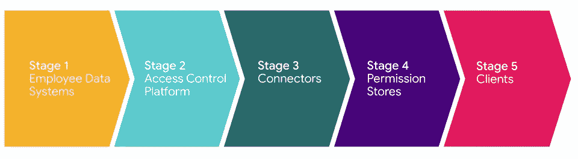
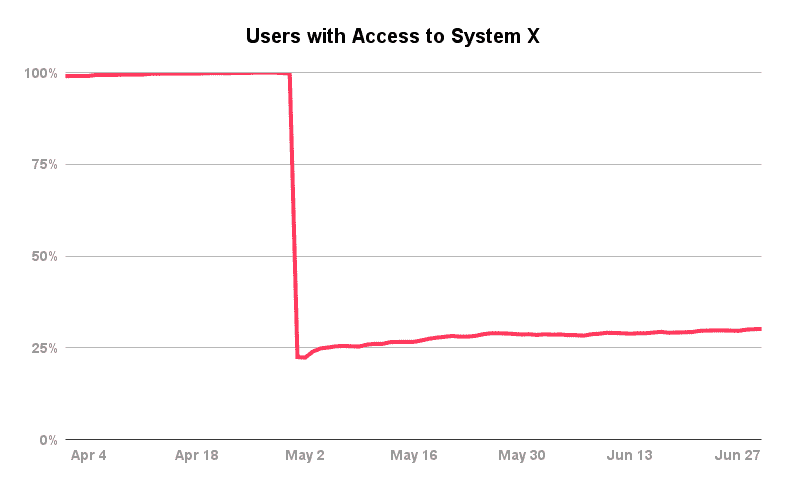
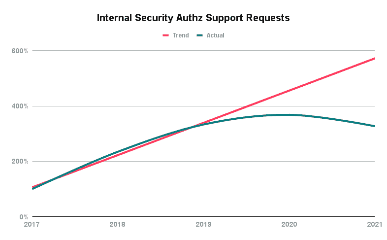
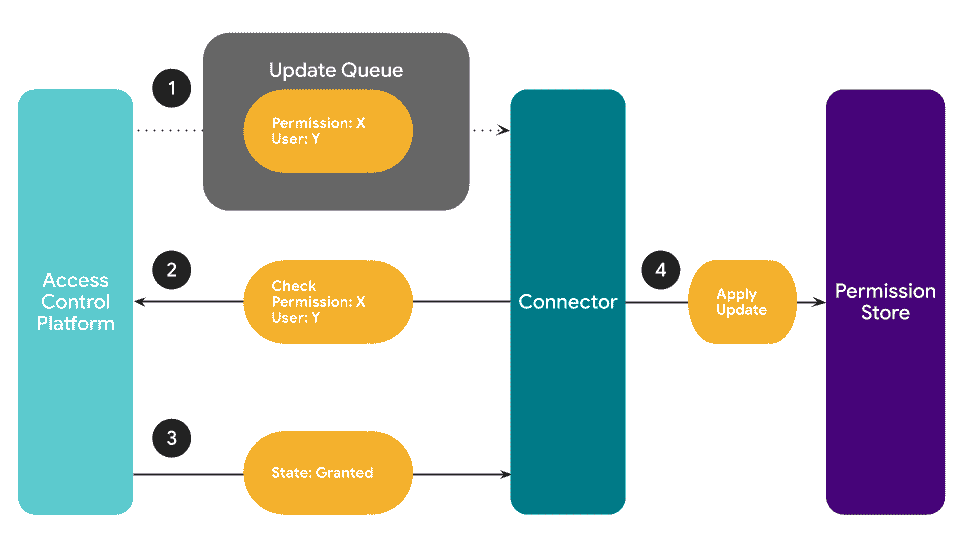

# Airbnb 的大规模访问管理方法

> 原文：<https://medium.com/airbnb-engineering/airbnbs-approach-to-access-management-at-scale-cfa66c32f03c?source=collection_archive---------0----------------------->

Airbnb 如何安全地管理我们庞大的员工、承包商和呼叫中心员工团队的权限。

**作者:** [保罗·布拉姆森](https://www.linkedin.com/in/paul-bramsen-9a98638b/)

# 介绍

Airbnb 是一家建立在信任基础上的公司。这种信任的一个重要部分来自于保护我们的客人和主人与我们共享的数据。我们做到这一点的方法之一是遵循最小特权原则。最低特权规定——在理想情况下——员工在工作需要时拥有他们需要的确切权限。不多不少。任何更多的情况都会带来不必要的风险，无论是来自恶意员工、受损的笔记本电脑，还是只是一个无心之过。任何不足都会抑制生产力。

实施最小特权不仅对维护信任至关重要，而且正迅速成为法律上的必要。Airbnb 在[世界上几乎每个国家和地区都有业务](https://news.airbnb.com/about-us/)，这迫使我们必须遵守越来越多的数据隐私法规。

在小公司中，当一个人可以跟踪所有同事的工作时，管理员可以用最少的工具有效地解决这些问题。但是随着公司的成长，这种方法并不适用。在本帖中，我们将解释 Airbnb 如何使用一种新颖的软件解决方案来维护最低特权，同时使我们的大型员工团队、承包商和呼叫中心代理能够有效和高效地完成我们的工作。

# 我们开始的地方

在 Airbnb 的早期，我们实施了自制和供应商解决方案的组合，但缺乏统一的架构阻碍了我们的扩展。用于控制访问的系统大杂烩使得我们很难实现两个最低权限目标:

*   通常不清楚员工可以从哪里获得所需的许可，这阻碍了工作效率。
*   旨在减少不必要的访问(即，驱动最小特权)的项目需要跨许多系统进行大量的工作。将访问控制与新系统集成需要几个月的工程工作，而本应是一两天的时间。

最终，这些因素导致运营负担增加，安全性降低，法规遵从性工作所需的时间增加。这使我们得出以下结论:**我们需要一个单一的地方来管理员工访问**。

# 澄清焦点

在确定了集中访问控制的需求后，我们开始为将要实施的解决方案设定指导原则。最终，我们将系统的需求归结为两个目标:

1.  访问控制系统应该管理权限生命周期中的整个流程和逻辑。这包括:
    –请求或撤销权限的自助方式。
    –控制谁有权批准新权限的设置。
    –管理权限组的工具。
    –权限自动过期设置。
    –满足运营和合规要求的记录。
    –关于相关权限更新的通知，如即将到期或何时需要批准。对于每个可用的权限，所有这些特性都应该被声明性地控制，并且系统应该使用这些声明来实现所有必要的逻辑和动作。
2.  我们希望构建一个系统，它可以轻松、健壮地与任何权限存储(例如，AWS IAM、LDAP、 [Apache Ranger](https://ranger.apache.org/) 、MySQL、 [Himeji](/airbnb-engineering/himeji-a-scalable-centralized-system-for-authorization-at-airbnb-341664924574) 等)集成，而不需要修改它。用一个网络类比来说，权限存储将是实施授权的数据平面，而我们的访问控制系统是协调一切的控制平面。这一需求使我们关注于提供有效地将中央访问控制系统中的权限变更同步到权限存储中所需的接口。这将通过为每个商店使用一点胶水代码来完成(允许我们保持中央系统的通用性)。

我们还澄清了什么是*而不是*的系统。

*   **而不是**一种超可靠、超低延迟的方式来回答在线许可检查。权限存储本身将回答在线授权查询，并且因为我们将与它们同步，所以如果中央访问控制系统出现故障，它们可以自动充当缓存。虽然可用性和性能总是很重要，但我们主要关注的是权限管理逻辑。
*   **不是**一个转储一次性授权码的地方。一些先前的许可管理系统已经演变成授权码垃圾场，招致大量技术债务。
*   **不是**为我们的客人和主人存储权限的地方。公共产品许可管理需求通常与我们授予员工访问我们内部工具和数据以完成工作的许可有很大不同。标度通常也相差许多数量级。此外，内部权限通常要复杂得多。所以分开处理每个案例是有意义的。

如果你只能从这篇文章中拿走一样东西，拿走这些目标。明确我们的关注点，并将这两个目标作为我们的北极星，是构建我们的集中式访问控制平台的最关键的一步。

# 构建与购买

我们评估了市场上的许多产品，但没有一个能满足我们的特定目标。一般来说，权限是由一小群知识渊博的管理员管理的，操作了批准过程，没有达到我们的第一个目标。此外，集成通常需要修改客户端。虽然一些许可存储已经具有插件(例如，LDAP 插件)，但是其他许可存储没有。

我们希望最终一家初创公司能够构建一个解决方案，实现一个集中式、自助式、易于插入的模型。我们认为这可以为其他公司提供很大的价值，这些公司没有足够的规模来构建像我们这样的内部解决方案。

# 体系结构

Each stage makes requests to the prior stage as updates flow through the system from left to right. Note that for the purposes of this post we are only considering stages 2 and 3\. We can assume stages 1, 4, and 5 already exist.

我们设计了一个线性五阶段架构的系统。从左向右改变流向。该架构是线性的，因为每个阶段都可以查询前一个阶段，但不能查询其他阶段。例如，访问控制平台可以查询员工数据系统，也可以通过连接器进行查询，但是从不直接与权限存储进行通信。

一个阶段还可以通过松散耦合的通道(如队列或回调)与紧随其后的阶段进行有限的通信。例如，访问控制平台可以将连接器使用的更新消息排队，以触发权限更新。

1.  **员工数据系统** 这些是包含员工数据(如职位、位置、状态、管理链)的人力资源系统(如 LDAP)。访问控制平台吸收这些数据，以支持基于头衔的动态组和基于管理链的审批流等功能。这些系统归 IT 团队所有。
2.  **门禁平台
    这是核心系统。这包括管理权限的所有业务逻辑，以及员工用来进行和/或批准变更的 UI。访问控制平台是高度可配置的，但是不与任何与其集成的权限存储直接交互。安全团队拥有这个系统。**
3.  **连接器** 连接器是连接访问控制平台和许可存储的粘合代码。它们有两个目的。首先，连接器告诉访问控制平台应该为请求提供哪些权限。例如，数据仓库连接器可以对用户和预订配置单元表进行读访问。其次，如果用户 bob 获得了读取预订的权限，那么数据仓库连接器会将该权限同步到适当的权限存储中，在本例中为 [Apache Ranger](https://ranger.apache.org/) 。由于连接器只是通过进行适当的 API 调用来响应队列中的消息，因此它们可以在所有者认为最好的任何环境中运行(例如，Kubernetes job、AWS Lambda、Airflow DAG)。它们由拥有相应权限存储的团队拥有和操作。例如，存储团队拥有 MySQL 连接器。
4.  **权限存储** 权限存储是存储权限并回答权限查询的系统，例如 AWS IAM、LDAP、 [Apache Ranger](https://ranger.apache.org/) 、MySQL 的内置权限系统、 [Himeji](/airbnb-engineering/himeji-a-scalable-centralized-system-for-authorization-at-airbnb-341664924574) 或其他内部系统。请注意，在某些情况下，权限存储可能内置于客户端中，在这种情况下，阶段 4 和阶段 5 将合并，就像 MySQL 的情况一样。
5.  **客户端** 客户端是最终用户需要的所有系统，例如 SSH、Apache Superset、MySQL、内部客户支持工具、Salesforce 等。

# 实现的效益

两年前，我们实施了这种架构，从那时起，我们已经将许多系统集成到这个集中式访问控制平台中。在此，我们重点介绍我们已经实现的一些优势。

## 安全性

安全性的最大优势之一是我们可以在一个地方实现新的最小特权特性，然后全面应用它们(而不是为 AWS、MySQL、SSH 等实现一次)。一个很好的案例研究是基于使用的过期。基于使用情况的过期是一项功能，在该功能中，长时间未使用的权限会被自动撤销。这种方法有利于安全性，因为不必要的权限会被快速清除。但这对用户体验也有好处，因为员工可以放心，被删除的权限不是他们经常使用的权限。在撤销发生之前，访问控制平台会通知受影响的员工即将发生的更改，并提供如果他们需要保留权限该如何做的指示。这些通知还提供了一些链接，在撤销发生后，如果他们后来意识到需要这些权限，可以通过这些链接以低成本的方式重新获得这些权限。

下图显示了访问核心生产系统(我们称之为 System X)的用户的相对变化。在 4 月底推出基于使用情况的到期后，访问 System X 的用户达到了约三分之一的稳定峰值。意义重大的最小特权胜利！我们在推出基于使用情况的到期的其他系统中也看到了类似的结果。

Users with System X access dropped by two thirds after enabling usage-based expiration in late April.

另一个安全优势是，随着新法规的引入，能够在所有系统中推行一致的法规遵从性更改。例如，我们可以启用一条规则，要求北美员工获得我们欧洲法律顾问的特别批准，以便访问欧洲客户的某些受保护数据。这条规则可以一致地应用于许多系统，比如在线数据库、离线数据存储和客户支持工具。

另一个成功之处是拥有一个集中式数据库，我们可以根据它创建跨系统的最低权限指标，并跟踪我们的进度。上面的图表是使用这个数据库生成的。

## 可用性

拥有一个集中的访问控制平台是可用性的一大胜利。通过整合，用户不再需要知道他们需要去 N 个不同的地方请求访问。实际上，我们已经能够在 Airbnb 为所有访问创建一站式商店。只需搜索您需要访问的内容，我们将指导您完成其余的工作。

我们在平台中内置的自助服务功能有助于降低运营开销。员工可以请求权限，而不必涉及支持工程师。当经理外出时，他们可以委托同事代表他们批准变更。用户可以自助撤销他们自己的权限、他们的报告的权限或他们管理的系统的权限。

Providing good self-serve access control tooling has significantly cut support costs.

## 开发者体验

我们付出了巨大的努力，让开发人员尽可能容易地构建连接访问控制平台和权限存储的连接器。这项工作的很大一部分是在构建优秀的工具。

举个例子，我们做出的一个设计决策在提供强大的开发人员体验方面被证明是非常有用的，那就是通过异步消息队列向连接器通知变更。每当许可的状态改变时，访问控制平台向队列发送消息。该队列由连接器处理，该连接器负责将更新后的权限的状态同步到权限存储中。

The permission’s state (granted or revoked) has to be fetched from the Access Control Platform. It is not included in the enqueued message.

信息的内容是设计的关键部分。该消息包含许可是什么和它是给谁的，但是*而不是*许可是被授予还是被撤销。为了获得当前状态(授权/撤销)，连接器必须查询平台。您可以将该消息视为一个触发器，使系统重新同步用户 y 的权限 X。

这种设计具有以下特性:

*   因为总是获取最新的状态(授权/撤销)，所以消息处理是幂等的。
*   这允许我们使用至少一次交付语义，大大简化了确保每次权限更改时都发送正确消息的过程。如果在我们记录下平台触发了必要的更新消息之前，权限发生了变化，但进程被终止了(可能是由于部署)，我们只需在清理过程中再次触发消息。
*   重放攻击无效。因此，我们让连接器开发人员自由地将消息排队以帮助调试。作为连接器开发人员，在尝试确定权限同步失败的原因时，这非常有用。
*   如果更新失败的次数太多，邮件将进入死信队列，负责连接器的团队将收到警报。然后，开发人员使用我们的工具从死信队列中读取消息，并调试失败的更新。一旦问题得到解决，所有失败的消息都可以重新排队，这将使所有权限恢复同步。
*   我们运行常规的离线作业来执行批量权限差异，并识别任何需要回填的权限更改。然后，我们通过对这些权限的更新消息进行排队来触发重新同步。这意味着连接器开发人员只需要编写代码来支持增量同步，而不是同时支持回填和增量同步。回填是免费的！

# 结论

管理权限和确保最低特权在任何公司都是一个挑战，在大公司尤其困难。许多公司提出了操作繁重的解决方案，这些解决方案昂贵、不安全，并且提供了负面的用户体验。在 Airbnb，我们通过实施一个集中的自助式访问控制平台解决了这一挑战。使我们的投资如此成功的是以一种有凝聚力和可扩展的方式解决 Airbnb 的独特目标，而非常罕见的是我们在生产中实际推出这一点的程度。Airbnb 的大部分权限由我们的访问控制平台管理。我们的方法使我们能够取得巨大的进步，确保我们尽一切努力保护我们社区的数据安全，同时使 Airbnb 的员工能够尽最大努力工作。

我们在访问管理领域取得了很大进步，但仍有许多工作要做！如果你有兴趣从事这方面的工作或其他保护 Airbnb 社区的工作，请查看我们职业页面上的安全和软件工程工作。

# 感谢

我们建立的访问控制平台是 Airbnb 许多合作者辛勤工作的结果。[朱鹰](https://www.linkedin.com/in/zhusamuel/)、[艾丽萨拉·罗贾纳佩拉特](https://www.linkedin.com/in/alissara-rojanapairat/)、[凯勒·梅希亚](https://www.linkedin.com/in/kyler-mejia-a9a323101/)、[戚薇·南希](https://www.linkedin.com/in/stephynancy/)和玛丽娜·布托维奇构建了系统的重要部分，并为架构做出了贡献。 [Alan Yao](https://www.linkedin.com/in/alanyao/) 和 [Abhishek Parmar](https://www.linkedin.com/in/abhishek-parmar-924b529a/) 提供了影响架构的宝贵反馈。 [Julia Cline](https://www.linkedin.com/in/julia-k-cline/) 确保我们生产的产品能够满足客户的需求。Brett Bukowski、Jacqui Watts、Julia Cline、Pat Moynahan 和 Christopher B、T21 对这篇博文提供了宝贵的反馈。Tina Nguyen 和 Lauren Mackevich 在整个过程中指导了这篇博文。许多其他同事以大大小小的方式为此做出了贡献。

# ****************

*所有产品名称、标识和品牌都是其各自所有者的财产。本网站中使用的所有公司、产品和服务名称仅用于识别目的。使用这些名称、标志和品牌并不意味着认可。*