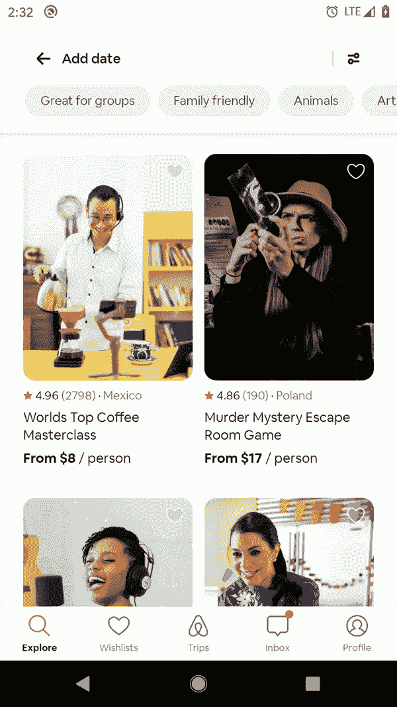
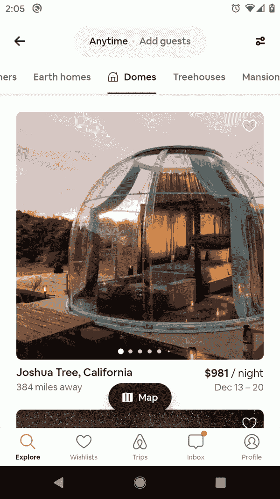

# Airbnb 在 Android 上的页面性能得分

> 原文：<https://medium.com/airbnb-engineering/airbnbs-page-performance-score-on-android-f9fd5e733e?source=collection_archive---------4----------------------->

*我们系列的第四部分关于* [*Airbnb 的页面性能评分*](/airbnb-engineering/creating-airbnbs-page-performance-score-5f664be0936) 。

[林](https://www.linkedin.com/in/lupinglin/)

Airbnb 的自制[页面性能评分](/airbnb-engineering/creating-airbnbs-page-performance-score-5f664be0936) (PPS)旨在通过收集大量以用户为中心的性能指标并将其制定为一个单一的 0-100 分，来捕捉丰富、复杂的性能现实。在本帖中，我们将深入探讨如何在 Android 上定义和实现这些指标。请务必先阅读[概述博客文章](/airbnb-engineering/creating-airbnbs-page-performance-score-5f664be0936)，以熟悉我们的 PPS 指标和公式。

# 使用仪器

## 通用页面跟踪系统

Airbnb 上的整个客户旅程分为不同的页面，每个页面都有自己衡量的 PPS。为了支持这种基于页面的性能跟踪系统，我们构建了一个标准化的基础设施，使工程师能够配置代表其功能的页面。

在 Android 上，一个页面与一个*片段*相关联。每个片段必须提供一个指定页面名称的 *LoggingConfig* 对象，以后需要引用页面名称时可以检索到该对象。我们在片段的整个生命周期中收集性能数据，并且只在片段暂停时发出日志事件。

通用的 *PageName* enum 用于唯一标识每个页面，并在所有平台上引用，以一致地表示我们用户旅程中的每个页面。

## 捕捉用户感知的等待时间

我们新的页面性能评分(PPS)的一个关键区别在于它衡量用户可以看到的等待时间。而我们早期的测量工作(在我们的[概述博客文章](/airbnb-engineering/creating-airbnbs-page-performance-score-5f664be0936)中提到过)，基于众所周知的[交互时间](https://web.dev/interactive/) (TTI)度量，测量代码执行时间和异步调用长度。例如，PPS 测量用户在屏幕上看到加载指示器的时间，而 TTI 测量网络请求返回结果需要多长时间，以及建立视图模型需要多长时间。我们相信 PPS 更能反映我们用户的体验。

为了捕捉视觉感知的等待时间，我们需要所有具有加载状态的视图来实现一个 API，报告它们的加载状态变化。我们创建了一个名为 *LoadableView* 的简单接口。

我们提供了基本的*视图组*，基本的*文本视图*，基本的*图像视图*，所有这些都实现了 *LoadableView* 接口。我们的开发人员只需要从这些原语中继承，就可以自动检测他们的视图。

一个挑战是我们需要跟踪一个视图的可见性，因为如果一个视图在屏幕上至少有 10%是不可见的，我们不想在我们的测量中包括它的加载时间。每个视图的可见性百分比的计算是频繁的和递归的。此外，我们的大多数视图都在一个 *RecyclerView* 中，我们必须确保它们的可见性在每个滚动事件中正确更新，同时保持 *RecyclerView* 的性能。我们设计了算法来降低这些计算的频率和复杂性，包括在 *RecyclerView* 中缓存可见性状态。

# 度量实施

## 首次布局时间(TTFL)

TTFL 测量用户在看到屏幕上的任何内容之前需要等待多长时间。TTFL 从片段初始化开始，在片段布局后的第一个 *onGlobalLayout* 事件结束，此时系统已经完成膨胀、测量和布局片段的视图层次。

缓慢的 TTFL 通常表明片段的视图层次过于复杂，或者 UI 线程在片段初始化期间忙于不必要的任务。

## 初始装载时间(TTIL)

TTIL 测量用户在屏幕上显示有意义的内容之前看到加载指示器的时间(不包括单独测量的媒体加载)。TTIL 像 TTFL 一样从片段初始化开始，当屏幕上不再有视图处于加载状态时结束。如果一个屏幕(片段)是静态的或缓存的，我们不会显示加载指示器。在这种情况下，TTIL 将和 TTFL 一样。

缓慢的 TTIL 通常揭示了改善网络延迟或客户端渲染时间的机会。对于网络延迟，我们寻找缓慢的后端服务、大的有效负载、未被利用的缓存或不太优化的数据解析器。对于渲染时间，我们尽量遵循使用 RecyclerView 的最佳实践，避免在构建视图模型时进行繁重或递归计算，并减少过度绘制等。

如上所述，具有加载状态的视图可以从具有内置 *LoadableView* 实现的基本原语中继承。API 自动向我们的日志框架报告视图的加载状态变化。我们使用一个简单的计数器，它在视图进入加载状态时递增，在数据被加载时递减。当计数器为 0 时，我们知道屏幕上不再有加载视图。

这张 GIF 展示了 TTFL(当显示带有 Airbnb 徽标的灰色背景时标记)和 TTIL(当加载点被有意义的内容替换时标记)。

## 主线程挂起(MTH)

当 ui 帧花费太长时间渲染时，用户体验到屏幕冻结、滞后和不连贯。每个 android 设备都有一个基于设备容量的目标帧刷新率。然而，当主线程太忙时，设备的渲染速度会慢于它所能达到的帧速率。我们将 MTH 定义为任何帧花费两倍于系统帧刷新率的时间进行渲染。

频繁的月数表明主线程可能过载。繁重的操作或计算应该从 UI 线程中移走，或者延迟到内容被呈现。

MTH 是使用 Android 系统报告的[帧度量](https://developer.android.com/reference/android/view/FrameMetrics)计算的。我们从系统中获取帧刷新率，并使用它来计算线程挂起的阈值。然后，我们监听系统回调以接收[帧度量](https://developer.android.com/reference/android/view/FrameMetrics)，如果帧持续时间超过我们的阈值，我们将δ*(帧持续时间-挂起阈值)*记录为挂起。

## 附加装载时间(ALT)

ALT 测量初始加载后发生的任何等待时间，例如等待列表分页或在按下保存按钮后等待内容更新。当视图在 TTIL 被标记后进入加载状态*时，ALT 开始，当不再显示加载视图时，ALT 结束。ALT 可以开始和结束多次，每次都被记录为一个单独的 ALT。*

提高 ALT 的机会通常在于预测和预取附加内容。还可以通过平衡在初始加载和附加加载中加载多少内容来提高总体 PPS。

*这张 GIF 演示了 ALT(当底部的加载指示器被从网络加载的分页内容替换时标记)。*

## 丰富内容加载时间(RCLT)

RCLT 测量用户在图像、视频或一些富媒体内容完全显示之前看到占位符或加载指示器的时间。 *ImageView* 和其他富媒体容器实现相同的 *LoadableView* API 向 PPS logger 报告加载状态变化。

为了提高 RCLT，我们希望缩小图像尺寸、改进图像缓存、优化图像格式和服务、战略性地安排加载尚未在屏幕上显示的丰富内容，以及选择高性能流库等。

*这张 GIF 演示了 RCLT(当占位符被替换为从网络加载的实际图像时进行标记)。*

# 结论

我们成功地在 Android 上构建了一个工具框架，以捕捉更加丰富和以用户为中心的性能指标，其指导原则与 Airbnb 跨 web 和本地平台的页面性能评分 中的设计原则相同。在此框架和收集的数据之上，我们构建了仪表板来监控整个应用的性能，设置了针对页面所有者的自动警报，简化了团队和组织级别的性能目标设置，并系统地跟踪和减轻了性能衰退。

在 2022 年，我们计划提高我们工具的粒度和准确性，例如测量点击响应度，更好地区分滚动期间的性能，以及为图元提供内置的性能优化。我们还将投入资源构建工具来提高可调试性，并通过综合测试实现早期回归检测和预防。

PPS 为我们的工程师和数据科学家提供了更好的见解和更多的方法来改进我们的产品。这也加强了我们[对工艺](/airbnb-engineering/commitment-to-craft-e36d5a8efe2a)文化的承诺。我们希望您也能在您的组织中应用这些知识。

## 增值

感谢所有帮助在 Android 上构建 PPS 的人:[伊莱·哈特](https://www.linkedin.com/in/eli-hart-54a4b975/)、[查尔斯·薛](https://www.linkedin.com/in/charlesx2013/)、[尼克·米勒](https://www.linkedin.com/in/nickbryanmiller/)、[安德鲁·谢尔曼](https://www.linkedin.com/in/scheuermann/)、[安东尼奥·尼诺拉](https://www.linkedin.com/in/hdezninirola/)、[乔希·尼尔森](https://www.linkedin.com/search/results/all/?keywords=joshua%20nelson%20%E2%9C%A8&origin=RICH_QUERY_SUGGESTION&position=0&searchId=959d4aca-c80e-448a-b415-4a732ba7a84d&sid=Rr6)、[阿迪蒂亚·普贾尼](https://www.linkedin.com/in/adityapunjani/)、[乔希·波尔斯基](https://www.linkedin.com/in/joshpolsky/)、[让-尼古拉斯·沃尔默](https://www.linkedin.com/in/jnvollmer/)、

有兴趣在 Airbnb 工作吗？看看这些角色:
[员工安卓工程师](https://grnh.se/6c9839421us)
[高级安卓工程师](https://grnh.se/1e5c9bf51us)
[高级安卓工程师](https://grnh.se/aa366a2e1us)
[安卓工程师，特殊项目](https://grnh.se/20c296251us)