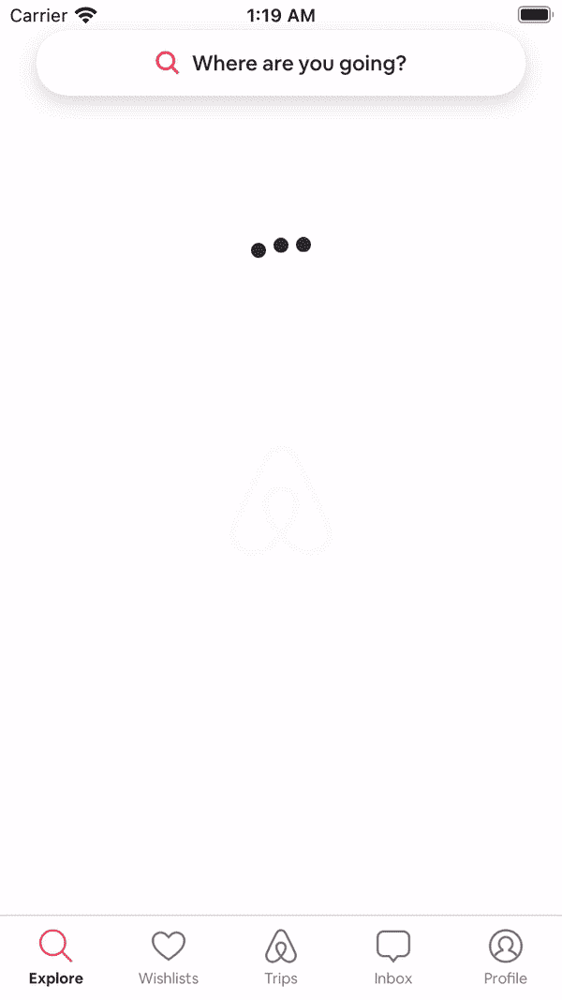
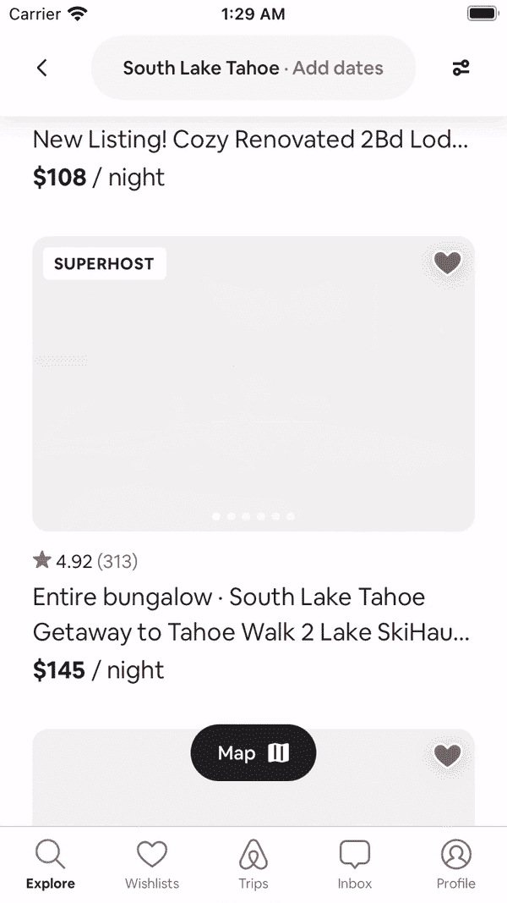

# Airbnb 在 iOS 上的页面性能评分

> 原文：<https://medium.com/airbnb-engineering/airbnbs-page-performance-score-on-ios-36d5f200bc73?source=collection_archive---------2----------------------->

*这是我们关于* [*Airbnb 的页面性能评分*](/airbnb-engineering/creating-airbnbs-page-performance-score-5f664be0936) *系列的延续，该评分衡量来自任何平台真实用户的多个性能指标。系列:* [*第 1 部分*](/airbnb-engineering/creating-airbnbs-page-performance-score-5f664be0936) *和* [*第 2 部分*](/airbnb-engineering/measuring-web-performance-at-airbnb-122da8d3ea3f) *。*

尼古拉斯·米勒

在 Airbnb，我们创建了[页面性能评分](/airbnb-engineering/creating-airbnbs-page-performance-score-5f664be0936)，为我们的工程师和数据科学家提供大量以用户为中心的性能指标，以更好地了解和改进我们的产品。在本帖中，我们将深入探讨我们如何定义这些指标，并在 iOS 上使用它们。

# 页面系统

Airbnb 上的整个客户旅程分为不同的页面，每个页面都有自己实测的[页面性能得分](/airbnb-engineering/creating-airbnbs-page-performance-score-5f664be0936) (PPS)。为了支持这种基于页面的性能跟踪系统，我们构建了一个标准化的基础设施，使工程师能够配置代表其功能的页面。

在 iOS 上，一个页面与一个 *UIViewController* 相关联。我们在一个 *UIViewController 的*生命周期中收集性能数据，并且只在*viewdiddeave*上发出日志事件。没有*页面名称，*通用页面标识符，就无法创建或发送该日志事件。

# 使用仪器

由于检测这些指标涉及许多边缘情况和复杂性，我们创建了一个页面性能分数状态机类，称为 *PPSStateMachine* 。这个类封装了跟踪和计算性能指标以及生成日志事件的所有逻辑。任何想要记录 PPS 事件的工程师都可以通过获取与其 *UIViewController* 相关联的 *PPSStateMachine* 并在 *UIViewController 的*生命周期事件期间调用相关方法来完成。为了使事情变得更简单，我们已经建立了额外的工具和基础设施，因此工程师只需要提供他们的页面的名称和内容的状态—例如，加载、已加载或错误。

# PPSStateMachine

# 时间

在测量性能时，所有时间都以纳秒为单位进行测量，然后转换为毫秒。通过将纳秒(UInt64)和毫秒(Float64)的概念创建为更具体的类型，我们迫使开发人员在转换为更常用的类型(例如 Int、Float)时考虑比例。

获取当前时间时，我们使用单调时钟，该时钟的值单调递增，并且在系统休眠时将继续递增。该值属于 64 位纳秒类型。

当标记持续时间的开始和结束时间时，我们有一个计算变量，它返回以毫秒为单位的当前时间。这使我们能够避免由于铸造造成的大多数准确度和精度误差。

## 例子

# 查看关联

每个 *UIViewController* 都有一个关联的 *PPSStateMachine* 。这个 *PPSStateMachine* 可以在开发者想要测量一个名字下的一系列页面时被覆盖。与 *UIViewController* 相关联允许通过爬行视图响应链在 *UIView* 上找到 *PPSStateMachine* 。

# 版本控制

在 PPS 协议中声明生命周期和语义方法允许我们抽象出分数是如何计算的。除了视频性能等全新指标之外，对 PPS 公式的大多数更新都不会导致开发人员需要更新各自的功能。在幕后，对公式的任何重大更改都首先通过将潜在值放入记录的事件的元数据中进行测试。一旦验证了潜在值，就可以将其升级为影响页面性能分数的官方值。

# 度量实施

# 首次布局时间(TTFL)

TTFL 在 UIViewController 的 viewDidLoad 期间开始，在 UIViewController 的第一个 viewDidLayoutSubviews 之后结束。

# 初始装载时间(TTIL)

TTIL 在 UIViewController 的 viewDidLoad 期间开始，并在设置加载的内容后结束一个渲染周期。

This is for illustrative purposes only and does not necessarily show anything that may or may not be available on Airbnb at any time. The content shown in the image may or may not be correct.

# 卷轴线挂起(某物)

STHs 报告为故障持续时间与最大帧持续时间之间的差值，根据两倍刷新率的最小阈值进行过滤。

[*CADisplayLink*](https://developer.apple.com/documentation/quartzcore/cadisplaylink)精确观察大多数 STHs。*运行循环。模式*为 *RunLoop。模式跟踪*。

每次触发显示链接时，我们都会根据旧帧和当前帧进行计算。

This is for illustrative purposes only and does not necessarily show anything that may or may not be available on Airbnb at any time. The content shown in the image may or may not be correct.

主线程挂起(MTH)跟踪可以在 iOS 上存在，但是，准确跟踪 MTH 会对性能产生一个小而持续的拖累。在我们的 MTH 跟踪测试中，CPU 无法睡眠，电池电量耗尽，该指标并没有给我们提供比某物更多的关于视觉感知性能的信息。因此，我们决定不在 iOS 上测量 MTH。

# 附加装载时间(ALT)

ALT 在显示加载程序时开始，在加载程序消失并设置内容后的一个渲染周期结束。

为了说明这个度量，让我们看一下无限滚动。如果在加载下一页之前到达底部，则记录的 ALT 是在加载下一页之前加载器(或底部)可见的时间。如果从未到达底部，例如，由于预取，则 ALT 记录为零。为了准确地记录日志，我们需要知道滚动百分比，底部加载器是否可见，以及跟踪旧状态的状态机。

This is for illustrative purposes only and does not necessarily show anything that may or may not be available on Airbnb at any time. The content shown in the image may or may not be correct.

# 丰富内容加载时间(RCLT)

通过我们的视图抽象 *URLImageView* ，RCLT 对于工程师来说是完全隐藏的，它能够显示来自 URL 的图像。

RCLT 只跟踪加载程序或占位符可见的时间。如果加载图像被隐藏，那么隐藏的行为标志着 RCLT 的结束。

在每一个 *URLImageView* 状态改变时，通过抓取视图的响应链并更新状态机是否加载图像来找到相应的 *PPSStateMachine* 。 *PPSStateMachine* 将计算持续时间并删除 URL 部分，如果持续时间低于指定阈值，则仅保存持续时间，以便日志不会太大。

This is for illustrative purposes only and does not necessarily show anything that may or may not be available on Airbnb at any time. The content shown in the image may or may not be correct.

# 摘要

我们目前在 iOS 上实施的 PPS 已经允许工程师快速实施和接收真实的性能数据。我们不断发展和扩大我们的工具和基础设施。我们希望您能在贵公司应用并推进我们的知识。

## 增值

感谢所有在 Native 上帮助构建 PPS 的人:[陆平·林](https://www.linkedin.com/search/results/all/?keywords=luping%20lin&origin=RICH_QUERY_SUGGESTION&position=0&searchId=58011edb-813b-43c3-9f00-f886aa446e84&sid=VYi)、[安东尼奥·尼罗拉](https://www.linkedin.com/in/hdezninirola/)、[布莱恩·凯勒](https://www.linkedin.com/in/kellerbryan19/)、[诺亚·马丁](https://www.linkedin.com/in/noahsmartin/)、[安德鲁·舒尔曼](https://www.linkedin.com/in/scheuermann/)、[乔希·尼尔森](https://www.linkedin.com/search/results/all/?keywords=joshua%20nelson%20%E2%9C%A8&origin=RICH_QUERY_SUGGESTION&position=0&searchId=959d4aca-c80e-448a-b415-4a732ba7a84d&sid=Rr6)、[乔希·波尔斯基](https://www.linkedin.com/in/joshpolsky/)、[让-尼古拉斯·沃尔默](https://www.linkedin.com/in/jnvollmer/)、[毛文生](https://www.linkedin.com/in/wensheng-mao-76ab7142/)以及所有一路帮助过的人。